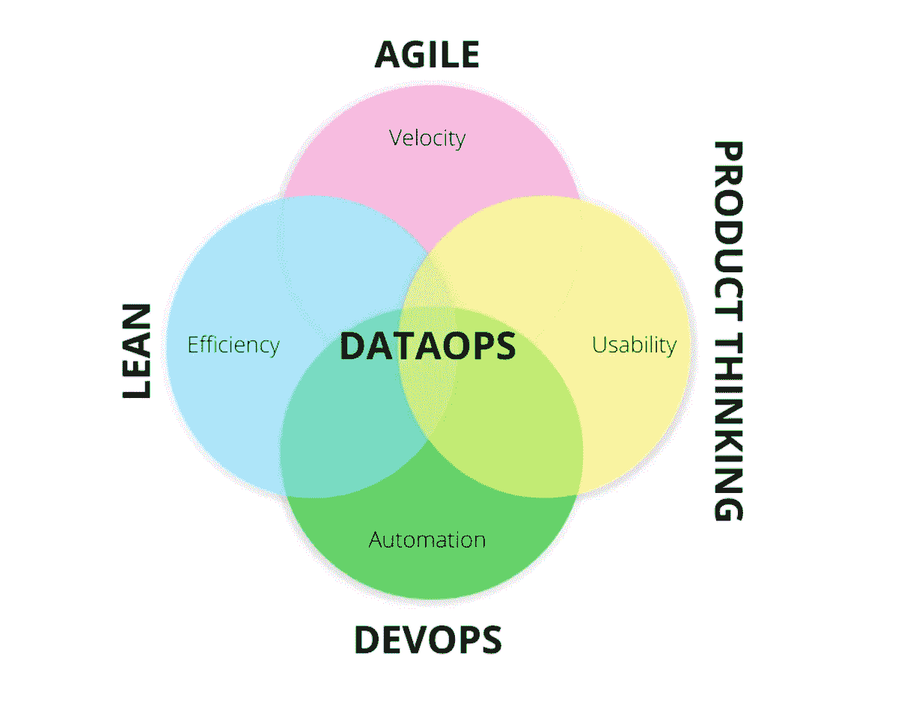
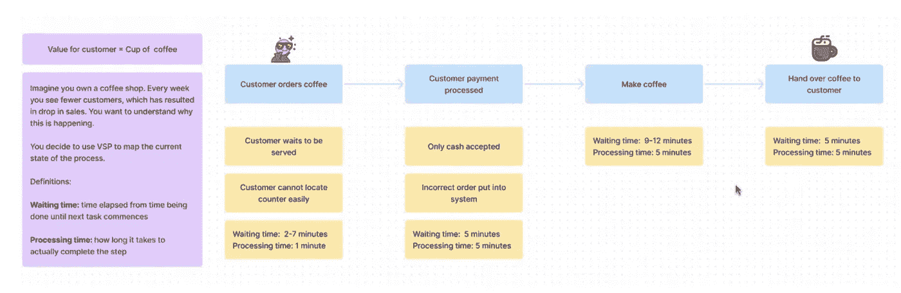
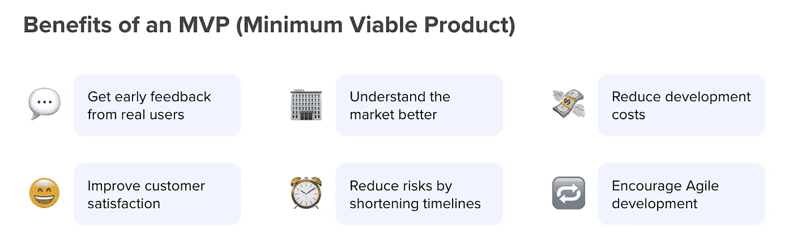
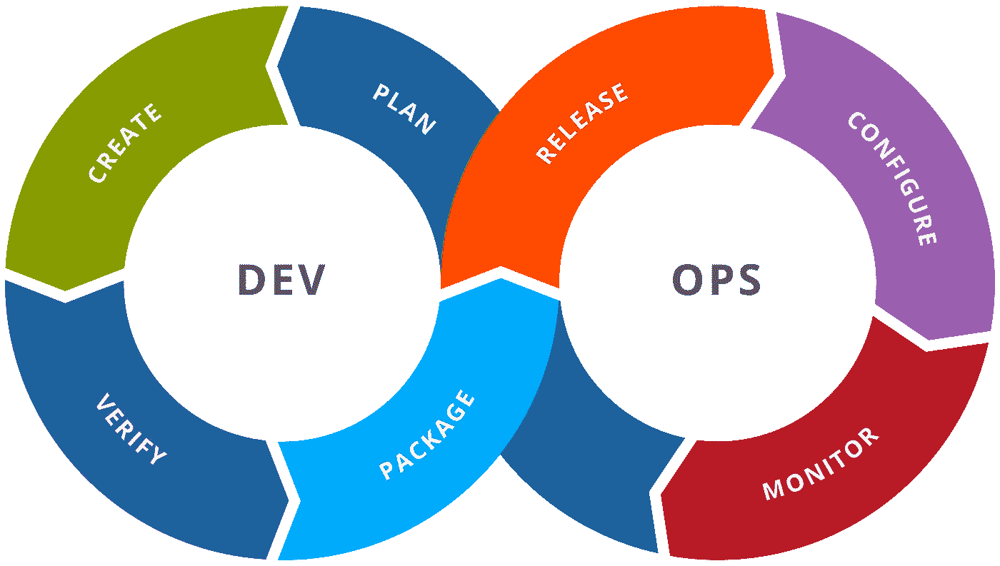
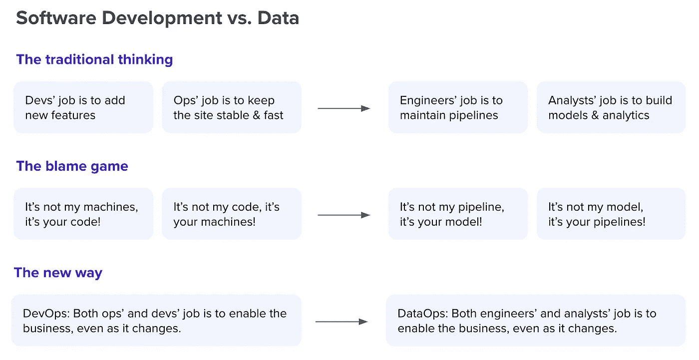
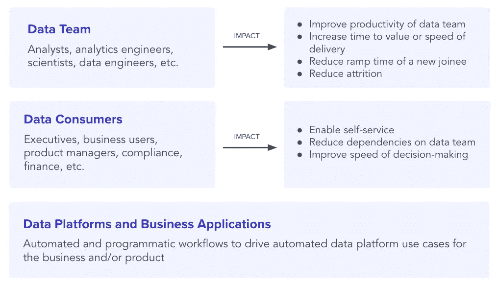
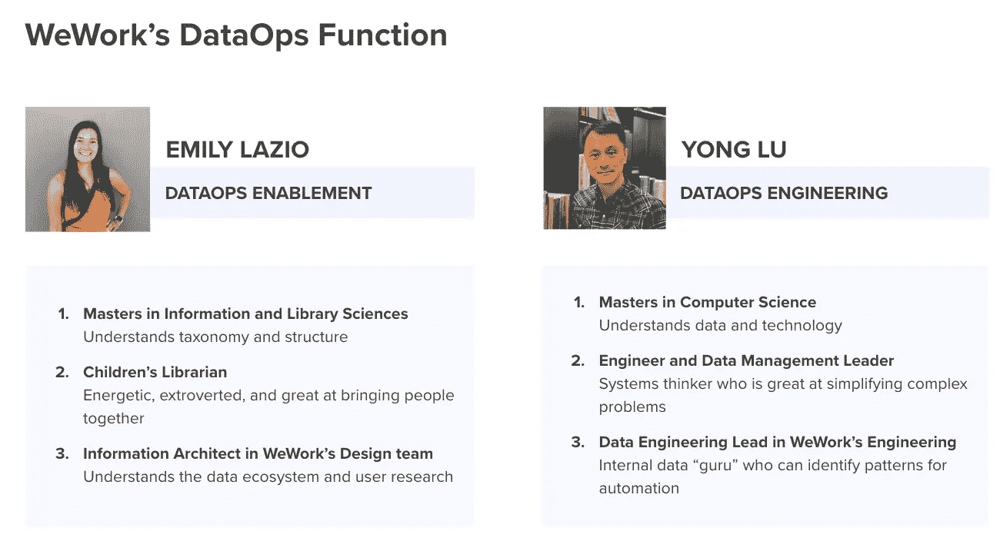
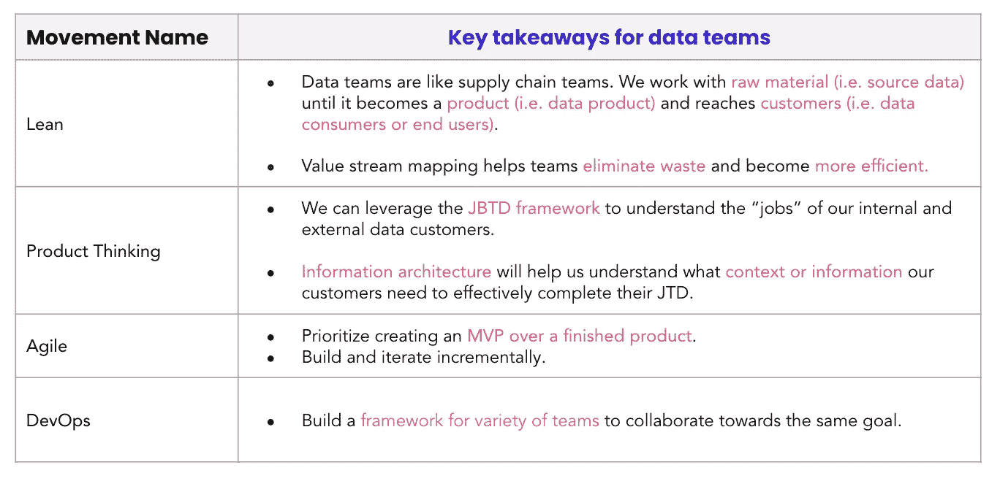

# 数据运营的兴起

> 原文：<https://towardsdatascience.com/the-rise-of-dataops-2788958034ee>

## 我们找到解决当今数据混乱和协作挑战的方法了吗？

克里斯·利维拉尼在 [Unsplash](https://unsplash.com/?utm_source=unsplash&utm_medium=referral&utm_content=creditCopyText) 上的照片

**数据变得越来越大，传统的数据管理已经不起作用了。DataOps 正在崛起，承诺驯服今天的混乱和环境挑战。**

让我们面对现实—传统的数据管理不起作用。今天， [75%的高管](https://www.rtinsights.com/executives-dont-trust-data/)不信任自己的数据，只有 [27%的数据项目](https://www.capgemini.com/consulting/wp-content/uploads/sites/30/2017/07/big_data_pov_03-02-15.pdf)是成功的。在所谓的“数据黄金时代”中，这些数字令人沮丧。

随着数据的规模和复杂性不断增长，我们正在努力控制数据。更糟糕的是，数据团队及其成员、工具、基础设施和用例同时变得更加多样化。结果是我们从未见过的数据混乱。

DataOps 已经存在好几年了，但现在它火了，因为它承诺解决这个问题。仅隔一周，Forrester 和 Gartner 最近在认识到数据运营的重要性方面做出了重大转变。

今年 6 月 23 日，Forrester 发布了关于数据目录的最新版本的 [Wave 报告](https://atlan.com/forrester-wave/)——但他们没有像往常一样发布“机器学习数据目录”，而是将该类别重命名为“数据操作的企业数据目录”。一周后，在 30 日，Gartner 发布了其 [2022 炒作周期](https://www.gartner.com/en/articles/what-s-new-in-the-2022-gartner-hype-cycle-for-emerging-technologies)，预测 DataOps 将在 2-5 年内完全渗透市场，并将其从曲线的最左侧移动到其“膨胀预期的峰值”。

谷歌自 2015 年以来对“数据行动”的全球搜索趋势数据。y 轴显示“随着时间推移的兴趣”，或搜索兴趣的归一化版本。100 表示在给定的时间和区域中该术语的最高流行度。(图片由作者提供。)

但是 DataOps 的崛起不仅仅来自分析师。我亲眼目睹了数据运营从一个不为人知的领域变成一个必备领域，一些公司甚至围绕数据运营建立了完整的战略、功能甚至角色。虽然结果各不相同，但我看到数据团队在敏捷性、速度和成果方面取得了令人难以置信的进步。

在这篇博客中，我将分解你应该知道的关于 DataOps 的一切——它是什么，它来自哪里，以及如何在你的组织中开始实施它。

# 什么是数据操作？

关于 DataOps，首先，也可能是最重要的一点是，它不是一种产品。它不是工具。事实上，这不是你能买到的任何东西，任何试图告诉你不是这样的人都是在欺骗你。

相反， **DataOps 是一种思维模式或文化**——一种帮助数据团队和人们更好地合作的方式。

数据操作可能有点难以理解，所以让我们从几个众所周知的定义开始。

> *“data ops 是一种协作式数据管理实践，专注于改善整个组织中数据管理者和数据消费者之间的沟通、集成和数据流自动化。”
> —* [*Gartner*](https://www.gartner.com/en/information-technology/glossary/dataops)
> 
> *“数据运营是在从基础设施到体验的所有技术层中实现解决方案、开发数据产品和激活数据以实现商业价值的能力。”
> ——*[*福瑞*](https://www.forrester.com/report/dataops-for-the-intelligent-edge-of-business/RES162717)
> 
> *“data ops 是一种数据管理方法，强调数据工程师、数据科学家和其他数据专业人员之间的沟通、协作、集成、自动化和合作测量。”
> —* [*安迪帕*](https://www.tamr.com/blog/from-devops-to-dataops-by-andy-palmer/)

如您所知，数据操作没有标准定义。然而，您会看到，每个人都在谈论超越技术或工具的数据操作。相反，他们关注的是诸如*沟通*、*协作*、*整合*、*体验*和*合作*等术语。

在我看来，DataOps 实际上是将当今日益多样化的数据团队聚集在一起，并帮助他们跨同样多样化的工具和流程工作。它的原则和过程帮助团队推动更好的数据管理，节省时间，并减少浪费的努力。

# 数据运营背后的四个基本理念

有些人喜欢说数据团队就像软件团队一样，他们试图将软件原理直接应用到数据工作中。但事实是，他们有天壤之别。

在软件中，你对你使用的代码有一定程度的控制。毕竟，某个地方的某个人正在写它。但是在一个数据团队中，您经常无法控制您的数据，因为它来自各种各样的源系统，格式不断变化。如果有什么不同的话，数据团队更像一个制造团队，将一堆难以驾驭的原材料转化为成品。或者，数据团队更像是产品团队，将产品带给各种各样的内部和外部最终消费者。

我喜欢思考 DataOps 的方式是，我们如何从其他团队吸取最佳经验，并应用它们来帮助数据团队更好地合作？DataOps 结合了精益、产品思维、敏捷和 DevOps 的最佳部分，并将其应用于数据管理领域。

数据运营背后的四个基本理念。(图片由作者提供。)

## 倾斜

> ***关键思想:利用价值流图减少浪费。***

尽管它的根源可以追溯到 18 世纪 30 年代[本杰明·富兰克林的著作](https://www.sixsigmadaily.com/benjamin-franklin-founding-father-lean-six-sigma/)，精益却源于丰田在 20 世纪 50 年代的工作。在第二次世界大战的阴影下，汽车工业——以及整个世界——正在恢复元气。对于各地的汽车制造商来说，员工超负荷工作，订单延期，成本高，客户不满意。

为了解决这个问题，丰田创造了 [**丰田生产系统**](https://en.wikipedia.org/wiki/Toyota_Production_System) ，这是一个通过消除浪费来节约资源的框架。它试图回答这样一个问题，如何在最短的时间内以最低的成本提供最高质量的产品？它的一个关键思想是在不牺牲质量的情况下，尽可能消除制造业中的八种浪费——生产过剩、等待时间、运输、工人利用不足等等。

TPS 是精益的前身，由商人约翰·克拉夫茨克于 1988 年发明，并于 1996 年由研究人员詹姆斯·沃马克和丹尼尔·琼斯推广。精益专注于**价值流图**的理念。就像你用 TPS 绘制一条生产线一样，你要极其详细地绘制一项业务活动，识别浪费，优化流程以保持质量，同时消除浪费。如果流程的一部分没有为客户增加价值，那么它就是浪费——所有的浪费都应该消除。

价值流图实际上是什么样的？让我们从现实世界中的一个例子开始。

在咖啡馆点咖啡的价值流图。(图片由作者提供。)

假设你拥有一家咖啡馆，你想改善你的顾客点一杯咖啡的方式。第一步是规划出顾客点咖啡时发生的一切:接订单、接受付款、煮咖啡、递给顾客，等等。对于其中的每一步，您都要解释可能会出现什么问题，以及这一步需要多长时间，例如，一位顾客很难找到他们应该点的菜，然后在他们到达后要花 7 分钟排队等候。

这个想法如何应用于数据团队？数据团队类似于制造团队。它们都与原始材料(即源数据)一起工作，直到它成为产品(即“数据产品”)并到达客户(即数据消费者或最终用户)。

那么，如果供应链有自己的价值流，那么数据价值流会是什么样的呢？我们如何将这些相同的原则应用于数据价值流映射？我们如何优化它们以消除浪费并提高数据团队的效率？

## 产品思维

> ***关键思想:用待完成工作框架询问你的产品真正在完成什么工作。***

产品思维的核心概念是**要做的工作(JTBD)框架**，由 [Anthony Ulwick](https://www.amazon.com/What-Customers-Want-Outcome-Driven-Breakthrough/dp/0071408673) 于 2005 年推广。

理解这个想法最简单的方法是通过[奶昔理论](https://hbswk.hbs.edu/item/clay-christensens-milkshake-marketing)，一个来自克莱顿·克里斯滕森的故事。一家快餐店想增加他们奶昔的销量，所以他们尝试了很多不同的变化，比如使它们比竞争对手的奶昔更有巧克力味、更耐嚼、更便宜。然而，什么都没起作用，销售还是老样子。

接下来，他们派人在餐厅站几个小时，收集购买奶昔的顾客的数据。这让他们意识到，他们的奶昔有近一半是在早上 8 点前卖给单身顾客的。但是为什么呢？当他们第二天早上回来和这些人交谈时，他们得知这些人开车去上班很长时间，很无聊，需要一份他们可以在开车时在车上吃的早餐。百吉饼太干了，甜甜圈太乱了，香蕉太快了，不能吃……但奶昔正合适，因为它们需要一段时间才能喝完，让人们饱足一上午。

一旦他们意识到，对于这些顾客来说，奶昔的目的或“工作”是在通勤期间提供令人满意的、方便的早餐，他们就知道他们需要让他们的奶昔更方便、更有饱腹感——于是销量增加了。

JTBD 框架帮助你制造人们喜爱的产品，无论是奶昔还是仪表盘。例如，产品经理的 JTBD 可能是区分不同产品特性的优先级，以实现业务成果。

这个想法如何应用于数据团队？在数据世界中，有两种主要类型的客户:“内部”数据团队成员，他们需要更有效地处理数据；以及“外部”数据消费者，他们来自更大的组织，使用由数据团队创建的产品。

你可以使用 JTBD 框架来理解这些客户的工作。例如，分析师的 JTBD 可能是为这些产品优先级决策提供分析和见解。然后，一旦您创建了 JTBD，您就可以创建实现它所需的任务列表——每个任务都是一个**数据价值流**，并且可以使用上面的价值流映射流程进行映射和优化。

## 敏捷

> ***关键思想:用 Scrum 提高速度，优先考虑 MVP 而不是成品。***

如果你在科技或任何“现代”公司工作过，你可能用过敏捷。2001 年，随着[敏捷软件开发宣言](https://agilemanifesto.org/)，**敏捷**被创建，是软件团队计划和跟踪他们工作的框架。

敏捷的核心思想是 **Scrum** ，一个基于创建 **MVP** 或最小可行产品的思想的迭代产品管理框架。

这里有一个例子:如果你想制造一辆汽车，你应该从哪里开始？你可以从进行采访、寻找供应商、建造和测试原型等等开始，但这将需要很长时间，在此期间，市场和世界将发生变化，你可能最终创造出人们实际上不喜欢的东西。

MVP 帮助改进开发的六种方式。(图片由作者提供。)

MVP 是关于缩短开发过程的。要创建一个 MVP，你会问什么是 JTBD——它真的是关于制造一辆汽车，还是关于提供交通工具？解决这项工作的第一个、最快的产品可能是自行车，而不是汽车。

Scrum 的目标是尽可能快地创造出可以推向市场并用于收集用户反馈的东西。如果你专注于寻找最小的解决方案，而不是创造理想或梦想的解决方案，你可以了解用户在测试你的 MVP 时真正想要的是什么——因为[他们通常无法在采访中表达他们真正想要的](https://www.nngroup.com/articles/why-user-interviews-)。

这个想法如何应用于数据团队？许多数据团队在与组织其他部门隔离的孤岛中工作。当他们被分配到一个项目时，他们通常会为一个解决方案工作几个月，并将其推广到公司，却发现他们的解决方案是错误的。也许他们得到的问题陈述不正确，或者他们没有设计正确解决方案所需的环境，或者在他们构建解决方案时组织的需求发生了变化。

数据团队如何使用 MVP 方法来缩短时间并更快地得出答案？他们如何建立航运思维，并从利益相关者那里获得早期、频繁的反馈？

敏捷可用于开放孤立的数据团队，并改进他们与最终数据消费者的合作方式。它可以帮助数据团队找到正确的数据，将数据模型投入生产并更快地发布数据产品，使他们能够从业务用户那里获得反馈，并随着业务需求的变化迭代地改进和调整他们的工作。

## DevOps

> ***关键思想:改善与发布管理、CI/CD 和监控的协作。***

DevOps 诞生于 2009 年的 Velocity Conference Movement，工程师 John Allspaw 和 Paul Hammond 在会上介绍了关于改善“[开发&运营合作](https://www.slideshare.net/jallspaw/10-deploys-per-day-dev-and-ops-cooperation-at-flickr)”的内容。

当时的传统思维是软件以线性流程移动——开发团队的工作是添加新功能，然后运营团队的工作是保持功能和软件稳定。然而，这次演讲引入了一个新的理念:开发人员和运营人员的工作都是支持业务。

DevOps 把线性开发流程变成了一个循环的、相互关联的流程，打破了这两个团队之间的孤岛。它有助于团队通过一套流程跨两个不同的职能部门一起工作。像发布管理(强制执行一套“运输标准”以确保质量)、运营和监控(创建监控系统以在出现问题时发出警报)和 [CI/CD](https://en.wikipedia.org/wiki/CI/CD) (持续集成和持续交付)这样的想法使这成为可能。

由 [Kharnagy](https://commons.wikimedia.org/wiki/File:Devops-toolchain.svg) 在维基百科上创建的 DevOps 工具链，在知识共享许可下在此共享。

这个想法如何应用于数据团队？在数据世界中，数据工程师和分析师很容易独立工作——例如，工程师管理数据管道，而分析师建立模型——当事情不可避免地发生时，他们会互相指责。这非但不能解决问题，反而只会导致争吵和怨恨。相反，重要的是将它们整合到一个共同的目标下，使业务更加以数据为导向。

例如，您的数据科学家现在可能依赖工程或 IT 来部署他们的模型，从探索性数据分析到部署机器学习算法。借助 DataOps，他们可以自行部署模型并快速执行分析，不再有依赖性。

从 DevOps 到 DataOps。(图片由作者提供。)

*注意*:我再怎么强调这一点也不为过——**data ops 不仅仅是通过数据管道进行开发**。DevOps 解决的问题是软件开发和 IT 这两个高技术团队之间的问题。DataOps 解决复杂的问题，帮助日益多样化的技术和业务团队创建复杂的数据产品，从管道到仪表板或文档。[了解更多。](https://medium.com/data-ops/dataops-is-not-just-devops-for-data-6e03083157b7)

# 你实际上是如何实现数据操作的？

今天，每个其他领域都有一个集中的实现功能。例如，销售运营和销售支持侧重于提高销售团队的生产率、加速时间和成功。DevOps 和开发人员生产力工程团队专注于改善软件团队之间的协作和开发人员的生产力。

为什么我们没有为数据团队提供类似的功能？DataOps 就是答案。下面是如何开始操作它。

## 确定最终消费者

DataOps 团队或职能部门帮助组织的其他部门从数据中获得价值，而不是执行数据项目。它专注于创建正确的工具、流程和文化，以帮助其他人在工作中取得成功。

数据运营的主要消费者。(图片由作者提供。)

## 创建专门的数据操作功能

当有专门的团队或职能部门支持时，DataOps 战略最为有效。该职能中有两个关键角色:

*   DataOps Enablement Lead :他们了解数据和用户，擅长跨团队协作和将人们聚集在一起。数据操作支持领导通常来自信息架构师、数据治理经理、图书馆学、数据战略家、数据传道者，甚至是外向的数据分析师和工程师。
*   **数据运营支持工程师:**他们是数据运营团队的自动化大脑。他们的主要优势是对数据以及数据如何在系统/团队之间流动的充分了解，在自动化方面扮演顾问和执行者的角色。他们通常是前开发人员、数据架构师、数据工程师和分析工程师。

WeWork 如何围绕两个关键角色构建他们的数据运营职能。(图片由作者提供。)

## 规划价值流，减少浪费，改善协作

在公司数据运营之旅的开始，数据运营主管可以使用 JBTD 框架来确定常见的数据“工作”或任务，也称为数据价值流。然后，通过精益，他们可以进行价值流映射练习，以识别和消除这些流程中浪费的时间和精力。

同时，来自敏捷的 Scrum 思想帮助数据团队理解如何更高效和有效地构建数据产品，而来自 DevOps 的想法展示了他们如何在这些数据产品上与组织的其余部分更好地协作。

数据团队可以从 DataOps 背后的四个动作中学到什么。(图片由作者提供。)

创建专用的数据运营策略和功能绝非易事。但是，如果您做得正确，DataOps 有潜力解决当今最大的一些数据挑战，节省整个组织的时间和资源，并增加您从数据中获得的价值。

在未来的博客中，我将根据我在世界各地的现代数据团队中看到的最佳实践，更深入地探讨“如何”实施数据运营战略——如何识别数据价值流，如何建立运输思维，如何创造更好的数据文化，等等。请继续关注，如果您有任何我应该回答的紧迫问题，请告诉我！

**发现此内容有帮助？在我的时事通讯《元数据周刊》上，我每周都写关于活动元数据、数据操作、数据文化和我们的学习建设的文章** [**【亚特兰】**](https://atlan.com/) **。** [**在此订阅。**](https://metadataweekly.substack.com/)

**准备好了解有关实施数据运营的更多信息了吗？报名参加由来自 WeWork 的 Emily Lazio 举办的** [**五部分大师班**](https://atlan.com/masterclass-series/) **，获得建立强大数据运营文化的可行路线图。**