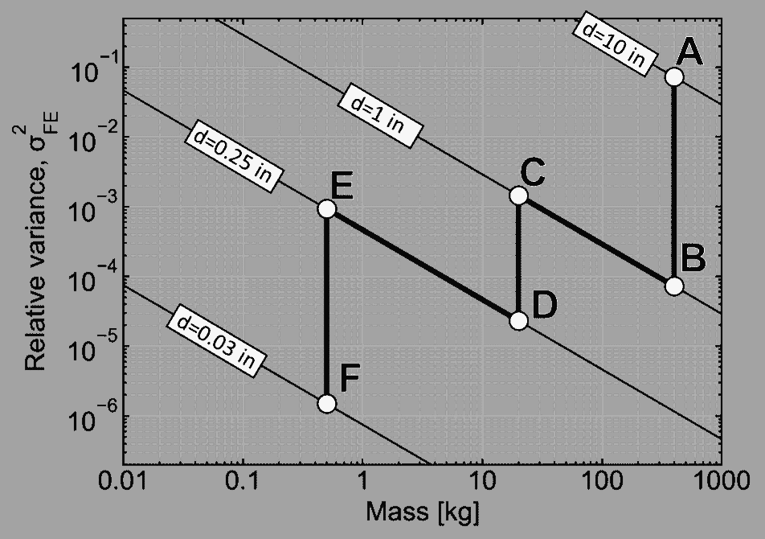
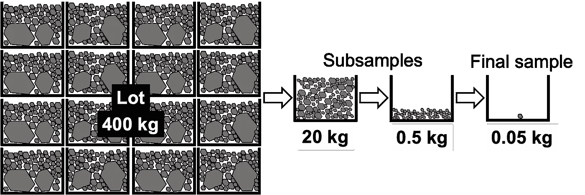
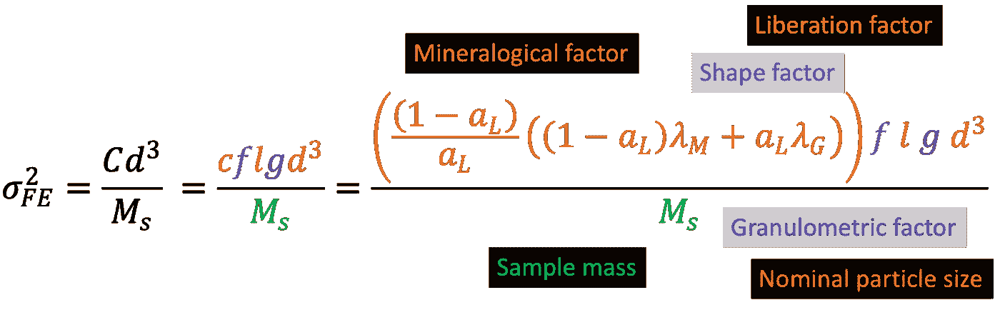
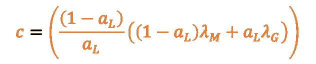
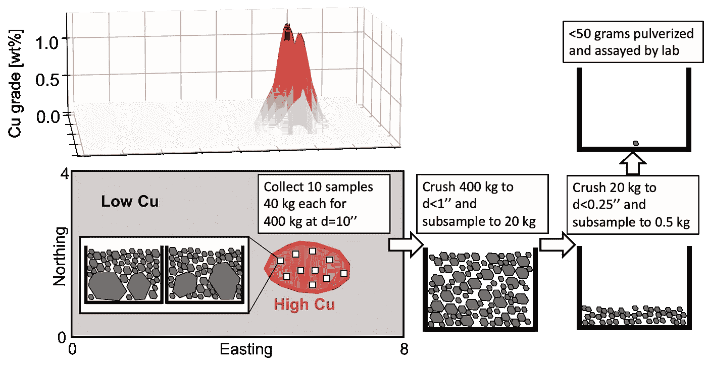
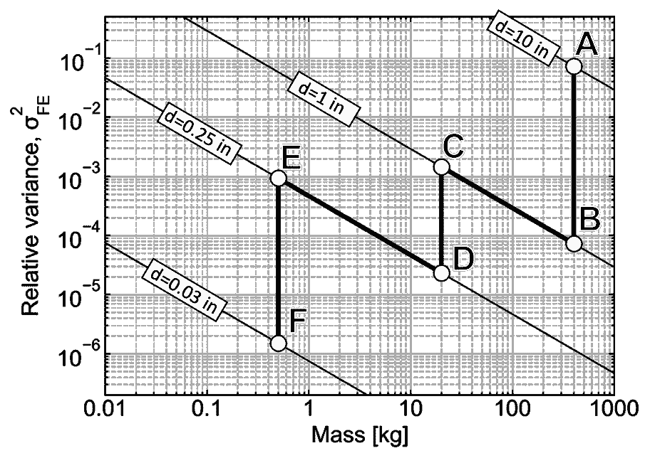
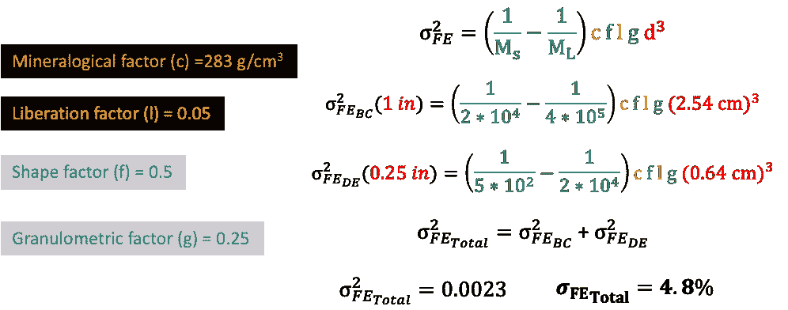
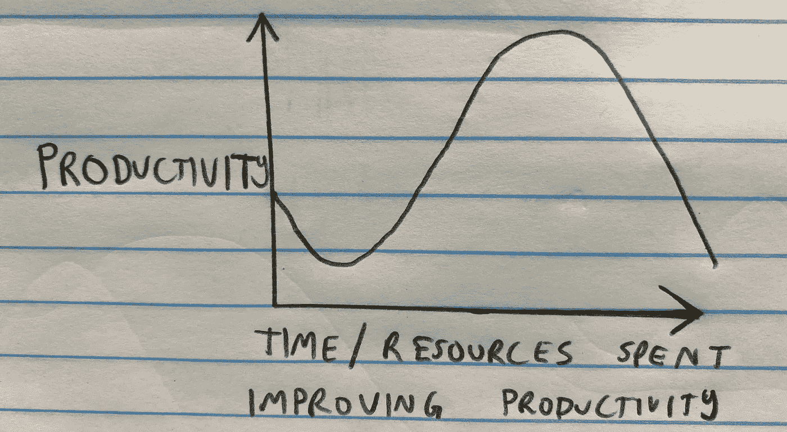

# 简单解释了取样诺模图

> 原文：<https://towardsdatascience.com/the-sampling-nomogram-simply-explained-241fef902a89>

## 简单介绍一个实际的采矿应用程序和相关代码

抽样诺模图。作者图片

# 介绍

在颗粒材料中的元素浓度与采矿或环境应用等决策相关的行业中，从被考虑的**体积或批次**中提取**个代表性样本**至关重要。如果出现不良的取样做法，可能会做出错误的决定，因为通常只对一小部分批次进行取样。例如，采矿或环境应用中污染物浓度高/低的地区的矿石/废物限制可能被错误地定义。

下图举例说明了从一批 400 千克的岩石中取出 50 克的最终样品，为了确保 50 克代表 400 千克，需要遵循广泛接受的 **Gy 的采样理论**的适当破碎和二次采样策略。

示意图显示了一个 400 kg 的批次，从该批次中提取代表性子样本并粉碎以表征该批次。作者图片

商业软件可以帮助用户，如矿工和环境科学家，根据 Gy 的取样理论构建取样诺模图。采样诺模图用于通知采样决策或操作，但是这个**软件**可能**昂贵**和**抽象重要细节**在后端运行。Gy 的采样诺模图实际上非常简单，可以用 Python 中的**很容易地****构造**。只要做一点工作，黑匣子就可以被揭示出来，从而允许对后端正在做的事情进行更好的解释。****

****这里用**实际采矿应用**和**代码**简单介绍**Gy 的取样理论，以构建和解释取样诺模图。******

# ****基本误差的相对方差****

****Gy 的抽样理论[1]定义的基本误差是假设抽样实践完美的最小抽样误差。它是对相对方差的一种度量，通常从中取平方根以获得相对标准差，类似于变异系数。相对标准偏差通常以百分比表示，然后可用于确定**理论采样精度对于当前应用**是否足够好。****

****基本误差方程由六个独特的因素**和**组成，如下所示并简要描述。****

********

****基本误差的相对方差方程。作者图片****

****人们提出了各种方法来量化每个变量。下面是对每一个变量的简要说明，但是量化变量的最佳方法取决于手边的应用。****

## ****标称粒度，d****

****标称颗粒尺寸近似于样品中最大颗粒的尺寸，单位为厘米。一个常见的定义是 **95%通过粒度**，即 95%的样品质量将通过的粒度。通常情况下，该值是通过检查估算的，但需要非常仔细地选择，最好使用颗粒筛分试验，因为它对基本误差有立方效应。****

## ****样品质量，毫秒****

****以克为单位测量的样品质量。**增加样品质量将减少基本误差**，因为代表了更大比例的批次。当采样方法在操作上受到限制时，基本误差方程常常被重新安排，以求解某个可接受误差所需的样本质量。****

## ****矿物学因素 c****

****也称为成分因素，矿物学因素描述了当感兴趣的材料完全从脉石材料中释放出来时达到的最大不均匀性**。矿物学因素以 g/cm 的密度单位进行测量，并可使用以下公式进行估算。******

********

****矿物学因素方程。作者图片****

****其中，aL 为无单位小数比例，λm 为含有分析物的颗粒密度，λg 为脉石密度。****

## ****解放因子，l****

****已经提出了许多不同的公式来量化释放系数，这是对矿物系数假设的修正。本质上，随着材料变得更加不均匀，释放因子越来越接近 **1** ，此时感兴趣的**分析物将与脉石材料**完全分离。在下端的 **0.05** 处，材料将非常均匀，并且**脉石和分析物共存于同一颗粒上**。****

****Gy 提出，释放因子可以通过感兴趣的分析物的释放直径除以颗粒直径的平方根来估算。****

## ****形状因子 f****

****形状因子也称为立方系数，是一个无量纲值，表示颗粒形状与立方体形状的匹配程度。更接近立方体形状的颗粒的 f=1，更接近球形的颗粒的 f=0.5，更接近片状材料的颗粒的 f=0.1。形状因子也可以通过将颗粒的体积除以其直径的立方来计算。****

****对于由多种形状颗粒组成的样品，最佳做法是使用目标分析物的平均形状因子。****

## ****粒度因子，g****

****也被称为粒度分布因子，这个**无量纲变量考虑了变化的粒度**，用于估计基本误差。估计该参数的常用方法是使用下面的离散表，其中描述了 Gy (1998) [2]提出的粒度系数的不同值:****

*   ****g = 0.25:无差别、未分级的材料(大多数土壤)。****
*   ****g = 0.40:材料通过筛网。****
*   ****g = 0.50:筛网保留的材料。****
*   ****g = 0.60–0.75:两个筛网之间的材料尺寸。****
*   ****g = 0.75:自然大小的材料，如谷物颗粒、某些沙子。****
*   ****g = 1.0:统一尺寸(例如，滚珠轴承)。****

# ****实际采矿应用****

****假设我们在 2D 有一个 8x 4 单元的场地，其椭圆形区域为高铜等级，如下图所示。铜品位升高的区域将是我们想要代表性地取样并获得品位的批次。下面显示的流程图说明了抽样策略，即从批次范围内随机抽取 10 个 40 千克的样品，总样品质量为 400 千克。然后，400 千克的样品经过两个阶段的压碎或粉碎，并使用旋转或 riffle 分裂器等工具进行二次取样，最终获得 0.5 千克的样品，该样品被送往实验室进行化验，以确定等级。****

********

****2D 的一个 8 乘 4 单位的场地，有一个高铜品位的椭圆形区域和显示取样策略的流程图。作者图片****

****我们将使用 Gy 的抽样理论，通过达到不确定性或相对标准偏差< 5% 来测试抽样是否具有代表性。****

## ****理论采样精度结果****

****使用一些假设的输入，下面的诺谟图是使用 github 上的 [**脚本中的`matplotlib` 输出的。下面的诺模图中标注的主要步骤也在此简要描述:**](https://github.com/13ff6/SamplingNomogram/blob/85d06282e909b885bbca9fbeb870ffba5b9fdfdd/sample_nomo.py)****

*   ******A 到 B** 将 400 千克样品从 10 英寸到 1 英寸的公称尺寸进行初步破碎****
*   ******B 至 C** 在 1 英寸处对 400 千克至 20 千克进行二次取样****
*   ******C 到 D** 对 20 千克样品进行二次粉碎，从公称尺寸 1 英寸到 0.25 英寸****
*   ******D 至 E** 对 20 千克至 0.5 千克的样品进行二次取样，然后送至实验室进行化验****
*   ******E 至 F** 最终 0.5 千克样品的粉碎和化验准备****

********

****标有不同点的取样诺模图显示了 400 千克样品(标称粒径为 10 英寸)到 0.5 千克最终样品(标称粒径为 0.03 英寸)的反复破碎和二次取样。作者图片****

****下面显示的是总基本误差的计算结果，它是通过对二次采样的每个阶段(本例中为 B 至 C 和 D 至 E)的相对方差求和得到的。****

********

****通过对 BC 和 DE 的每个子采样阶段的相对方差求和，对总相对标准差进行假设和计算。作者图片****

****得到的相对标准偏差为 **4.8%** ，低于 **5%的目标**。****

## ****使用 Python 代替商业软件的优势****

****用现成的软件包也可以达到同样的效果。然而，了解细节并用 Python 代码进行测试可以让从业者**轻松模拟不同的场景。**例如，假设本例中的目标是 3%的相对标准偏差。从业者可以测试不同的较高样品质量或较小的标称颗粒尺寸，以获得较低的基本误差。或者，如果相对标准偏差目标是更灵活的 10%，则可以测试不同的场景，以确定哪个场景可以最小化所需的采样资源。****

# ****结论****

****对 Gy 取样理论的扎实理解对于确保**代表性样品**取自正在考虑的**体积或批次**的**非常重要。确定量化 Gy 基本误差的因素具有足够的挑战性，但是采样诺模图的实际构造和基本误差的计算实际上非常简单，可以用 Python 来完成。*当简单的开源选项可用时，我们不应该总是依赖昂贵的软件和黑盒解决方案。*******

# ****平衡理论和实践知识****

****理论方法，如 Gy 的采样理论，对于在现场做出决策非常有用，但是考虑可能存在的**操作困难或限制**也很重要。同样，如果程序没有**理论上的考虑**，纯粹基于操作简易性的决策可能导致错误的结果。最终，在*和 ***实际*** ***知识*** 之间需要**平衡****，以便可以实现最优结果，该最优结果可能不是最佳的理论解决方案或最容易实现的解决方案，但是在给定可用资源和约束的情况下将提供最佳解决方案。***********

*****下图粗略说明了在平衡理论知识和基于实际操作的经验时如何实现**最佳生产率**。要么过分纠结于每一个微小的理论细节，要么只做最实际的事情，这都会导致次优的生产率。*****

**********

*****图解说明当生产时间与改进程序和生产效率所花费的时间和资源之间达到适当平衡时的最佳生产效率。作者图片*****

*****在我们对高铜品位批次进行取样的例子中，理论上的解决方案可能是多取样十倍，并将所有材料粉碎至 0.1 英寸，这在操作上变得具有挑战性，如果没有所需的设备，这可能是不可能的。类似地，仅仅抓取一块 1 公斤的石头很可能会给出不正确的结果，但是在实践中很容易做到。因此，需要两个之间的**平衡来实现最佳结果。*******

# *****参考*****

*****[1]戈瑞，下午，1976 年。颗粒材料的取样——一般理论。里面的 j .迈纳。过程。, 3: 289–312.*****

*****[2] Gy，1998 年下午。用于分析目的的取样。英国奇切斯特威利。*****