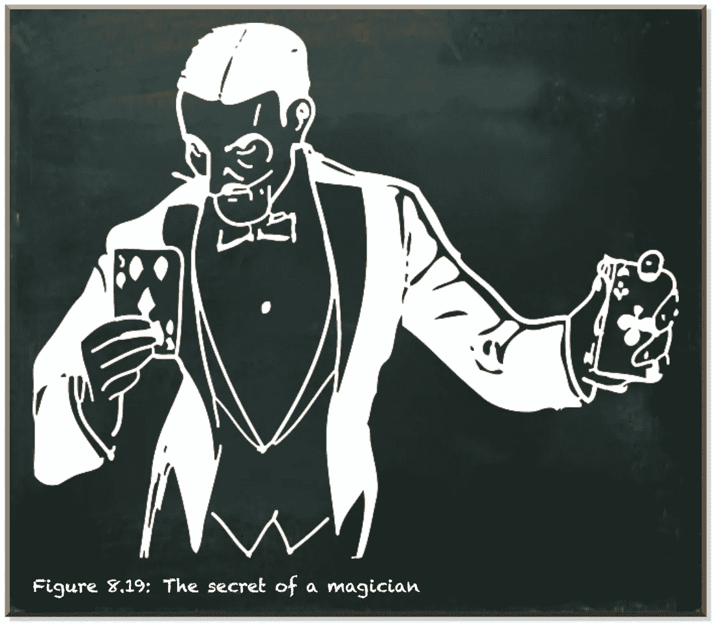
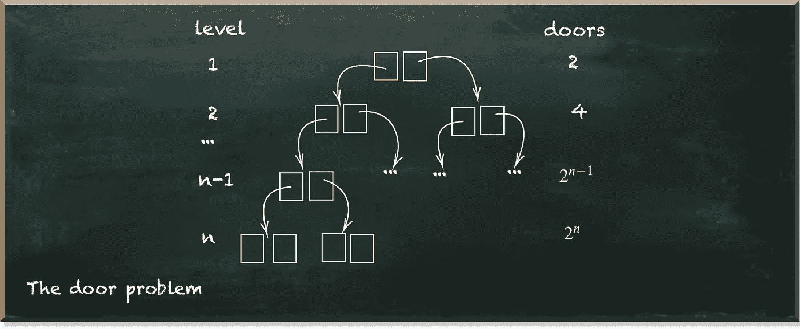
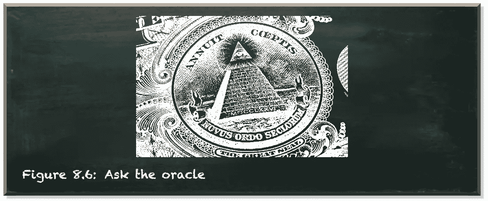

# 成为量子专家的秘密技能

> 原文：<https://towardsdatascience.com/the-secret-skill-you-need-to-becoming-a-quantum-expert-6da3b298bf55>

## 既不是数学也不是物理

量子机器学习要不要入门？看看 [**动手量子机器学习用 Python**](https://www.pyqml.com/page?ref=medium_secretskill&dest=/) **。**

作者图片

成为量子计算专家的秘密要素不是数学或物理学位。如果是这样的话，这些聪明的物理学家中的一个应该已经找到了解决人类迫切问题的方法。但是他们还没有。

该行业需要的是那些了解紧急问题的特殊性，同时确定可以从量子加速中受益的问题的专家。

最大的误解是量子计算机比经典计算机快。他们不是。

> 量子计算所做的只是让实现非确定性算法成为可能。

但是不用担心。这不是一件坏事！如果量子计算是一个解决世界上所有问题的通用工具，我们将受到少数理解量子计算的数学家的摆布。而仅限于少数人的知识是危险的。剥夺大部分人口的知识是民主的死亡和走向专制的道路。

但是量子计算不是数学家幕后操纵的神奇工具，这不仅对我们的社会有好处。相反，这是你分一杯羹的机会。

作者图片

你只需要了解什么是非确定性算法，以及如何识别可能从中受益的问题。

我们来考虑下面这个问题。你站在两扇门前(第一层)。您选择了一个门，然后再次看到两个门(在标高 2)。这种情况一直持续到你到达第 n 层。最后，在最后的第 n 层，有一扇门，门后有一个奖品。

作者图片

现在，让我们创建一个算法来解决这个问题。

传统上，我们使用确定性算法。这样的算法可以一步打开一扇门。所以它从第 1 步到第 n 步逐门打开，看是否包含价格。如果没有，则继续下一个。

解决这个问题需要几个步骤？

最好的情况下，需要 n 步。这是我们第一次尝试打开带价格的门时的情况。

然而，在最坏的情况下，它需要 *2⁰+2 +…+2^(n-1)+2^n* 步骤。这是门的总数。在这种不幸的情况下，我们打开的最后一扇门包含了奖品。

在这两种情况下，我们需要解决问题的步骤数随着 n 的增加而增加。然而，它们长得非常不同。因为第一个是线性增长的，我们说这个算法是多项式增长的。相比之下，第二个呈指数增长。你千万不要低估这种差异。

步骤数多项式增长的解可以快速求解，即使对于大 n 也是如此。即使我们没有计算能力来解决 n 值大的问题，我们也应该在几年内拥有它。

所以让我们回到门口。显然，假设我们第一次尝试就能找到价格是幼稚的。对于大的 n 来说尤其如此，因为我们拥有的门越多，任何特定的门包含奖品的可能性就越小。然而，在复杂性理论中，我们通常假设最坏的情况。

但是如果有人告诉你正确的门，那就完全不同了。然后，不管是哪扇门，你只需要 n 步就可以检查出答案。

作者图片

让我们考虑另一种算法——非确定性算法。这种算法可以在一个步骤中同时打开同一层的所有门。第一步，它打开第一层的两扇门。第二步，打开第二层的四扇门，依此类推。因此，它打开了第 n 层的 2^n 门。最终，该算法在 n(非确定性)步骤后找到价格。因此，解决这个问题的复杂性是多项式的——它是容易处理的。

现在，我们只需要一台能够执行非确定性算法的计算机。这种计算机可以解决门问题，因为算法的复杂性只是多项式增长。

一些聪明的数学家确实开发了非确定性算法。一些人处理数学玩具问题，像多伊奇和西蒙。其他人，像彼得·肖尔，处理相关的问题，如数字的因式分解。

但是为什么他们没有解决人类的紧迫问题呢？或者至少是对公司很重要的问题？

他们开发算法来解决他们最熟悉的问题。原因很简单。要创建一个解决问题的非确定性算法，你必须彻底了解问题的结构。

而数学家最懂什么？对，数学问题。

同时好消息和坏消息是，这些数学家不太了解你在日常工作中面临的问题。所以要解决它们，就得自己动手。

因此，要成为量子计算专家，你需要获得现实世界领域的专业知识。然后，用识别可能受益于非确定性算法的问题的能力来补充它。

量子机器学习要不要入门？看看 [**动手量子机器学习用 Python**](https://www.pyqml.com/page?ref=medium_secretskill&dest=/) **。**

在这里免费获得前三章。