# t-SNE，UMAP，主成分分析和其他映射之间的定量比较。

> 原文：<https://towardsdatascience.com/the-similarity-between-t-sne-umap-pca-and-other-mappings-c6453b80f303>

## 低维投影有助于更好地理解样本之间的关系，但是一个地图与另一个地图有多相似呢？

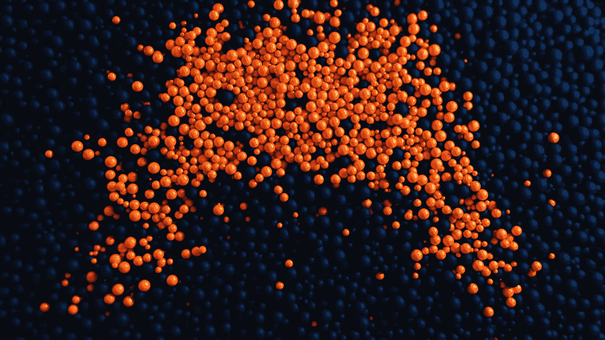

在 [Unsplash](https://unsplash.com/s/photos/scatter?utm_source=unsplash&utm_medium=referral&utm_content=creditCopyText) 上的 [Mike U](https://unsplash.com/@roguewild?utm_source=unsplash&utm_medium=referral&utm_content=creditCopyText) 拍照。

PCA、t-SNE 和 UMAP 等降维方法的使用是对低维样本进行特征降维和可视化的重要技术。如果我们可以看到样本是如何通过眼睛分布的，它可以提供新的关键见解。*但是，与(原始的)高维度相比，降维空间的代表性如何呢？或者 UMAP 的嵌入与 t-SNE 或 PCA 相比有多一致？*在这里，我将演示如何使用 [*flameplot*](https://erdogant.github.io/flameplot/pages/html/index.html) 库中的计算方法来量化两幅地图之间的相似性。

*如果你觉得这篇文章很有帮助，可以使用我的* [*推荐链接*](https://medium.com/@erdogant/membership) *继续无限制学习，并注册成为中级会员。另外，* [*关注我*](http://erdogant.medium.com) *关注我的最新内容！*

# 介绍

主成分分析、t-SNE 和 UMAP 等特征提取方法的主要目的是以这样一种方式降低数据集中的维数，即低维空间是原始(或高维)空间的良好表示。

一般来说，有两种类型的特征提取方法；*线性和非线性变换*。 ***线性方法*** 如 PCA，基于原始特征的线性组合构造一组新的维度或潜变量。 ***非线性方法*** 另一方面，诸如 t 分布随机邻居嵌入(t-SNE)，非线性地保留样本之间的局部相似性，代价是保留不同样本之间的相似性。因此，t-SNE 可以更好地保留局部(不)相似性，因为它不会因数据集中的巨大差异而被压缩。一个主要的优势是非线性映射非常适合低维表示或可视化。另一方面，线性归约方法，例如 PCA，优选地用于降低复杂度、改善运行时间、确定特征重要性，以及最后但并非最不重要的防止维数灾难。值得注意的是，当用于可视化目的时，PCA 方法也可以提供很多信息。关于如何更深入地了解数据的更多信息，请参见[[1]](/what-are-pca-loadings-and-biplots-9a7897f2e559)关于五氯苯甲醚用量的博客。

# **如何量化地图之间的差异？**

在将高维数据映射到低维数据时，重要的是 ***相似样本之间的距离被很好地保留，而不是样本的整体分布*** *。*我们希望在原始(高维)空间中看到的低维表示中投影彼此相关的样本。这将允许通过目视检查发现样品之间的关系。*这种量化方法最初在本文[【2】](https://www.nature.com/articles/srep24949)中描述，具有以下步骤来量化两个图之间的样本相似性:*

1.  *计算每个图中样本之间的欧几里德距离。*
2.  *使用欧氏距离对样本进行排序。距离最小的样本在顶部。*
3.  *对于 kX 和 kY 最近邻，将地图 X 的等级与地图 Y 的等级进行比较。*
4.  *量化等级之间的重叠。*

***最终输出是一个矩阵，它描述了 k 个最近邻的映射有多相似。*** 得分是描述地图之间样本相似性的度量。两个地图之间的完美重叠将导致得分为 1，这意味着一个地图的所有 k 个最近邻与另一个地图相似。然后，我们可以将高值的矩阵染成红色，低值的矩阵染成蓝色。这种可视化可以帮助快速解释地图的比较。

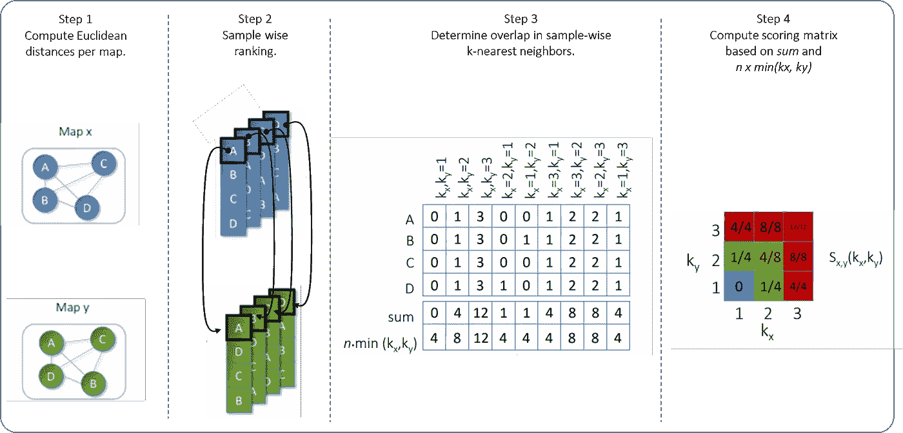

图一。系统比较两个样本投影之间的局部和全局差异的示意图。图片来自作者。

让我们再多谈一点评分方法。分数基于每个样本的 *kx* 和 *ky* 最近邻。在第一步中，为图 *X* 中的样本 *i* 计算等级，并将其与 *j* 邻居进行比较； *rxij* 。样本 *i* 的第一个最近邻的等级为 1，第二个最近邻的等级为 2，依此类推。类似地， *ryij* 是样本 j 相对于样本 *i* 在图 *Y* 中的排序。现在我们可以在区间[0，1]上计算一个分数(见等式 1)，其中变量 *n* 为样本总数，指标函数由等式 2 给出。

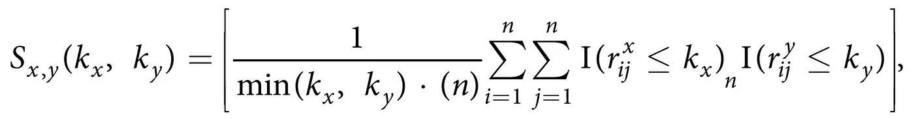

等式 1。


等式 2。

*如果对于每个样本，图 X 中的所有 kx 最近邻也是图 Y 中的 ky 最近邻，则得分 Sx，y(kx，ky)将具有值 1，反之亦然。*

# **使用主成分分析、t-SNE 和 UMAP 进行降维。**

在以下示例中，我将使用 *mnist* 数据集，并使用 PCA、t-SNE 和 UMAP 创建嵌入。我们要回答的问题是: ***就样本分布而言，不同的地图有多“相似”*** 。首先，我们需要安装[*flame plot*](https://erdogant.github.io/flameplot/)*，这将有助于量化地图之间的相似性，并创建有洞察力的情节。*

```
*pip install flameplot*
```

*我们可以使用主成分分析、t-SNE 和 UMAP 来降低维度，并绘制前两个维度(图 2、3 和 4)。很明显，与主成分分析相比，SNE 霸王龙和 UMAP 霸王龙表现出了更好的分类效果。但是 PCA 有 50 个维度，但是为了可视化的目的，我们仅限于绘制 2(或 3)个维度。*虽然我们可以观察到各种类似乎被很好地分开，但仅仅通过眼睛是不可能将精确的样本分布与另一张地图进行比较的。**

*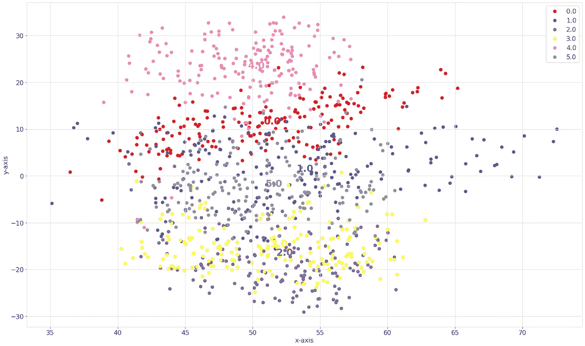*

*图二。mnist 数据集的前两个 PC 的 PCA 图。图片来自作者*

*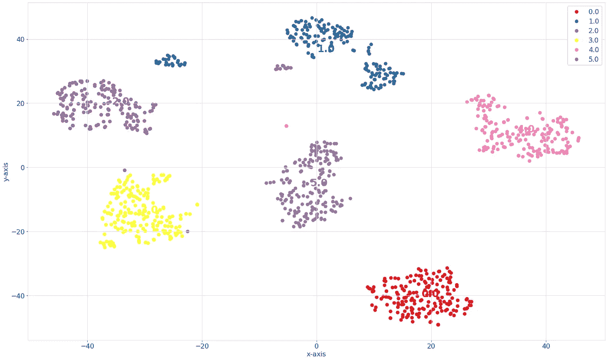*

*图 3。mnist 数据集的 t-SNE 图。图片来自作者。*

*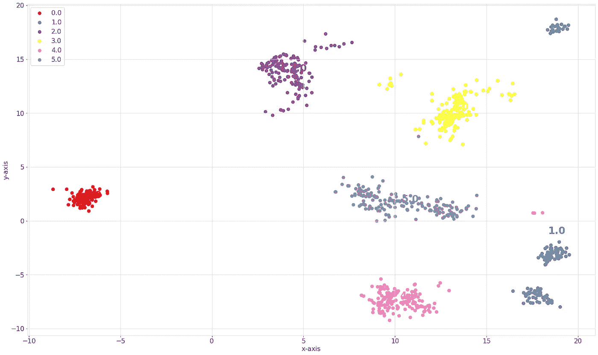*

*图 4。mnist 数据集的 UMAP。图片来自作者。图片来自作者。*

## *创建交互式散点图。*

*使用 [D3Blocks 库](https://d3blocks.github.io/d3blocks/)，我们可以创建一个交互式散点图，直观地查看样本在不同投影之间的分布情况。更多关于 D3blocks 的细节可以在这个[博客](/d3blocks-the-python-library-to-create-interactive-and-standalone-d3js-charts-3dda98ce97d4)中找到。*

```
*pip install d3blocks*
```

*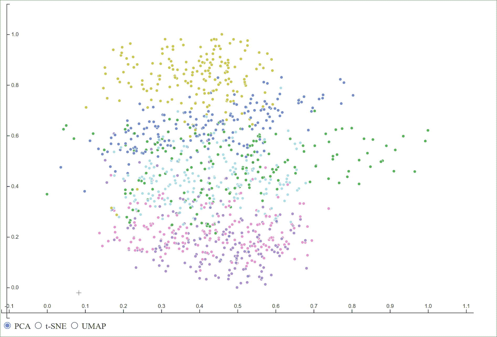*

*用 D3Blocks 创建的交互式散点图。*

# *量化地图之间的相似性。*

*使用 *flameplot* 库来量化两张地图之间的相似性是相当简单的。导入库后，我们可以使用*比较*功能，提供样本在地图中的坐标。*

# *50D 主成分分析与 2D t-SNE 图的比较。*

*当我们量化 50D PCA 嵌入和 2D t-SNE 图之间的相似性时，我们可以直接看到局部和全局范围内的高分(图 5)。这表明，与 2D t-SNE 图中的样本分布相比，50D PCA 图中样本的邻居分布非常相似。或者换句话说，t-SNE 在降低维度和保持样本之间的局部相似性方面做得非常好。*

*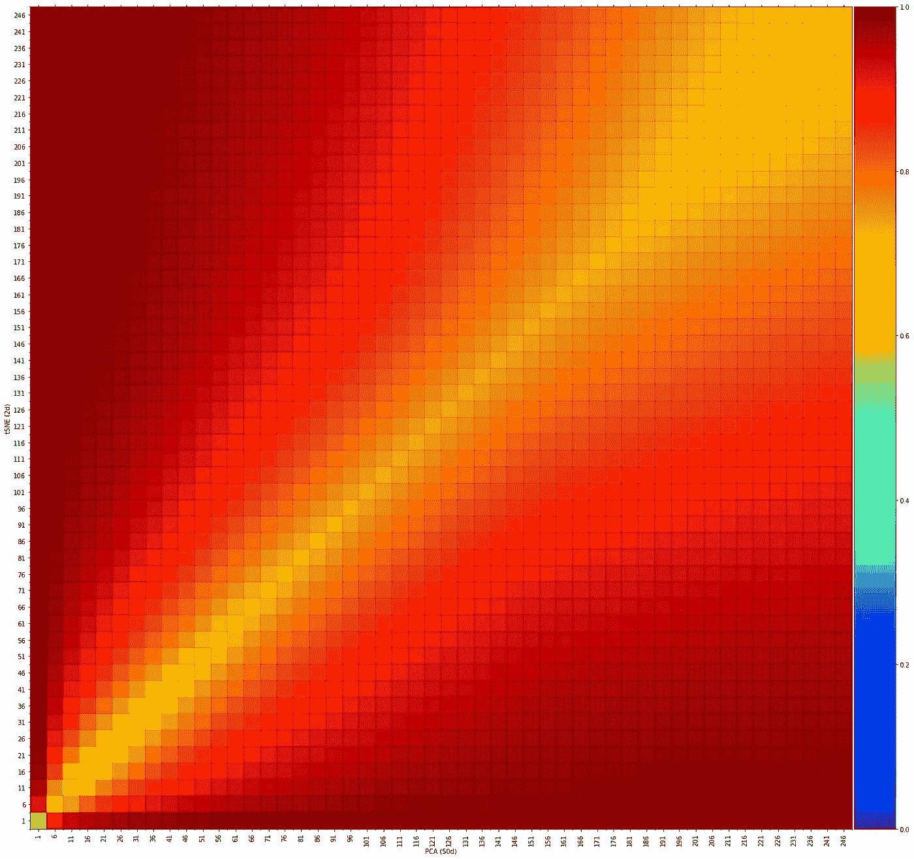*

*图 5。轴表示最近邻居的数量。x 轴显示 50d-PCA，y 轴显示 t-SNE。颜色描述了 k 个最近邻居之间的相似性分数。图片来自作者。*

# *2D 主成分分析与 2D t-SNE 图谱的比较。*

*2D PCA 与 2D t-SNE 之间的比较结果，平均而言，相似性较低。局部尺度，即最近邻居的最接近数量，显示出较低的分数。这意味着样本在两个图之间具有不同的邻居，因此两个图上存在不同的样本分布。在较大的比例下，分数会变得稍大(绿色)，这意味着平均而言，在两张地图之间会看到更多相似的邻居。*

*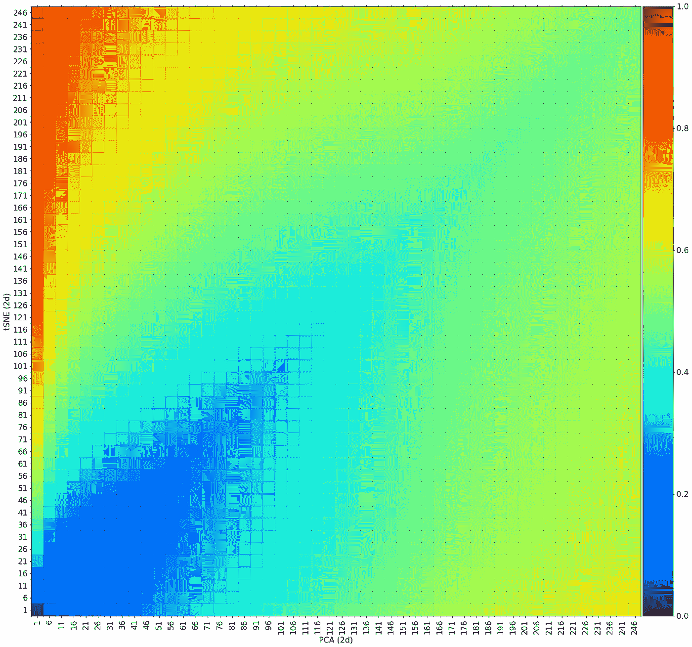*

*图 6。轴表示最近邻居的数量。2d-PCA 显示在 x 轴上，t-SNE 显示在 y 轴上。颜色描述了 k 个最近邻居之间的相似性分数。图片来自作者。*

# *t-SNE 和 UMAP 地图的比较。*

*t-SNE(图 3)和 UMAP(图 4)都清楚地区分了类别，但是还不知道确切的样本分布是否也相似。在这里，我们可以再次量化与<https://erdogant.github.io/flameplot/>**库的相似性(图 7)。比较的结果是高分，这意味着地图之间在局部和全球尺度上的样本分布非常相似。然而，当我们仔细观察极低数量的邻居时，我们看到 6 个最近邻居的得分为 0.5–0.6(绿色)。这意味着在两个地图之间存在非常局部的相似性之间的一些差异。***

***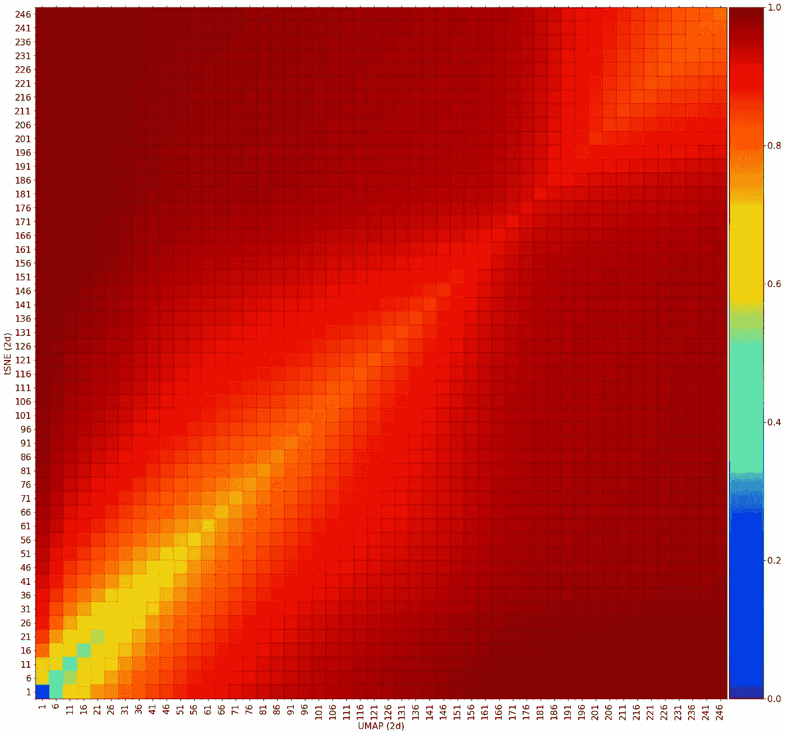***

***图 7。轴表示最近邻居的数量。x 轴表示 UMAP，y 轴表示 SNE 霸王龙。颜色描述了 k 个最近邻居之间的相似性分数。图片来自作者。***

# ***t-SNE 与随机坐标的比较。***

***让我们做最后一个比较，看看当我们比较 t-SNE 图和随机数据点时，行为是怎样的。从图 8 中可以看出，它的得分很低，这意味着在局部和全局范围内都没有发现相似性。这证实了我们应该期待的。***

***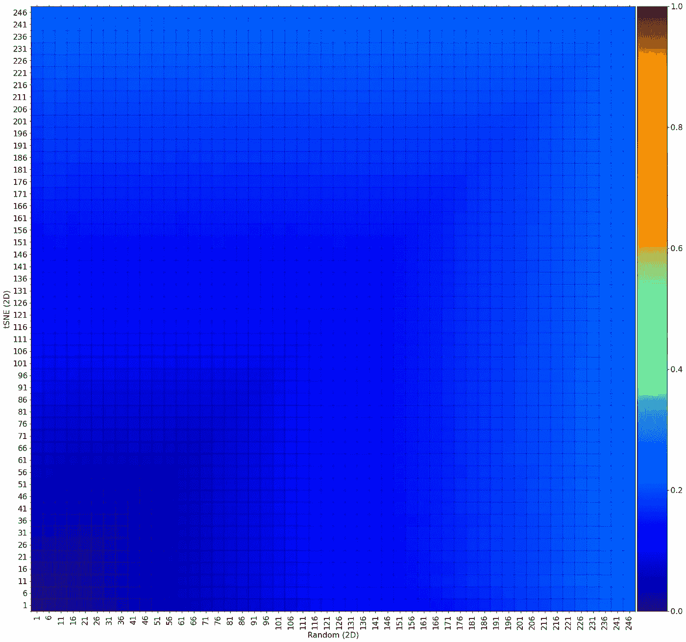***

***图 8。轴表示最近邻居的数量。x 轴显示随机数据，y 轴显示 t-SNE。颜色描述了 k 个最近邻居之间的相似性分数。在当地或全球范围内看不到任何相似之处。图片来自作者。***

# *****收尾。*****

***维数约减技术对于低维样本的特征约减和可视化非常有用。尽管我们期望低维空间应该代表(原始的)高维度，但情况并不总是如此。 [flameplot](https://erdogant.github.io/flameplot/) 这种见解有助于确定映射的稳定性，和/或您是否希望将结果用于决策。*当我们使用低维空间的结果进行决策时，我们应该始终意识到地图仅仅是更高复杂维空间的投影。****

***注意安全。保持冷静。***

*****欢呼，E.*****

***如果您觉得这篇文章很有帮助，请使用我的* [*推荐链接*](https://medium.com/@erdogant/membership) *继续无限制学习，并注册成为中级会员。另外，* [*关注我*](http://erdogant.medium.com) *关注我的最新内容！***

## **软件**

*   **[火焰图库](https://erdogant.github.io/flameplot/)**
*   **[D3Blocks 库](https://d3blocks.github.io/d3blocks/)**

## **我们连线吧！**

*   **[让我们在 LinkedIn 上联系](https://www.linkedin.com/in/erdogant/)**
*   **在 Github 上关注我**
*   **[在媒体上跟我来](https://erdogant.medium.com/)**

## **参考**

1.  **E.什么是五氯苯甲醚负荷和双标图？ ，中，走向数据科学，2022 年 4 月**
2.  **E.Taskesen 等人，[*2D 图谱中的泛癌亚分型显示了由分子特征*](https://www.nature.com/articles/srep24949) 的特定组合驱动的亚结构，科学报告自然，2016**
3.  **E.Taskesen， [*D3Blocks:创建交互式和独立 D3js 图表的 Python 库*](/d3blocks-the-python-library-to-create-interactive-and-standalone-d3js-charts-3dda98ce97d4) *，* Medium，迈向数据科学，2022 年 9 月**