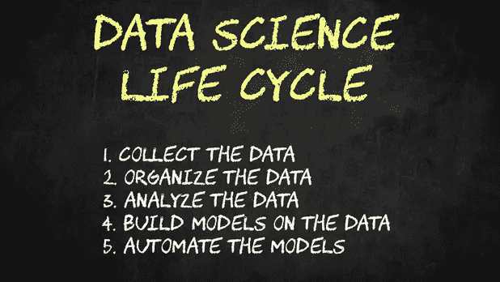
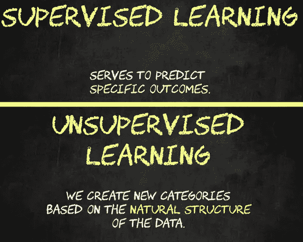
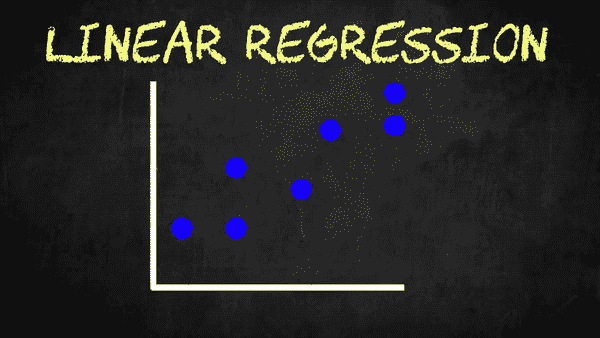
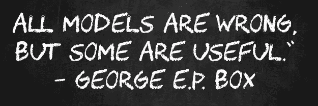

# 数据科学初学者需要知道的简单事情

> 原文：<https://towardsdatascience.com/the-simple-things-you-need-to-know-as-a-data-science-beginner-c4b9ffd0b516>

## 你对数据科学好奇吗？你对你的数据科学家同事的工作感兴趣吗？你想成为一名数据科学家吗？这是你进入这个令人兴奋的领域的入门书！

图片由 [Sai Kiran Anagani](https://unsplash.com/@anagani_saikiran) 在 [Unsplash](https://unsplash.com/?utm_source=medium&utm_medium=referral) 上拍摄

# 目录

1.  [一段(非常简短的)历史](#6935)
2.  [数据科学家如何利用数据创造价值](#9b92)
3.  [数据科学家使用的工具](#c7f6)
4.  [数据科学家解决什么问题？](#5f9a)
5.  [机器如何学习？](#eddc)
6.  [数据科学项目是什么样的？](#a662)
7.  [结论](#a6d9)

这篇文章是写给那些想要一本关于什么是数据科学、它是如何工作的以及它的用途的简单易懂的解释的人的。也许你听说过数据科学，你想了解更多。也许你与一位数据科学家一起工作，并希望更好地了解他们的角色，或者你甚至有成为一名数据科学家的目标。这篇文章以简单的术语定义和描述示例为特色，是为您而写的。

我叫 Ken Jee，是一名数据科学家和内容创作者。总的来说，我的任务是帮助每个人更容易进入这个领域(老实说，我也有点为我的父母写这篇文章，这样他们就不会再要求我解释我每周都在做什么)。话虽如此，我们还是直接进入主题吧。

如果您喜欢视频格式，请点击此处观看:

# (非常简短的)历史

要了解现在的数据科学是什么，重要的是要了解它是从哪里开始的。数据科学存在的时间比我们大多数人意识到的要长。1974 年，著名的计算机科学家彼得·诺尔提出了数据科学作为计算机科学的替代名称。有趣的是，在 1985 年，C.F. Jeff Wu 在他的一次演讲中使用了这个术语作为一个完全不同的领域统计学的替代名称。如果这不是显而易见的，这里有一些相当杀手的伏笔。

数据科学家的官方头衔最早是由 LinkedIn 的 DJ Patil 推广的，他后来成为巴拉克·奥巴马政府下的第一位美国首席数据科学家。

虽然这一领域的起源实际上相当古老，但这一领域的真正演变却相对较新。由于存储和计算能力的巨大进步，在过去 10 年中，数据科学的发展方式发生了巨大变化。这些短时间内的快速变化是人们仍然普遍认为数据科学是一个新的或不断发展的学科的原因。

虽然计算机科学和统计学都被几位教授称为数据科学可能是巧合，但这已经成为现实。数据科学现在是这两个领域的完美结合。我们还应该加入一点业务和主题领域来平衡事情。

许多人仍然坚持认为数据科学只是用不同的名字称呼统计学。在 1985 年，这可能是真的在一个 C.F .杰夫吴的演讲。然而，我不认为现在还是这样。由于巨大的数据量和不断增加的计算复杂性，如果没有计算机科学的帮助和对他们所操作的独特领域的一些高级理解，数据科学家今天面临的许多问题都无法解决。

那么，实际上，现在的数据科学是什么？这些抽象的东西已经够多了。

数据科学是一个名副其实的领域。数据科学是一个我们使用数据来产生某种形式的价值的领域。我们用科学技术来提取这种价值。

作者图片

# 数据科学家如何用数据创造价值

让我们更深入地分析一下。我们如何处理数据来产生一些价值？数据科学家从数据中获取价值的方式在很大程度上源自数据科学生命周期。所有组织的数据通常都遵循这条路径。

作者图片

我们从数据中产生价值的第一种方式是通过收集数据。虽然这不一定是所有数据科学家的核心角色。一些数据科学家利用他们的技能来收集数据。这可以通过建立网页或调查等数据输入系统来实现，也可以通过编写代码从网上不同地方收集数据来实现。

数据科学家从数据中创造价值的另一种基本方式是组织数据。世界上绝大多数数据是非结构化的，这意味着它们没有被组织到数据库中。一些数据科学家可以将这种无序的数据转换成结构化的格式，使其更容易分析。作为该过程的一部分，他们还可以通过纠正拼写错误、修复错误、识别重复记录和识别缺失值来“清理”数据。如今，这些任务中有很多是由数据工程师处理的，但它们仍然属于数据科学的范畴。如果您想了解特定数据科学角色的更多细节，这里有一个视频。

我们从数据中创造价值的下一种方式是通过分析。简单分析从基础统计开始。例如，我们可能希望对比在线客户和店内客户的平均支出。像这样的见解可以帮助我们在如何销售或营销方面做出更明智的决策。通常，传达这些见解的最佳方式是通过漂亮的数据可视化。我们也可能想看看广告活动是否有效。我们可以进行一个 A/B 测试，看看两个广告位置中哪一个推动了最多的销售。

作者图片

这是很多科学开始出现的地方。对于这样的事情，我们希望使用科学的方法和概念，如假设检验，来评估群体和活动之间的差异。

在数据分析之后，我们开始进入大多数人认为性感的东西:建立预测模型。根据过去的数据，数据科学家通常可以建立比随机概率更好地预测未来结果的模型。这使得企业(有望)在如何分配资源方面做出更好的决策。例如，如果我们拥有一个农场，我们可以建立一个模型来预测我们每个月需要购买多少化肥。特别是如果肥料有保质期，如果我们能非常准确地预测它，就能为我们省钱。另一个例子是，如果我们打算特许经营一家新餐馆，我们可以在理论上建立一个模型，根据新地点的地理、交通模式和人口统计数据来预测投资回报。

数据科学家从数据中创造价值的最后一个主要方式是通过自动化。如果我们将我们构建的一些模型投入生产，它们通常会以远远超过人类的速度提出建议。网飞就是一个很好的例子。他们有机器学习算法，可以实时给你推荐视频。对于一个真人来说，做同样的服务，需要成千上万的人，成千上万的小时。在这种情况下，只需要几个算法就可以在瞬间完成。这些事情会有回报的。根据 Comparitech 的说法，显然[网飞的推荐算法对他们来说每年价值超过 10 亿美元](https://www.comparitech.com/blog/vpn-privacy/netflix-statistics-facts-figures/)。

# 数据科学家使用的工具

现在你应该很有希望理解数据科学家在哪里创造价值。但是他们用什么工具，他们的工作是什么样子的？

在我看来，数据科学家工具箱中最重要的工具是编程。大多数数据科学家要么使用 Python，要么使用 R，Python 是两者中更受欢迎的。也使用其他语言，但通常是针对特定的领域或用例。数据科学家能够访问数据，操纵数据，创建可视化，建立模型，并通过编码生产他们的模型。编程是数据科学家的通用工具。

数据科学家也有他们使用的专业工具。为了获取和操作数据，数据科学家通常会使用 SQL。这使得数据科学家可以轻松地与存储数据的数据库进行通信。另一个专业工具是 Tableau 或 Power BI，它们提供了创建数据可视化和仪表板的图形界面。

对于一些项目，数据量太大，数据科学家需要使用更多的计算能力。在这些情况下，他们将访问亚马逊、谷歌或微软(也被称为云提供商)拥有的虚拟计算机来运行他们的分析。

最后一个越来越受欢迎的工具是 Git。Git 是为编写代码的人提供的版本控制工具。这里有一个关于这个的完整视频，供那些想要更深入了解的人观看。

# 数据科学家解决什么问题？

我们明白，数据科学家正在使用奇特的工具。但是他们实际上能帮助解决什么问题呢？我认为这对于非数据科学家来说非常重要。数据科学和机器学习擅长处理两种主要类型的问题:监督学习和非监督学习。

首先是监督学习。监督学习用于预测特定的结果。我们想预测一些事情，比如某人是否戴着面具，或者某人到底有多高。监督学习意味着我们有数据，我们想要预测的结果被标记出来。假设我们想预测一个木瓜是否成熟。如果我们的数据有一些木瓜的特征，如长度、柔软度、质量和含糖量，如果有人给它贴上“成熟”的标签，那么这将是一个监督学习问题。更具体地说，这将是一个分类问题。我们试图将木瓜分为成熟或不成熟两类。如果我们试图预测一个木瓜的克重，这将是一个回归问题，因为我们试图预测一个连续的数值。

无监督学习是另一回事。在无监督学习的情况下，我们通常没有预先定义好的类别。相反，我们看到哪些数据自然地组合在一起，并根据其相似性或差异创建新的类别。简单的客户细分就是一个例子。也许你根据购买模式将顾客分组，然后根据相似的特征给这些群体命名。另一种形式的无监督学习是生成式的，我们从在大规模语料库上训练的模型中创建文本或图像。

作者图片

再次强调，我认为理解机器学习和数据科学的局限性非常重要。我经常听到非数据科学家把这个领域说成是万灵药。是的，我们可以做一些不可思议的事情，但是基于具体的商业案例，仍然有一些限制。这里有一个很好的例子，说明数据科学会因为糟糕的假设而出错。

# 机器是如何学习的？

我意识到我在这篇文章中多次提到机器学习。事实上，我可能会将它与数据科学互换使用。我收到的很多问题是，什么是机器学习，什么是数据科学？机器实际上是如何学习的？

虽然[我有一整段视频更深入地探讨了这个话题的细节，](https://www.youtube.com/watch?v=q8cEt8gj3zY)机器学习算法主要是数据科学家用来建立他们的模型的。我上面列举的有监督的&无监督的学习技术都是机器学习。另一方面，大多数数据分析、数据收集和数据清理技术都没有落入机器学习的范畴。

在很大程度上，每当我们制作一个预测未来结果的模型，用算法将数据点分组，或生成新材料时，我们所做的都被认为是机器学习。

但是学习真正发生在哪里呢？

每当数据科学家构建一个模型时，他们都会将其数据分成一个训练集和一个测试集。他们将使用训练数据来“教授模型”，然后他们将看到他们的模型在预测测试集中的结果方面做得如何。我们来做一个很简单的例子。我们的数据是根据某人制作的视频数量来预测他们在 YouTube 上的浏览量。通过简单的线性回归，训练我们的模型是拟合此数据的直线。这就是我们的模型从这些数据中学习的方式。为了对我们的测试数据进行预测，我们只需要根据我们在训练集中选择的数据点来查看我们的线的值。

训练模型的一种方法是使用一条平坦的线，然后改变模型的斜率和截距，以减少误差或我们对每个估计的错误程度。作者图片

如果我们的模型在预测这些测试值方面做得很好，那么我们可以认为它已经准备好应用于新数据。在模型训练中，你会听到过拟合和欠拟合、偏差和方差权衡之类的术语。我认为它们可能超出了本文的范围，但是如果您想让我就这些问题写单独的文章，请在评论部分告诉我。

# 数据科学项目是什么样的？

我们构建了这些模型，但是数据科学家工作的最终产品是什么样的呢？老实说，这因角色而异。数据科学的可交付成果通常有三种风格:1)指导业务利益相关者获得自己见解的仪表板，2)对特定问题提出建议或预测的可交付成果，以及 3)用户可以从中获得实时预测的训练模型。

我认为理解这一点非常重要，在这个领域中，没有明确的正确和错误的答案。只有确定性和不确定性的影子。我的意思是，我们建立的模型给了我们对可能发生的事情的估计。我们模型的可信度帮助我们决定是否应该采取行动。理论上，任何模型都可能是错误的，即使它是在预测第二天太阳是否会升起。

我们建立的大多数模型，尤其是那些与实时预测相关的模型，需要不断地维护、重新训练，并用新数据更新，以使它们尽可能准确。

作者图片

# 结论

希望本文能帮助您更好地理解数据科学以及数据科学家可以帮助解决的一些问题。如果您认为这篇文章对您的朋友、同事或希望成为数据科学家的人有所帮助，如果您转发这篇文章，我将不胜感激。

如果您喜欢这篇文章，请记得在 Medium 上关注我以获取更多类似内容，并注册我的简讯以获取我的内容创作和数据科学行业其他学习资源的每周更新！此外，考虑通过注册会员来支持我和成千上万的其他作家[。](https://medium.com/@kenneth.b.jee/membership)

非常感谢您的阅读，祝您在数据科学之旅中好运。