# 您可以在不到一天的时间内建立最简单的分析架构

> 原文：<https://towardsdatascience.com/the-simplest-possible-analytics-architecture-you-can-set-up-in-less-than-a-day-ea2b4a4d1127>

## 只需几个小时，您就可以在笔记本电脑上从头开始设置和部署数据库、ETL 服务器和自动化报告。

分析和数据库工具的分拆在市场上造成了巨大的混乱。

企业需要简单、有效的报告和分析，但在过去几年中，从“我需要分析”到实际获得它的过程变得越来越具有挑战性。


负空间拍照:[https://www . pexels . com/photo/blue-and-green-pie-chart-97080/](https://www.pexels.com/photo/blue-and-green-pie-chart-97080/)

幸运的是，我个人已经在多家公司建立了几十个分析程序。在本文中，我将描述我所知道的建立和部署数据库和报告架构的最简单的方法。

这种方法非常简单，甚至非分析/非技术人员也可以使用它来开始自己的简单数据堆栈。

**本文结束时，你将……**

*   了解如何从头开始建立简单完整的分析和数据库架构。
*   了解如何为您、您的团队或您的企业节省数千美元的软件和数据处理成本。
*   给你的老板和同事留下深刻印象，尤其是如果分析不是你的工作。

## 第一步。选择云服务提供商

第一步是选择一个云服务器来管理你的数据处理(你的 ETL 服务器和数据库)。

这里有许多选择，但最简单的是坚持使用三大选择——谷歌云、AWS 或 Azure。

我个人推荐使用谷歌云。在我看来，它有最简单的用户界面，并会使设置尽可能容易和简单。

前往 cloud.google.com，点击右上角的“控制台”。如果您尚未登录，将会要求您使用 gmail 帐户登录。你可以使用任何你想要的账户。

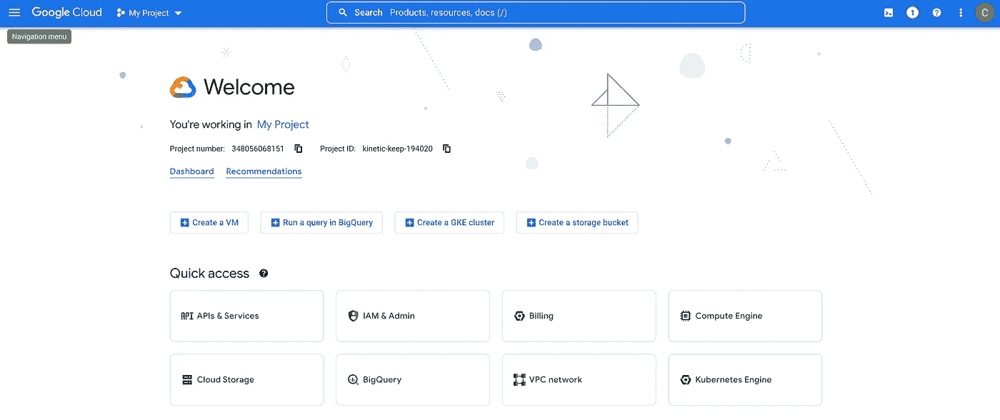

如果您尚未创建项目，您需要通过单击下拉菜单创建一个项目(在此屏幕截图中，它显示“我的项目”——您的项目可能为空)。你可以通过几个步骤来完成。

仅此而已。您已经完成了第 1 步！

## 第二步。创建数据库

在谷歌云控制台中，点击左上方的 4 个栏，向下滚动到显示“数据库”的位置，点击显示 SQL 的那个。

这里还有其他可能更受欢迎的选项——比如 Google Big Query——但是我们尽量保持简单，所以我们将使用基本的 SQL 选项。

在下一个屏幕上，它会要求您添加一个帐单帐户。不要在这里强调太多，因为你的成本会非常低。Google Cloud 将根据您选择的级别和您使用的资源量向您收费。当你开始的时候，这些水平会非常小。此外，谷歌云为首次用户提供 300 美元的免费积分。

选择“创建实例”,然后单击 Postgres SQL 的选项。为什么是 Postgres 而不是 MSSQL？这真的没有太大关系——但我个人发现 Postgres 是最简单的数据操作接口，编写 SQL，进行分析和摄取数据。这两者之间的细微差别使 Postgres 略胜一筹。

在下一个屏幕上，启用 API——这将允许 Google Cloud 通过云门户管理实例。

在下一页，您将通过输入实例 ID 和密码来完成设置。这些可以是你想要的任何东西。

对于本指南，请选择 Postgres 12(而不是最新版本)，并选择“生产”作为您的“开始配置”对于您所在的地区，请选择您居住的地区，并将从该地区连接到数据库。那么现在选择“单一区域”。

在“机器类型”下，将设置更改为“轻量级”,因为我们保持事情小而简单。然后将存储空间调整为 10GB。这将为你节省大量的钱。GCP 将允许您以后根据需要扩大规模。

最后，点击页面底部的“创建实例”。


*忽略 PostgreSQL 14 —您的应该是 12

几分钟后，您的数据库将上线！

现在我们来连线。

我喜欢用一个叫 DBeaver 的数据库工具。你可以在这里免费下载[。](https://dbeaver.io/)

打开 Dbeaver，单击左上方看起来像插头的图标，添加一个新连接。

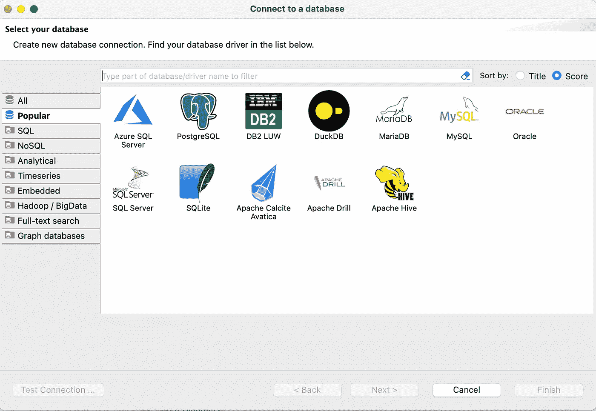

在“连接到数据库”屏幕上(如上所示)，双击 PostgreSQL。

您可以获得连接到 Google Cloud 中的新数据库所需的凭据。

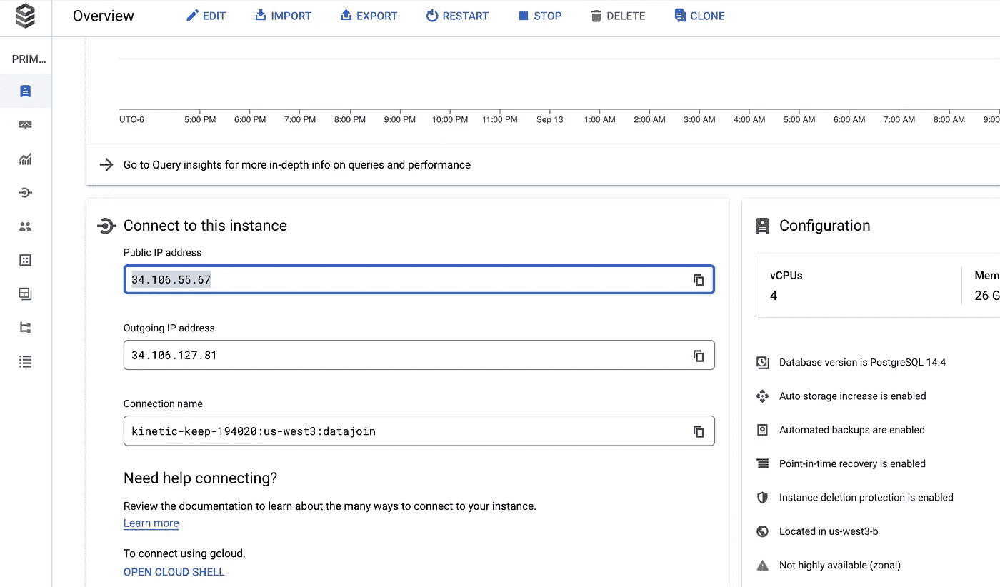

在上面的截图中，它在我刚刚创建的数据库的概述页面中显示了我的新实例的 IP 地址。

您还需要您的用户名和密码。您的用户名可以通过点击屏幕左侧的用户选项卡获得。您的密码是您在数据库创建过程中设置的初始密码。如果您忘记了密码，可以在用户屏幕上重置。

在连接之前，您需要将您的 IP 地址加入白名单。在“连接”选项卡下，找到“授权网络”部分。然后点击“添加网络”,添加您的 IP 地址并给它一个名称。然后点击“保存”这将允许您从该特定 IP 地址登录到数据库。我建议在你的主要工作场所或家里做这件事。

完成后，在 DBeaver 中输入所需的凭证，然后点击“Test Connection”——您应该会看到如下所示的屏幕:

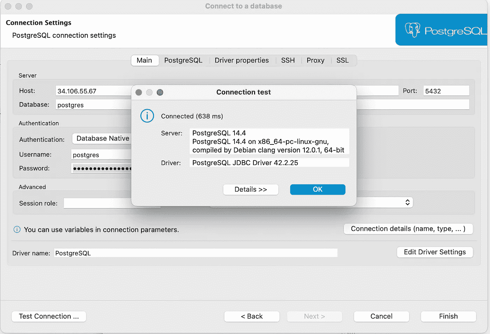

这意味着您已经成功连接！

现在让我们把一些数据输入你的数据库。

## 第三步。设置 ETL 工具或 ETL 服务器

有几十种方法可以将数据输入数据库。如果您有非常定制的需求，您可能会想要一个 ETL 服务器，您可以在其中托管和执行 Python(或类似的)脚本。如果你的需求更简单(比如获取 Linkedin、脸书营销数据等)。)可以用 Fivetran 之类的。我将介绍如何设置这两者。

***虚拟机***

回到谷歌云，点击屏幕左上角的 4 个工具条。然后向下滚动并悬停在“计算引擎”上在新选择栏的最顶端，单击“虚拟机”

点击“创建实例”

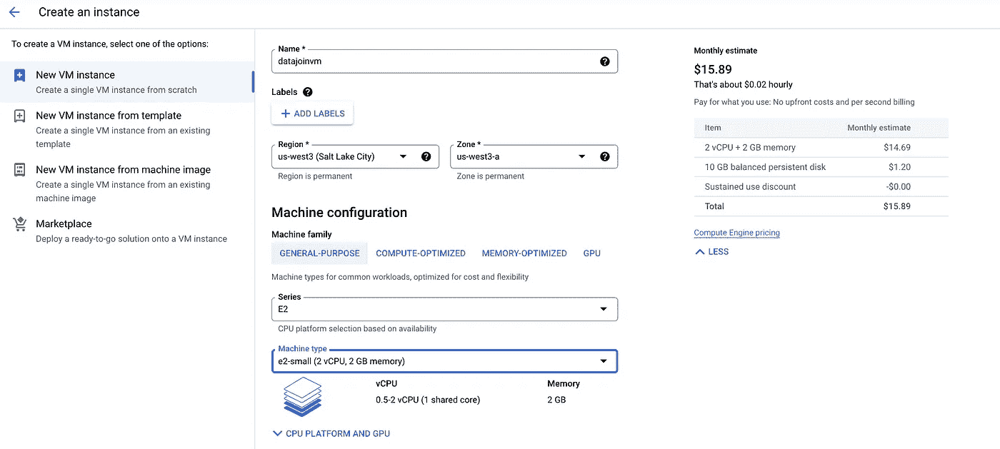

在下一个屏幕上，为虚拟机命名，并在“机器类型”下选择 e2-small。你可以在任何时候升级它，所以一开始总是选择尽可能小的。

在“防火墙”下，选中“允许 HTTP”和“允许 HTTPS”流量。

在“启动盘”下，你会看到“镜像”在 Debian 上被设置为默认操作系统。您可以通过单击“更改”来进行更改基于熟悉程度，我更喜欢使用 Ubuntu，但是你可以使用你最熟悉的。

将会有几个不同版本的操作系统选项，我建议你选择最新版本的操作系统。

设置完成后，滚动到底部并点击“创建”

几秒钟后，您应该会在下一个屏幕上看到一个绿色的勾号，表示您的服务器现在处于活动状态。

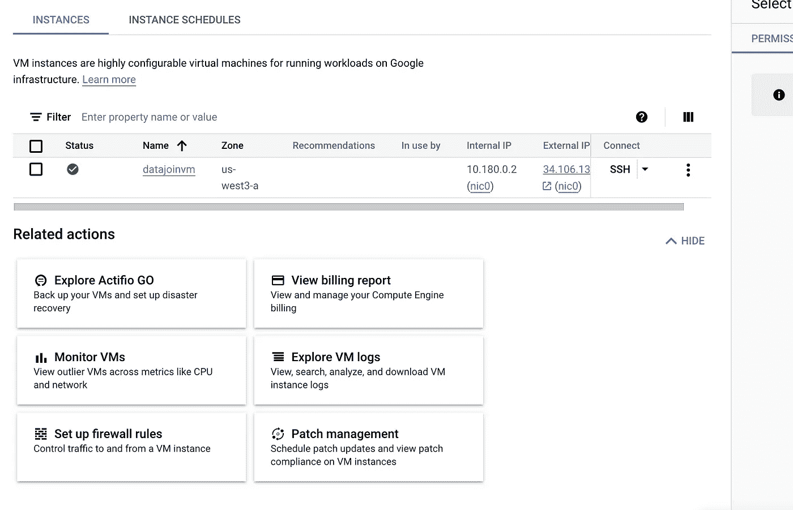

要设置对新虚拟机的访问，请单击虚拟机，然后单击“SSH”旁边的下拉菜单，并使用“在浏览器窗口中打开”

这将打开一个新的浏览器窗口，您将在其中连接到虚拟机。

每次都用这种方式连接效率很低，所以我建议创建 ssh-keys，这样您就可以使用 Windows 上的 Powershell 或 Mac 上的终端进行连接。

要在 Mac 上做到这一点，请进入终端并输入

```
cd ~/.ssh/
```

这将把您带到 ssh keys 文件夹，您将在这里存储 ssh 密钥以连接到您的新虚拟机。现在输入

```
ssh-keygen
```

该命令将提示您输入名称。我通常喜欢使用我刚刚创建的 VM 的名称，但是您可以使用任何您想要的名称。

将创建两个文件:一个名为[name](您刚才使用的名称)，另一个名为[name]。酒馆

要设置本地计算机连接到 VM，您需要在。pub 文件到您的新虚拟机。

你可以打开你的新虚拟机(按照上面的说明)并输入

```
cd ~/.ssh/
```

现在，您将位于虚拟机的 ssh 密钥文件夹中。

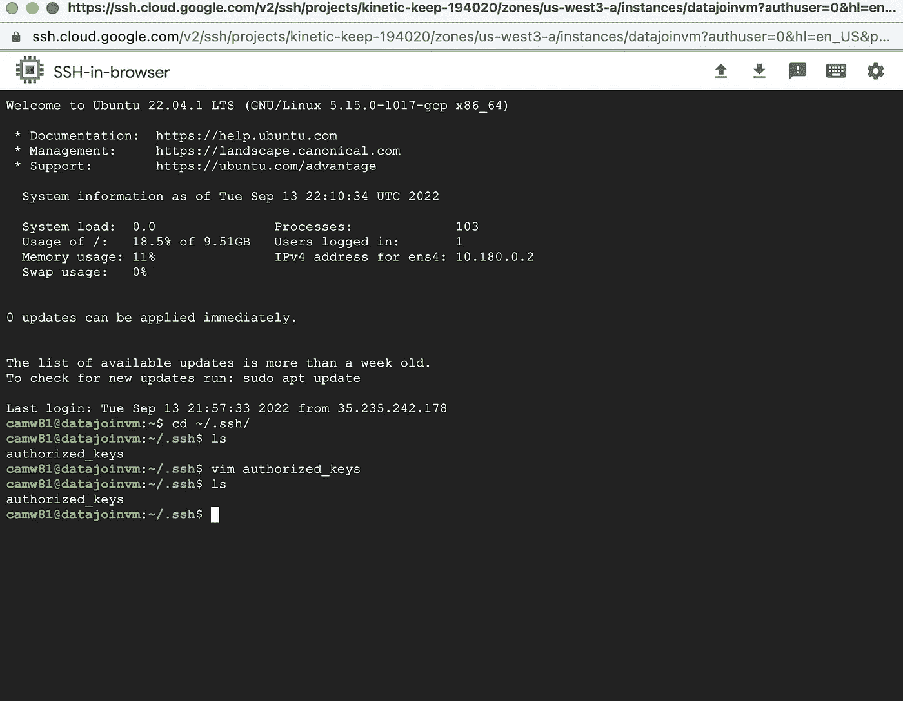

添加公钥(在。pub 文件)添加到授权密钥文件中

```
echo [PUBLIC KEY] >> authorized_keys
```

回到您的本地计算机，键入

```
vim ~/.ssh/config 
```

您需要在这里输入新连接的主机信息。如果您的机器上存储了多个密钥对，这一点尤其重要。

在配置文件中，您将添加以下内容

```
Host [whatever you want]
HostName [External IP Address]
User [username it shows on the VM]
IdentityFile ~/.ssh/[name of the private key - the file without .pub]
ServerAliveInterval 50
```

*请注意，您可以通过转到计算引擎>虚拟机>然后选择您的虚拟机，在 Google 云控制台中找到您的虚拟机的“外部 IP 地址”。

按 shift z，z 保存并退出。

要从您的本地机器连接到您的虚拟机，只需在终端中键入“ssh [Host]”，您就应该连接上了。

如果第一次尝试没有成功，不要担心。如果你有问题，请随时给我发消息或查看这篇文章以获得更多指导:[https://www . digital ocean . com/community/tutorials/how-to-set-up-ssh-keys-on-Ubuntu-1804](https://www.digitalocean.com/community/tutorials/how-to-set-up-ssh-keys-on-ubuntu-1804)

现在您有了一个虚拟机，可以用来编写和部署 python 脚本，并设置自动化的 cron 作业，以有趣的方式部署或使用数据。

关于你能做什么的例子，请查看我的文章[如何使用 Python 请求从 API 中提取数据](/how-to-pull-data-from-an-api-using-python-requests-edcc8d6441b1)。

***ETL 工具***

市场上有几十种 ETL 工具，带有一些最流行的应用程序、网站和 API 的现成连接器(通常每月花费 150 美元或更少)。

在这个例子中，我将使用名为 Fivetran 的 ETL 工具为我的公司提取一些 Linkedin 广告指标。

像 Fivetran 这样的工具使得 ETL 变得微不足道。

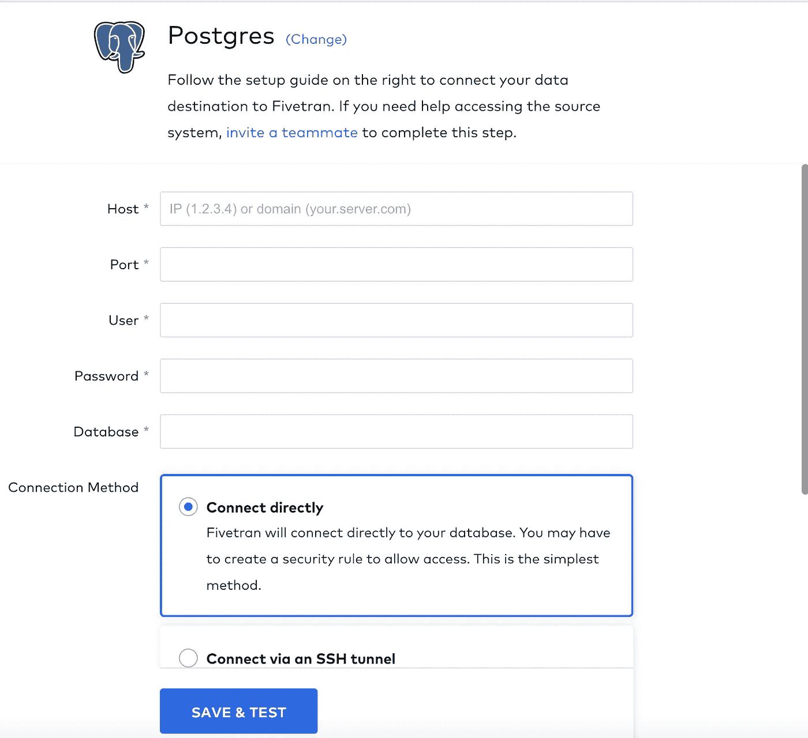

选择一个数据源和一个目的地(在本例中是 Postgres)，添加您的凭证并按照说明进行操作。不要忘记将数据库中的 IP 地址列入白名单，以供您使用任何第三方工具。像 Fivetran 这样的工具有大量的帮助页面，会告诉你需要哪些 IP 地址才能让软件正常工作。(您可以按照上面的说明将 IP 列入白名单，我在上面讨论了如何将您的客户端 IP 列入 Dbeaver 的白名单。)

像 Fivetran 这样的工具可以对数据库进行完全同步，甚至不需要设置合并标准或配置数据模型。

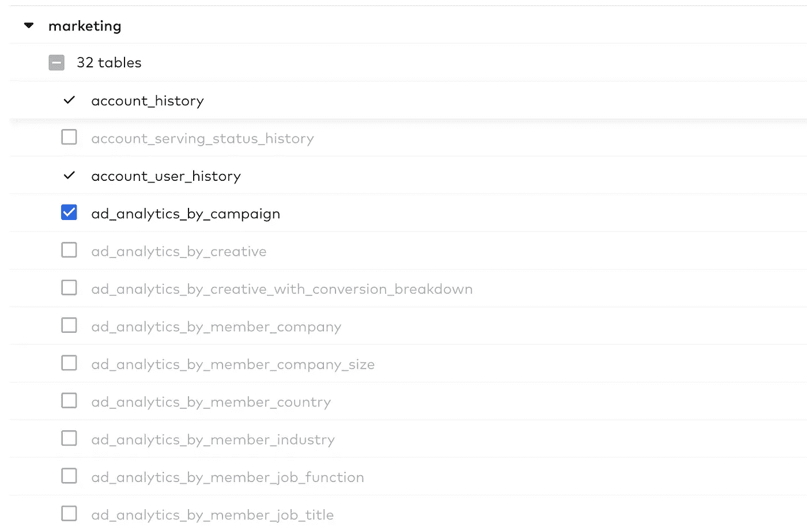

数据会自动将预先建模的表同步到 Postgres 数据库中，无论您设置的步调是什么。

下面是它在数据库中的样子:


## 第三步。设置报告

只需两步，您就已经实现了 80%的自动化报告和分析。

你甚至不需要 Hadoop、雪花实例、DBT 或任何其他花哨的企业级工具来做这件事。

现在到了有趣的部分。

市场上有许多不同的 BI 和报告解决方案。Tableau 是最受欢迎的，但设置起来既昂贵又耗时。

Power BI 很便宜，很可能你的公司已经通过你的 Office 365 订阅为它付费了。

但是到目前为止，最好也是最简单的入门选择是 Google Data Studio。

转到 Google Data Studio，使用您用来访问 Google Cloud 控制台的相同登录帐户登录。点击左上角的“创建”并选择“数据源”

你会看到几十个不同的选项。在搜索框中键入“postgres”并选择“PostgreSQL”

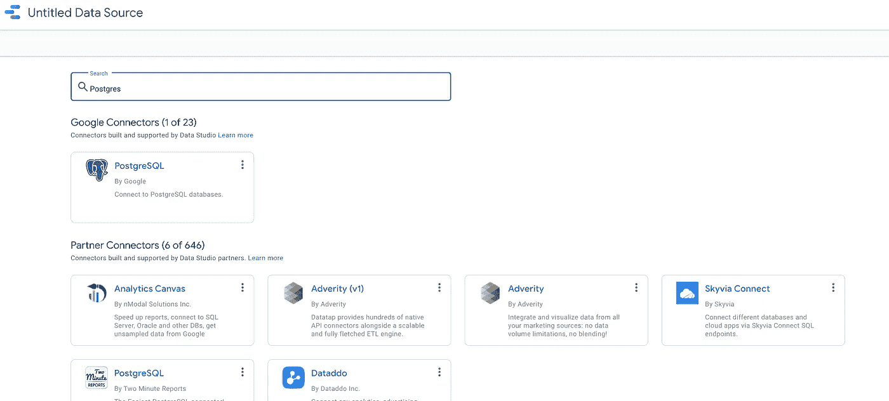

在左上角你可以给你的数据源一个名字。只需使用您会记住的名称或与数据库同名的名称。

在下一个屏幕上，您需要再次添加您的数据库凭证并验证您的数据库。您首先需要将 Data Studio 用于连接的 IP 地址列入白名单(您可以按照步骤 1 中提供的相同说明将您的客户端 PC/笔记本电脑列入白名单)。

输入凭证后，您将看到数据库中反映的模式和表。

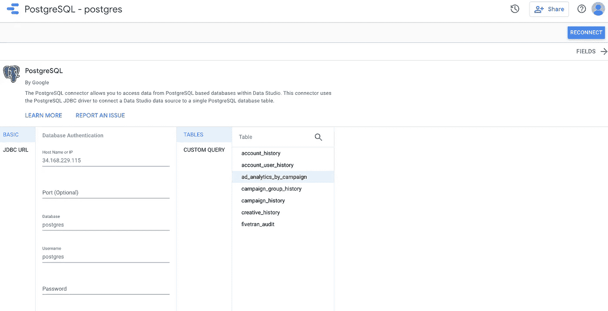

在这里，您可以选择一个表，或者您可以选择“自定义查询”选项并编写 SQL 来获得您想要的预聚合数据。

在下一页，您将能够根据您正在导入的自定义查询或表来格式化您的数据字段。这是根据数据的上下文将某些字段转换为文本、数字、货币或日期字段的好机会。

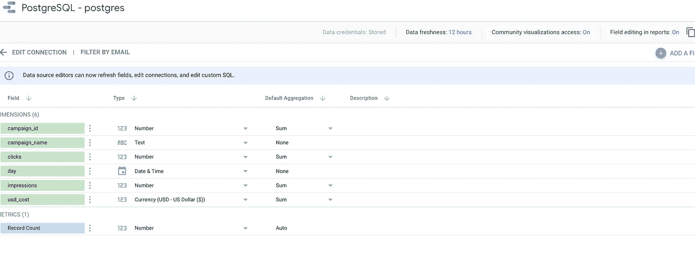

完成字段格式化后，点击右上角的“创建报告”。

此时，您将把新获取的数据处理成实际的报告。

根据数据的上下文，有数百种显示、聚合和格式化数据的选项。

我只用了几分钟就建立了这个 Linkedin 广告仪表板:

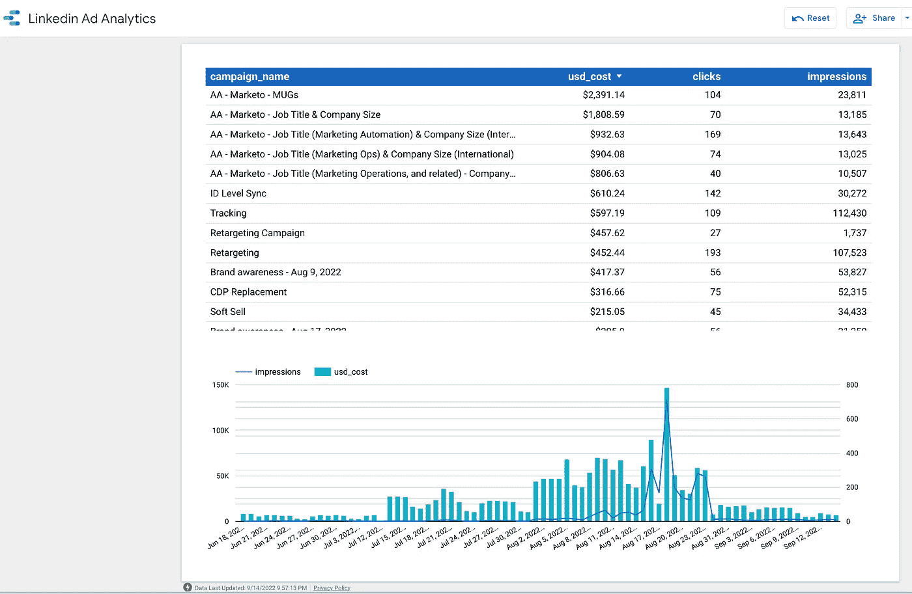

编辑完报告后，您可以单击“查看”来查看它的外观。然后，您可以直接在同一个屏幕上将其分享给团队成员或任何相关的利益相关者。

瞧啊。您刚刚创建了一个自动化仪表板。

只要您的数据源在数据库中被一致地更新(使用 Fivetran 或您的定制 ETL 脚本)，每当用户打开它检查新数据时，报告将自动刷新。

## 下一步是什么？

恭喜你！如果您已经完成了本指南，那么您已经成功地建立了一个成熟的分析架构。

从这里开始，您可以使用 ETL 工具或者使用 Python 脚本的，[添加新的数据源，构建更多更好的仪表板](/3-rules-for-dashboards-people-actually-look-at-7d7c60fa3353)，或者[使用 SQL](/6-lesser-known-sql-techniques-to-save-you-100-hours-a-month-10ceed47d3fe?source=user_profile---------6----------------------------) 进行一些分析。

随着数据的增长，您可以使用 Google Cloud(或您选择的任何服务器)快速轻松地扩展您的数据库。

感谢阅读！如果您喜欢本指南，请在 Medium 上关注我的[，了解更多关于分析和从数据中获取价值的文章。](https://camwarrenm.medium.com/membership)

如果你想和我在一个项目上合作，或者在为你的团队或业务建立单一来源真实分析方面获得帮助，[直接联系我](https://cameronwarren.carrd.co/)。