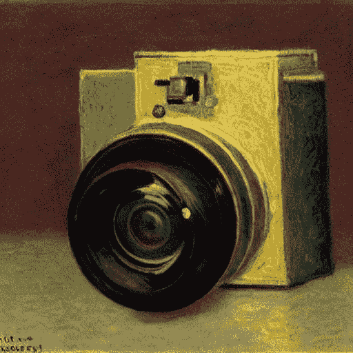

# 缓慢的莫家伙现在由人工智能匹配

> 原文：<https://towardsdatascience.com/the-slow-mo-guys-now-matched-by-ai-dba5e9e177c7>

## 使用深度学习和视频帧插值在 5 分钟内提高您的慢动作视频的质量



克洛德·莫内画的相机——稳定扩散生成的图像

我们都同意慢动作视频创造了这种戏剧效果，这无疑为特定场景增添了额外的风味。另一方面，降低视频速度可能会产生一些不想要的伪像，这可能会被认为是不值得观看的。但是是什么让慢动作视频变得伟大呢？

> 让我们使用深度学习来产生能够以高帧率记录的高端相机的平滑结果。

除了其他方面，我认为最重要的方面是它的 FPS 数:每秒有多少帧被渲染到屏幕上。太低，视频会断断续续，造成不愉快的观看体验。**因此，我们需要一台昂贵的摄像机，能够以高帧率进行拍摄。或者，我们可以使用深度学习，尝试在两个连续的帧之间合成中间图像。**我有没有提到这会让我们多花 0 美元？

超级慢动作只是计算机视觉领域中众所周知的视频帧插值或 VFI 的应用之一。这个故事介绍了 *RIFE:视频帧插值的实时中间流估计。*我们介绍了它带来了什么，并使用我们自己的视频进行了快速试驾。让我们开始吧！

> [Learning Rate](https://mailchi.mp/d2d2d4a109b5/learning-rate-newsletter) 是为那些对 AI 和 MLOps 的世界感到好奇的人准备的时事通讯。你会在每周五收到我关于最新人工智能新闻和文章的更新和想法。订阅[这里](https://mailchi.mp/d2d2d4a109b5/learning-rate-newsletter)！

# 什么是 VFI？

**视频帧内插(VFI)的最终目的是提高帧速率，增强视频的视觉质量。**为了实现这一点，它试图合成两个连续帧之间的中间图像，这两个连续帧在空间和时间上都与现有上下文一致。

在其核心，我们发现另一个视觉任务命名为光流。所以，让我们快速绕一圈，看看什么是光流，以及它如何帮助我们处理 VFI。然后，我们将准备好观看 *RIFE* 的运行，并使用我们自己的视频来玩它。

## 光流

**广义而言，光流是理解事物在像素级图像中如何运动。**这对于许多下游视频编辑任务非常有用，例如视频分析、图像稳定和视频对齐。

一幅图像由许多像素组成，当我们移动相机时，这些像素会发生某种变化。光流试图找出这种运动是如何影响每个像素的。所以，**我们试图给图像中的每个像素附加一个运动矢量，指示这个像素要移动到哪里。**

光流—计算机爱好者

这些信息是理解图像中正在发生的事情、物体如何移动以及移动方向的关键。然后，下一步是在这些像素变化之间生成合理的帧。这就是 VFI 发挥作用的地方。

# RIFE 简介

我们看到了什么是 VFI，以及它如何提高视频的视觉质量。我们还看到了什么是光流，为什么它被认为是 VFI 的核心元素，以及它如何帮助我们解决这个问题。现在，是时候介绍 RIFE 了。

RIFE 使用一个名为 IFNet 的神经网络，可以直接从图像中估计中间流。这项新工作的主要贡献总结如下:

*   设计一种新颖高效的网络架构来简化基于流的 VFI 方法。因此，给定两个输入帧，所提出的模型可以从头开始训练，并直接逼近中间流。
*   一个新的泄漏蒸馏损失函数，它导致更稳定的收敛和大的性能改善。
*   首款基于流的实时 VFI 算法，能够以 30FPS 的速度处理 720p 视频

下面我们可以看到一些用 RIFE 处理的视频的例子。左边是原始视频，右边是增强版。看看处理后的版本有多平滑。

RIFE:视频帧插值

你可以阅读 ArXiv 上的[论文](https://arxiv.org/pdf/2011.06294.pdf)并浏览该项目的[页面](https://github.com/megvii-research/ECCV2022-RIFE)了解更多细节。让我们进入有趣的部分:在我们自己的视频上使用 RIFE！

# 辅导的

在我们自己的视频上使用 RIFE 真的很容易。然而，如果我们真的想让它发光，我们需要一个 Nvidia GPU。为此，我们用谷歌 Colab 吧！

去[colab.research.google.com](https://colab.research.google.com/)用 GPU 运行时创建一个新的笔记本。如果您以前没有这样做过，从`Runtime`菜单中选择`Change Runtime Type`，然后选择`GPU`。

现在，我们准备克隆 RIFE repo。在单元格中，键入以下内容:

```
!git clone [https://github.com/hzwer/arXiv2020-RIFE](https://github.com/hzwer/arXiv2020-RIFE)
```

接下来，在目录中创建一个名为`train_log`和`cd`的新文件夹:

```
!mkdir /content/arXiv2020-RIFE/train_log
%cd /content/arXiv2020-RIFE/train_log
```

下载预先训练好的模型，为视频帧生成预测。为了实现这一点，我们使用了一个 Python 模块，使得从 Google Drive 下载对象变得容易:`gdown`

```
!gdown --id 1APIzVeI-4ZZCEuIRE1m6WYfSCaOsi_7_
!7z e RIFE_trained_model_v3.6.zip
```

接下来，我们应该安装项目的依赖项。`cd`到项目的文件夹中，使用`pip`安装必要的包:

```
%cd /content/arXiv2020-RIFE/
!pip3 install -r requirements.txt
```

如果您想快速尝试该模型，请下载作者提供的`demo.mp4`视频:

```
!gdown --id 1i3xlKb7ax7Y70khcTcuePi6E7crO_dFc
```

运行下面的脚本为`demo.mp4`生成一个增强的视频:

```
!python3 inference_video.py --exp=2 --video=demo.mp4 --montage
```

最后，如果您想在自己的视频上使用该模型，只需更改`--video`标志指向的视频的名称:

```
!python3 inference_video.py --exp=2 --video=mydemo.mp4 --montage
```

这个脚本将使视频中的帧数增加四倍。输出将存储在相同的位置，其名称将类似于`mydemo_4X_120fps.mp4`。恭喜你！您的新的、增强的视频现在准备好了！

注意，上传带音频的视频的时候好像有个 bug。为了获得最佳体验，请使用没有音频的视频，或者尝试使用`--fps`标志，直到问题得到解决。

# 结论

在这个故事中，我们看到了什么是光流，以及它与视频帧插值的关系。我们研究了这两种方法的目标，以及一种新技术 RIFE:VFI 实时中间流量估计如何用于生成令人印象深刻的新内容。

最后，我们玩了 RIFE 和我们自己的视频。我把最好的部分留到了最后:一个新的 Windows 应用程序已经使用 RIFE 为任何 GPU 提供快速视频插值: [Flowframes](https://nmkd.itch.io/flowframes) 。然而，使用 python，您可以在任何支持 GPU 的机器上获得 RIFE 的好处！

# 关于作者

我叫 [Dimitris Poulopoulos](https://www.linkedin.com/in/dpoulopoulos/) ，我是为 [Arrikto](https://www.arrikto.com/) 工作的机器学习工程师。我曾为欧洲委员会、欧盟统计局、国际货币基金组织、欧洲央行、经合组织和宜家等主要客户设计和实施过人工智能和软件解决方案。

如果你有兴趣阅读更多关于机器学习、深度学习、数据科学和数据操作的帖子，请关注我的 [Medium](medium.com/@dpoulopoulos/follow) 、 [LinkedIn](https://www.linkedin.com/in/dpoulopoulos/) 或 Twitter 上的 [@james2pl](https://twitter.com/james2pl) 。

所表达的观点仅代表我个人，并不代表我的雇主的观点或意见。