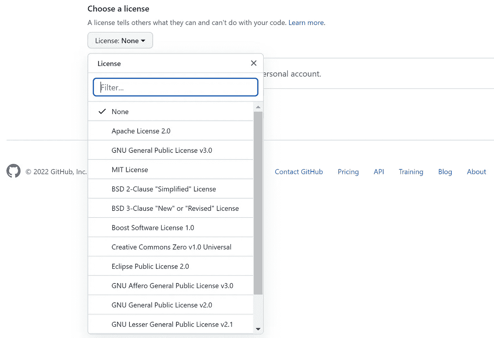
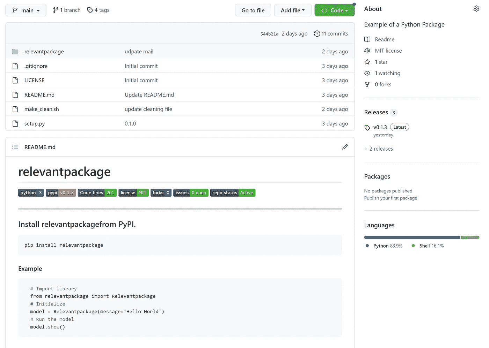
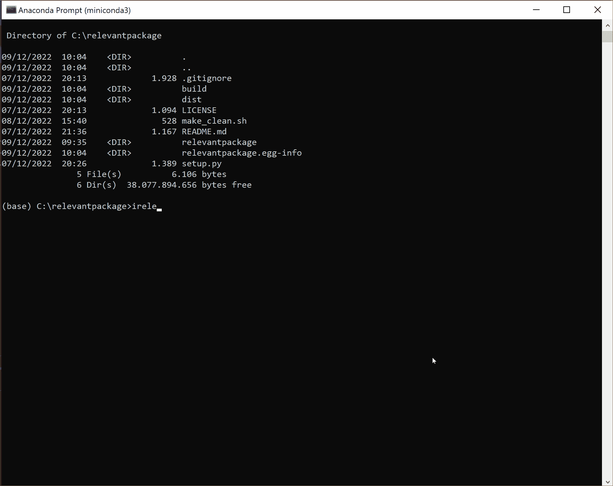
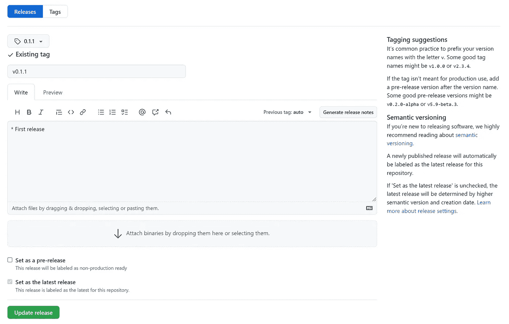
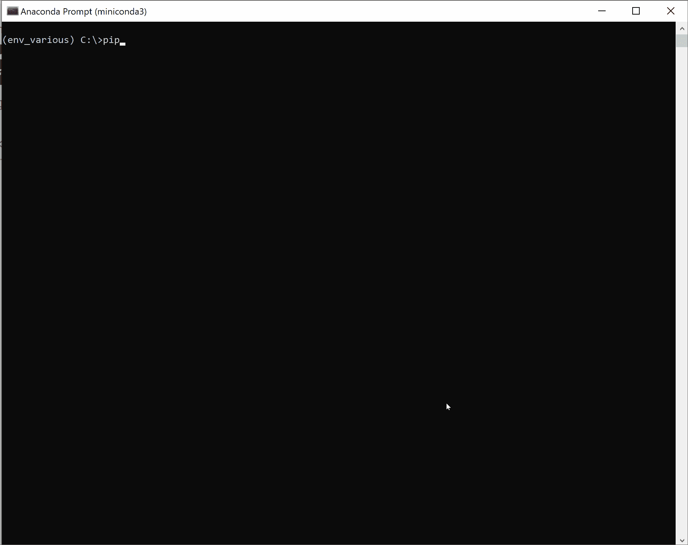

# 用 PyPi 发布 Python 包的入门指南

> 原文：<https://towardsdatascience.com/the-starters-guide-to-release-your-python-package-in-pypi-efd72cbc0011>

## 一步一步的指导，有效地在 Python 包索引(PyPI)中发布您的 Python 包，以 pip 安装它


照片由 [Aaron Burden](https://unsplash.com/@aaronburden?utm_source=unsplash&utm_medium=referral&utm_content=creditCopyText) 在 [Unsplash](https://unsplash.com/s/photos/compas?utm_source=unsplash&utm_medium=referral&utm_content=creditCopyText)

在 PyPi 中发布一个包并用 pip 安装它有很大的好处，因为它会自动解决依赖性，并且它可以在任何机器上访问。然而，发布开源 Python 包需要一些准备步骤，例如目录的明确结构、版本控制、归档构建和发布包。我将逐步展示如何 *i)* 用必要的文件构建目录， *ii)* 用版本控制创建发行版档案(也就是 Python 包)，以及 *iii)* 在 PyPi 上发布。我还将演示如何使用***I release****库*来自动化所有这些步骤。在这篇博客的最后，你可以发布并安装你自己的库。**

**如果你觉得这篇文章很有帮助，可以使用我的* [*推荐链接*](https://medium.com/@erdogant/membership) *继续无限制学习，并注册成为中级会员。另外，* [*关注我*](http://erdogant.medium.com) *关注我的最新内容！**

# *Python 包。*

*Python 包是加载函数(集合)的基本构建块。这将防止每次启动时都要从头开始编写代码。*物理上的*，它是一个包含 Python 脚本的结构化文件夹。*概念上的*，是一个名称空间。或者换句话说，由一个包名绑定在一起的一组功能或模块。包保存在一个名为 [PyPi](https://pypi.org/) 或 Python 包索引【1】的中央存储库中。可以用命令安装:`pip install <package_name>` *。* 在后台，pip 工具会在服务器上搜索包名，然后安装到(本地)机器上。另一个优点是它自动解析依赖树。要创建 Python 包，需要遵循一些基本规则。 ***第一步是创建一个结构化的文件夹。****

# *第一步。创建结构化文件夹。*

*构建您的目录是很重要的，即使您不想在 PyPi 上发布它。*这将使你的项目可维护，对你未来的自己和那些想贡献或使用它的人来说都是可理解的。在创建结构化文件夹之前，我们需要一个包名。除了少数例外，可以自由选择包的名称。最重要的是，应该是在 [PyPi](https://pypi.org/) 上没有注册。通过在 pypi.org 的搜索栏中搜索包名来找到它。如果名字已经存在，你需要有创意。**

*出于演示的目的，我将把我的包命名为: ***relevantpackage。*** 对于 *Python 包文件夹*和*主 Python 脚本*的名称，建议并通常使用与**完全相同的** *名称*(参见下面的代码部分)。但是，命名可能取决于项目的范围。只要确保明智地选择(文件夹/文件)名称，以避免导入过程中的混淆*。*与 ***相关的包*** 的目录结构如下图所示。*请注意，所有文件在开始时都可以是空的，因为我们将在下面的部分中填充它们。**

```
*relevantpackage/
├── relevantpackage/        Python package folder.
|    ├── __init__.py        Make the folder a package.
|    └── relevantpackage.py The main Python file.
|
├── setup.py                Configuration file for the package and dependencies.
├── LICENSE                 License file.
└── README.md               Project information.*
```

## *相关包. py*

*我要创建的第一个文件是主 python 脚本。这个脚本的名字是`relevantpackage.py.`，它由一个名为`Relevantpackage`的类组成，我们可以导入并初始化这个类:`from filename import classname`或者在这个例子中:`from relevantpackage import Relevantpackage`。*

```
*"""This is the relevantpackage.py script."""

# Import libraries
import os

class Relevantpackage():
    """Relevant package class."""

    def __init__(self, message=None):
        """Initialize with user-defined parameters."""
        self.message=message

    def show(self):
        """Run the show function."""
        if self.message is None:
            print('No message was given as input during initialization.')
        else:
            print(self.message)

        # Return
        return None*
```

## *__init__。巴拉圭*

*package 文件夹是将要在 PyPi 上发布的文件夹，因此安装在(本地)机器上。要告诉 Python " *这是包目录"*，它需要一个名为`__init__.py` 的文件。在我的例子中，是目录 ***relevantpackage。***init 文件是包初始化时第一个执行的文件。如果你喜欢，它可以是空的，但是我推荐添加下面的信息。注意，这个 *init* 文件与脚本 *relevantpackage.py* 中写的`def __init__(self, message=None)`无关。*

```
*# Change the content according to your package.
# from directory.filename.py import classname
from relevantpackage.relevantpackage import Relevantpackage

__author__ = 'E.Taskesen'
__email__ = 'name@gmail.com'
__version__ = '0.1.0'

# module level doc-string
__doc__ = """
relevantpackage
================

Description
-----------
relevantpackage is a Python package created for demonstration purposes.
This information will show up when using the help function.

Example
-------
>>> # Import library
>>> from relevantpackage import Relevantpackage
>>> # Initialize
>>> model = Relevantpackage(message='Hello World')
>>> # Run the model
>>> model.show()

References
----------
* https://towardsdatascience.com/a-step-by-step-guide-in-detecting-causal-relationships-using-bayesian-structure-learning-in-python-c20c6b31cee5

"""*
```

## *setup.py*

*`setup.py`是您的包的配置文件。它将包含依赖项、版本和其他相关信息(参见下面的代码部分)。对于 ***relevantpackage，*** 我们没有依赖项，但是我添加了最常用的库，比如 *NumPy、Pandas 和 Matplotlib* 用于演示目的。依赖项是被使用并导入到包中的库。*

```
*# Change the content according to your package.
import setuptools
import re

# Extract the version from the init file.
VERSIONFILE="relevantpackage/__init__.py"
getversion = re.search( r"^__version__ = ['\"]([^'\"]*)['\"]", open(VERSIONFILE, "rt").read(), re.M)
if getversion:
    new_version = getversion.group(1)
else:
    raise RuntimeError("Unable to find version string in %s." % (VERSIONFILE,))

# Configurations
with open("README.md", "r") as fh:
    long_description = fh.read()
setuptools.setup(
     install_requires=['matplotlib','numpy','pandas'],        # Dependencies
     python_requires='>=3',                                   # Minimum Python version
     name='relevantpackage',                                  # Package name
     version=new_version,                                     # Version
     author="E.Taskesen",                                     # Author name
     author_email="name@gmail.com",                           # Author mail
     description="Python package for my relevantpackage.",    # Short package description
     long_description=long_description,                       # Long package description
     long_description_content_type="text/markdown",
     url="https://github.com/erdogant/relevantpackage",       # Url to your Git Repo
     download_url = 'https://github.com/erdogant/relevantpackage/archive/'+new_version+'.tar.gz',
     packages=setuptools.find_packages(),                     # Searches throughout all dirs for files to include
     include_package_data=True,                               # Must be true to include files depicted in MANIFEST.in
     license_files=["LICENSE"],                               # License file
     classifiers=[
         "Programming Language :: Python :: 3",
         "License :: OSI Approved :: MIT License",
         "Operating System :: OS Independent",
     ],
 )*
```

## *README.md*

*`README.md`是一个降价文件，包含关于包和/或项目的一般信息。这是 GitHub 存储库上显示的第一页。我在自述文件中加入了 ***徽章*** ，提供了该项目的概述。请注意，有些徽章只有在 PyPi 上提供该包后才有效。您可以通过将 ***相关包*** 名称更改为您的包名称来重复使用这些徽章。*

```
*# relevantpackage

[](https://img.shields.io/pypi/pyversions/relevantpackage)
[](https://pypi.org/project/relevantpackage/)
[](https://github.com/erdogant/relevantpackage/)
[](https://pepy.tech/project/relevantpackage)
[](https://pepy.tech/project/relevantpackage)
[](https://github.com/erdogant/relevantpackage/blob/master/LICENSE)
[](https://github.com/erdogant/relevantpackage/network)
[](https://github.com/erdogant/relevantpackage/issues)
[](http://www.repostatus.org/#active)

---------

### Install relevantpackagefrom PyPi.
```bash
pip install relevantpackage
```

#### Example
```python
  # Import library
  from relevantpackage import Relevantpackage
  # Initialize
  model = Relevantpackage(message='Hello World')
  # Run the model
  model.show()
```
```

## *许可证*

*`LICENSE`是开源软件的重要组成部分。为了让你的库真正开源，你需要许可它，这样其他人就知道如何使用、改变和分发软件。因此，选择正确的许可证非常重要。在[本页](https://docs.github.com/en/repositories/managing-your-repositorys-settings-and-features/customizing-your-repository/licensing-a-repository)上阅读更多关于不同类型许可证的信息。创建新的存储库时，可以从下拉菜单中选择许可证，如图 1 所示。 ***相关包*** 将在 MIT 许可下可用。*

**

*图一。创建新的存储库时，可以选择许可证(图片由作者提供)。*

# *第二步。上传到 GitHub。*

*在您创建了包含所需文件*(如步骤 1 所示)*的结构化目录后，您可以在 [GitHub](http://github.com/) 上发布它。请注意，您需要为您的包更改`setup.py`中的变量，*如名称、描述、URL 等*。将文件推送到 GitHub 存储库之后，我们可以开始构建发行版档案，也就是 Python 包。图 2 显示了[***relevant package***](https://github.com/erdogant/relevantpackage)***的 [GitHub 库](https://github.com/erdogant/relevantpackage)。*** 请注意，有些徽章在开始时可能是红色的，但在 PyPi 上发布包后会变成绿色。*

**

*图二。relevantpackage 的 GitHub 库截图(图片由作者提供)。*

# *第三步。安装所需的工具。*

*为了在 PyPi 上创建发行版档案并发布包，我们需要一些库的帮助。 ***这里我要介绍一下 irelease 库[2]。irelease 库自动创建发行版档案、版本检查、在 GitHub 上创建标签和发布，以及在 PyPi*** 上发布。在下一节中，我将演示如何使用*库来释放 ***相关包*** 。此外，我将描述手动创建发行版归档文件的步骤。首先，让我们安装 ***irelease*** 库:**

```
**pip install irelease**
```

*****I release****库*使用 *Setuptools、Wheels 和 Twine* ，它们是众所周知的发布 Python 包的工具。简要描述如下:**

*   **[Setuptools](https://pypi.org/project/setuptools/) :用于创建和发布 Python 包。**
*   **[滚轮](https://pypi.org/project/wheel/):用于创建`.whl`文件，可通过`pip install`命令直接安装。该文件也被上传到 [P](https://pypi.org/) yPi。**
*   **[Twine](https://pypi.org/project/twine/) :在您的系统和 [PyPi](https://pypi.org/) 之间提供一个安全的、经过验证的连接。**

# **第四步。软件包的安装和测试。**

**此时，我们创建了一个结构化的文件夹，其中包含所有必需的文件，应该可以通过 pip 安装。在 PyPi 上发布之前，建议首先检查本地机器上的工作是否正确。要创建包的安装，我们需要转到根目录(在这个例子中:***relevant package***)并安装:**

```
**pip install -U -e .**
```

**有三个输入参数，`-U`参数是`-Update`的缩写，它将强制安装当前版本。`-e`参数是`-editable`的缩写，它允许你进行编辑。`.`指当前工作目录。合起来就是在可编辑模式下强制安装当前目录(即 ***相关包*** )。现在，您可以导入包并测试功能，如下所示:**

```
**# Import library
from relevantpackage import Relevantpackage
# Initialize
model = Relevantpackage(message='Hello World')
# Run the model
model.show()**
```

# **第五步。创建一个包并发布到 PyPI 上。**

**此时，我们创建了一个包含所有必要文件的结构化文件夹，我们测试了包的正确工作，我们有一个可用于版本控制的 GitHub 存储库，安装了所有需要的库，并且在 [*Twine*](https://pypi.org/account/register/) 上创建了一个帐户，用于安全分发您的包。**

**下一步是构建发行版档案。这些是您的包的压缩文件，可以跨多个平台(Windows、UNIX、macOS)部署。要创建发行版归档文件并发布包，我们必须从您要发布的包的根目录运行 ***irelease*** 。在我的例子中，它是本地磁盘上的***relevant package***的根(图 3)。我们可以使用终端或(Anaconda)提示符，用一个命令发布这个包。您可以使用命令`irelease`或`pyrelease`。在下面的章节中，我将使用`irelease`这个名字，但是这两个命令做的完全一样。**

```
**irelease**
```

```
**pyrelease**
```

**`irelease`的默认设置是自动从`.git`和`setup.py`中提取*用户名*、*包名和路径位置*。您不需要提供任何输入参数，但是，这可能取决于您的系统配置。您可以提供输入参数，如下面的代码部分所示。**

```
**irelease -u erdogant -p relevantpackage

options:
  -u USERNAME, --username USERNAME # Username on Github/Gitlab.
  -p PACKAGE, --package PACKAGE    # Package name to be released.
  -c {0,1}, --clean {0,1}          # Remove local builds: [dist], [build] and [x.egg-info].
  -i {0,1}, --install {0,1}        # Install this versions on local machine.
  -t twine, --twine twine          # Path to twine in case you have a custom build.
  -v {0,1,2,3,4,5}                 # Verbosity, higher number tends to more information.**
```

**在终端中运行`irelease`后，如动画图(图 3)所示，将连续执行以下步骤:**

1.  **从 GitHub 库获取最新信息。**
2.  **`__init__.py`中列出的版本与 GitHub 上发布的最新版本的比较。**
3.  **清理以前的构建目录，如`dist`和`build`，以防止错误构建的分发。**
4.  **使用以下命令创建新的分发归档文件:**

```
**python setup.py bdist_wheel**
```

```
**python setup.py sdist**
```

**5.在 Git 存储库中自动设置版本 ***标签*** 。这将冻结 GitHub 库的当前状态，并允许在需要时在版本之间来回切换。在这里可以找到 ***相关包*** 的标签:**

```
**https://github.com/erdogant/relevantpackage/tags**
```

**6.使用*绳*上传到 PyPi 的发行档案。请注意，您需要[绳线](https://pypi.org/project/twine/)的用户名和密码。正在使用的命令:**

```
**twine upload dist/***
```

**7.打开 GitHub 存储库的发布页面，添加发布描述。**

****

**图 3。运行 irelease 创建发行版归档文件并在 PyPi 上发布包的示例(图片由作者提供)。**

**8.最后一步是在 GitHub 存储库上创建关于发布的描述。然后按下<*释放按钮>* 。注意，当使用 ***irelease*** 时，浏览器会自动打开(图 4)。**

****

**图 4。最后一步是为你的发布写一个描述。[https://github.com/erdogant/relevantpackage/releases](https://github.com/erdogant/relevantpackage/releases)(图片由作者提供)。**

# **第六步。Pip 安装您的软件包。**

**当你现在在 pypi.org[搜索你的包裹时，你应该能找到。这意味着您可以使用 pip 安装软件包，导入并使用库。让我们试试 ***相关包*** (参见下面的代码部分和图 5) *。*](https://pypi.org/)**

```
**pip install relevantpackage**
```

```
**# Import library
from relevantpackage import Relevantpackage
# Initialize
model = Relevantpackage(message='Hello World')
# Run the model
model.show()**
```

****

**图 5。pip 安装相关包并运行示例代码(图片由作者提供)。**

# **最后的话。**

**使用 ***irelease*** 库，您可以轻松地发布您的包，因为它自动化了创建发行版档案、版本检查、创建标签和发布到 PyPi 的步骤。释放你的包的好处，不管多小，都是巨大的。您的包可以在任何机器上访问，它解决了您的包所需的依赖树。另一个优点是，您必须创建一个具有明确目录结构的存储库。这将有助于使你的项目对你未来的自己来说是可维护的和可理解的，对其他想要使用或贡献的人来说也是如此。请注意，还有一些工具，如[cookiecutter](https://github.com/cookiecutter/cookiecutter)【3】，可以帮助创建必要的目录结构。**

**我没有描述的另外两个重要步骤是*测试和文档*，但是你可能想在发布你的包之前考虑一下。强烈建议在发布您的包之前编写测试。对于测试驱动开发来说，有很多很好的材料。此外，如果您发布了您的包，还建议您创建描述输入参数、输出和函数行为的文档。此外，创建许多演示用法的示例。最好的方法是在代码中创建带有描述和示例的文档字符串。然后，可以将文档字符串与诸如[Sphinx](https://docs.readthedocs.io/en/stable/intro/getting-started-with-sphinx.html)【4】这样的工具一起使用。这里显示了一个例子，我在这里创建了 Sphinx 页面*D3 blocks**，它们主要依赖于代码中编写的文档字符串。*就是这个！我期待着听到你发表你的第一个包！****

**注意安全。保持冷静。**

*****欢呼，e .*****

***如果你觉得这篇文章很有帮助，可以使用我的* [*推荐链接*](https://medium.com/@erdogant/membership) *继续无限制学习，并注册成为中级会员。另外，* [*关注我*](http://erdogant.medium.com) *关注我的最新内容！***

# **软件**

*   **[irelease GitHub](https://github.com/erdogant/irelease)**

# **我们连线吧！**

*   **让我们在 LinkedIn 上联系一下**
*   **[在 GitHub 上关注我](https://github.com/erdogant)**
*   **在媒体上跟随我**

# **参考**

1.  ***使用 Python 包索引查找、安装和发布 Python 包。*[https://pypi.org/](https://pypi.org/)**
2.  **Taskesen，E. (2020 年)。Python 包来发布你的包。[https://github.com/erdogant/irelease](https://github.com/erdogant/irelease)**
3.  ***从 cookiecutters(项目模板)创建项目的跨平台命令行实用程序，例如 Python 包项目、C 项目。*[https://github.com/cookiecutter/cookiecutter](https://github.com/cookiecutter/cookiecutter)**
4.  ***Sphinx 是一个强大的文档生成器，具有许多用于编写技术文档的强大功能，包括。*[https://docs . readthe docs . io/en/stable/intro/getting-started-with-sphinx . html](https://docs.readthedocs.io/en/stable/intro/getting-started-with-sphinx.html)**
5.  ***Taskesen E，Verver O. D3Blocks:一个 Python 包，用于创建交互式 d3js 可视化。*[https://d3blocks.github.io/d3blocks](https://d3blocks.github.io/d3blocks)**