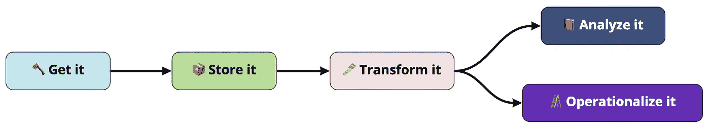

# 初创公司创始人的现代数据堆栈指南

> 原文：<https://towardsdatascience.com/the-startup-founders-guide-to-the-modern-data-stack-e972c8d89023>

**你** [**需要**](https://www.mckinsey.com/industries/technology-media-and-telecommunications/our-insights/big-data-getting-a-better-read-on-performance) [**分析**](https://thinkgrowth.org/the-startup-founders-guide-to-analytics-1d2176f20ac1) **。**虽然像谷歌分析这样的无代码解决方案会让你走得很远，但在你的首轮投资中，你会意识到有太多的问题你无法回答，你会开始谷歌“如何正确设置分析”来偷工减料解决方案。你将游过企业、全方位承诺的海洋，差点被拉进去。但是在这次搜索中，你可能会听到希望之乡的低语:现代数据堆栈。

不幸的是，栈*是什么*是模糊的，你可能会遇到更多的思想领导而不是解决方案。因为尽管现代数据堆栈兜售的东西令人信服——为你的组织建立分析的正确方式——但工具很少被列举，主要是因为形势仍在变化，没有人真正知道。

> 但在这种不确定性中，你仍然有工作要做，你需要明确的方向。

这篇文章是来帮助你的。接下来，我会告诉你:

1.  对现代数据堆栈的温和介绍，让您可以尽情享受
2.  工具建议，帮助您快速设置可扩展分析。

*在我们开始之前，声明:在这场比赛中，我确实有一匹* [*马*](http://hyperquery.ai) *，所以如果你在寻找偏见，它将被定位到 Hyperquery 的提及。但除此之外，这是我在花了一年时间设置和使用下面列出的每一个工具后测量的空间。*

# 什么是现代数据堆栈，为什么要关注它？

在过去十年中，数据空间经历了大规模的重构。特别是，云数据仓库彻底改变了企业数据的处理方式，降低了存储成本，加快了访问速度，实现了云优先。他们改写了数据的经济学，在此过程中，他们也改写了行为——我们如何看待存储、基础设施和数据访问，产生了许多利用这些变化的工具，不仅改变了数据的存储方式，也改变了随后**收购**和**使用**的方式。

从本质上来说，“现代数据堆栈”是一个模糊的名称，指的是在数据空间中实现这种重构的工具类别。你为什么要在乎？因为这些工具使得获取和使用高质量数据变得比以往更容易、更便宜、更快捷。它们也倾向于**可组合**，这意味着您将能够比坚持使用完整的端到端捆绑解决方案更容易地更换供应商。

# 这在实践中是什么样子

虽然术语“现代数据堆栈”经常被用来(在我看来是错误的)笼统地指代*所有*现代数据工具，但在我看来，有 4 个关键过程已经成为现代数据堆栈中不可改变的原子元素:**获取数据、存储数据、转换数据和分析数据**。

现代数据堆栈的核心组件。(图片由作者提供)

让我们来讨论一下这些步骤和工具，我个人认为它们在这些领域最有前途，特别是对于初创公司和扩大规模的公司:

## 🪓正在获取数据

*   **ETL:❤️**[air byte](http://airbyte.com)**，** [Hevo](http://hevodata.com) ，[便携](https://portable.io/)， [Fivetran](http://fivetran.com) ，Stitch， [Meltano](https://meltano.com/)
*   **事件跟踪:**段，舵栈

用于 ETL 的 Airbyte 或 Hevo 两者都不会花费你任何成本。如果您正在寻找一个托管解决方案， [*Hevo*](https://hevodata.com/integrations/pipeline/) *非常棒，您将能够在一个地方完成 ETL、业务前逻辑转换和反向 ETL。如果你相信自己能做一些基本的基础设施设置，Airbyte 是一个很好的开源解决方案。因为它管理的是管道而不是存储，这里的中断在最坏的情况下会导致管道中断，但可能不会丢失数据——这是早期阶段可以接受的风险。如果你在寻找一些晦涩难懂的东西(但仍然保养良好)，那么* [*便携*](https://portable.io/) *就太棒了。*

*为事件跟踪也弄点东西。我们选择了细分市场，但我的主要问题是广告拦截器太容易识别细分市场事件跟踪，所以你可能会错过一半用户的事件。不知道鲜为人知的工具有多好，但可能值得一试。或者，您可以通过 API 调用来跟踪事件，但我不是工程师，所以这可能是一个可怕的长期想法。这里可能有更好的解决方案，所以我不会给出任何真正的建议。*

## 📦存储数据(仓库)

*   [**雪花**](http://snowflake.com) **，**[**big query**](https://cloud.google.com/bigquery)，[火弩箭](http://firebolt.io)，Azure，Postgres，红移，数据湖

如果你想以低廉的价格起步，那就去 BigQuery 吧(尤其是如果你是一家初创公司，你可以获得大量的 GCP 积分)。如果你想以后成本透明，去雪花。不要红移，否则你会讨厌管理基础架构，只有当你真的需要东西变得如此无结构而不是因为你懒惰时，才使用数据湖。您也可以只读取您的实时 Postgres 实例的副本，但要知道您必须稍后迁移所有内容，并且您可能会遇到 Postgres 兼容性的红移 b/c。我也听说过微软堆栈的伟大之处，但是我没有尝试过。

## 🪚转换数据

*   [**❤️ dbt**](http://getdbt.com) **，**数据表单，查看器

*您是否曾经编写一个 SQL 转换来回答一个问题，然后一遍又一遍地编写它？然后你制造一个你总是忘记的观点。dbt 是在普通 SQL 中对这些转换进行版本控制和调度的地方，因此您可以更好地*<https://en.wikipedia.org/wiki/Don%27t_repeat_yourself>**。在这个阶段，不要担心研究其他选择——实际上没有任何选择。dbt 拥有最活跃的社区，最活跃的开发，并且是开源的(完全免费)。不要搞砸了，而是做一些事情，如建立一百万个漂亮的 PDT。**

## *📕分析数据*

*   *[**❤️超查询**](http://hyperquery.ai) ，可注释，深注释，十六进制，模式(数据工作区)*
*   *元数据库、超集、Tableau、Google Data Studio、Power BI(仪表板)*

**在早期阶段，您不需要单独的工具来执行仪表板、SQL munging、您的报告构建和文档编制:您需要一个单一的工作空间来分析+可视化 SQL 中的数据，然后随后记录、共享和集中调查结果—*[*Hyperquery*](http://hyperquery.ai)*非常适合于此。这是一个支持查询的文档工作区，您可以在其中完成所有基本的问题回答和探索，而不必处理数百万个无上下文的仪表板或 IDE 选项卡。你也不应该用 Python 做事情，直到你在 SQL 中做了你能做的一切，因为过早地将 Python 设定为标准将会为你的组织树立一个* [*的糟糕先例*](/how-to-scale-your-analytics-org-by-ditching-git-3d8d4ce398d1) *。**

*对于所有这些工具，我要说的是，实际上现在不要去自托管开源解决方案。你不希望红外线坏了，丢失你所有的工作。*

## *🪜[可选]操作化数据(反向 ETL)*

*   *人口普查小组*

*你可能不需要马上使用它，但是反向 ETL 允许你将你的仓库数据传输到其他工具，比如 Salesforce、Intercom，甚至是 conception，所以它可以增强操作工作。[*high touch*](http://hightouch.io)*在这个空间有更多的连接器。人口普查也很可靠。或者如果你是混乱邪恶的话两者都用。**

# *最终意见*

*批评者可能会感叹，我对现代数据堆栈的范围限制得太多了，但这一切背后的粗体星号是，这是为了让您开始，而不是为您的所有数据问题提供一些最简单的解决方案。当然，考虑一下[度量](https://robertyi.substack.com/p/signaling-a-tectonic-shift-in-the) [层](http://supergrain.com)和[监控](http://metaplane.dev)，特别是当事情扩展和中断时。但是你需要有数据，它才可能是错的。从上面开始——它会让你完成 95%的工作，一个人可以在几天内完成所有工作。*

**我是 Robert，我是 Hyperquery 的首席产品官，我们正在打造一种新的文档，将笔记、查询和数据整合到一个统一、有序的空间中。我们最近进入公测，直接在*[*hyperquery . ai*](http://hyperquery.ai)*报名吧。(如果你有兴趣帮助我们建设，我们正在招聘——查看我们的* [*空缺职位*](https://www.notion.so/Careers-at-Dataframe-3e861dab875443269ee612e9159c2071) *。)**

**推文*[*@ imrobertyi*](https://twitter.com/imrobertyi)*/*[*@ hyperquery*](http://twitter.com/hyperquery)*来问好。👋
关注我们*[*LinkedIn*](https://www.linkedin.com/company/hyperquery/)*。🙂**