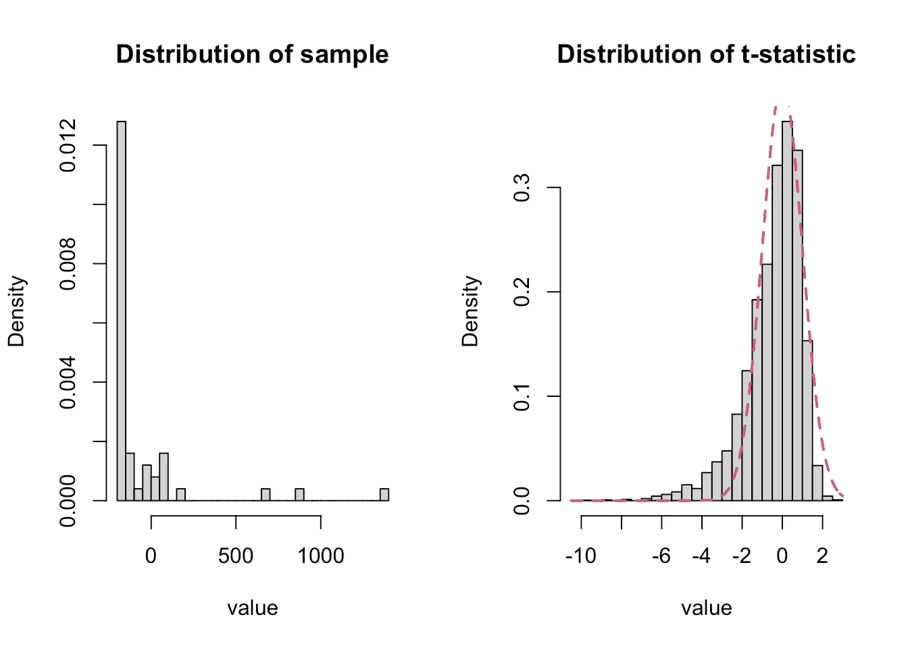
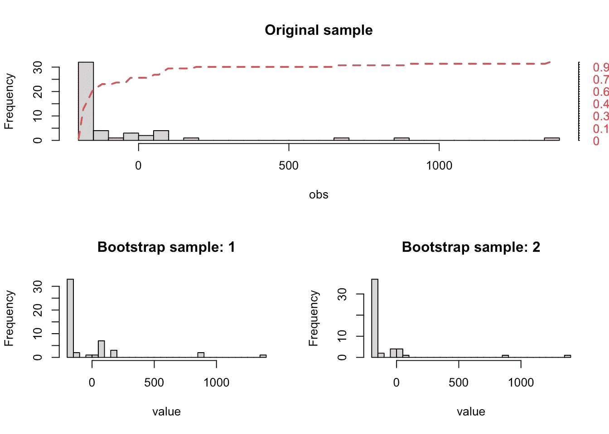
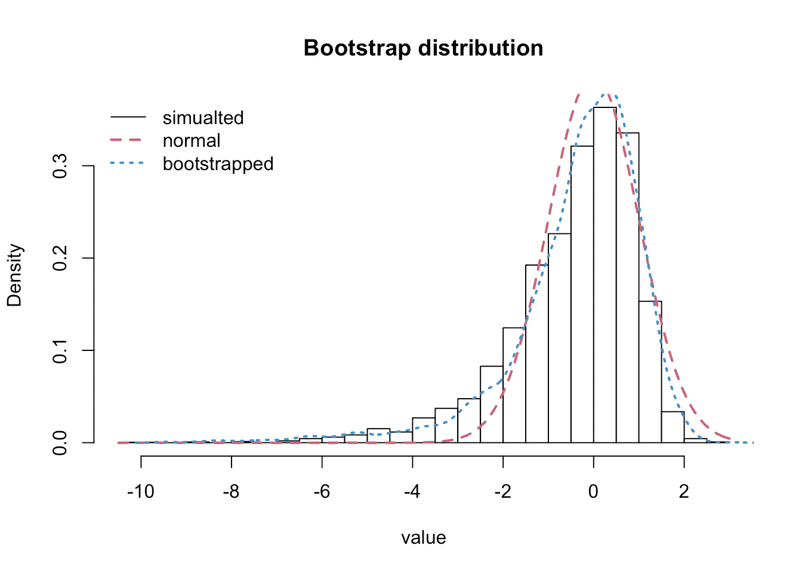
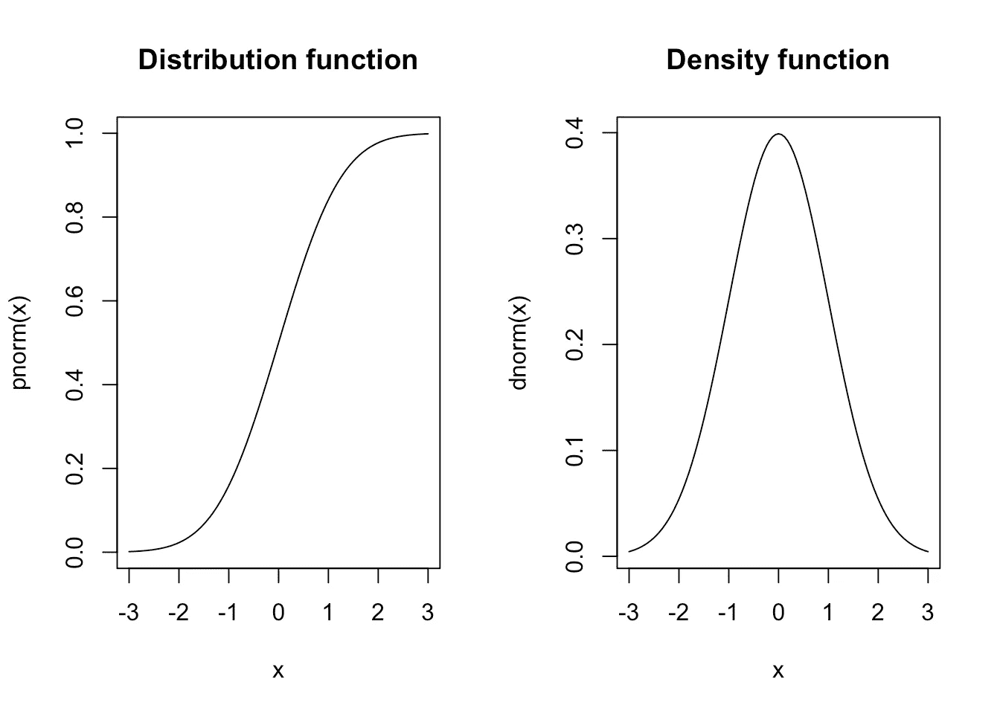

# 自助背后的统计魔法

> 原文：<https://towardsdatascience.com/the-statistical-magic-behind-the-bootstrap-2188ee147423>

## 如何使用 bootstrap 进行测试或置信区间，以及它为什么有效

Artem Maltsev 在 [Unsplash](https://unsplash.com?utm_source=medium&utm_medium=referral) 上拍摄的照片

经常有人声称，人工智能、数据科学和机器学习都只是美化了的统计学。虽然这可能走得太远了，但数据科学家无疑从统计学中借鉴了许多有用的工具。但是有一个非常有用的工具被广泛忽视了——T4 自举。Bootstrap 是一种算法，允许您在不做任何理论的情况下确定测试统计的分布。

> 统计推断提供了描述从数据中可以合理得出哪些结论的数学理论。

在数据科学中，统计推断通常出现在 A/B 测试中，或者当模型用于分析时。非统计学家在测试和推断时经常会遇到困难。公平地说，我(作为一名统计学家)有时也很纠结。

当我们在实践中必须做一个测试时，我们定义我们想要测试的假设，并且很可能开始搜索以找出正确的测试统计和分布来使用。如果我们有很多数据，这通常不是问题——特别是如果我们想测试一些简单的东西，如关于 A/B 测试结果均值的假设或线性回归模型中的系数。然后一个好的老 t-test 就可以了。

但是如果数据集很小，根本不是正态分布呢？各个测试的所有假设都实现了吗？如果我们要测试的假设是模型中特征的非线性函数，该怎么办？或者如果我们要检验一个关于测试中测得的两个 KPI 之比的假设？统计很快变得非常复杂。这就是引导程序发挥作用的地方。

**Left** :我们要测试期望值是否为零的样本的直方图。**右侧**:从与左侧样本相同的分布模拟的样本的 t 统计量的模拟分布，叠加了正常密度。图片作者。

在上图中，我们可以看到一个普通 t 检验达到极限的例子。左侧样本中的 50 个观察值来自指数分布，平方后居中。在右边，我们可以看到，如果我们想对样本来自零均值分布的(真)零假设使用 t 检验，会发生什么。直方图显示了如果对以相同方式构建的 5000 个模拟实例实际计算测试统计量时所获得的分布。叠加密度是 t 检验的渐近正态分布的密度。

显然，在这种情况下，正态分布是对真实分布的一个非常糟糕的近似。因此，如果我们在这种情况下使用正常的 t 检验，我们得出的结论将是不正确的。

# 引导程序如何工作

Bootstrap 允许确定统计数据 **T** 的分布——例如 A/B 测试中的点击率(CTR)——通过类似于模拟的过程非常容易。该过程如下:

1.  从您的数据中抽取一个与您的数据大小相同的样本。使用替换进行绘制，这样一些原始数据点可能会丢失，一些数据点可能会多次出现在样本中。这个样本被称为**引导样本**。
2.  根据 bootstrap 样本计算您感兴趣的数量 **T*** 并保存结果。
3.  重复前面两步 **m** 次。
4.  使用前面步骤中保存的值 **T*₁,…,T*ₘ** 来计算您感兴趣的分布的属性，无论是 p 值还是置信区间的分位数。

就这些了。它的效果出奇的好——通常在相对较小的样本中也是如此。这可能需要一些计算，但在许多应用程序中，这不是一个障碍，因为数据集足够小。这是统计魔术！

**顶部**:叠加经验累积分布函数的原始样本。**底部**:引导样本的两个例子。图片由作者提供。

为了计算抽样统计数据的置信区间，可以简单地利用观察到的 **T*₁,…,T*ₘ** 分布的相应分位数。

对于假设检验，必须要小心一点，因为 bootstrap 统计数据 **T*** 是以原始样本的统计数据 **T** 为中心的，而不是以检验统计数据的期望值为中心的。数学上，我们写 **E[T*ₘ]=T ≠ E[T]** 。因此，如果我们想要测试 **T** 是否显著不同于零，临界值或 p 值必须从 **T*ₘ-T** 的分布中导出。

上例中 t 统计量的分布与渐近正态分布和 bootstrap 分布的比较。图片由作者提供。

上图比较了使用 Bootstrap 获得的检验统计分布与实际模拟分布和正态分布。很明显，自举分布更接近真实分布。

# 理解 Bootstrap 需要知道什么

当我第一次了解 Bootstrap 时，我学习了如何执行上述步骤。但是我真的很困扰，我不知道为什么这个魔法会起作用。从一个样本中提取新样本对我来说似乎很可笑。有什么统计数据可以证明这一点呢？

事实证明，理解 Bootstrap 起作用的统计学原因实际上非常简单。你只需要清楚地了解两件事:

## 1.统计测试

理解 Bootstrap 的第一件事是清楚地理解统计测试。当我们做测试时，我们有一个样本和一些假设。在我们的样本 **x₁，…,xₙ** 中的数据来自一些通常未知的分布。然后我们计算一些测试统计数据**t(x₁,…,xₙ】**这只是我们数据的一些函数。既然我们不知道我们样本的分布，我们也不可能知道 **T** 的分布 **Fₙ** 。
统计学家所做的就是克服这一点，以这样一种方式构建 **T** ，他们知道如果我们有无限量的数据并且零假设为真，它会有什么分布。如果零假设为假， **T** 必须发散到一个在渐近分布 **F** 下极不可能的值。
然后我们计算 **T** 并将其与 **F** 进行比较——忽略实际样本是有限的这一事实。如果样本足够大，这是一个合理的近似值。如果它很小，结果可能会非常错误。
在上面的 t 检验示例中，渐近分布 **F** 是正态分布，但是右侧直方图中显示的有限数量数据的检验统计量的分布 **Fₙ** 非常不同。

## 2.经验累积分布函数

理解 Bootstrap 的第二件事是了解经验累积分布函数。如果你觉得你的统计学基础有点生疏，让我给你一个快速的提醒。

当我们想到统计分布时，我们通常倾向于想到密度函数 **f(x)** —例如正态分布中著名的钟形曲线。描述分布的另一种方式是通过它的累积分布函数。

**f(x)= p(x≤x)=e[𝟙(x≤x)】**

对于每个值 **x** ，它给出了从该分布中抽取的随机变量 **X** 小于或等于该值 **x** 的概率。对于连续分布 **F(x)** 就是从负无穷大到 x 的密度积分，所以累积分布函数只是描述概率分布的另一种方式。

标准正态分布的分布函数和密度函数。图片由作者提供。

在实践中，我们通常不知道我们正在处理的数据的累积分布函数，但我们可以通过它的经验对应物来估计，经验累积分布函数或 ECDF 由下式给出

从公式中可以看出，点 **x** 的 ECDF 就是小于或等于值 **x** 的数据比例。本质上，ECDF 是一个阶跃函数，在样本中实际观察到的数据点之间保持不变。随着数据集大小 **n** 的增加， **F̂(x)** 变得越来越接近真实的累积分布函数 **F(x)** 。

经验累积分布函数和理论累积分布函数。图片由作者提供。

## 关键洞察力

对于 Bootstrap 来说，最重要的是任何 ECDF 本身都是一个有效的分布函数。这种分布是离散的，随机变量可能取的值是在原始样本中观察到的值。ECDF 给这些可能的结果分配了相同的概率。

# 自举的工作原理

那么，为什么这个自举魔法会起作用呢？回想一下，我们的测试统计数据 **T(x₁,…,xₙ)** 遵循未知分布 **Fₙ** ，我们想知道 **Fₙ** 来计算置信区间、临界值或 p 值。
我们根据从原始样本中抽取的 bootstrap 样本计算 **m** 检验统计量 **T*** ，然后利用这些检验统计量的经验分布 **F*ₙ** 代替未知分布 **Fₙ** 。

> 为什么这样做有意义的关键在于，从原始样本中进行替换绘制意味着从样本的 ECDF 指定的分布中进行绘制。正如我们刚刚讨论的，ECDF 是将概率 **1/n** 分配给原始样本中每个数据点的分布。替换绘制意味着以概率 **1/n** 绘制这些点中的每一个。因此，如果我们从样本中抽取——我们从 ECDF 抽取。

因此，如果样本量 **n** 足够大，检验统计量 **T*** 的分布 **F*ₙ** 将是 **Fₙ** 的一个好估计，因为 **F̂(x)** 将是 **F(x)** 的一个好估计。

# 为什么叫自举？

这种靴带的发明者如今已经 80 多岁了。他的名字叫布拉德利·埃夫隆，事实证明他是一个非常幽默的人。他接受的几次采访充满了尖锐的引用、笑话和有趣的轶事。作为一名学生，他实际上被斯坦福停学 6 个月。他成为了斯坦福幽默杂志*的编辑，并在 ***花花公子*** 上发表了一期恶搞的文章。对于 1961 年来说，这种模仿可能有点过火了。*

**

*格伦·卡斯滕斯-彼得斯在 [Unsplash](https://unsplash.com?utm_source=medium&utm_medium=referral) 上拍摄的照片*

*为他的手术选择“Bootstrap”这个名字的灵感来自一个故事，这个故事在德国和英国比在世界其他地方更广为人知。Baron Munchausen 是一个虚构的 18 世纪的德国贵族，喜欢讲述他的冒险故事。在其中一个故事中，他和他的马被困在了一个沼泽里，他抓住自己的头发——或者在某些版本中——他的鞋带，设法把自己和马拉了出来。*

*你可以看到，为什么 Efron 认为这是一个很好的从样本中重新采样的类比！*

# *何时何地使用引导程序*

*bootstrap 可用于测试、置信区间等。每当真实分布未知或难以确定时。*

*bootstrap 工作的逻辑是基于渐近近似的。bootstrap 分布将与真实分布相差很远，因为 ECDF 不同于真实的累积分布函数。因此，不清楚自举是否优于基于渐近正态分布的检验。然而，bootstrap 通常在相对较小的样本中表现得非常好。*

*自举的一个主要缺点是所需的计算量。如果底层数据集非常大，或者相对于数据而言，生成 **T(x₁,…,xₙ)** 所需的计算量很大，这可能会是一个问题。然而，在您可能希望应用引导的大多数领域，计算并不是一个限制因素。*

> *最终，一切都取决于用例。对于希望快速得出可靠结果的数据科学家来说，Bootstrap 是一个很好的工具，他们无需担心理论。但是请注意，Bootstrap 工作的原因是渐近近似，并且不能保证它在有限样本中的性能。*

*如果你喜欢这篇文章，请在 [Linkedin](https://www.linkedin.com/in/dr-christian-leschinski-491577101/) 上关注我，我经常在那里发布关于统计学、数据科学和机器学习的帖子。另外，看看我在 Medium 上的其他一些帖子:*

*</are-you-interpreting-your-logistic-regression-correctly-d041f7acf8c7>  <https://pub.towardsai.net/how-to-choose-your-loss-function-where-i-disagree-with-cassie-kozyrkov-2038d19b5e0a> *