# 随机森林背后的统计数据

> 原文：<https://towardsdatascience.com/the-statistics-behind-random-forests-2bfe2e8116f9>

## 窥探随机组合的内部运作

**随机森林。**(照片由[迭戈·伯奇](https://pixabay.com/fr/users/dwntkrs-3305959/)从[皮克斯拜](https://pixabay.com/images/id-4752236/)拍摄)

随机森林有一点非常独特。

我们通常的方差减少技术——比如限制决策树的深度，或者给逻辑回归增加范数惩罚——通过惩罚单个*假设的复杂性来工作。然而，随机森林中的方差减少来自于同时探索*多个竞争假设*。*

注意这里的“竞争”二字。个体预测者之间的多样性是集合模型(如随机森林)性能的关键。而在统计学的语言中，“多样性”对应的是单个模型**预测的**不相关/反相关**。**

让我们做一些很少机器学习类做的事情，深入研究随机森林的统计数据。为了做到这一点，我们将以一种读者友好的方式从开创性的 [Breiman 论文](https://link.springer.com/content/pdf/10.1023/A:1010933404324.pdf)中推导出一些结果，并最终回答这个有意义的问题: ***那么什么是*？**

# 定义我们的指标

回想一下，随机森林分类器的输出来自于为不同类别投票的单棵树的比例，并挑选相应比例最大的类别。因此，正确分类一个点的随机森林将使其*最大*比例(介于 0 和 1 之间的数量)属于正确的类。

让我们给我们的随机森林附加一个叫做**边缘函数**的函数；该函数从我们的数据集分布中提取单个(X，Y)对，并输出林中正确的*Y 类的投票比例与林中所有不正确的*类的最大比例之间的差异。

关于 margin 函数，你只需要知道，在一个点上较大的正 margin 意味着在森林的“正确性”上有更大的缓冲空间；然而，低于*零*的边距值意味着森林直接向上错误分类该点(越大的负边距越差)。)

**示例:**点(X，Y)处的 0.5 的差值意味着森林*正确地*选择了类别 Y，在 Y 处的总票数比任何其他不正确的类别多 50%。相反，差值为-0.3 意味着森林*错误地对该点进行了分类，错误选择的类别的总票数比正确的类别 y 多 30%*

注意:在本文的其余部分，我们将使用拥有大量树的随机森林，即在*限制*内的随机森林，这样一旦您修复了您的训练数据集，它们的输出实际上就*而不是*随机的。这并没有改变我们的任何结论，因为即使是中等大小的森林也会很快收敛到它们的极限，但这确实简化了我们的分析。

**现在，让我们定义我们的分类度量:**对点 D 的训练数据集进行采样的概率，以及从相同分布中对单个评估点(X，Y)进行独立采样的概率，使得拟合在 D 上的森林在该(X，Y)点上具有正余量:

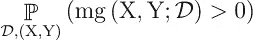

**图 1:“mg”是从训练数据集 D 生成的森林的边缘函数，在点(X，Y)上评估。**(图片作者提供)

同样，一个点上的正裕度意味着森林正确地分类了该点，因此**上面的概率完全等同于我们的森林生成过程**的人口%准确度。(如果你很难看出这一点，可以尝试这种更明确的重构:如果你从总体分布中抽取一个验证集，并且在任何随机抽样点上正确分类的概率是 Q，那么验证集的%准确度大约是 Q。)

现在出现了一个你可能很久没听过的短语:切比雪夫不等式。

> ***统计能力移动#1:你可以(二次)只使用它的期望和方差来限制任何随机变量的尾部概率。***

利用切比雪夫不等式，我们可以仅利用边际函数的期望和方差来计算对零下边际进行采样的概率的具体下界。直观地说，方差低、正均值大的边际很少会取负值，切比雪夫只是让这一点变得严谨。现在，只要知道我们可以调整和权衡均值和方差，以获得上面概率表达式的更大下限(我们的总体精确度。)

# 高水平的偏差与方差

由于边际函数的期望和方差是我们精度权衡的关键，因此我们应该对这两者有一个直观的理解。

让我们看看这些术语，从**期望**开始:

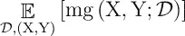

**图 2** (图片由作者提供)

更大的期望值意味着我们生成的任何森林通常都是正确的，其误差比不正确的要大。根据我们对概率和切比雪夫不等式的了解，较大的期望值意味着负值概率的较大下限，即总体精确度的较大下限。

通过使用诸如自举抽样或特征二次抽样的方法对单个树进行随机化，可以稍微降低上述期望。这是森林做出的权衡之一:略微增加“偏差”。但是我们通过增加偏置获得了什么呢？

这就是**差异**出现的原因:

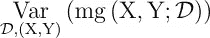

**图 3** (图片由作者提供)

对于固定的正平均值，较小的方差意味着我们生成的森林在任何采样点都不太可能有低于零的边际。与较大的期望值一样，较小的方差增加了采样低于零的裕量的概率的下限。

请注意，我们不能构建无限多的树来将方差缩小到零；如果我们所有的树都是相同的，那么我们的随机森林与一棵单独的决策树是无法区分的，不管它有多大。显然，树与树之间的差异很重要。这里代表“树与树之间的差异”的严谨量是什么？

事实证明，树误差之间的协方差就是我们所需要的。(注意协方差只是一个比例相关。)但是怎么做？而这个协方差项从何而来？我们需要分解方差项来找出答案。

# 分解差异

我们可以使用方差的矩定义来如下展开边际函数的方差:

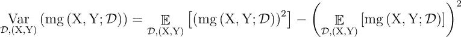

**图 4** (图片作者提供)

让我们放大右边的第一个期望项。

记住,( X，Y)处的边际函数是正确类别 Y 的树投票比例与其在所有不正确类别中的最大投票比例之差。我们真的可以将投票给某个类别的所有树的比例表示为投票给该类别的随机选择的树的概率**。(回想一下，一个森林是从一个特定的数据集通过独立的、相同分布的单棵树的绘制而生长出来的。)**

**森林投票比例和抽样概率之间的这种联系让我们想到了第二个统计学上的优势:**

> *****统计学威力大招#2:所有的比例——或者说概率——都可以改写为二元/指标/伯努利随机变量的均值。*****

**重申一下，我们可以将森林对给定 C 类的投票比例写成每棵树对 C 类的二元投票的平均值——其中，如果树投票给 C，投票为 1，如果树不投票，投票为 0。在极限情况下(即有无限多的随机生成的树)，这个“树的平均值”变成了一个*期望值*，从我们随机抽样的单个树的分布中取值。**

**让我们使用这种树形分布和我们的频率特性来重写我们的边际函数:**

**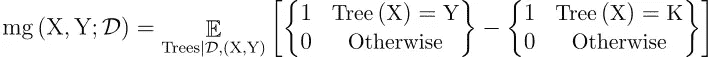**

****图 5:“K”是错误的类别，在我们的树分布中平均票数最高。**(图片作者提供)**

**请快速注意，我已经将期望值设定在训练数据集 D 和固定评估点(X，Y)上，因为左边的边际函数是在固定的*D 和固定的*T7(X，Y)上评估的。****

**在这种替换中，我们将产生 Y 类或 K 类的树的*比例*的差异用于输入 X(这是我们对 X 处评估的边际函数的原始定义)，并将其转换为随机采样的树对 Y 类或 K 类的二元投票的*平均值*的差异(上图是差异的平均值，相当于平均值的差异)。)为了使表达式更简洁，让我们将上述期望内的二进制投票的差异称为与单个树相关联的**“原始”边际函数，或“rmg”。****

**我们可以通过首先对两边求平方，然后对 D 和(X，Y)应用期望，最后用更紧凑的原始边距函数代替二进制投票的差，来写出下面的新恒等式:**

**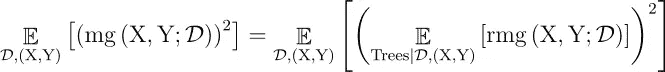**

****图 6:“RMG”是单个样本树的原始边缘函数**(图片由作者提供)**

**我们为什么要这么做？如果你还记得，左边的期望是图 4 中方差公式的第二阶矩。我们正在重写方差项。**

****现在我们要从上面右边的项中取出一个协方差表达式** **。**兴奋起来！**

****

**刚刚有人说“协变”吗？(图片由[加布里埃拉·克莱尔·马里诺](https://unsplash.com/@gabiontheroad) 转自**[Unsplash](https://unsplash.com/photos/TO4AEY1UoWk)**)******

****在我们这样做之前，我们需要使用三个简短而巧妙的技巧。第一个技巧是通过**引入两个独立的、同分布的树分布来重写上面表达式中右边的期望:“Trees”和“Trees-prime”**。因为这些分布都是同分布的，它们的期望是相同的，所以我们可以用“Trees”和“Trees-prime”上的两个(同值)期望的乘积来代替右边项中的平方期望。然后，我们得到右手项的如下重写:****

****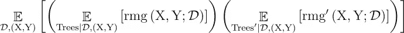****

******图 7** (图片作者提供)****

****请注意，原始边际函数是特定树的唯一属性(就像边际函数是特定森林的唯一属性一样)，因此我将从“Trees”采样的树的原始边际函数描述为“rmg”，将从“Trees-prime”采样的树的原始边际函数描述为“rmg-prime”。****

****第二个技巧利用了这样一个事实:两个独立随机变量的期望乘积**等于乘积**的期望。由于分布“Trees”和它的孪生“Trees-prime”在构造上是独立的，所以在上面的表达式中被评估的“rmg”和“rmg-prime”函数本身*独立于树的绘制(在固定评估点(X，Y)和数据集 D 生成我们的树时)。)然后，我们可以使用第二个技巧，用两个原始边际函数的乘积的联合期望来代替期望的乘积。因此，我们可以将表达式重写为:*****

****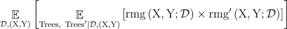****

******图 8** (图片作者提供)****

****最后，第三个技巧是“置换”期望，这样您在外部对训练数据集 D 和树分布有一个期望，在内部对评估点(X，Y)有一个期望。要了解这是如何工作的，首先巩固一些术语是有帮助的。使用**迭代期望定律**，我们可以将上面的迭代期望重写为总期望:****

****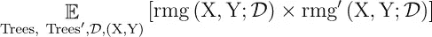****

******图 9** (图片作者提供)****

****现在，我们将利用(X，Y)独立于“树”、“树素”和 D 上的联合分布这一事实，将上述期望分解为新的迭代期望:****

****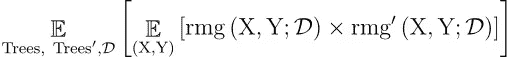****

******图 10** (图片作者提供)****

****我们非常接近于在这里抽出一个**协方差** **项**(它也只是一个**换算** **相关性**！)注意，里面的项是两个随机变量乘积的期望，是协方差的教科书公式之一中的组成项: *Cov(X，Y) = E[XY]- E[X]E[Y]* 。让我们根据协方差重写期望中的项，以获得新的整体表达式(为下图中的字体大小道歉；我答应这一点，只要表情会得到):****

****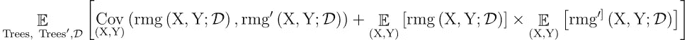****

******图 11** (图片作者提供)****

****回想一下图 6，我们一直在计算边际函数的二阶矩。然后，我们可以将上述表达式代入图 4 中方差的矩定义中的二阶矩。我会在这里保存几页重复的数学；只需知道我们可以将上述期望中的第二项与图 4 中右侧的第二项合并。进行这种替换和合并会得到以下关于边际函数方差的表达式，该表达式仅涉及上述协方差项(包含在预期中)和一个附加方差项:****

****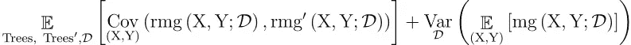****

******图 12** (作者图片)****

****这是构成我们的森林的边际函数在 D 和(X，Y)上的方差的两个分量。让我们直观地理解每个术语:****

1.  ******左边的术语:**粗略地说，这个术语表示任意两个随机采样的树的“误差”在点的总体分布上“共变”的程度，其中这个协方差是在树和产生这些树的训练数据集的所有可能组合上平均的。**注意，让一棵树的逐点误差与另一棵树的误差不相关，甚至相反，会降低表达式**的整体值。****
2.  ******右边的术语:**这个术语不太重要，因为对于大型训练数据集 D，不同训练数据集 D 上的森林的预期裕度函数的方差很小(换句话说，两个大型随机森林适合两个 i.i.d .大型数据集将做出非常相似的预测。)然后我们可以合理地假设右边的项比左边的项小得多。****

****让我们去掉右边的项，只使用左边的项重写边际函数的方差:****

****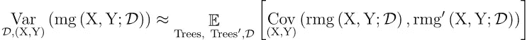****

****图 13 (图片由作者提供)****

****太神奇了！**我们森林的偏差-方差权衡实际上是*偏差-协方差*权衡**，所讨论的协方差是单棵树的误差。****

****偷偷摸摸的读者可能已经注意到一些更令人兴奋的事情:**这个数学没有任何部分是专属于*棵树*的。你听到我在任何地方提到“叶子”、“节点”或“分裂”了吗？******

****没错；您可以随机选择任何分类器，然后将它们平均在一起，以实现最佳的偏差-协方差权衡——这可能比单独使用任何一个分类器都更准确！狂野。****

# ****投资类比****

********

****(照片由[谢尔盖·托克马科夫](https://pixabay.com/users/sergeitokmakov-3426571/)从[皮克斯拜](https://pixabay.com/photos/stock-chart-investing-market-6554463/)拍摄)****

****在传统的投资组合理论中，投资的一个目标是在固定的平均回报下最小化投资回报的方差。****

****假设你的投资组合包括对不同公司的投资:谷歌、可口可乐、Reddit 等。那么，你投资的累积回报就是个人回报的总和。我们可以把你的累积收益的方差写成:****

********

******图 14:让你退休的数学方程式**(图片由作者提供)****

****让我们看一下右边的两个总数。****

****右边的第一个总和由每只股票收益的方差总和组成。某种股票的回报波动越大，整个投资组合的回报也波动越大，这是有道理的。你可以把收益的方差看作是一项投资的**风险**的粗略度量。****

****右边的第二个和稍微有趣一点，包含协方差项(你能看出我在说什么吗？)如果两只股票共同负变，实际上*降低了*投资组合收益的总体方差。****

****这就是为什么分析师总是告诉个人投资者分散投资。如果你只持有 Gamestop 的股票，那么你的财富会像 Gamestop 的财富一样剧烈波动。但是如果你持有不同行业的不同公司的股票，那么个人的涨跌会在一定程度上抵消，你面临的唯一风险是整个市场下跌的风险(所谓的“系统性”风险)。分散投资相当于不把所有的鸡蛋放在一个篮子里。****

****回到随机森林——我们的单个树(股票)有时可能过于投机，以泛化为代价追求训练的准确性。然而，通过随机化这些树，我们正在探索(投资)问题中不同的、相关性较低的“部门”，通过取平均值，我们正在使产出(我们的投资组合)较少依赖于任何一棵树。通过这样做，我们创建了一个健壮而强大的模型。****

# ****结论****

****让我们总结一下我们的两条主要经验:****

*   ****随机森林采用了一种独特的方差减少方法:集合相关误差较小的单个模型****
*   ****基于树的系综没有什么独特之处。你可以构建任何机器学习模型的随机集合，调整随机性以达到最佳精度****

****需要注意的一点是，梯度推进可能会做一些类似于第一个项目符号的事情。对于每个新的 boosting 迭代，我们有效地对当前迭代的“错误”进行上采样，并训练新的模型；最后，我们将新模型添加到现有的集合中。因为我们对前一次迭代的误差进行了上采样，所以增量模型往往在这些点上具有相对较低的误差，而在前一次迭代表现良好的点上具有相对较高的误差。这是反相关性在起作用！然而，注意，这里没有给出严格的证明；我将把关于增强和随机集合的讨论留给真正的专家。****

****第二点实际上很有趣。它表明，现有的每一个模型都可以简单地通过随机化和并行训练许多类似的模型来改进——这在更便宜的云计算中越来越容易做到。****

****谁知道呢？也许下一场大型 Kaggle 比赛将归结为一种巧妙的随机技术。****

# ****参考****

****[1] L .布雷曼，[随机森林](https://link.springer.com/article/10.1023/A:1010933404324) (2001)，*机器学习* 45 **，**5–32****