# 用于手写数字识别的个人宠物项目的第三次生命

> 原文：<https://towardsdatascience.com/the-third-life-of-a-personal-pet-project-for-handwritten-digit-recognition-fd908dc8e7a1>

## 使用 Streamlit 在定制数据集上从头开始部署 YOLOv3 的旅程

五年前，当我得到第一份数据科学家的工作时，我想尽快获得更多的经验。我做的其中一件事是做一个个人项目:一个 Flask 应用程序，允许用户画一个数字，并让它被 ML 模型识别。我花了几个月的时间来开发它，但是从提高我的技能和帮助找工作的角度来看，这是值得的。

两年后，我出版了一个有各种改进的新版本；比如我用 OpenCV 识别单独的数字，模型扩展到 11 类，预测非数字。如果你有兴趣，你可以在这里阅读关于这两个版本的更多细节[。](https://andlukyane.com/project/drawn-digits-prediction)

这两个应用程序是使用免费计划部署在 Heroku 上的，但前一段时间，免费计划停止了。我想保持这个项目的活力，所以我决定做一个新版本。简单地重新部署一个项目并不有趣，所以我在 12 个类上从头开始训练了一个 YOLOv3 模型。虽然这看起来像是一个小型的个人项目，但它实际上提出了许多与真实项目相同的挑战。在这篇博文中，我想分享我在这个项目上的工作经历，从数据收集到部署。

这是应用程序本身的[链接](https://huggingface.co/spaces/Artgor/digit-draw-detect)。

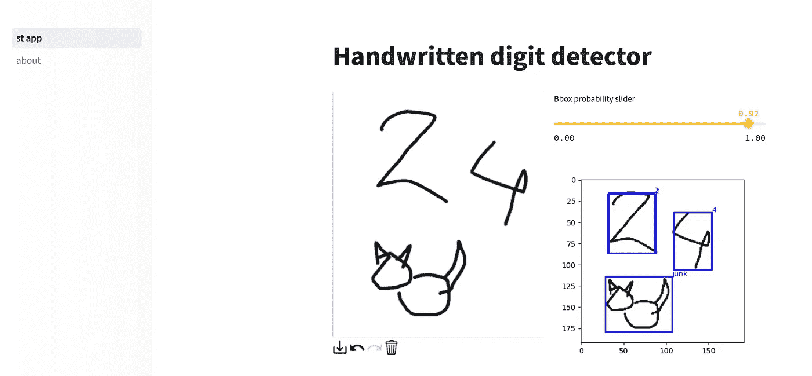

作者制作的截图

## 数据收集和处理

获得良好的数据和注释是任何项目的重要组成部分。由于这个应用程序的早期版本，我有一个大约 19k 张图片的数据集，存储在亚马逊 S3 桶中。虽然这些图像的标签最初是由我的模型生成的，但我知道存在一定程度的误差。事实上，我估计错误率在 10%左右，这意味着大约 2k 的图像有不正确的标签。

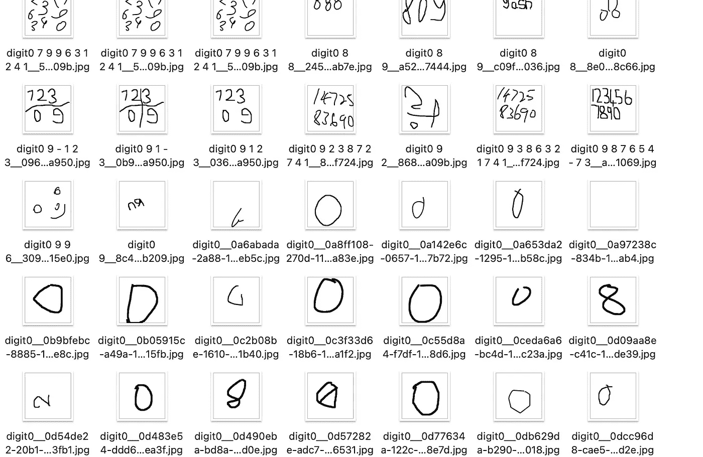

作者制作的截图

除了标记过程中的错误之外，我还遇到了图像中令人困惑的案例带来的困难。例如，人们有时绘制数字的方式很难确定描绘的是什么，或者在一幅图像中绘制多个数字，这又增加了一层复杂性。此外，我在以前的模型中实现了一个“other”类来识别非数字对象，但是我仍然需要验证所有的标签。

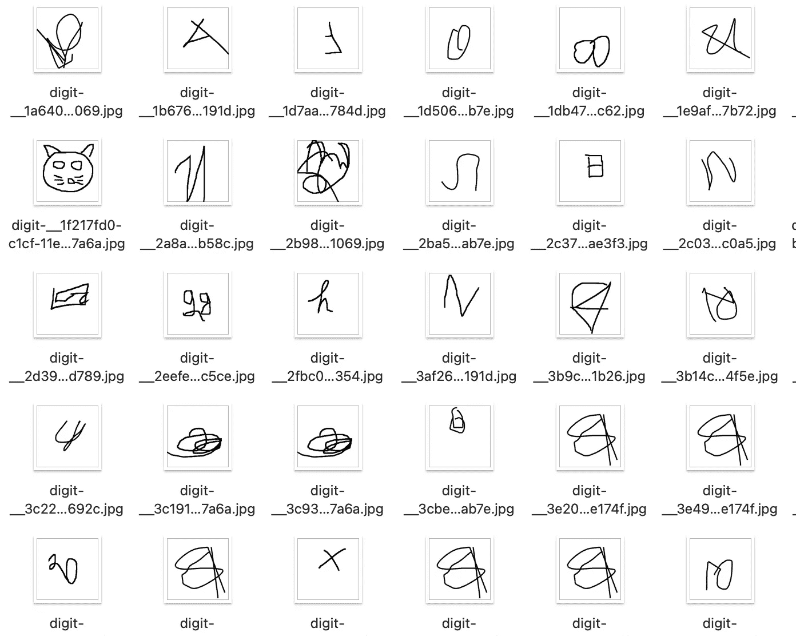

作者制作的截图

因此，我花了几个小时手动检查和纠正图像的标签，甚至删除了一些我不确定的标签。在开发我的项目时，确保数据和注释准确可靠是至关重要的。

## 图像分类模型

当我开始着手我最新的数字识别项目时，我在我的 MacBook 上用 Pytorch 训练了一个 CNN 模型。我还用这个教程训练了一个 ViT 模型。这两种模型都使用 Pytorch 的 [MPS](https://pytorch.org/docs/stable/notes/mps.html) 进行训练，允许使用 Metal 编程框架在 macOS 设备上进行高性能 GPU 训练。与使用 CPU 相比，这大大加快了训练时间。

我之前使用 PyTorch-lightning 和 Hydra 开发了一个培训管道，我可以很容易地为这个项目修改它。你可以在这里看到这条管道[的代码。](https://github.com/Erlemar/pytorch_tempest_pet_)

一旦模型被训练，我就检查他们做出不正确预测的情况，并试图纠正它们。不幸的是，在某些情况下，我自己无法确定正确的标签，所以我通常会删除此类图像。

值得注意的是，在这一点上，我有 12 个类供模型识别:10 个用于数字，一个用于“其他”，最后一个类，我称之为“审查”。我惊讶地发现，模型能够很好地识别这个类。

虽然这些实验工作起来很愉快，但它们最终是我为项目训练对象检测模型的最终目标的垫脚石。

## 为对象检测注释图像

正如我前面提到的，我这个项目的目标是训练一个对象检测模型，它需要每个图像中每个对象的边界框。首先，我使用 OpenCV 库中的 *cv2.findContours* 和 *cv2.boundingRect* 在图像中的对象周围绘制边界框。为了使这个过程更有效，我最初只处理包含单个对象的图像。

如果 OpenCV 在一个图像中识别出多个边界框，我会手动验证并修改标签，将这些图像移动到一个单独的文件夹中，以便以后处理。

接下来，我需要为包含多个对象的图像获取标签。我最初试图自动提取边界框，但发现了太多错误，因为人们经常用多个不相连的笔画来绘制数字。

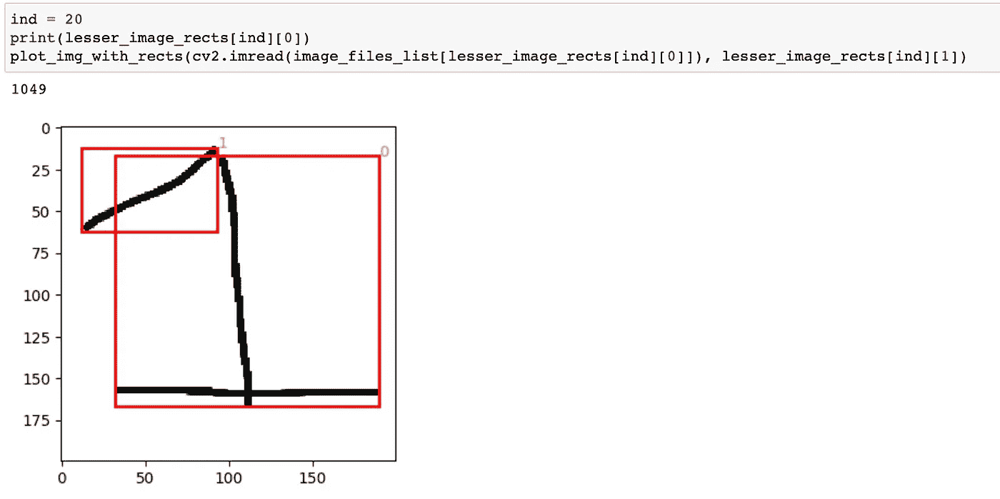

作者制作的截图

经过一些研究，我发现[https://www.makesense.ai/](https://www.makesense.ai/)是标记其余数据的有用工具。花了几个小时浏览所有图像，但最终，我有了 16.5k 图像的边界框注释。

我在标注数据时遇到的一个挑战是决定标注什么和不标注什么。例如，在一些图像中，很难确定是否所有描绘的对象实际上都是数字，或者一些对象是否应该被标记为“其他”。

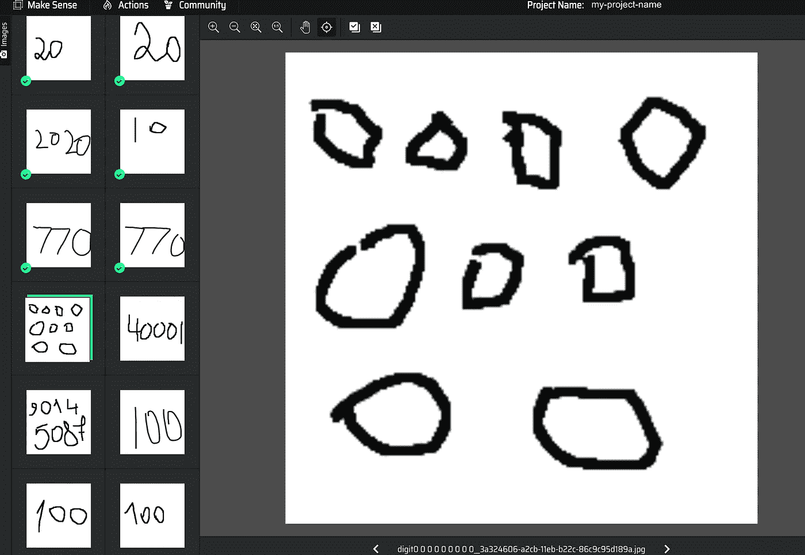

作者制作的截图

## 为对象检测训练 YOLOv3

当我开始研究我的对象检测模型时，我最初只使用带有单个对象的图像进行训练，以确保一切都按预期进行。我以这个[教程](https://sannaperzon.medium.com/yolov3-implementation-with-training-setup-from-scratch-30ecb9751cb0)为起点，看到了一个不错的表现，错误率相对较低。

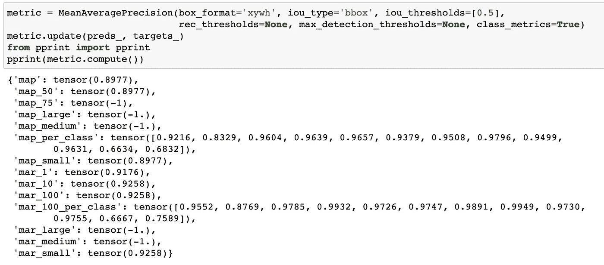

作者制作的截图

然而，当我开始在所有图像上训练模型时，事情出错了。该模型的性能受到影响，有时梯度甚至爆炸。预测的边界框也是不正确的。

作者制作的截图

为了尝试并找出这些问题的根源，我仔细调试了流程的每一步。我遇到的一个问题是关于增强的:Albumentations 库中的一些增强导致了边界框的扭曲。这里有一个关于这个问题的旧 GitHub [问题](https://github.com/albumentations-team/albumentations/issues/182)。因此，我开始使用 imgaug 进行增强，并且只在标准化和调整图像大小的最后一步使用 albumentations。

我发现的另一个问题是边界框的格式:我使用了 coco 格式，而模型的代码期望它们是 yolo 格式。修复这个问题有所帮助，但模型的性能仍然不够好。

经过进一步的实验，我发现了最终的问题:当我在训练图像分类模型时，我使用 OpenCV 提取了绘制的数字，并将图像的大小调整为 32x32 或 64x64。这意味着数字占据了图像中的所有空间。然而，当我开始训练对象检测模型时，我将带有图像的整个画布调整为 64x64。结果，许多物体变得太小和扭曲，不能有效地被识别。将图像大小增加到 192x192 有助于提高模型的性能。

我正在分享一个[链接](https://wandb.ai/al-3002-w/pet_project_object_detection/reports/valid_loss_epoch-22-12-21-17-11-25---VmlldzozMTk0ODY2?accessToken=z9k3pv80vheyskvhz5hlg7z4ardyrvht2faqx20be3n4ogsp336w62k222x7ec51)到一个带有训练图和更多细节的权重和偏见报告。

之前我提到过我在 MacBook 上用 Pytorch MPS 训练过图像分类模型。然而，当我试图以同样的方式训练一个对象检测模型时，我遇到了 Pytorch MPS 的一些问题。一个内部操作失败了，所以我被迫切换到使用 CPU。GitHub 上有一个特殊的[问题](https://github.com/pytorch/pytorch/issues/77764)，人们可以在那里分享这类案例。

虽然这在对 64x64 大小的图像进行训练时是可行的(尽管要花 15 分钟)，但是将图像大小增加到 192x192 会使训练极其缓慢。结果我决定用 Google Colab 代替。不幸的是，免费版本是不够的，所以我不得不购买 100 个信用点。Colab 上的一个纪元只用了 3 分钟。运行几个实验就足以获得良好的性能。

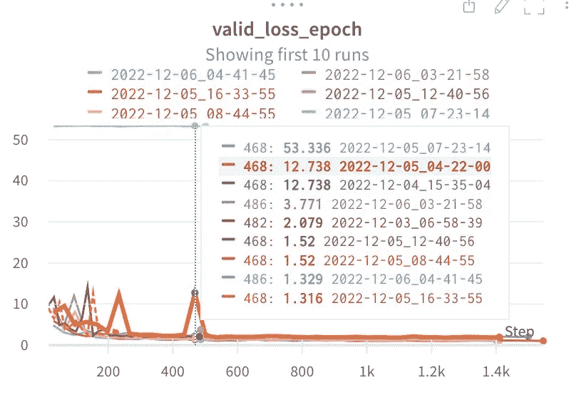

作者制作的截图

## 部署

训练模型是开发过程中的一个重要步骤，但不是最后一步。训练模型后，下一步是创建和部署应用程序。

## 细流

为了创建这个项目的应用程序，我决定使用 [streamlit](https://streamlit.io/) ，因为我以前有过使用它的经验，并且发现它比使用 flask 进行应用程序开发要快得多。虽然这款应用的视觉效果可能不如一个精心设计的网站，但它的开发速度足以弥补这一点。

我用这个[画布工具](https://pypi.org/project/streamlit-drawable-canvas/)让用户画出模型可以识别的数字。应用程序开发过程相对较快，只需几个小时就能完成。一旦应用程序准备就绪，我就可以进入部署阶段了。

## 部署

最初，我计划在 [streamlit cloud](https://streamlit.io/cloud) 上部署应用，因为这是一个快速部署和共享小应用的优秀平台。我在 streamlit cloud 上成功部署了该应用程序，但当我在聊天中分享它时，它很快就达到了资源限制。这意味着我需要找到一个替代的部署解决方案。

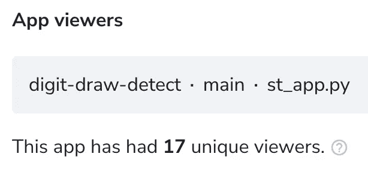

作者制作的截图

我考虑过像以前一样在 Heroku 上部署这个应用，但意识到对这个项目来说太贵了，因为它比以前的版本需要更多的内存。

这时我想起了[拥抱面部空间](https://huggingface.co/spaces)，一个专门为部署 ML 应用程序而设计的平台。我能够在一个小时内轻松地将我的应用程序部署到拥抱脸空间上，并且它工作起来没有任何问题。总的来说，我发现这个平台是部署小型 ML 模型的优秀解决方案。

## CI/CD

当处理已经存在的项目时，我们并不总是能够自由地按照我们的意愿设置管道，但是在我的情况下，我可以做我想做的任何事情，所以我实现了大量的检查来最小化错误出现的机会。

我安装了带有各种检查的预提交钩子。

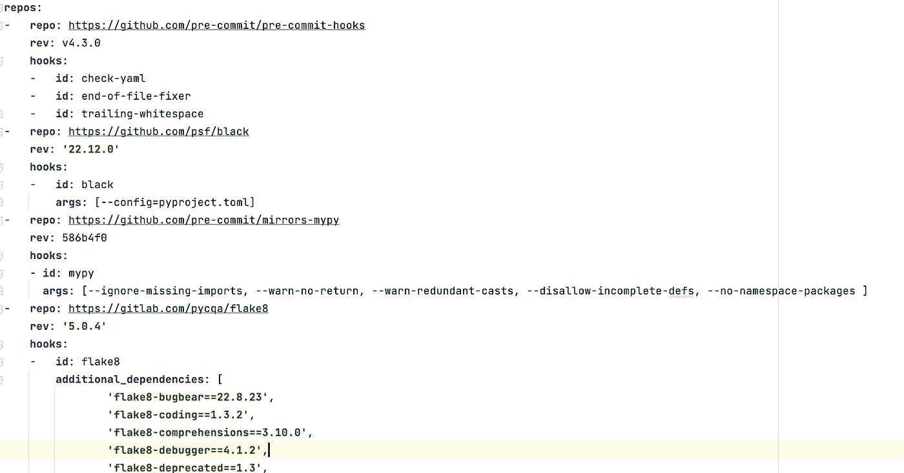

作者制作的截图

I .限制对主要分支机构的推送—所有变更应仅通过 PRs 完成。

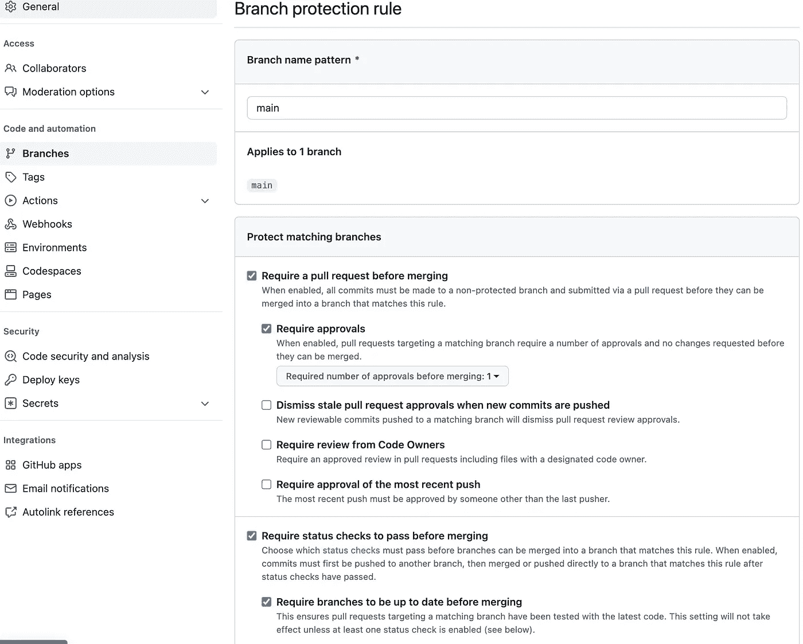

作者制作的截图

创建 PR 时，它会触发 deepsource 检查以及带有检查的 github 操作。

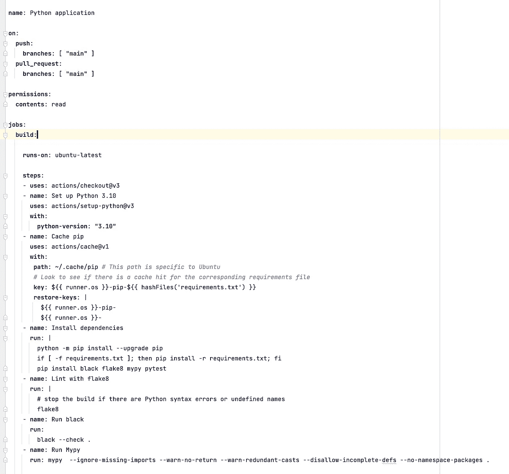

作者制作的截图

当一个 PR 成功合并到主分支时，github 会触发一个动作来更新 Hugging Face Spaces 上的 repo。

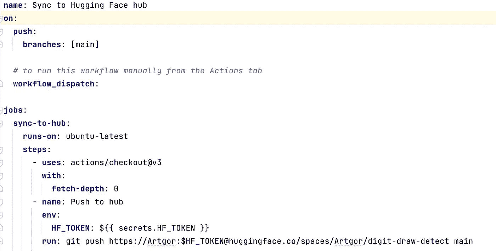

作者制作的截图

## 失败的样式转移

最初，我计划给应用程序添加一个额外的功能:使用样式转移来显示与用户绘制的样式相同的所有 9 个其他数字的能力。然而，我发现这个功能并没有我希望的那么好。我认为，在白色画布上绘制的黑色数字缺乏上下文和风格，这使得很难有效地应用风格转移。因此，我决定在最终版本的应用程序中不包含这一功能。

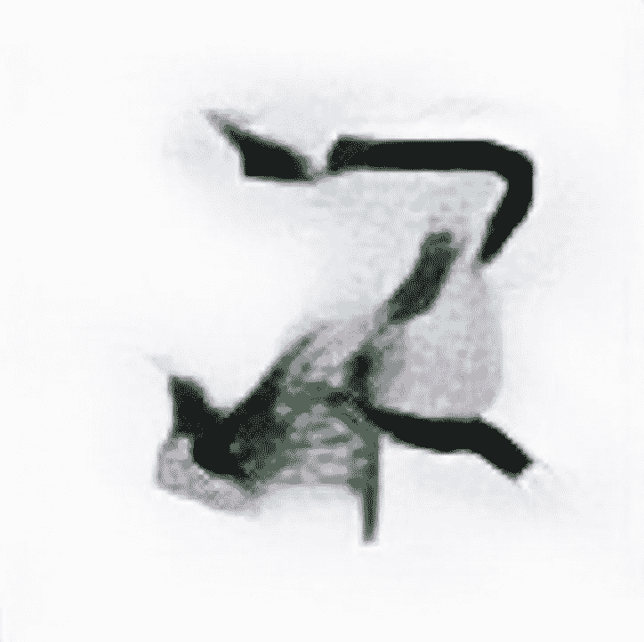

作者制作的截图

## 结论

总的来说，我对这个项目的结果很满意。虽然该模型的预测并不完美，但对于该应用程序的目的来说，它们仍然足够准确。但是，我确实计划在未来使用新数据重新训练该模型，以进一步提高其性能。

这个项目对我来说是一次宝贵而愉快的学习经历，我希望你也觉得有趣。

更多资源的链接:

*   [我个人网站上的项目页面](https://andlukyane.com/project/drawn-digits-prediction)
*   [在 Kaggle 上有数字和边界框的数据集](https://www.kaggle.com/datasets/artgor/handwritten-digits-and-bounding-boxes)
*   [训练代码](https://github.com/Erlemar/pytorch_tempest_pet_)
*   [GitHub 上的项目代码](https://github.com/Erlemar/digit-draw-detect)