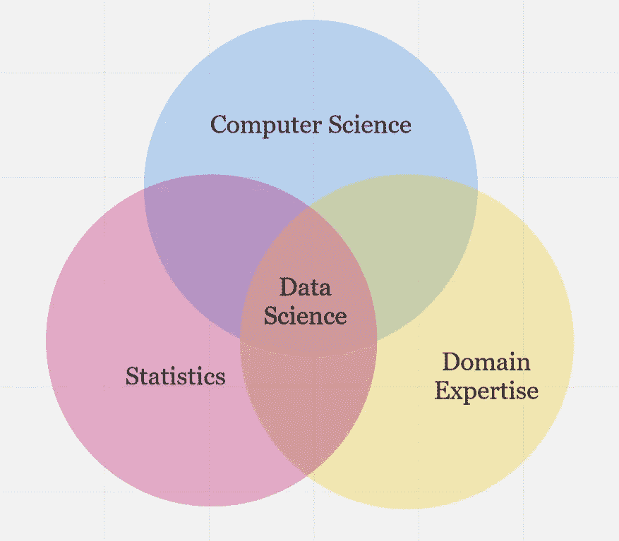

# 数据科学的三大基石

> 原文：<https://towardsdatascience.com/the-three-building-blocks-of-data-science-2923dc8c2d78>

## 数据科学本质上是一个跨学科的领域，我们应该提醒自己这一点。

作者图片

在我本科第一次上数据科学课的第一堂课，教授展示了上面的维恩图。我找不到确切的演示文稿，所以我尽力复制了一份图表，同时保留了关键点。

回过头来看，我怀疑她在一开始就给我们留下了这样的印象，因为她希望我们记住数据科学的基础，因为这个世界越来越被硅谷闪亮迷人的产品分散了注意力。

这些天，每个人似乎都专注于数据科学的一些热门新话题或技术，无论是 PyTorch、TensorFlow、最新的 Tableau 更新，还是谷歌最先进的自然语言处理模型。所有这些话题有什么共同点？不可否认，他们是技术型的*。*

不要误解我。技术专长当然是有效数据科学工作的重要组成部分，但它不是唯一的*组成部分。就其本质而言，数据科学是一个跨学科领域。要想在这方面出类拔萃，从它的所有基本学科中汲取营养是很重要的。*

在本文中，我将介绍数据科学的三个组成部分——统计学、计算机科学和领域专业知识——并讨论每一个部分对该领域的重要性，以及探索如果忽略一个或多个部分会出现什么问题。

## 统计数字

我们中的大多数人可能会用统计学这个词来支持我们的任何随机论点，但是我们真的能定义它吗？根据牛津语言，统计学是“收集和分析大量数字数据的实践或科学，特别是为了从代表性样本中推断整体比例”[1]。

更简单地说，统计学着眼于一堆数字，并试图从中找到有意义的模式。它通常分为两个分支:1) *描述性统计*，试图描述现有数据中的模式；2)*推断性统计*，试图对未来数据做出预测。

在最初的定义中有两个重要方面需要注意:

1.  传统上，统计学——作为数学的一个分支——专注于严格的数字数据。正如我们将看到的，数据科学不一定是这种情况。
2.  准确的统计依赖于具有代表性的*样本。这与第一点有关，因为盲目地关注数字可能会与这个目标背道而驰。*

在数据科学出现之前，统计学就是数据科学。几个世纪以来，人们一直在分析数据以获得洞察力，但正式的数据科学是一个相对较新的领域。为什么？在过去，数据是手工收集的，数量相对较少，这意味着也可以手工分析。然而，随着计算机的出现，可供我们使用的数据量呈指数增长，单靠统计学已不足以处理和研究这些数据。

这将我们引向现代数据科学的下一个组成部分。

## 计算机科学

回到我们的好朋友牛津语言，我们可以将计算机科学定义为“对计算机原理和使用的研究”

嗯。不是超级信息量。可以说甚至有点误导。

许多人默认认为计算机科学等同于编程或软件工程。事实上，计算机科学涉及一系列不同的学科，包括但不限于图形学、理论计算机科学、操作系统、计算机体系结构、算法设计和编程语言。

将所有这些领域联系起来——并因此定义了整个计算机科学——的是使用计算机程序来执行一步一步的逻辑运算以解决某个问题。事实上，这就是“计算机”的全部——一台执行一系列逻辑步骤的机器。计算机科学包括在追求特定目标的过程中对这些步骤的主动操作。

计算机最大的优势是它们的运算速度比人快得多。这是计算机科学成为数据科学主要组成部分的主要原因。

理论上，数据科学可以在没有计算机的情况下存在。计算机不提供分析数据的数学基础——这是统计学的作用。在一个人类可以以光速思考和写作的世界里，统计数据可能就足够了。

但是*实际上*，有如此多的数据以至于不可能全部用手工来收集、研究、处理和分析。进入计算机科学，这是促进大数据洞察力的现代工具。

由 [Max Duzij](https://unsplash.com/@max_duz?utm_source=medium&utm_medium=referral) 在 [Unsplash](https://unsplash.com?utm_source=medium&utm_medium=referral) 上拍摄的照片

至此，我们可以看到统计学为数据科学提供了数学基础，计算机科学为数据科学提供了现实世界的处理能力。

然而，如果没有第三个同样重要的因素，两者都失败了。

## 领域专业知识

这一次，没有牛津语言的定义可以借鉴，因为领域专长实际上不是一个单独的领域；这更像是一个总括性的术语，最好通过以下方式来理解。

让我们问自己一个问题:在谈论数据科学时，*数据*实际上来自哪里？是某个统计方程的数学余项吗？还是隐藏在计算机硬件某处的难以捉摸的结构？

这些问题可能看起来很愚蠢，但当我们考虑到这么多自称的数据科学家是如何痴迷于数字和代码，以至于忘记这两者的成功从根本上依赖于数据本身时，它们就不那么愚蠢了。

数据来自哪里？*域名。*

没有正确理解数据的背景，数据是没有价值的——背景只能由*领域专家*获得:理解数据来源领域的人，因此可以提供正确解释数据所需的视角。

让我们考虑一个玩具例子来说明这一点。想象一下，我们从 PGA 巡回赛最近几年的不同高尔夫比赛中收集数据。我们获得所有的数据，我们处理和组织它，我们分析它，我们自信地发表我们的发现，三次检查我们所有的公式和计算。

然后，我们就成了媒体的笑柄。为什么？嗯，因为我们都没有真正打过高尔夫球，所以我们没有意识到低分数对应着好成绩。因此，我们所有的分析都是基于相反的情况，因此是不正确的。

这显然是夸大其词，但它表达了这一点。数据只有在上下文中才有意义，因此在试图得出任何结论之前咨询领域专家是至关重要的。

在实践中，未能说明领域和持续依赖纯粹的定量方法会导致(在许多情况下，已经导致)不道德的、限制性的数据科学实践。

## 一些最后的想法

半年前，当我开始我的人机交互和以人为中心的数据科学博士项目时，我与我所在部门的一位教授分享了一次奇怪的交流。就背景而言，他有社会学背景。

几个同学和他一起喝咖啡，讨论交叉的研究兴趣；我偶然遇到他们，他问我我的是什么。我回答说，我学的是以人为中心的数据科学、计算机科学教育和可视化。

他专注于我的第一点，并继续简要讨论了他的研究项目如何围绕技术的历史和社会学。他描述了他如何检查信息技术的基本基础设施，并对通过提供数据和计算工具来支持科学活动的组织感兴趣(听起来熟悉吗？).

他以半开玩笑的方式结束，笑着说，“所以，我自己也算是一个以人为中心的数据科学家。”

当时，我并没有多想，但在过去的六个月里，我开始明白他的意思了。他的角色是为领域专家提供便利和支持，以便人们可以在上下文中正确理解和解释他们的数据*——这项工作的重要性怎么强调都不为过。*

关于这一点，让我们回顾一下:

1.  统计学提供了从数据中得出数学见解所需的工具。**没有它，我们可能会得出不科学的结论。**
2.  计算机科学提供了大规模收集、处理和分析数据所需的工具。**没有它，我们就无法理解现代世界中的海量数据。**
3.  领域专业知识提供了将数据融入上下文和理解数据所需的工具。没有它，我们可能会依靠数学和计算技术得出不准确的结论，而这些技术忽略了只有领域专家才能看到的数据的复杂性。

将这三者结合在一起，我们就得到了数据科学。

**想擅长 Python？** [**获取独家、免费获取我简单易懂的指南点击**](https://witty-speaker-6901.ck.page/0977670a91) **。想在介质上无限阅读故事？用我下面的推荐链接注册！**

 [## 穆尔塔扎阿里培养基

### 阅读媒介上穆尔塔扎·阿里的作品。华盛顿大学的博士生。对人机感兴趣…

murtaza5152-ali.medium.com](https://murtaza5152-ali.medium.com/?source=entity_driven_subscription-607fa603b7ce---------------------------------------) 

*我叫 Murtaza，是华盛顿大学研究人机交互的博士生。我喜欢写关于教育、编程、生活以及偶尔的随想。*

## 参考

[1][https://languages.oup.com/google-dictionary-en/](https://languages.oup.com/google-dictionary-en/)