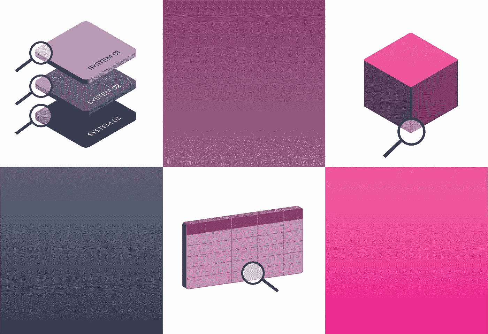
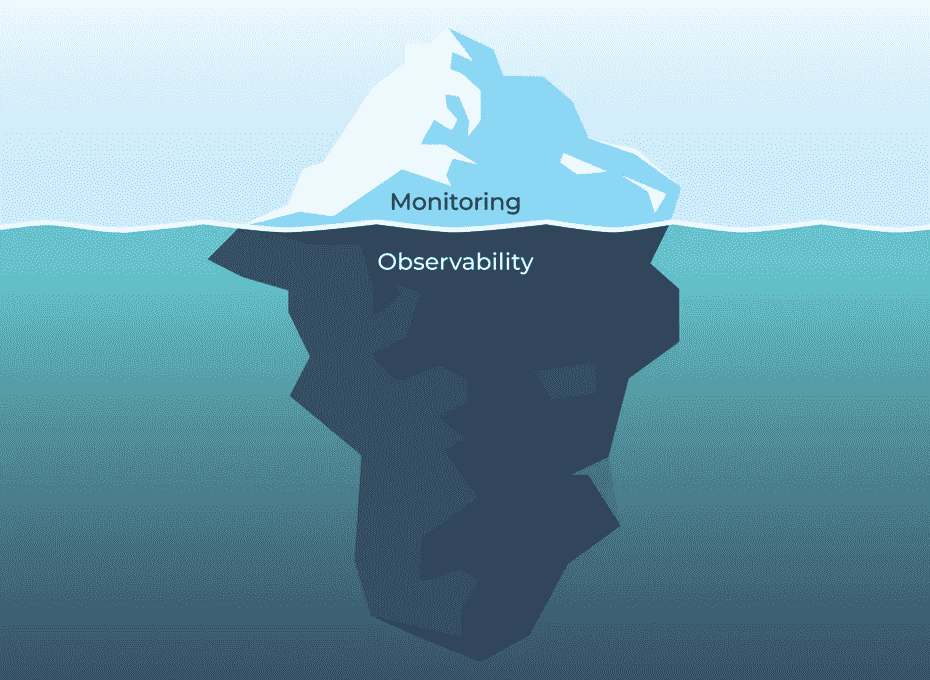
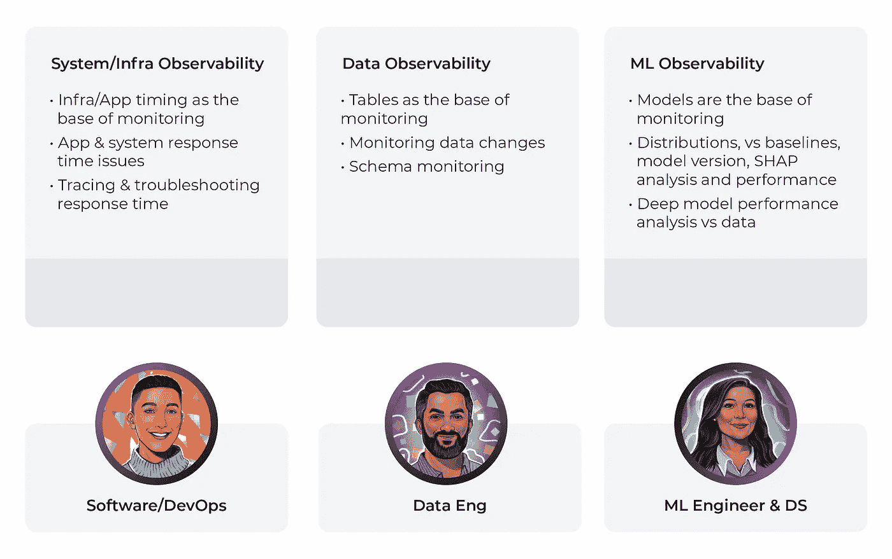
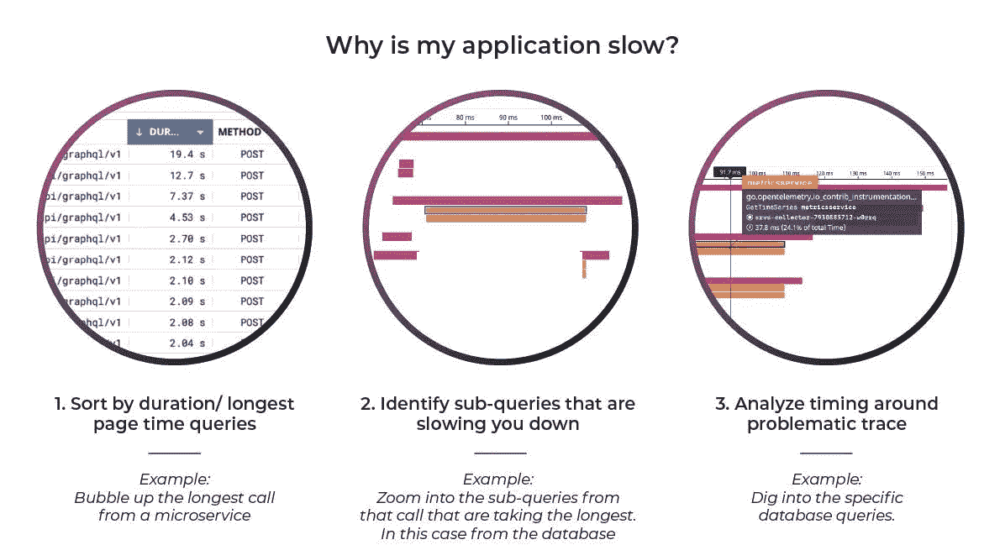
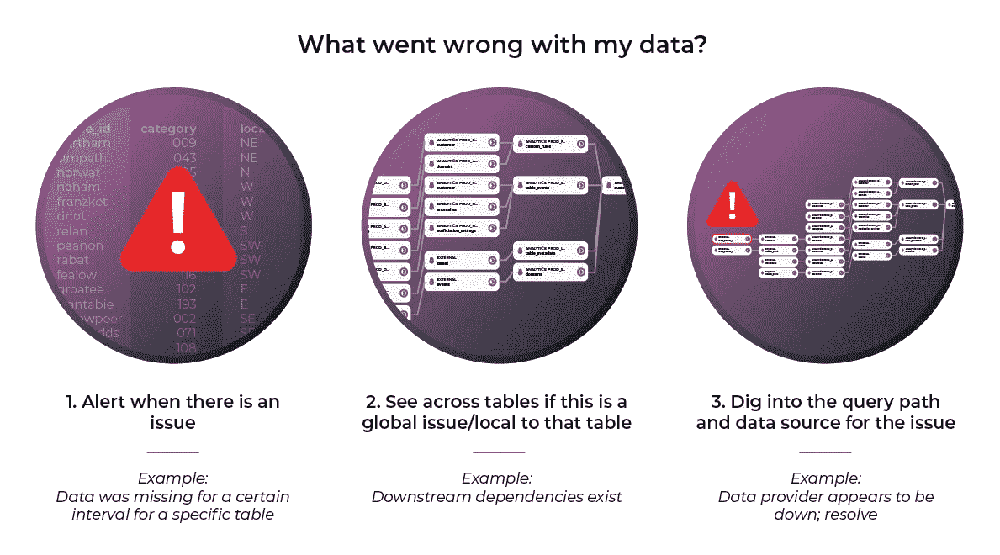
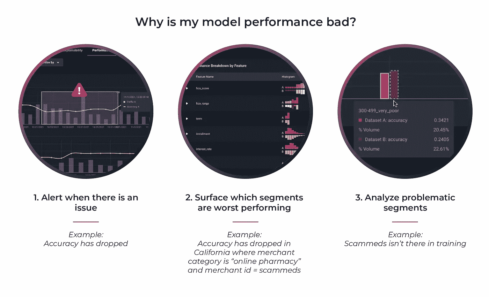

# 系统需要的三种可观察性

> 原文：<https://towardsdatascience.com/the-three-types-of-observability-your-system-needs-a3e7f6ae4803>

作者图片

*本文是与凯尔·柯文合作撰写的，他是* [*Bigeye*](https://www.bigeye.com/) 的联合创始人兼首席执行官

# 什么是可观测性？

1969 年，人类首次登上月球，这要归功于大量巧妙的工程和 15 万行代码。除此之外，这种代码使任务控制中心的工程师能够全面了解任务，并做出近乎实时的决策。代码量如此之少，以至于工程师们能够彻底地调试该软件，并且其性能近乎完美。另一方面，今天的搜索引擎执行数十亿行代码，这使得工程师更有可能犯错误或在系统的某个地方出现异常情况。最重要的是，数据和机器学习模型(计算机本质上为自己编写的代码)都有自己的挑战。简而言之，几乎不可能保证一个现代的软件系统总是如你所期望的那样运行。这就是为什么可观察性对所有生产系统都是至关重要的。

幸运的是，我们可以自动化复杂软件系统的可观测性，这样你就可以获得关于你的软件的及时的和可操作的信息，就像 NASA 工程师对阿波罗任务所做的那样。可观察性是快速发现问题所在并找到根本原因的实践。大多数现代软件系统包括基础设施、数据和机器学习模型。这三者都需要可观察性，但是每一个都有不同的需求、工作流和角色。让我们仔细看看！

作者图片

当然，可观察性并不是开发人员、数据工程师和 MLOps 工程师等技术人员所独有的。这与跟踪业务度量和行业特定需求的规程是一样的，但是在这篇文章中，我们将关注可观察性对这三个更具技术性的角色的人意味着什么。

这三种类型的工程师使用可观察性来解决不同工作流的不同问题。在最高级别，基础设施可观察性与软件问题有关，这些问题通常围绕延迟、故障和资源利用。另一方面，数据可观察性更关心应用程序正在使用的数据的变化，无论是数据库中的静态数据还是进入数据存储系统的任何步骤中的数据。机器学习的可观察性是一门较新的学科；它关注于你的模型的性能，衡量它们预测值的好坏，无论是在某些数据片段的总体上，还是使用像 [SHAP 分析](https://arize.com/blog/what-are-the-prevailing-explainability-methods/)这样的技术在单个预测的水平上。

分解三种类型的可观察性:作者的图像

# 基础设施可观测性

## 人物角色

软件/DevOps 工程师负责软件基础设施的开发和运营。他们的代码是将现代软件系统的所有砖块粘合在一起的灰泥。

## 问题

许多现代应用程序都依赖于几个系统的协同工作，一个系统中的小问题可能会导致整个应用程序的速度显著下降。

新版本的代码可能会有意想不到的错误。配置更改、密码和闰秒等罕见事件都可能在这一层引起问题。此外，DevOps 工程师通常要对他们没有设计的软件系统负责。运行其代码的虚拟机或 Kubernetes 集群可能会失败。

## 工作流程

根据问题出现的位置，可以在这一层采用几种工作流。我们来看其中一个。

假设你是一个大型电子商务网站的 DevOps 工程师——姑且称之为 Nile。突然之间，页面加载时间开始变长了。众所周知，此类应用程序 1%的速度下降会导致 15%的客户满意度下降，这意味着巨大的收入损失。

不费吹灰之力—您已经将您的应用与市场领先的可观察性解决方案相集成。您会立即收到有关问题的通知，并可以开始故障排除。

首先，因为您记录了页面加载时间以及页面上每个查询的单独查询时间，所以您可以确定哪些页面加载得比其他页面慢。然后，您可以查看单个查询时间，并根据哪个查询时间最长对它们进行排序。

在系统的更深处，您可以识别出降低您速度的子查询。通过分析这些子轨迹周围的时序，像您这样的 DevOps 工程师能够很容易地看到指向问题根本原因的模式。在这种情况下，最近的代码更改为去年购买超过 300 次的客户在历史查找中引入了更多延迟，由于尾部延迟放大，所有客户都为此付出了代价。您退出变更，直到您的团队能够找出如何在不产生此类成本的情况下部署它。

问题解决了。

作者图片

# 数据可观察性

## 人物角色

数据工程师和分析工程师负责构建和运营数据管道。它们确保您的应用程序接收的数据的及时性、完整性和其他质量特征。

## 问题

当数据源发生变化时，它可能会改变模式、内容或数据到达数据湖或数据仓库的时间。例如，假设您的数据供应商从美国邮政编码(数字)转换为全球邮政编码(字符串)。突然，您的管道中的一个步骤出现故障，因为它依赖于邮政编码是一个数字或者正好是 5 位数字，并且您得到了所有加拿大客户的部分或空邮政编码。

其他问题可能包括陈旧数据(来自未按时运行的管道)、数量(意外丢失或重复的记录)和分布(个人年龄的负值或新的分类值)。这些问题可能是由数据原始来源的变化、数据基础结构的问题或者数据在管道中传输时所经历的各种转换步骤中的代码变化引起的。

全天候识别所有数据管道中的这些问题对于防止数据中断到达模型用于培训和服务的数据是至关重要的，并且可以快速超越抽查等手动方法，甚至数据管道测试等半自动方法。

# 工作流程

现在，假设你是一家快速发展的分析公司的数据工程师。你获得了第一个大客户，他们刚刚发起了一场关键的营销活动，这取决于你公司的客户细分模型。您的模型在未来 24 小时内提供的建议将对他们的业务和您的业务产生巨大影响。这种模式依赖于新的观众数据。

您从数据可观察性工具得到一个警告:一个应该每 60 分钟更新一次的表已经有 75 分钟没有更新了。单击警报中的链接，您将看到第三方数据提供商的 SLA。您会发现数据已经过时，几个月前也发生过类似的问题。阅读您的队友上次修复时留下的事件记录，您会看到这些数据来自哪个提供商，以及他们的电话号码。你拿起电话给他们打电话。你猜怎么着？在你打电话之前，他们甚至不知道有问题。他们的 SSL 证书过期了，他们用来更新证书的 cron 作业卡住了。他们手动重新运行脚本，您的数据可观察性工具确认一切恢复正常。探测时间:15 分钟。修复时间:十分钟。客户影响:可忽略不计。没人知道你刚刚挽救了公司迄今为止最大的一笔交易。

作者图片

# 机器学习可观察性

## 人物角色

机器学习工程师负责开发、生产和操作机器学习模型。

## 问题

越来越多的软件系统依赖于机器学习模型。越来越多的经济价值依赖于机器学习模型。表现不佳的模型可能会导致糟糕的决策，甚至更糟，让许多客户名誉扫地，收入减少。

然而，与传统软件不同，机器学习模型不是静态的。性能通常会随着时间的推移而下降。事实上，[一项调查](https://arize.com/resource/survey-machine-learning-observability-results/)显示，平均而言，模型在投入生产后的 10 天内就会退化。拥有尽快检测问题、确定根本原因和改进模型的工具是至关重要的。

## 工作流程

对于这个例子，假设你是一个机器学习工程师，为一家大银行维护一个[欺诈模型](https://arize.com/blog/best-practices-in-ml-observability-for-monitoring-mitigating-and-preventing-fraud/)。您的模型将交易标记为欺诈(或不欺诈)。有一天，你的 [ML 可观测性](https://arize.com/ml-observability/)系统向你发送一个警报。您登录后，可以很快找到似乎会产生意外输出分布的输入片段。在这些输入中，您可以识别出一个新的骗子。也许这种新的骗子展示了模型以前没有见过的行为，但你可以用这些新数据重新训练它，并抓住他们和任何其他未来尝试这种方案的人。

收集有用的信息再次成为关键。在这种情况下，您正在寻找一段时间内的模型输入和输出。一旦您获得了所需的数据，对基线性能有所了解是非常有用的。

当模型性能超出基线界限时，您可以放大出现问题的时间范围。接下来，您将按切片对数据进行排序，并评估有问题的数据。

图片作者(来源:[模特绩效管理论文](https://arize.com/wp-content/uploads/2022/04/Model-Performance-Management-Paper.pdf))

# 结论

随着软件在整个世界，尤其是在你的公司中变得越来越不可或缺，对[可观察性](https://arize.com/blog-course/what-is-observability-data-machine-learning/)的需求也在增长。今天，复杂软件系统所需的可观察性水平需要自动化工具。你需要哪些工具取决于你正在解决什么问题。通常，软件和 DevOps 工程师将主要依赖系统和基础设施可观察性工具。数据工程师面临特定的挑战，需要针对数据可观察性定制解决方案。机器学习工程师需要一套完全不同的工具来解决模型性能下降的问题。随着你的团队和公司规模的扩大，你可能会发现自己需要这三样东西。

# 联系我们

如果这个博客引起了你的注意，并且你渴望了解更多关于[机器学习可观察性](https://arize.com/ml-observability/)和[模型监控](https://arize.com/model-monitoring/)，请查看我们其他的[博客](https://arize.com/blog/)和 [ML 监控](https://arize.com/ml-monitoring/)上的资源！如果您有兴趣加入一个有趣的 rockstar 工程团队来帮助模型成功生产，请随时[联系](https://arize.com/contact/)我们，注册一个免费帐户，或者在这里[找到我们的空缺职位](https://arize.com/careers/)！