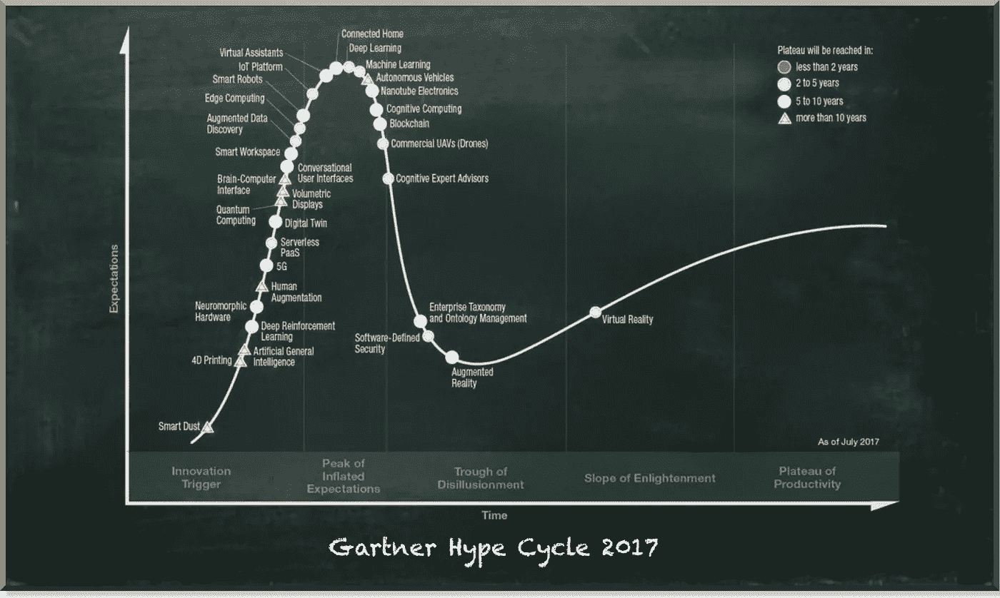
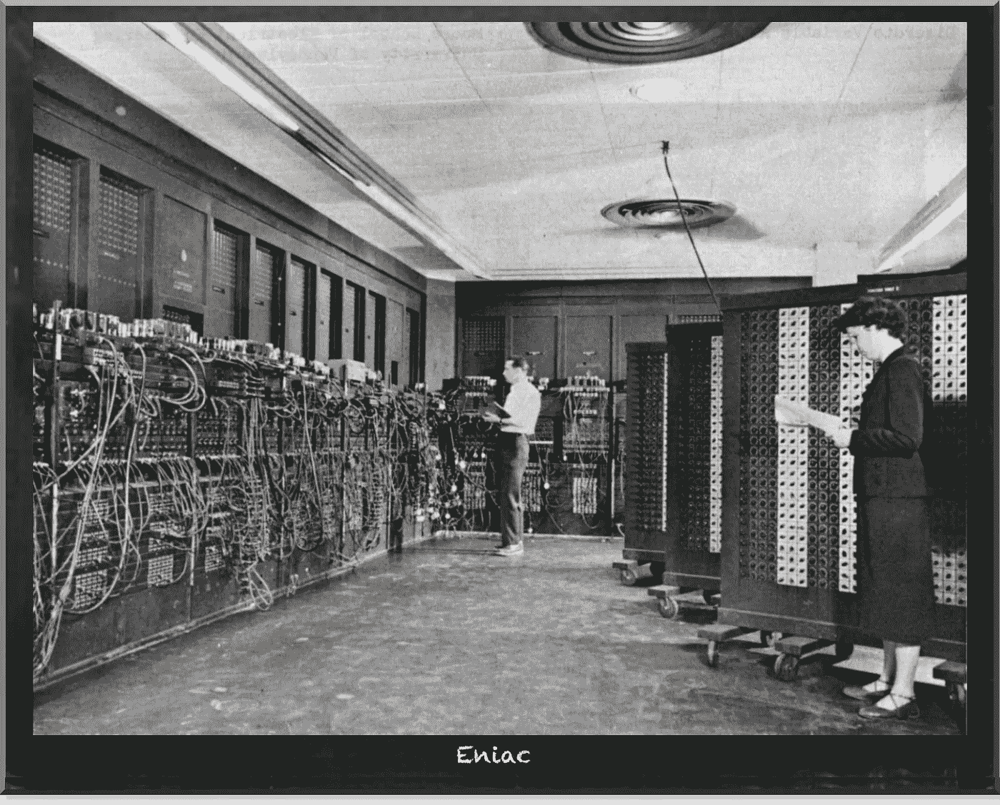
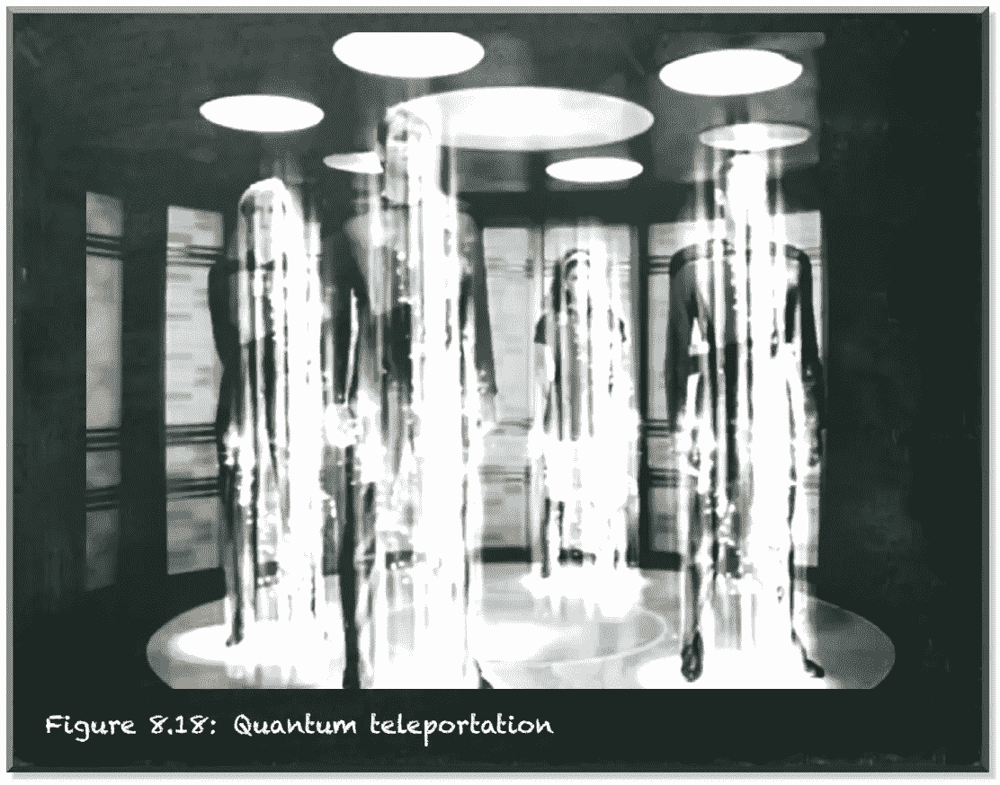

# 现在是开始量子计算的时候了

> 原文：<https://towardsdatascience.com/the-time-to-get-started-in-quantum-computing-is-now-9157d0e606e1>

## 现在轮到我们这些领域专家来学习如何使用这项新技术了

量子机器学习要不要入门？看看 [**动手量子机器学习用 Python**](https://www.pyqml.com/page?ref=medium_timenow&dest=/) **。**

量子计算最近经常出现在媒体上。当然有！我们都非常兴奋，因为它是新的，闪闪发光。

2017 年，量子计算进入了 Gartner 炒作周期。所以，让我们为它欢呼吧，只要我们还在创新的扳机上，它还没有过渡到幻灭的低谷。

改编自 Gartner 2017 年新兴技术宣传周期

但是量子计算将会影响我们所有人。有一个合理的理由相信，这项利用量子力学作为资源的技术在 21 世纪可能会像 19 世纪的电一样具有变革性。

我们最初是如何学会获取和使用电的，以及我们今天是如何用量子力学做同样的事情的，这两者有很深的相似之处。

英国物理学家罗伯特·威廉·博伊尔在 1675 年发表了他关于电的机械起源或产生的笔记。从那以后，对电的探索又上了一个台阶。另一位英国科学家弗朗西斯·豪克斯比(Francis Hauksbee)在做电的吸引和排斥的实验时，第一个制作了一个摩擦时会发光的玻璃球。然而，又过了一个世纪，托马斯·爱迪生才在 1878 年看到电灯的市场。治理电力的起点。

在看量子计算之前，我们先走一个中间步骤。让我们看看数字计算时代是如何开始的。它始于 Eniac——电子数字积分器和计算机。

改编自美国陆军照片，公共领域

这是第一台数字电子计算机，其运算方式与今天的微处理器大致相同。建于宾夕法尼亚大学，美军于 1946 年实施。当时，它唯一的应用是计算炮弹的弹道。

然而，战争结束了，它再也没有什么实际用途了。然而，科学家和工程师对随之而来的可能性感到兴奋。毫无疑问，他们被证明是正确的。但是，在 1946 年，没有人想到个人电脑、笔记本电脑、手机和互联网。这项新技术的深远影响是最没有预料到的。相反，它们完全来源于对这种计算技术的接触。顺便说一下，它们都是电力驱动的。

今天，我们正在见证另一种计算技术的出现。又一次，一个全新的计算能力世界开启了。

然而，量子力学的基本理论并不新鲜。它出现在 20 世纪初。几十年的量子物理学基础研究让我们走到了今天——在驾驭它的边缘。

当然，我们会在大众媒体上读到精彩的东西。有时候，当他们报告量子叠加和纠缠时，这听起来很夸张。当然，大众媒体说明性地解释了叠加——一个粒子同时处于多种状态。当然，当我们听到纠缠时，我们会想到《星际迷航》中的隐形传送——当有人在宇宙的另一端看到另一个粒子时，一个粒子会瞬间改变其状态。但是当然，这些观念从过于简单到错误都有。

作者图片

然后，还有科学。即使是最伟大的头脑也嘲笑量子力学暗示的概念。就连爱因斯坦也在挣扎。他对量子纠缠不屑一顾，认为它是一种幽灵般的超距作用，因为他认为这很荒谬。他当然不是唯一一个试图将量子物理学预测的奇怪事物归入数学好奇心垃圾箱的人。

在这个特殊的例子中，爱因斯坦错了。过去三十年的发现表明，量子力学预言的每一件怪异的事情，尽管可能与直觉相反，却是正确的。没有其他理论能准确预测量子力学没有预测到的东西。

作者图片

假设这一切都太多了。假设这一切都太不可思议而不真实。然后，看看我们自己周围是有帮助的。

我们周围已经有了量子技术。我们利用量子力学建造的第一件东西绝对改变了世界。这是全球定位系统——GPS。它的工作原理是原子计时，使用量子叠加来访问原子内部非常稳定的滴答。它能让我们在厘米范围内进行地理定位。它为我们提供基于位置的服务。

那么，量子计算是怎么回事呢？

量子计算是一种完全不同的信息处理方式。它不仅能让我们解决当今超级计算机难以解决的问题。但在某些情况下，量子计算使我们能够解决我们能够建造的任何可以想象的超级计算机无法解决的问题。

但是有一个条件——当然有。

问题是，利用这种新的计算能力很难做任何有用的事情。找到一台量子计算机可以做的事情并不困难。它们可以做经典计算机能做的几乎所有事情。然而，如果经典计算机能够解决这个问题，那么让经典计算机来做可能会更便宜，甚至更快。

所以，挑战是找到你应该用量子计算机做的事情，因为没有其他合理的方法来解决这个问题。所以，本质上，我们必须去一个组织问:

> “有什么非常重要的事情是你不可能做到的，但是如果你不去做，你的组织将会处于危险之中？”

答案可能是不存在这样的问题。如果一个组织有这样的问题，他们会阻止他们建立组织。

**因此，相反，我们需要组织内部的人拓展和思考那些在计算上不可能的事情，这些事情可能真的有价值。**

我们不需要另一个物理学家在实验室里思考一个组织的问题。他们不会提出这些见解。

这些见解将来自拥有这种新型计算能力的从业者。因此，我们需要知道如何利用这些特殊量子设备的领域专家。

**现在是成为这些专家之一的时候了！**

IBM 刚刚推出了名为 Eagle 的 127 量子位芯片。因此，解决经典计算机无法解决的任务的技术今天已经存在。然而，物理学家在实验室里想出的最好的东西是模拟量子力学系统。

谷歌在 2019 年宣称量子至上——他们的 Sycamore 量子设备解决了一项经典计算机无法完成的任务。但是，他们承认这个问题没有实际用途。本质上，他们证明了量子计算机能做的事情，量子计算机也能做得很好。就像 1946 年一样。唯一的区别是，今天的 Eniac 的被称为 Sycamore 和 Falcon。

现在轮到我们这些领域专家来学习如何使用这项新技术了。让我们不要等待一些聪明的物理学家重新发明我们的企业，让我们灭绝。相反，让我们走在这场运动的最前沿，塑造我们的未来。

量子机器学习要不要入门？看看 [**动手量子机器学习用 Python**](https://www.pyqml.com/page?ref=medium_timenow&dest=/) **。**

在这里免费获得前三章。