# 最高云评估，这样你就不需要重复我们的错误

> 原文：<https://towardsdatascience.com/the-top-clouds-evaluated-such-that-you-dont-need-to-repeat-our-mistakes-6797720992b>

## 一位 ML 工程师对热门云服务提供商的看法

您是否正在努力理解不同的云服务提供商？您的云成本正在激增吗？你害怕在转换供应商时犯战略性错误吗？在这篇文章中，我们收集了所有的知识和经验来帮助你。

多年来，云一直在增长和扩展，从那时起，它们已经成为许多软件系统的重要组成部分。LinkedIn 上有超过 1.7 万个德国云工程师的空缺职位。对于许多公司来说，他们是否应该使用云是毫无疑问的。例如，我在一家初创公司工作，对我们来说，使用现有的强大和可扩展的基础设施以及服务器和分析软件的可能性大大超过了成本，并使我们能够更专注于软件的创意方面，而不是技术服务器问题。对我们来说，一个更相关的问题是选择哪种云，在这里我想分享一下我对此的想法。

在本文中，我将简要分析三种主要的云——AWS、Azure 和 GCP。除了一些客观特征，我还将分享我与他们每个人一起工作的个人经历，包括我面临的问题以及我是如何解决这些问题的。

[https://pixabay.com/images/id-3843352/](https://pixabay.com/images/id-3843352/)

# **我们需要从云中得到什么**

现代云提供了数百种服务，当然，我们无法分析所有的服务。不过，其中一些比另一些用得更频繁。例如，在我们的项目中，我们通常需要从云中获得以下内容:

基于 SQL 或文件的数据存储。

基于 HTTP 请求或时间触发器运行 ETL 流程的批处理服务。

一个轻量级的 API 服务来处理对模型的快速请求。

由于我们专注于开发轻量级机器学习模型，所以我们不考虑高性能机器的可用性。我们通常需要的是廉价的虚拟机或可抢占的经济高效的集群。

# **1。GCP。妥协还是后起之秀？**

Google 云平台是我遇到的第一个云，先从它说起吧。

在三大巨头中，GCP 是最不受欢迎的选择。然而，它的受欢迎程度增长相对较快。在过去的两年里，它获得了将近 2%的市场份额，从 7.2%增长到 9.1% [1]。其较低的市场份额可以解释为 GCP 在不久前才推出(其核心服务之一——应用引擎——在 2011 年才普遍推出)[2]。

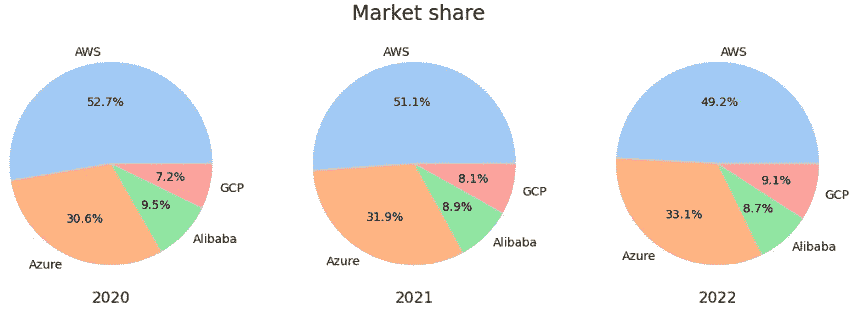

2020-2022 年云市场份额。*图片由作者提供，数据来自* [1]

云服务商年轻意味着什么？就 GCP 而言，这导致可获得的服务数量减少。AWS 和 Azure 提供 200 多种服务，而 GCP 只有 100 多种。例如，你现在在 GCP 找不到区块链开发、量子计算和图形数据库的专用服务。虽然如果你的业务是围绕这些技术建立的，这对 GCP 来说可能是一个破坏交易的缺点，但在更传统的情况下，这甚至可能是一个优势——你的团队不会迷失在无限的配置和服务列表中。

历史上，人们一直批评 GCP 的可用数据中心数量较少。的确，这是一件需要考虑的重要事情。AWS 和 Azure 的数据中心似乎离你或你的客户更近，而 GCP 的数据中心更远，这可能会增加延迟。幸运的是，这个缺点不再相关，因为谷歌开放了多个新的地区和区域，并不断增加新的。就区域和专区的数量而言，谷歌超过了 AWS——AWS 是这方面的前领导者。

作为云计算市场上相对年轻的竞争对手，GCP 也可以在价格上提供更好的交易。例如，GCP 提供了最便宜的虚拟机“E2-micro-preemptive ”,具有 2 个 vCPU 和 1 GB 内存。它的价格比 AWS 的“t4g.nano”低 48%，比 Azure 的“A0”低 5 倍**。如果你需要一个便宜的专用 PostgreSQL 服务器，GCP 也可以提供一个比竞争对手低 25%的价格[2]。总的来说，GCP 在低端水平上更便宜。更高性能的实例的成本通常与其他云提供商的同类产品大致相同。重要的是要知道 GCP 没有廉价的内存优化实例——只有 40 个 vCPUs 的高性能和极其昂贵的实例。**

## GCP 的个人经历

我真正喜欢 GCP 的是它的 web 界面和文档，它们以非常简洁和用户友好的方式实现。就个人而言，我认为这是直接影响您的团队实现解决方案所需时间的主要优势之一。

GCP 似乎比 Azure 更稳定，但仍不如 AWS 稳定。例如，我们在 App Engine 中遇到了一个恼人的 bug。从 App Engine 执行对第三方服务的每个请求至少需要 2 分钟，而在我的本地环境中最多需要 100 毫秒。我们需要做的就是从“标准”环境切换到“灵活”环境。有趣的是，Java 组件在“标准”环境下工作得很好，所以这个问题只与用于 Python 的 Google Cloud SDK 有关。

App Engine 又一次让我们大吃一惊。一天，我们查看了成本预测，发现 App Engine 产生的成本比我们的预期高出五倍。出于某种原因，五个应用引擎实例被分配给了一些过时的版本，这些版本在重新部署后仍保留在那里，尽管处于非活动状态，但它们仍在产生成本。

总之，廉价机器的较低价格、较少的配置选项和服务选择使 GCP 成为小公司的完美选择。有些人可能会考虑谷歌宣传的另一个优势，但这很难核实。他们宣称，谷歌云数据中心运行的能源是典型数据中心的一半，并且在可用的情况下 100%使用可再生能源[3]。

## **GCP 提示**

GCP 适合你，如果:

*   你是一家刚起步的公司。
*   你不可能投入太多时间去学习 AWS 和处理 Azure bugs。
*   您不需要太多来自云的灵活性和配置工具。
*   你已经准备好接受平台规定的方法。
*   您需要通用或计算优化的解决方案，但不需要内存优化的解决方案。

如果你决定选择 GCP，以下是我对开发者的建议:

*   不要使用 App Engine 标准环境——G 大哥希望你使用更灵活的环境，否则，他们会惩罚你。
*   定期检查成本分析，确保没有意外成本。
*   一定要清理掉多余的 App Engine 应用版本，防止 G 抢你。

# **2。AWS。当金钱不再重要**

目前，AWS 是云服务的市场领导者，拥有 49.2%的市场份额，尽管慢慢地将它的地位输给了 Azure 和 GCP [1]。自 2002 年成立以来，它也是我们三个竞争对手中历史最悠久的云服务提供商。老实说，除了运行简单的 EC2 实例，我从未与 AWS 深入合作过，但我们一直认为 AWS 是我们项目的替代云服务提供商。

AWS 作为大型企业项目的行业标准而闻名。出于这个原因，AWS 提供了最大的机器选择，包括具有 448 个 CPU、12 TB 内存和 100 千兆网络的高性能机器，每小时 132 美元。除了出租虚拟机，AWS 还提供 200 多种服务来满足不同的需求。AWS、Azure 和 GCP 之间特定服务的比较是另一篇文章的主题，但总体而言，AWS 的定价平均较高，尽管就最便宜的配置而言，AWS 的价格介于 GCP 和 Azure 之间[4]。

AWS 的一个明显优势是它的成熟。AWS 变化不大。在最流行的服务中你几乎找不到任何错误，文档是广泛的和写得很好的。它的高受欢迎程度意味着你有更大的机会找到熟悉 AWS 的新员工以及也使用 AWS 的客户。

AWS 的另一个优势是它的灵活性。事实上，就云配置而言，您可以满足任何项目需求，但是可能需要的配置数量自然会增加配置的复杂性和时间。如果你的团队没有 AWS 方面的专家，复杂性有时会让人不知所措。

## AWS 的个人体验

AWS 并没有带来什么惊喜，但是有两件事在我看来很不方便。第一个—如果您创建了一个标记策略，它仅在当前区域内可用。当我切换区域时，我必须重新创建策略，尽管可以选择将策略设为全局策略。

第二个不便之处也与标签政策有关。当我创建一个强制标签策略时，AWS 不允许我创建没有这些标签的 EC2 实例(这正是我想要的)，但是我仍然必须键入标签名称并在下拉列表中找到它们。我希望看到已经分配了空值的标签，并在实例创建之前提示填充值。似乎我需要在 AWS 组织工具下实现一个服务控制策略来支持这样的行为。我发现这个过程对于这样一个简单的任务来说相当复杂。

## **AWS 提示**

AWS 适合您，如果:

*   你很富有。
*   您的团队中有 AWS 专家。
*   你建立一个企业级的长期项目。
*   或者你只是想租一个便宜的虚拟机，其他的设施都不在乎。

如果你决定使用 AWS，以下是我对开发者的建议:

*   从一些外部资料中初步学习主要概念。我强烈推荐 Coursera 上的“AWS 基础专业化”——并不是 AWS 上的所有东西都凭直觉就能弄清楚。
*   花一些时间浏览文档并理解文档是如何组织的。

# **3。蔚蓝色。微软有时做得很好**

出于多种原因，我们的一些客户更喜欢微软 Azure 作为云服务提供商。我注意到它在德国特别受欢迎。其中一个原因可能是由于微软团队或微软 Outlook 的流行，它们在微软 365 账户下运营，并提供对包括 Azure 在内的所有其他微软工具和服务的访问。在市场上，Azure 介于 GCP 和 AWS 之间，市场份额为 33.1%，数据显示其受欢迎程度增长[1]。说到服务数量，Azure 也被认为是 AWS 和 GCP 之间的折中选择。除此之外，微软宣传 Azure 与其他微软产品的深度集成。

虽然 Azure 在价格上被认为是一个折中的解决方案，但在低端它超级贵。他们最便宜的通用虚拟机“A0”的价格是 GCP 同类产品的 5 倍，内存却更少。它也比 AWS 的模拟产品贵 3.5 倍。最便宜的 PostgreSQL 实例“B1MS”也比 GCP 和 AWS 的同类产品贵，尽管这里的差别不是很大[5]。对于更高性能的配置类型，Azure 服务器的成本与 AWS 相同或略低。还有一点需要考虑的是，Windows 机器在 Azure 上通常比在 AWS 或 GCP 上便宜。[6]

人们经常报告 Azure 文档的问题，包括不一致、错误和缺失部分。Python SDK 也是如此。你可能会说，这只是谣言，但这是我在 Azure 上的经历。

## Azure 的个人体验

Azure 在用户体验方面给我的印象最差。例如，当您选择数据库配置时，您认为“没有可用的配置，您的区域正在维护中”错误意味着什么？你能决定等一会儿维护结束吗？哈，你会永远等下去的！在 Azure 中，此错误意味着订阅设置中缺少相应的资源提供者注册。

如果你是 Azure 门户的开发者，你会首先向打开“成本分析”面板的用户展示什么？如果你的答案是“下个月的预计成本”，那么你就远远落后了。微软正在显示一个“错误请求”错误，其中有很多细节，让你有机会思考——你希望看到哪种类型的预测——做好道德准备，同时学习一些关于 Azure 内部的知识。

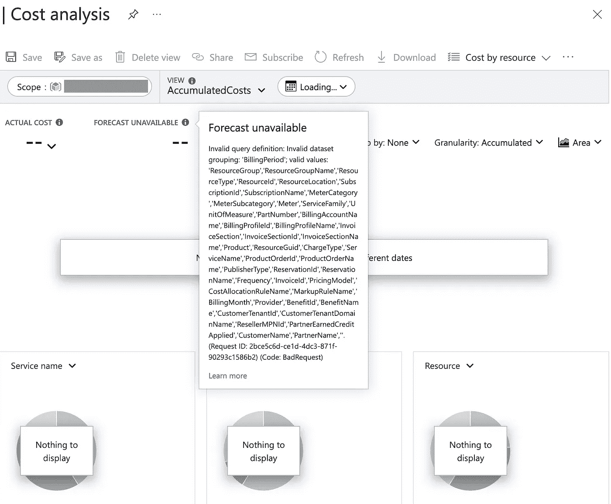

Azure 案例 2 演示，作者图片

你发现 Azure 机器学习了吗？这是一个非常好的平台！如果您正在创建实时端点，您知道您的源代码将被有意地交付给您的服务，并且您可以在您的评分函数中使用您的模块。这样很方便。该平台还允许您创建批处理端点。为什么你会期望你的源代码被交付呢？如果您是一个独特的人，在批处理过程中需要他们的模块，请考虑您自己独特的方式来交付代码！你是不是很绝望，想在 Azure 文档里找到答案？有一天我们都还年轻天真。啊是的，你甚至不能使用 Azure ML SDK for Python 部署批处理端点。要么创建一个发布的管道，要么使用 Azure CLI，要么使用 Azure ML Portal，因为方便的部署只是实时端点的特权。

你还可以使用 Azure 机器学习来惩罚初级开发人员或降低公司中受访者的薪资预期。例如，只需将 Flask 模块添加到 conda 依赖列表中，并要求他们部署此服务。他们会很高兴地调查一个非常有趣的错误。Azure 还保证他们不会在文档中找到任何提示。

Azure 机器学习是一个不错的平台。如果你经历了所有的不一致，那么它工作得很好。

## **3.2。Azure —提示**

在以下情况下，Microsoft Azure 适合您:

*   您使用 Microsoft Office 堆栈(Word、Teams、OneDrive、SharePoint 等。)和/或 C#编程语言。
*   你既不会选择最便宜的服务器，也不会选择最贵的——你需要中间的东西。
*   您需要内存优化的解决方案，而不是通用或计算优化的解决方案。
*   你读到了 Azure 当前的错误和不一致，但这并没有吓到你。

如果你决定使用微软 Azure，以下是我对开发者的建议:

*   如果因为 Azure 服务器处于维护状态超过几分钟而无法创建服务，请在“资源提供者”面板下检查您的权限和注册。
*   如果你在 Azure 门户上看到任何奇怪的错误——只需改变过滤器的值。
*   如果您使用 Azure 机器学习，并且您的评分函数无法定位您的源代码，请将代码作为模型交付，并将其显式添加到 init 函数中的 sys.path。
*   如果你使用 Azure 机器学习，不要使用批处理端点——看起来它们还没有准备好——只需使用常规发布的管道。事实上，“批处理端点”只是一个已发布管道的包装器。
*   不要在你的 Azure conda 环境规范中包含 flask。

# **画廊**

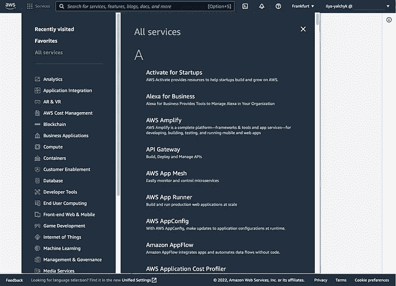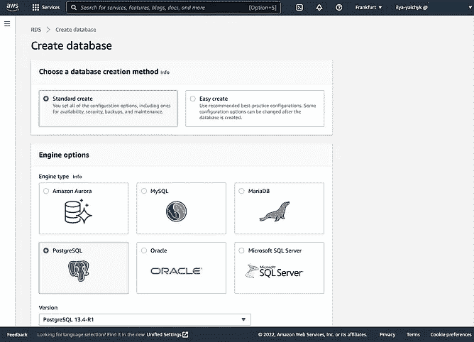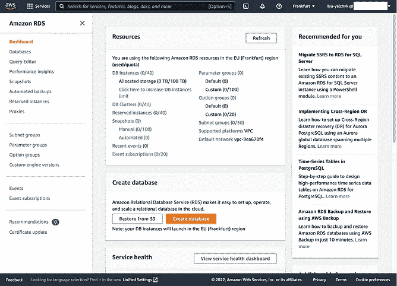

AWS，作者图片

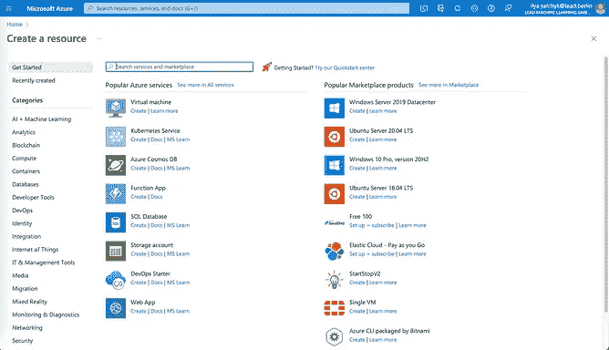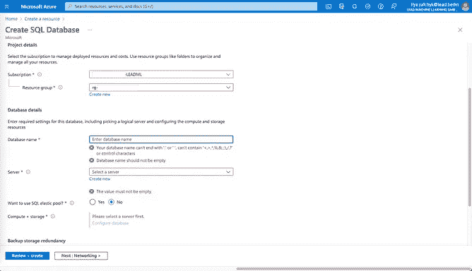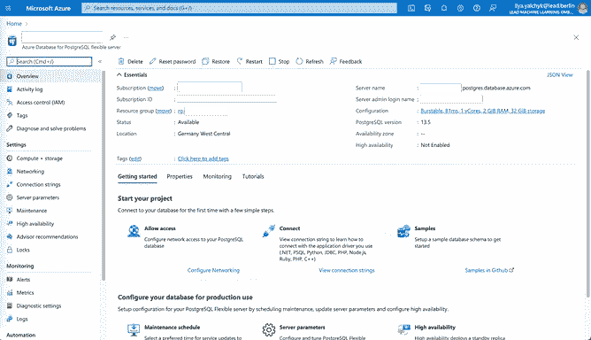

蔚蓝，作者图片

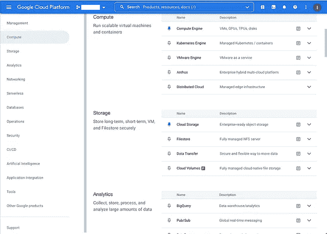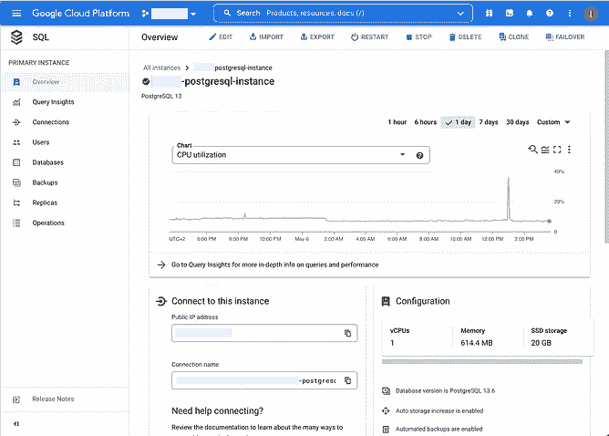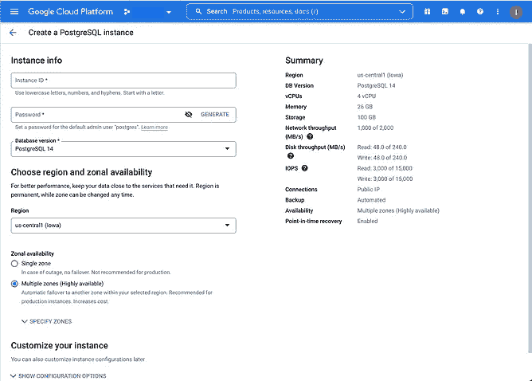

GCP，作者图片

# **结论**

我提到了可以帮助您选择正确的云服务的多种差异。同时，我必须承认，所有提到的公司都以大致相同的价格提供大致相同的服务。在这种情况下，我宁愿依赖我团队的专业知识，而不是某个云服务提供商的特定功能。从我的经验来看，开发人员花费的时间比你选择更好的云服务节省的时间要多。因此，如果我的团队由 Azure 专家组成，我会坚持使用 Azure，尽管有过不好的体验。

我很惊讶这些云服务提供商通过接管如此多的事情来简化工作。可悲的事实是，这种简化不仅要花费金钱，还要花费我们的时间来更深入地了解它们并应对所有即将到来的挑战。然而，我很高兴我的云之旅还在继续，我在云方面的专业知识也与日俱增。

# **参考文献**

[1]韦尔舍里，L. S. (2022 年 2 月 16 日)。超大规模云市场市场份额:2022 年。Statista。2022 年 5 月 6 日检索，来自[https://www . statista . com/statistics/1202770/hyperscaler-iaas-PAAs-market-share](https://www.statista.com/statistics/1202770/hyperscaler-iaas-paas-market-share)

[2]谷歌云定价计算器。(未注明)。谷歌云。2022 年 5 月 6 日检索，来自[https://cloud . Google . com/products/calculator/# id = 1 abd7a 80-bf53-4f 77-8006-db48d 924 dd9c](https://cloud.google.com/products/calculator/#id=1abd7a80-bf53-4f77-8006-db48d924dd9c)

【3】谷歌云平台的与众不同之处？(未注明)。谷歌云。[https://cloud . Google . com/free/docs/what-makes-Google-cloud-platform-different](https://cloud.google.com/free/docs/what-makes-google-cloud-platform-different)‌

[4]“AWS 定价计算器”，Calculator . AWS .[https://calculator.aws/#/estimate?id = 171 ef 16 e 56 c 643 CB 303 BD 94 f 950 af0 c 0343058 ad](https://calculator.aws/#/estimate?id=171ef16e56c643cb303bd94f950af0c0343058ad)(2022 年 5 月 6 日访问)。‌

[5]云计算服务|微软 Azure。(未注明)。Azure.microsoft.com。2022 年 5 月 6 日从[https://azure.com/e/749b0305ecd74af280c0ab84ad998d8e](https://azure.com/e/749b0305ecd74af280c0ab84ad998d8e)检索

[6]森蒂斯峰，P. (2021 年 8 月 26 日)。*终极云定价对比:2021 年 AWS vs Azure vs Google Cloud*。投 AI。[https://cast . ai/blog/ultimate-cloud-pricing-comparison-AWS-vs-azure-vs-Google-cloud-in-2021/](https://cast.ai/blog/ultimate-cloud-pricing-comparison-aws-vs-azure-vs-google-cloud-in-2021/)