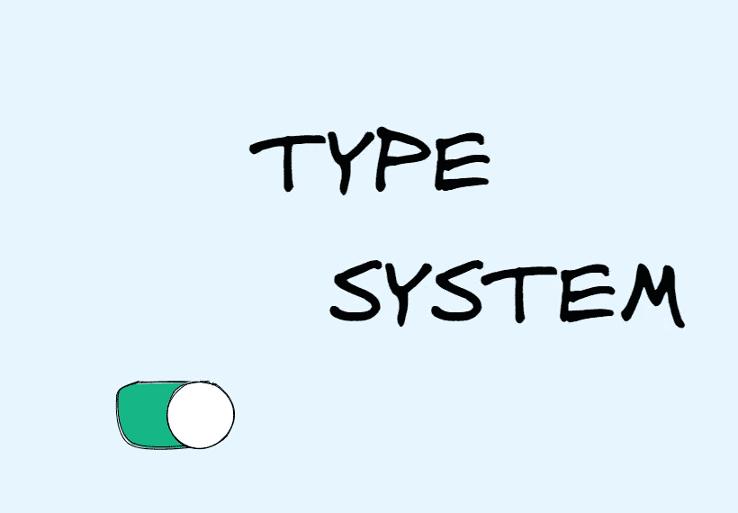
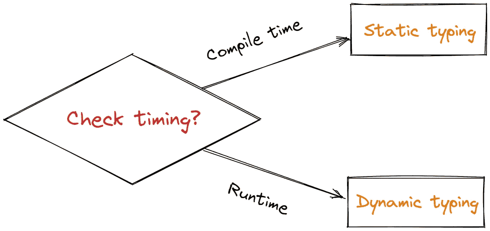
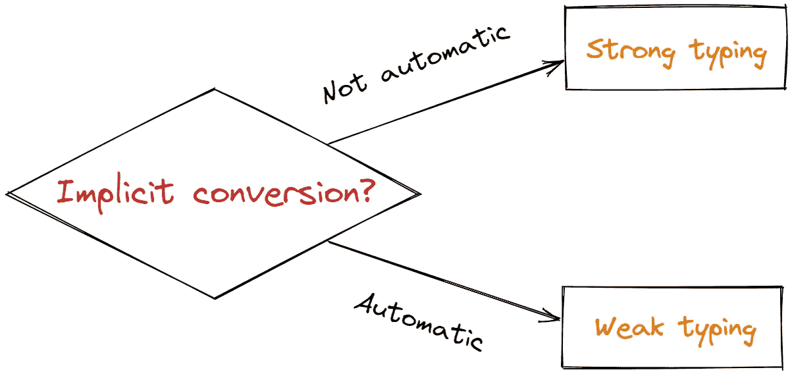
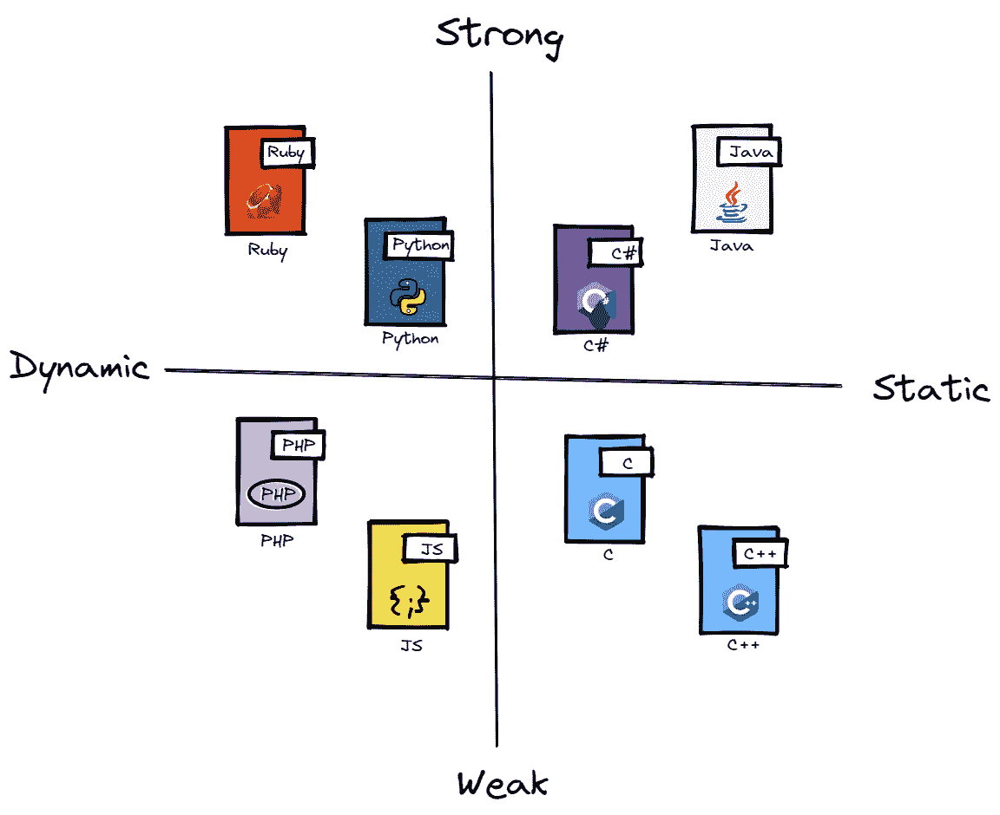

# 每个程序员都应该知道的类型系统

> 原文：<https://towardsdatascience.com/the-type-system-every-programmer-should-know-c3134a1b9bde>

## 这可能是你最不能错过的编程知识

作者图片

本文将介绍各种编程语言中不可忽视的那些部分——类型系统。

# 什么是类型系统？

在学习一门编程语言时，入门课程的前几节通常会介绍该语言的各种数据类型，它们与后续的编程开发密不可分。这足以说明类型对于一门编程语言的重要性。

编程语言中的类型分类广泛，可以分为以`int`和`float`为代表的内置类型，以及以`class`和`function`为代表的抽象类型。区分这些类型最显著的特征是，我们只能在特定类型上使用它的特定操作。

但是什么是类型系统呢？

它实际上是一个专注于管理类型的系统，**它是一个由一组规则组成的逻辑系统，这些规则将称为类型的属性分配给计算机程序的各种结构，如变量、表达式、函数或模块。**

# 类型系统能做什么？

1.  定义程序类型以确保程序的安全性。
2.  可以提高代码的可读性，提高代码的抽象层次，而不是低级低效的实现。
3.  有利于编译器优化。指定类型后，编译器可以将其与相应的字节对齐，从而生成高效的机器指令。

等等。

从以上几点可以看出，一个变量的类型可以决定一个具体的意义和用途，这对我们的编程是极为有利的。

# 程序中类型的本质是什么？

类型系统可以说是一个工具，我为什么这么说？

因为程序最终运行的是机器码。在机器代码的世界里，没有类型，那些指令只是处理即时数据或内存。

**所以类型本质上是内存的抽象，不同的类型对应不同的内存布局和内存分配策略。**

有关内存管理的更多信息，请查看我以前的文章:

  

# 静态与动态类型

我们经常听到这个问题，但是在类型检查发生的时候，两者的区别是**。**

静态类型系统在编译时确定所有变量的类型，并在不正确使用的情况下抛出异常。

动态类型系统在运行时确定变量类型，如果有错误就抛出异常，如果处理不当可能会使程序崩溃。

静态类型系统的早期类型错误报告保证了大型应用开发的安全性，而动态类型系统的缺点是编译时没有类型检查，程序不够安全。只有大量的单元测试才能保证代码的健壮性。但是使用动态类型系统的程序很容易编写，并且不需要花费很多时间来确保类型是正确的。

作者图片

# 强类型与弱类型

强类型和弱类型的区别没有权威的定义。早期关于强分型和弱分型的讨论，大多可以概括为静态分型和动态分型的区别。

但流行的说法是，强类型往往不容忍隐式类型转换，而弱类型往往容忍隐式类型转换。这样，强类型语言通常是类型安全的，也就是说，它只能以允许的方式访问它有权访问的内存。

作者图片

# 常见编程语言

我总结一个常见编程语言类型的分类图，注意拆分的四个区域都是分区，比如 PHP 和 JS 都是动态弱类型。

作者图片

*今天就到这里。我是 Zachary，我会继续输出与 web 开发相关的故事，如果你喜欢这样的故事并想支持我，请考虑成为* [*中级会员*](https://medium.com/@islizeqiang/membership) *。每月 5 美元，你可以无限制地访问媒体内容。如果你通过* [*我的链接*](https://medium.com/@islizeqiang/membership) *报名，我会得到一点佣金。*

你的支持对我来说非常重要——谢谢。