# 地理空间栅格数据入门指南

> 原文：<https://towardsdatascience.com/the-ultimate-beginners-guide-to-geospatial-raster-data-feb7673f6db0>

## 关于栅格文件、地理配准、元数据和栅格 Python 库，您需要了解的一切


丹尼尔·科鲁奇在 [Unsplash](https://unsplash.com?utm_source=medium&utm_medium=referral) 上的照片

大多数航空照片和卫星图像都是光栅文件。
这种格式常用来表示现实世界的现象。如果您正在处理地理数据，那么您很有可能必须处理它。

要在 Python 中使用地理栅格文件，需要不同的理论概念。在进入编程部分之前，我强烈建议您阅读介绍性部分。

## 目录

1.  简介:*第一概念。*
2.  应用:*栅格用在哪里？*
3.  色彩映射表:*离散和连续色彩映射表，用于可视化栅格。*
4.  地理参考: *CRS 和仿射变换。*
5.  栅格的元数据:*与栅格相关的所有数据。*
6.  Rasterio: *在 Python 中读取、保存、地理配准和可视化栅格文件。*

# 介绍

> 栅格由按行和列组织的像元(或像素)矩阵组成，其中每个像元包含一个表示信息的值

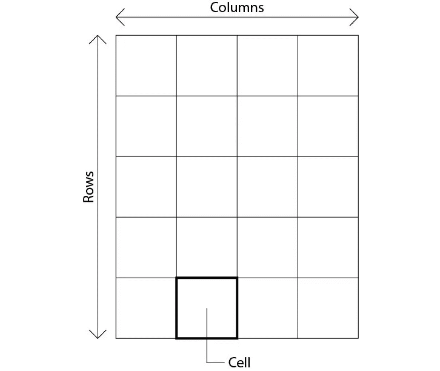

光栅结构。图片由作者提供。

地理栅格中的每个像素都与特定的地理位置相关联。这意味着如果栅格的分辨率为 1 *m/px* ，每个像素覆盖 1m 的区域。有关这方面的更多详细信息，请参见地理配准部分。

此外，

> 栅格包含一个或多个大小相同的图层，称为波段


三波段栅格。图片由作者提供。

任何类型的数值都可能存储在一个单元格中。根据上下文，单元格可能包含不同范围内的整数或浮点值。

jpg、png 和位图都是光栅文件，但是本指南不考虑它们，因为它们是非地理文件。地理栅格通常以 TIFF 格式保存。

# 应用程序


照片由 [NASA](https://unsplash.com/@nasa?utm_source=medium&utm_medium=referral) 在 [Unsplash](https://unsplash.com?utm_source=medium&utm_medium=referral) 上拍摄

由于栅格的应用方式多种多样，以下是最常见的应用:

*   卫星图像
*   专题地图
*   数字高程模型(DEM)

## 卫星图像

来自卫星的影像通常保存在多波段栅格中。电磁波谱被分成多个部分，可以被卫星探测到。并不是所有的都属于可见光谱，但通常有些是在红外波段，人眼是看不见的。

栅格文件非常适合这种类型的影像，因为卫星感测到的每个电磁波谱部分都可以存储在波段中。

Sentinel-2 是最受欢迎的卫星之一，它使用 13 个光谱带拍摄照片，一部分来自可见光谱，另一部分来自红外光谱。因此，每个输出文件都是一个包含 13 个波段的栅格(其中 3 个波段为红色、绿色和蓝色)。

以下是从 Sentinel-2 拍摄的照片(仅显示 RGB 波段):

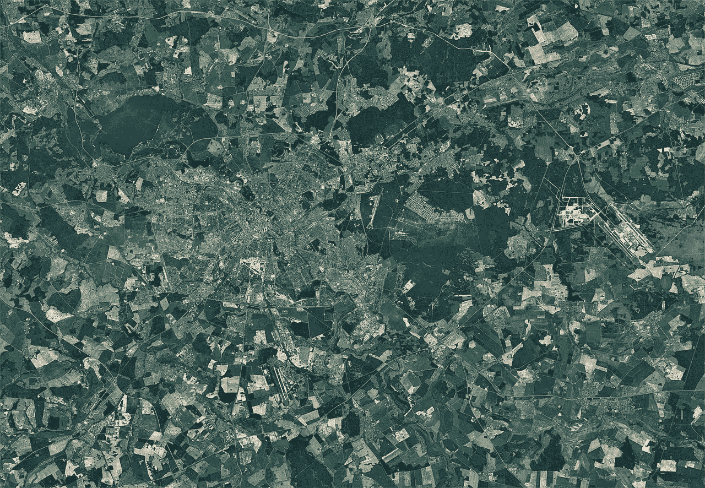

明斯克市(白俄罗斯)，哨兵-2 卫星图像。[包含修改后的哥白尼哨兵数据 2019](https://commons.wikimedia.org/wiki/File:Minsk_city_(Belarus),_Sentinel-2_satellite_image,_2019-05-19.jpg) ， [CC BY-SA 3.0 IGO](https://creativecommons.org/licenses/by-sa/3.0/igo/deed.en) ，via Wikimedia Commons。

## 专题地图

专题地图用于对地理区域进行分类。每个区域都与共享某些特征的特定类别相关联。例如，我们可以根据种植园的类型对农业区进行分类。栅格非常适合此任务，因为每个像元都可以存储表示像素关联区域所属类的整数值。

以下是意大利伦巴第大区的专题地图示例。根据类别，每个像素存储 0 到 6 之间的值:

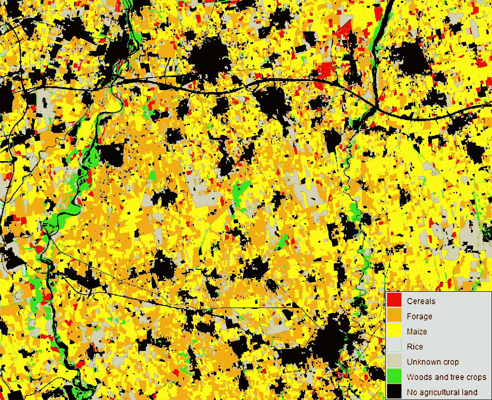

伦巴第(意大利)，专题地图。图像来自 [Sentinel-2 图像时间序列，用于作物制图](https://www.kaggle.com/datasets/ignazio/sentinel2-crop-mapping)。

## 数字高程模型(DEM)

数字高程模型用于表示地表起伏。DEM 是一种栅格，其像素包含浮点值:表面的高程值。

这里显示的是火星表面区域的 DEM:

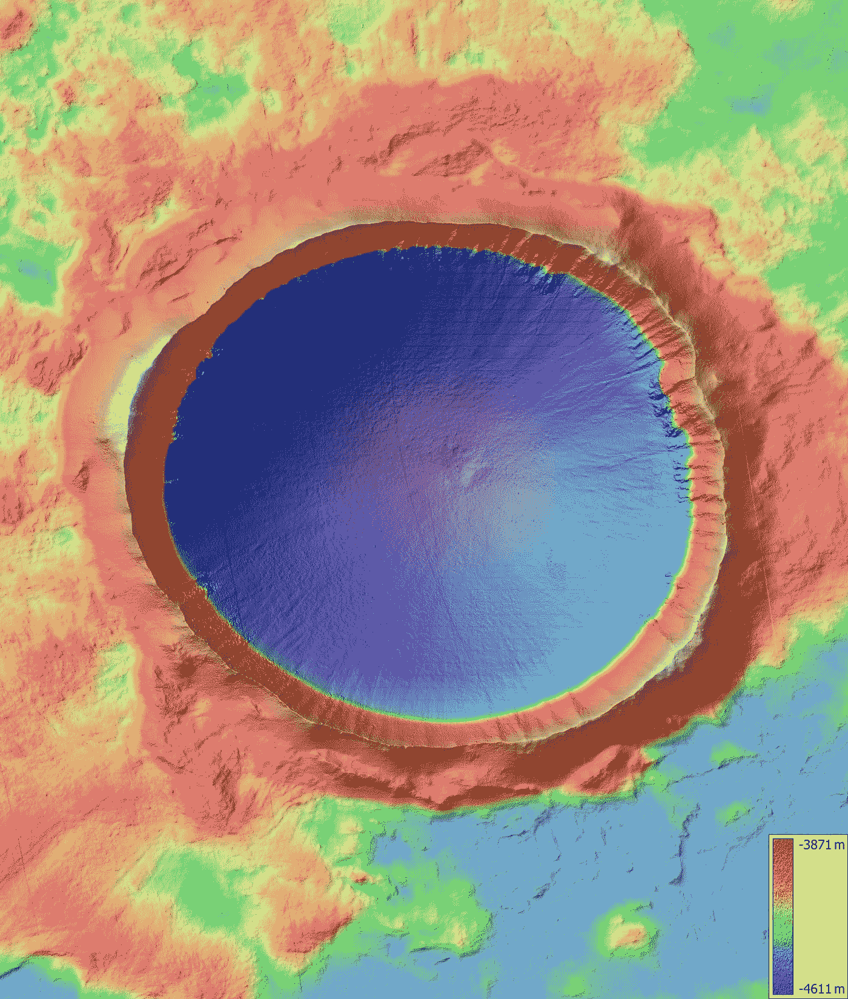

火星表面的一个陨石坑。图片来自 [UAHiRISE](https://www.uahirise.org/dtm/ESP_019147_2395) (已编辑)。

为了使第一个文件可视化，只显示了可见的波段，但是第二个和第三个文件不能直接可视化，因为保存在每个单元格中的值不是一种颜色，而是一条信息。

在下一节中，将重点介绍可视化这种栅格文件所需的解决方法。

# 彩色地图

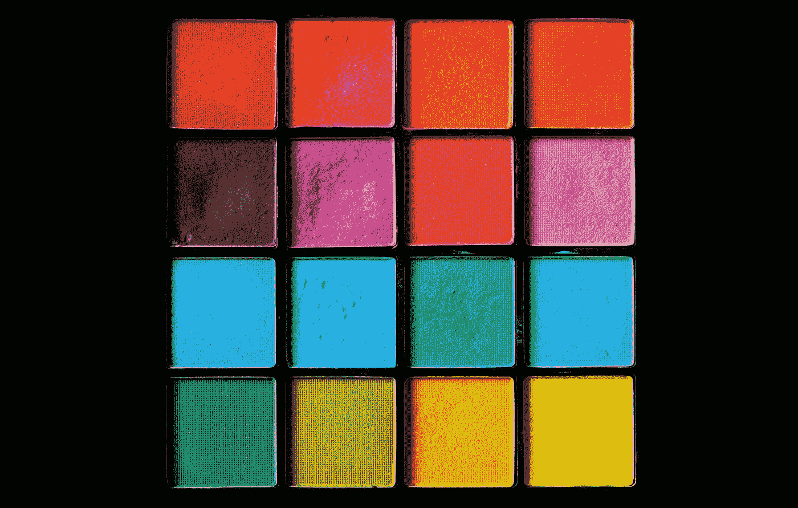

亚历山大·格雷在 [Unsplash](https://unsplash.com?utm_source=medium&utm_medium=referral) 上拍摄的照片

由于栅格对可存储的数值类型和范围没有限制，因此并不总是能够直观地显示它们。例如，我上面显示的最后一幅图像是两个单波段光栅:在前者中，每个像素是一个介于 0 和 6 之间的整数，而在后者中，是一个介于 *-4611* 和- *3871* 之间的浮点数。他们的信息不代表一种颜色*。*

为了直观显示这些类型的栅格，我们使用色彩映射表，即

> 将单元格值映射到颜色的函数

因此，当通过色彩映射表可视化栅格时，其值将被颜色替换。

彩色地图主要有两种类型:**连续**和**非连续**。

## 非连续彩色地图

它们是通过使用*值-颜色*对定义分段函数来实现的。

在专题地图示例中，我定义了 7 个值-颜色对:<0, black>、<1, red>、<3, orange>、<4, yellow>、<5, blue>、<6, gray>、<2, green>。

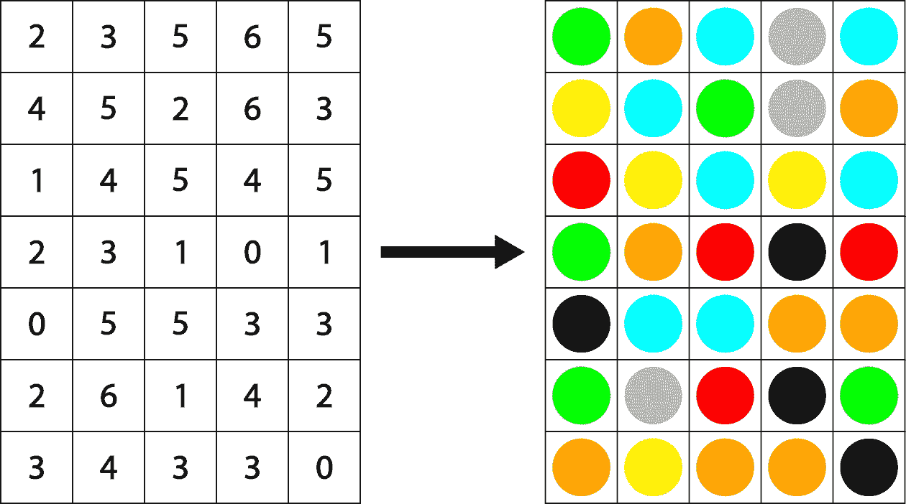

不连续的色彩映射表。图片由作者提供。

当栅格包含一小组值时，通常使用这种方法。

## 连续彩色地图

它们是通过使用连续函数将栅格值的间隔与颜色的间隔相关联而得到的。

通常，在应用此类色彩映射表之前，会使用以下公式在范围[0，1]内缩放所有栅格值:

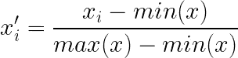

最小-最大比例公式。使用[编码生成的图像](https://www.codecogs.com/latex/eqneditor.php)。

在灰度色图中，使用线性函数将[0，1]范围内的值与[0，255]范围内的灰度值相关联:

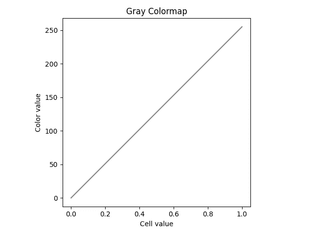

灰度色图。图片由作者提供。

彩条以适当的方式显示结果:

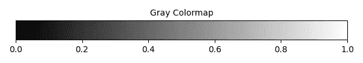

灰度色图。图片由作者提供。

在这种情况下，0 值用黑色表示，1 值用白色表示，它们之间的所有值用不同形状的灰色表示。

为了更好地可视化栅格，我们还可以定义一个 RGB 色彩映射表，其中每个栅格值都与一个红色、绿色和蓝色值相关联。

以下是文献中称为 Turbo 的流行色彩映射表:

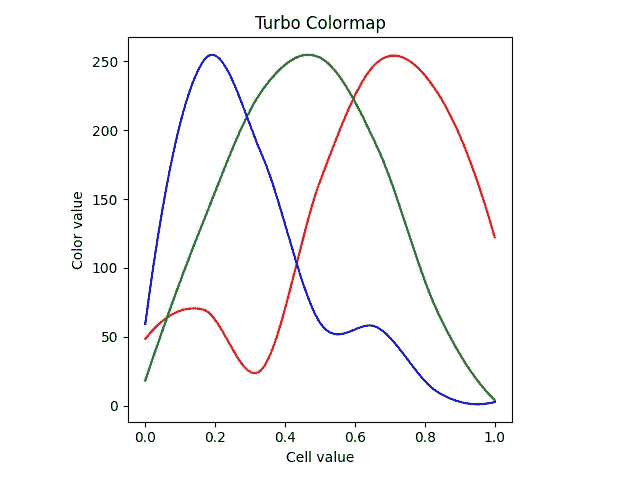

Turbo 色彩映射表。图片由作者和查表从[这里](https://gist.github.com/mikhailov-work/ee72ba4191942acecc03fe6da94fc73f)。

该色图以蓝色阴影开始表示最低值，以红色阴影结束表示最高值:

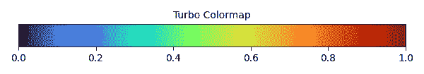

Turbo 色彩映射表。图片由作者提供。

在 DEM 示例中，我使用这种颜色图将高程信息转换成颜色。这是将一系列值映射到颜色时使用的颜色映射表(而不是像非连续颜色映射表中的小集合)。

# 地理参考


由 [Unsplash](https://unsplash.com?utm_source=medium&utm_medium=referral) 上的 [GeoJango Maps](https://unsplash.com/@geojango_maps?utm_source=medium&utm_medium=referral) 拍摄

地理栅格中的每个像元覆盖一个特定的地理区域，其坐标(由行和列表示)可以转换为现实世界的地理坐标。翻译过程使用两个组件:T4 坐标参考系统(CRS)T5 和仿射变换 T7。

在继续之前，重要的是要知道地球的形状是通过一个几何图形来近似的，称为**旋转椭球**或**椭球**。由于这个数字是一个近似值，多年来已经使用不同大小的轴定义了多个球状体。

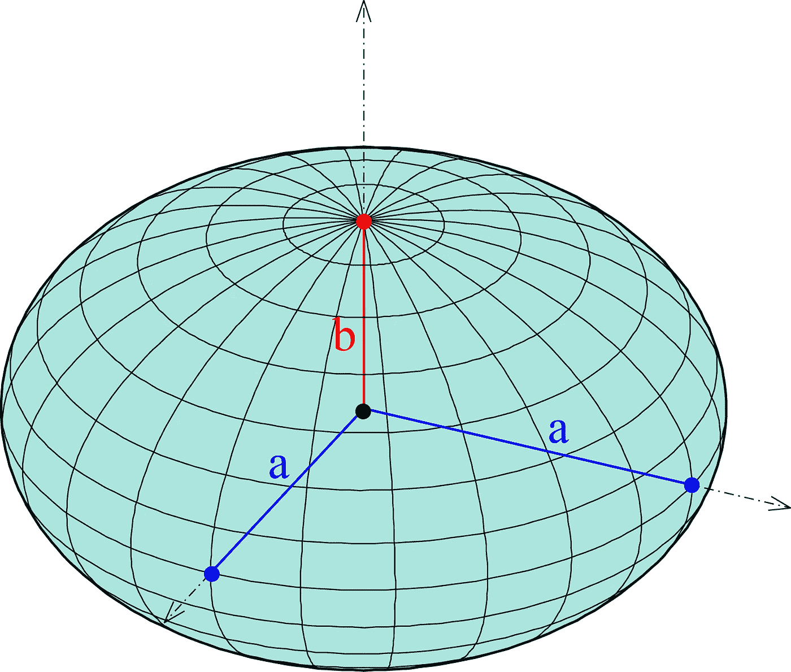

球体。 [Ag2gaeh](https://commons.wikimedia.org/wiki/File:Ellipsoide.svg) ， [CC BY-SA 4.0](https://creativecommons.org/licenses/by-sa/4.0) ，via Wikimedia Commons(已编辑)。

## 坐标参考系统

> CRS 是一种用于精确测量地球表面坐标位置的框架

每个 CRS 都基于特定的椭球体，因此，如果两个 CRS 使用不同的椭球体，则相同的坐标表示两个不同的位置。

CRS 可以分为:

*   **地理坐标系，**利用角度单位(度)。角距离从定义的原点开始测量。
*   **基于地理坐标系的投影坐标系**。它使用空间投影来投影椭球体，空间投影是一组用于将 3D 数据展平到 2D 平面上的数学计算。它使用线性单位(英尺、米等)。)来测量该位置距离平面原点的距离(在两个轴上)。

最流行的地理坐标系之一是 **WGS84** 、**T3【也称 [EPSG:4326](https://epsg.io/4326) 。它基于一个椭球体，其半短轴(称为赤道半径)等于 6378137 米，半长轴(称为极地半径)等于 6356752 米。WGS84 使用**纬度**来找出一个地方距离赤道多远，使用**经度**来找出一个地方距离本初子午线多远。两者都以度为单位。**

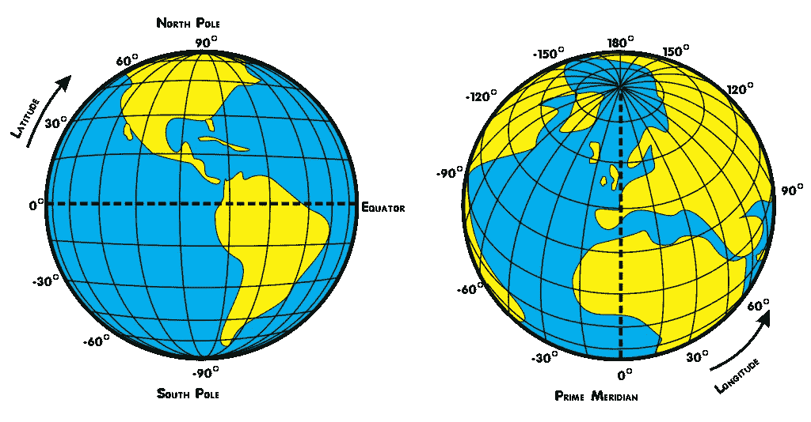

地球的纬度和经度。Djexplo ，CC0，通过维基共享。

例如*40° 43 ' 50.1960 ' ' N，73° 56 ' 6.8712 ' ' W*是使用经纬度的纽约市位置。

而最流行的投影坐标系之一是 **UTM** / **WGS84** ，也称为 [EPSG:32632](https://epsg.io/32632) 。它将 WGS84 球体投影到一个平面上，然后使用(x，y)以米为单位定义坐标。

栅格文件中使用的 CRS 取决于多种因素，例如数据的采集时间、数据的地理范围和数据的用途。请记住，您可以将 CRS 的坐标转换为另一个坐标。也有用于地球外表面地理参考的 CRS，如月球和火星。

## 仿射变换

地理配准栅格使用仿射变换从影像坐标映射到真实坐标(采用 CRS 定义的格式)。

> 仿射变换用于将像素位置映射到所选的 CRS 坐标中

仿射变换是保持共线性(如果三个或三个以上的点都位于同一条直线上，则称它们共线)和直线上各点之间的距离比的任何变换。

这些都是仿射变换:

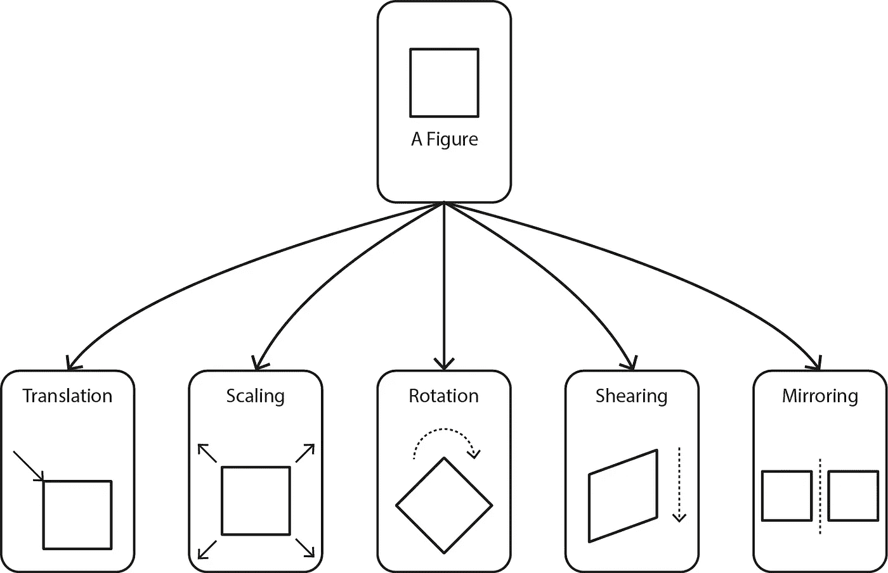

仿射变换。图片由作者提供。

在地理配准中，大多数情况下，只需要进行缩放和平移变换。将它们与正确的系数一起应用，可以将栅格像元坐标转换为真实坐标。读取地理栅格时，这些系数已经在元数据中定义。

用于转换的关系是:

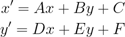

光栅坐标和 CRS 坐标之间的关系。使用[编码](https://www.codecogs.com/latex/eqneditor.php)生成的图像。

如果 **scale_x** 和 **scale_y** 是 CRS 单位(度、米、英尺等)中的 **pixel_width** 和 **pixel_height** 。)， **r** 是图像在现实世界中的**旋转**， **x_origin** 和 **y_origin** 是光栅左上角像素的**坐标**，参数为:

*   a = scale _ x cos(r)
*   b = scale _ y sin(r)
*   c = x _ origin∙cos(r)+y _ origin∙sin(r)
*   d = scale _ x sin(r)
*   e = scale _ y cos(r)
*   f = x _ origin∙sin(r)+y _ origin∙cos(r)

请记住，根据所使用的 CRS，scale_x、scale_y、x_origin 和 y_origin 中的一个或多个可以是负值。

由于大多数图像都是**朝北**，因此 **r = 0** ，参数可以简化为:

*   A =标度 x
*   B = 0
*   C = x _ 原点
*   E =比例 y
*   D = 0
*   F = y _ 原点

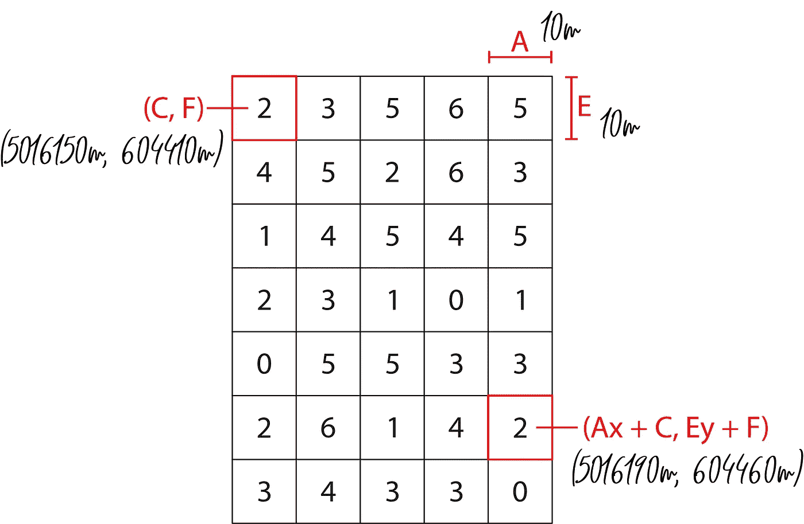

地理参考示例。图片由作者提供。

a 和 E 定义缩放比例，而 C 和 F 定义从原点的平移。

# [计]元数据

每个地理栅格都有关联的元数据。以下是最重要的字段:

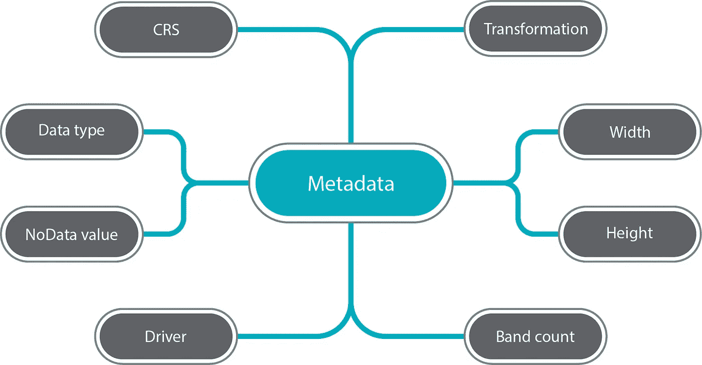

元数据字段。图片由作者提供。

## 深部热疗

此字段存储坐标参考系统的信息，例如名称、测量单位、椭球体轴和原点坐标。

## 转变

它存储用于将光栅像素坐标映射到 CRS 坐标的系数 A、B、C、D、E、F。

## 数据类型

通常被称为*数据类型*。它定义了存储在栅格中的数据类型，如 Float32、Float64、Int32 等。

## NoData 值

栅格的每个像元都必须包含一个值，并且栅格不支持空值。如果生成栅格的源无法为某些像元提供值，则使用 nodata 值填充这些像元。如果 nodata 值设置为 0，这意味着当读取 0 时，它不是一个要考虑的值，因为它表明源不能提供正确的值。通常，栅格数据类型为 Float32，将 nodata 值设置为**≈**-3.4028235 10 ⁸.

## 宽度、高度和带数

它们分别是每个波段的宽度、每个波段的高度和栅格的波段数。

## 驾驶员

驱动程序为光栅文件提供了更多功能。大多数情况下，地理栅格使用 GTiff 驱动程序，该驱动程序允许将地理配准信息集成到文件中。

# 拉斯特里奥

第一个用于访问地理栅格文件的库是[地理空间数据抽象库，GDAL](http://GT(1) × GT(5)  = 10m × 10m) 。它最初是用 C 开发的，后来扩展到 Python。这样，Python 版本只提供了对 C 版本的少量抽象。基于 GDAL 的 Rasterio 试图通过提供一个更简单、更高级的接口来解决这个问题。

要从 PyPI 安装最新版本的 Rasterio，请使用:

```
pip install rasterio
```

这些是必需的导入:

```
import rasterio
from rasterio.crs import CRS
from rasterio.enums import Resampling
from matplotlib import pyplot as plt
from mpl_toolkits.axes_grid1 import make_axes_locatable
import numpy as np
from pprint import pprint
```

## 读取栅格

要打开光栅文件，请使用:

```
raster = rasterio.open('raster.tiff')
```

要打印波段数，请使用:

```
print(raster.count)
```

要将所有栅格作为 NumPy 数组读取，请使用:

```
raster_array = raster.read()  # shape = (n_bands x H x W)
```

或者，要仅读取特定波段，请使用:

```
first_band = raster.read(1)  # shape = (H x W)
```

请记住，波段索引从 1 开始。

要读取与栅格相关联的所有元数据，请使用:

```
metadata = dataset.meta
pprint(metadata)
```

输出:

```
{'count': 1,
 'crs': CRS.from_epsg(32632),
 'driver': 'GTiff',
 'dtype': 'uint8',
 'height': 2496,
 'nodata': 255.0,
 'transform': Affine(10.0, 0.0, 604410.0,
       0.0, -10.0, 5016150.0),
 'width': 3072}
```

读取栅格时，可能没有数据值，建议用 NaN 值替换它们。为此，请使用:

```
first_band[first_band == metadata['nodata']] = np.nan
```

要按给定因子调整栅格的大小，首先定义输出形状:

```
out_shape = (raster.count, int(raster.height * 1.5), int(raster.width * 1.5))
```

然后使用:

```
scaled_raster = raster.read(out_shape=out_shape,
                resampling=Resampling.bilinear)
```

*请记住，缩放栅格后，仿射变换的 A 和 F 系数必须更改为新的像素分辨率，否则，地理配准将给出错误的坐标。*

## 形象化

要使用色彩映射表和色彩条显示栅格波段，请使用:

```
fig, ax = plt.subplots()
im = ax.imshow(raster.read(1), cmap='viridis')
divider = make_axes_locatable(ax)
cax = divider.append_axes('right', size='5%', pad=0.10)
fig.colorbar(im, cax=cax, orientation='vertical')
plt.savefig('cmap_viz')
```

输出:

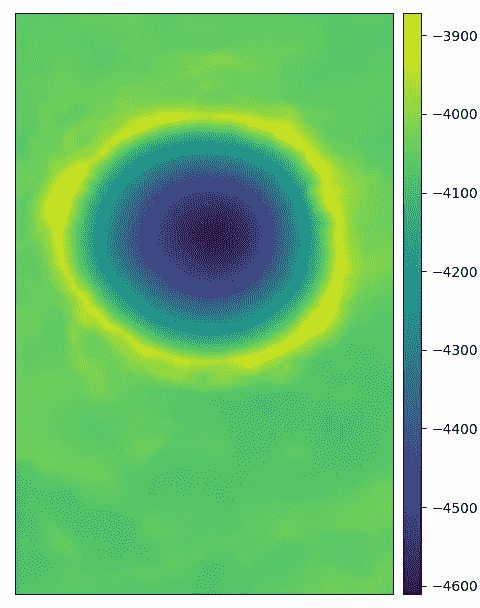

光栅可视化示例。图片由作者提供。

对于多波段卫星栅格，要显示前 3 个可见波段，请使用:

```
rgb_bands = raster.read()[:3]  # shape = (3, H, W)
plt.imshow(rgb_bands)
```

通常，卫星影像在前三个波段存储 RGB。如果不是这种情况，则必须根据波段的顺序来改变索引。

## 地理参考

*通过以下方法获得的坐标将被返回，并且必须使用当前的 CRS 单位提供。*

要查找像素(I，j)的实际坐标，其中 I 是行，j 是列，请使用:

```
x, y = raster.xy(i, j)
```

做相反的用法:

```
i, j = raster.index(x, y)
```

要显示数据的界限:

```
print(raster.bounds)
```

输出:

```
BoundingBox(left=604410.0, bottom=4991190.0, right=635130.0, top=5016150.0)
```

本例中的栅格是使用 ESPG:32632 作为 CRS 进行地理配准的，因此输出坐标以米为单位。

## 保存栅格

步骤 1 —找到所需 CRS 的 [EPSG](https://epsg.io/) 代码，然后检索其信息:

```
crs = CRS.from_epsg(32632)
```

在此示例中，使用了 EPSG:32632，这在本指南的第四部分中有所提及。

步骤 2-定义仿射变换:

```
transformation = Affine(10.0, 0.0, 604410.0, 0.0, -10.0, 5016150.0)
```

系数 A、B、C、D、E、F 的用途已在本指南的第四部分进行了解释。

步骤 3-保存栅格:

```
# a NumPy array representing a 13-band raster
array = np.random.rand(13,3000,2000)
with rasterio.open(
    'output.tiff',
    'w',
    driver='GTiff',
    count=array.shape[0],  # number of bands
    height=array.shape[1],
    width=array.shape[2],
    dtype=array.dtype,
    crs=crs,
    transform=transform
) as dst:
    dst.write(array)
```

如果不需要地理参考，设置`crs = None`和`transform = None`。

write 方法还有另一种语法:

```
dst.write(array_1, 1)
# ...
dst.write(array_13, 13)
```

但是在大多数情况下，编写一个单独的 3d 数组更容易。

# 结论

本指南展示了在栅格(由一个或多个相同大小的矩阵组成的集合，称为波段)中，每个像元包含一条信息。这些信息根据任务而变化，例如卫星图像、专题地图和数字高程模型。此外，根据应用程序的不同，您可能需要色彩映射表来将其可视化。此外，您发现使用坐标参考系统和仿射变换，可以将每个细胞位置映射到真实世界的坐标。最后，您会看到 Rasterio 使读取、写入、可视化和地理参考操作变得非常容易。如果您需要一个程序来打开栅格， [QGIS](https://www.qgis.org/) 和 [ArcGIS](https://www.esri.com/en-us/arcgis/products/arcgis-desktop/overview) 是不错的选择。

## **附加资源**

*   [坐标参考系统](https://docs.qgis.org/3.22/en/docs/gentle_gis_introduction/coordinate_reference_systems.html)
*   [地图投影](https://desktop.arcgis.com/en/arcmap/10.3/guide-books/map-projections/what-are-map-projections.htm)
*   [仿射变换库](https://github.com/rasterio/affine)
*   [Rasterio 官方文件](https://rasterio.readthedocs.io/en/latest/index.html)

感谢阅读，我希望你发现这是有用的。