# 摄影测量三维重建终极指南

> 原文：<https://towardsdatascience.com/the-ultimate-guide-to-3d-reconstruction-with-photogrammetry-56155516ddc4>

## 三维重建

## 使用 3D 摄影测量、现实捕捉、网格空间和 Blender 的完整动手 3D 重建教程。

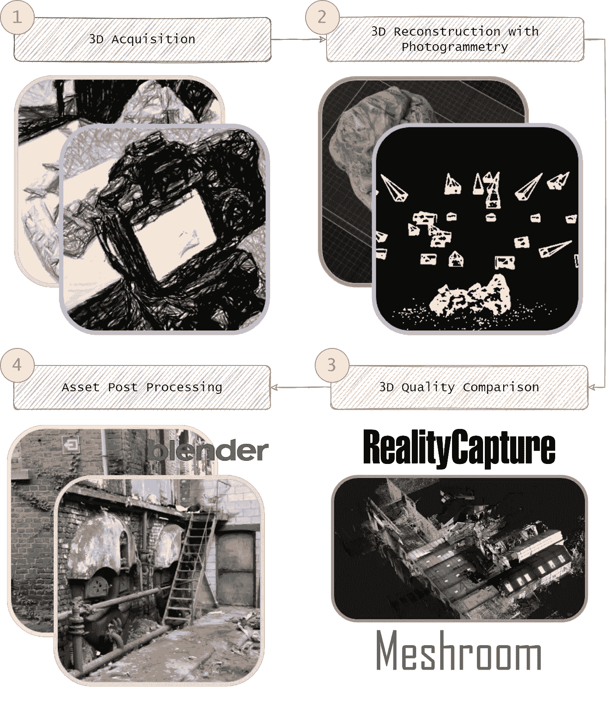

如何通过简单的工作流程将 3D 图像转化为 3D 资产。弗洛伦特·普克斯

我们生活的时代是超级令人兴奋的，如果你对 3D 感兴趣，那就更令人兴奋了。我们有能力使用任何相机，从感兴趣的对象捕捉一些图像数据，并在眨眼之间将它们转化为 3D 资产！这种通过简单的数据采集阶段实现的 3D 重建过程对于许多行业来说都是一个改变游戏规则的过程。你喜欢电子游戏吗？很好！电影？甚至更好！映射？没错！机器人技术？医学？3D 打印？我会就此打住；你抓住了重点。我会开始腐蚀你，让你追求无限的 3D 力量！

随着新的尖端 3D 重建方法的兴起，如神经辐射场(又名 [NeRF](https://dl.acm.org/doi/abs/10.1145/3503250) )，回到某种程度上“基础”而不是“基本”是必不可少的，这应该有助于减轻宣传(除其他外😄).

从图像进行三维重建是一个广泛研究的领域，有一个超级激动人心的故事，它通过三个研究“振动”得到了历史性的解决:具有立体视觉和运动结构的计算机视觉(SFM)，具有各种同步定位和绘图(SLAM)迭代的机器人技术，以及具有摄影测量视角的地理信息学。这些术语主要针对传感器相对于其周围环境的同步定位(位置和方向),同时构建这些周围环境的 3D 地图。

今天，我们对 metric 方法感兴趣，它可以建立在一组非结构化的重叠图像上，并将它们转化为 3D 对象。还有什么比我们自己做更好的理解方式呢？

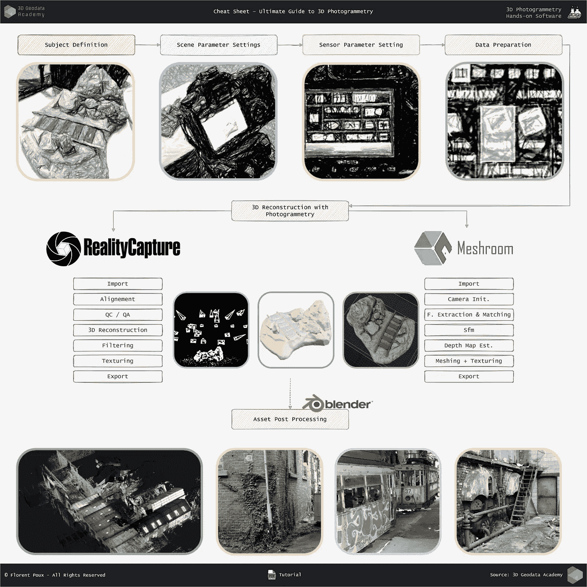

本指南详细介绍了 3D 摄影测量工作流程。它包括现实捕捉，网络空间和搅拌机软件的直接使用。F. Poux

让我们开始吧！

```
Introduction

1\. The Small Scale Object (The Hands-on basics)
  Step 1\. Data Acquisition
  Step 2\. Data Processing
    Option A. Reality Capture
    Option B. Meshroom

2\. The Large Scale Project (Advanced Photogrammetry)
  Step 1\. 3D Data Acquisition
  Step 2\. 3D Data Processing
    Option A. Reality Capture
    Option B. Meshroom

Conclusion
```

# 介绍

在这本终极 3D 重建指南中，我们将详细探索**的两个摄影测量项目**，并解释导致最终美丽结果的所有步骤。我们将研究一个小规模项目(通过摄影测量重建一个简单的对象)和一个大规模项目(使用地面激光扫描仪和摄影测量重建一个废弃的羊毛工厂)。

对于每个项目，我们将经历**采集**设置和**处理**步骤，展示带有付费选项(现实捕捉)和开源软件(网络空间)的工作流程。

为了便于复制，我有意给出了最大限度的细节和插图。因此，这种语气比通常的要浓一点，但是希望，当你日常活动中的事情变得模糊时，它可以作为一个精确的配方😁。

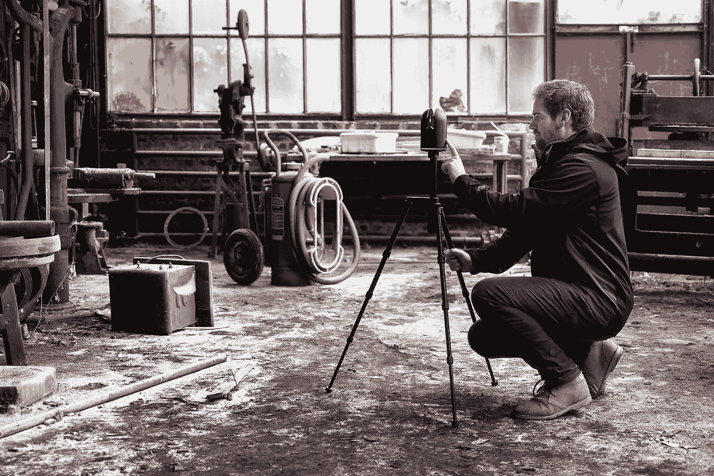

我正在 3D 扫描羊毛工厂。然后，产生的点云充当主干来注册各种图像视角。图片由 R. Robroek 提供

如果你有时间的话，现在就按照这个过程，准备好创建感兴趣的物体和场景的数字复制品。

# 小尺度物体

让我们首先研究一个简单的项目，你可以在家里用一台基本的相机和一台电脑轻松复制。这个项目旨在获得一个简单物体的三维重建(更准确地说，是一个迷你矿井装饰)。物体的大小大致为 15*10*10 厘米。这个物体是灰色和棕色的，表面粗糙。

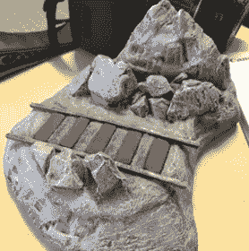

*要重建的对象。*

## 第一步。数据采集

正如承诺的那样，**必需的装备**很容易得到。只需要一个摄像头(你的智能手机可以工作)，如果需要更多的稳定性和控制，可以使用三脚架，但没有它也有可能工作。使用的相机是佳能 EOS 50D，配有佳能超声波镜头。照片以 JPG 格式保存，尺寸为 4752*3168 像素。在开始采集之前，我们拍几张照片来确定应该使用什么设置。在我们的实验中，我们将**相机参数**设置如下:

*   焦距:28 mm 的固定焦距，在到主体的距离和可工作区域之间给出了良好的平衡；
*   ISO: 400，这是一个很好的开始值，但是如果你的场景看起来太暗，你可以把这个值提高到 1600(风险自负😁);
*   光圈开口:F/3.5，允许以有限的景深为代价获得足够的光线。在我们的例子中，由于我们只关注一个微小的物体，我们在这里很好。
*   快门速度:125 毫秒(1/8 秒)，由于更稳定，我们的三脚架允许这一速度。没有三脚架，1/200s 以下超级棘手；
*   白平衡:4000 K。这适应我们场景的环境照明。

上述参数在整个采集过程中保持不变。

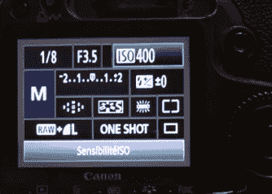

*相机设置。*

**收购战略**本身很简单。我们将相机放在三脚架上，调整高度和角度，使物体完全适合视野。在这种情况下，由于物体相对较低，我们可以给相机一个向下的角度，这样我们也可以拍摄顶部。我们使用自动对焦来确保照片不会模糊，然后切换到**手动模式**。

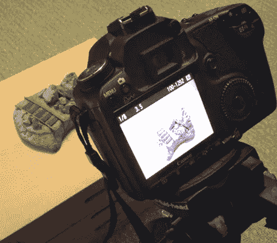

*采集设置。*

然后，我们沿着围绕物体的圆形轨迹移动三脚架。我们需要与物体保持恒定的距离，这样焦点才能保持正确。我们边走边检查照片。一旦我们完成了物体周围的第一圈，我们就缩小三脚架的腿，降低相机向下的角度。我们调整焦距，然后再次切换到手动模式。我们在主题周围多拍几张照片。

最后，我们将相机从三脚架上取下，拍摄完整物体的垂直照片。为此，我们再次调整焦点。然后，我们拍摄详细的照片，以确保物体所有部分的纹理都完好无损。这个想法基本上是拍摄足够多的照片，以允许完整和详细的重建，同时记住不必要的大量输入只会减慢和复杂化这个过程。理想情况下，对于这样一个物体，你有 25 张图片(8 个水平位置乘以三层高度，再加上最上面的一张)。

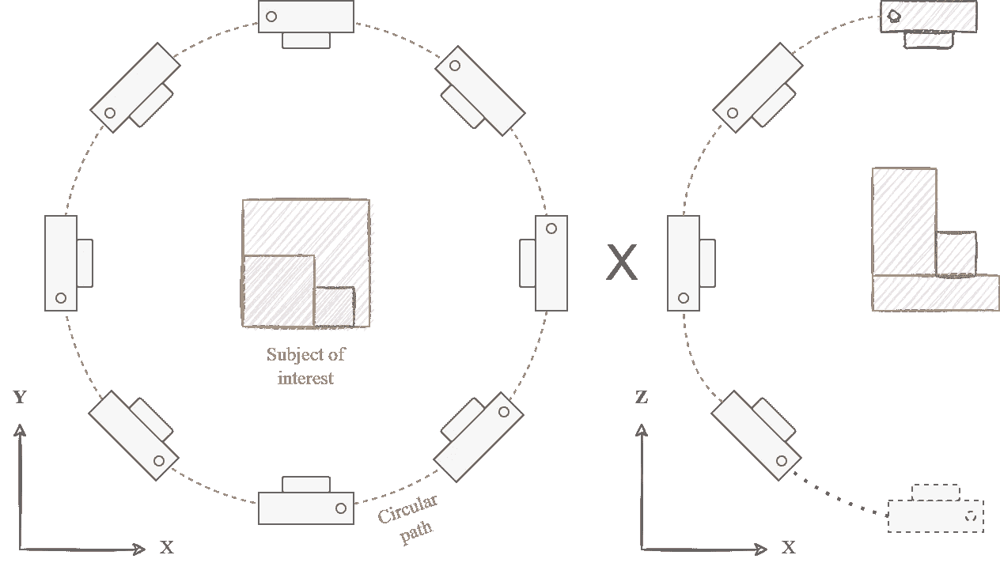

单一物体摄影测量的 3D 采集设置图。F. Poux

现在，我们可以把照片复制到电脑上，然后开始处理！👌

## 第二步。摄影测量处理

首先对照片进行分类，剔除那些只会干扰后续步骤的劣质图像(模糊、不在画面内、曝光错误)。从 50 张照片中，我们剔除了两张稍微失焦的照片。为了进行处理，我不得不找一台旧的笔记本电脑，配备相当标准的组件来证明可复制性😁:笔记本电脑是宏碁 Aspire，Windows 10 64 位；英特尔酷睿 i5 第七代处理器；12 Gb 内存，和一个 NVIDIA GeForce 940 MX GPU。相对于下一个将要评审的项目，并且考虑到输入的数量较少，使用高性能的计算机比可选的多！

现在，所有的测试平台都清楚了，让我们通过一个带有现实捕捉和网格空间的工作流程来深入了解 3D 摄影测量处理细节。

## 选项 A:现实捕捉。

现实捕捉的选择非常简单:你可以免费做任何事情…只要不输出任何东西。所以，没有什么比展示最先进的专业软件更好的了。

🦚 **注意** : *我对植入式广告很谨慎，我真心相信客观测试。我不希望认可解决方案，而是提供明确的信息和知识来指导用户做出明智的决策。因此，我想说的是，在所有的摄影测量解决方案中，现实捕捉对某些事情来说是非常好的，但其他解决方案对其他事情来说更好。经典的候选软件包括 Metashape (Agisoft)、ContextCapture (Bentley Systems)、3D 泽法、Pix4D、…*

你可以用这个[提供的链接](https://www.capturingreality.com/)直接下载 Reality capture。一旦程序安装完毕，你就可以通过“匿名”注册，以 PPI 模式(按输入付费)免费试用许多在线教程和讨论有助于开始现实捕捉。第一步是创建一个新项目并**导入**我们的 48 张图片。这可以通过拖放或点击“输入”图标来完成。

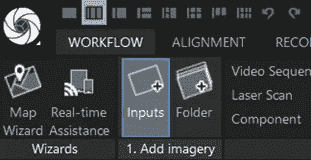

*数据导入。*

然后，我们从“校准”选项卡中的第一个图标开始**校准**。对于这个项目，我们保留默认参数。

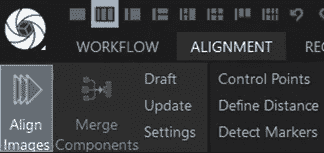

*对齐。*

考虑到输入数量少，校准只需 30 秒即可完成。在这一步之后，我们有一个**组件**，它由一个点云和摄像机的估计位置组成。呜哇！🎉

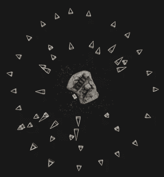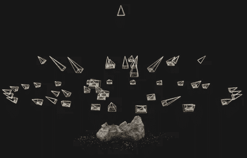

*点云和相机位置。俯视图(左)；侧视图(右)。*

我们可以检查所有输入是否对齐，并看到 48 个摄像机中的 48 个摄像机的位置是估计的。我们还检查了**校准报告**。该报告提供了校准持续时间、校准输入的数量、点数以及平均和最大重新投影误差(以像素为单位)。也可以检索使用过的校准设置。

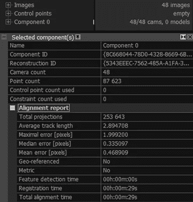

*比对报告。*

💡**提示** : *最好将最大投影误差设定为 2 个像素，平均投影误差低于 0.5 个像素。当然越低越好。有趣的是，你可以看到我们回答了这两个标准。最重要的是，我们获得了平均轨迹长度信息，可以清楚地了解相机到物体的距离。*

最后，对点云进行视觉检查。如果一切正常，我们可以进行下一步，**重建**。我们保留默认参数，除了“**图像缩小**”因子被设置为 2。

💡**提示** : *缩小系数是图像在使用前缩小的系数。可以将缩小比例保持在 1(这意味着图像以其原始大小使用)，但重建可能需要更多时间。当使用较高的缩减系数时，结果可能会更嘈杂或更不详细。然而，这种差异有时非常微妙。使用一个能给出令人满意的结果和可接受的处理时间的缩减因子确实很重要(在这种情况下，它不是关键的，但对于更重要的项目是必不可少的)。*

点击*“重建”*选项卡中的*“普通细节重建”*图标，启动**重建**。这一步只需要五分钟，就能生成大约一百万个三角形面的网格。与地球上的国家数量(2023 年为 195 个)相比，这是一个很大的数字，但与我们通常的工作相比，这是非常小的数字。用“高级”**选择**工具，我们选择边缘和大三角形，然后过滤选择。我们还调整了重建框，以消除属于放置对象的家具的部分(“框”选择工具)

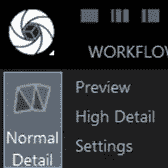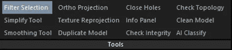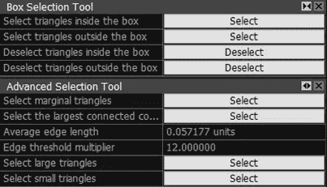

重建按钮(左)、滤镜选择工具(中)和可能的滤镜选项(右)

我们现在可以看看我们的过滤模型。在这一步，分析你得到的质量是很重要的，因为在这种模式下，很容易发现应该修复的几何问题。就我所见，我对这一步的结果很满意。你呢？你的实验进展如何？

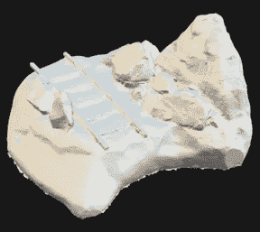

*生成的三维网格*

最后一步是**纹理**网格。为此，我们保留默认参数，并单击“重建”选项卡中的“纹理”按钮。默认情况下，纹理使用的缩减系数为 2。

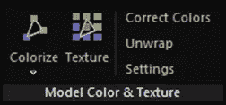

*纹理菜单*

又过了两分钟，我们终于得到了这个物体的数字复制品。

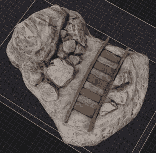

*纹理网格。*

在**不到一个小时**(包括采集和处理时间)的时间里，我们设法获得了一个完整的物体的 3D 模型，并且与实物高度逼真。最大重投影误差被设置为低于 2 个像素，并且我们获得了 0.46 个像素的平均误差。模型的某些区域比其他区域具有更好的纹理。在这种情况下，由于我们手头有物体，采集设置也准备好了，通过拍摄缺少信息的零件的照片，纹理问题可以很容易地解决。这表明，具有现实捕捉的 3D 摄影测量可以非常有效，并且即使不是专家也相对容易操作。我们保留了默认的参数，得到了令人满意的结果。显然，对于更广泛或复杂的项目，理解并**调整每个任务的设置**以获得最佳结果是至关重要的。这就是我们将在第二章检查的内容。😉

🦚 **注** : *如果你想导出模型，要么必须购买许可证，要么免费使用 PPI 模式下的程序，只为最终结果付费。*

## 选项 B:网络空间。

Meshroom 是一个开源程序，可以在这个地址下载:[https://alicevision.org/](https://alicevision.org/)。在线提供用户手册。

通过拖放或点击“文件”顶部菜单中的“导入图像”将图像**导入到 Meshroom 中**。在 Meshroom 中，您可以轻松地可视化**管道**以及为获得最终结果而执行的不同任务(**图 15** )。可以通过添加或修改**节点**的参数来适应用户的需求。

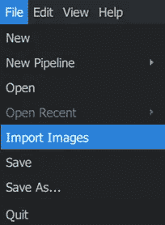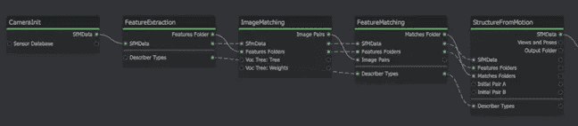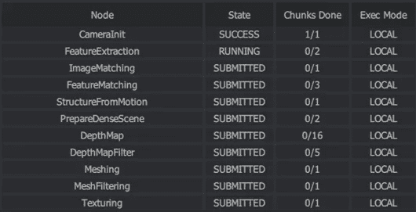

网格管道的数据导入和提取及其相应的任务监控。

我们可以看到**执行的连续任务**是特征提取、图像匹配、特征匹配、运动结构、深度图的创建、网格化和纹理化(关于这些步骤的详细解释，请参见第二章第 2 节)。对于这个项目，我们保留默认的管道，这通常会给出好的结果，只需单击屏幕顶部的“开始”按钮。2 小时后，处理完成，我们可以研究 3D 视图中的**稀疏点云**结果，以及摄像机的估计位置。

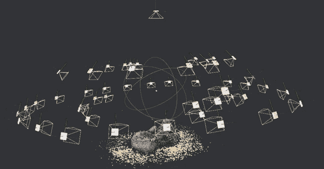

*网格计算后的稀疏点云和相机位置。*

如果我们点击管道节点，我们有一个关于每个任务的简短的**报告**。例如，我们可以看到所有 48 个摄像机的位置都是估计的。我们还可以检查网格任务的报告，它告诉我们重建几乎是由 2M 三角形组成的。

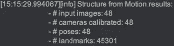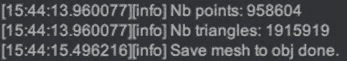

运动结构报告和有关网格化结果的信息

在文件资源管理器中，我们现在可以寻找" **Meshroom Cache** "文件夹，它已经包含了所有的处理结果(没有必要显式地导出模型)。在“**网格化**”文件夹中，我们可以发现我们的模型是一个 OBJ 文件。在“**纹理**文件夹中，我们找到了纹理模型的 OBJ 文件。

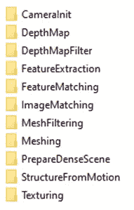

**图 21** 。*网络空间缓存文件夹的内容。*

💡**提示** : *在 Windows 10+中，OBJ 模型可以直接用 3D Viewer app 打开，否则我们会在第二章看到如何用 Blender 或 MeshLab 处理这些文件。*

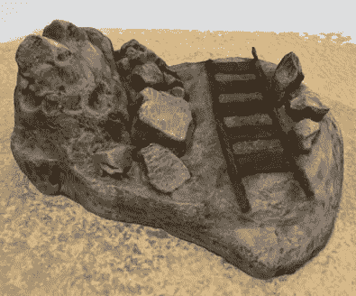

使用 Meshroom 标准管道及其纹理对应物生成的 3D 网格。

有了 Meshroom，**加工时间**要长得多。三角形的数量也是现实捕捉的两倍，这并不奇怪，因为我们在重建中使用了缩小因子，这与这里不同。然而，模型的外观(纹理)可能看起来更好，即使在这种情况下，使用的缩小因子是相同的(2)。可以用 Meshroom 对模型进行**后处理**，或者改变节点的参数(而不是保持默认值)以获得更好的结果。该模型也可能被导入到另一个软件(如 Blender)中，以清洁放置物体的家具的部件。与现实捕捉不同，使用 Meshroom，我们可以直接获得模型作为 OBJ，没有隐藏成本。我们甚至可以把它 3D 打印出来(但那是以后的事了😉)!

# 2.大型项目

现在让我们来看一个**大规模**的项目，更详细地了解处理工作流程。这个项目发生在比利时的韦尔维耶市，特别是一个废弃的羊毛工厂。工作环境由**几栋**组成。这些建筑的室内和室外部分都要考虑。


大型 3D 项目的最终 3D 网格。F. Poux

因为这个地方被废弃了，所以这条路不对公众开放。这个地方的建模是一个项目的一部分，该项目旨在捕捉像这样不寻常的地方，使人们可以(虚拟地)和我的朋友 Roman Robroek 一起参观它们。

# 第一步。三维数据采集

整个收购过程由两个人在 2 小时内完成。一个人拍照。本项目中使用了两台摄像机:

*   焦距为 16 至 36 毫米的索尼相机；
*   焦距为 24 毫米的佳能相机。

393 张照片由索尼相机拍摄，384 张由佳能相机拍摄。照片拍摄于 HDR(高动态范围)。格式是 JPEG。所以，我们总共有 777 张照片。

在战略要地，一个**三脚架**在一个圆上以短角度间隔拍摄照片。更多的照片是徒手拍摄，完全覆盖工作环境。

第二个人负责**激光扫描**部分，并使用 BLK 360 激光扫描仪，这种扫描仪体积小，因此可以在狭窄区域进行扫描。因此，该项目是一个混合项目。来自 156 次激光扫描的数据被收集并添加到处理中，以完成来自照片的信息。

BLK 中的原始文件是. e57 格式。黑白目标用于将扫描链接在一起。

# 第二步。三维数据处理

这一次，为了进行处理，我们使用了一台高端计算机:这是一台配备了英特尔酷睿 i9–10900 x 处理器、256 Gb 内存和 NVIDIA GeForce RTX 3090(我知道这很酷😊).

## 选项 a .现实捕捉

在现实捕捉中，我们首先**导入**我们的 156 次激光扫描(从. e57 转换成。lsp 文件)。**对准**可以在所有输入上进行，也可以逐个零件进行。在最后一种情况下，我们对齐组件(“合并组件”工具)。

对准也可以在扫描上单独进行，然后在图像上进行。如果扫描是地理配准的，则对准只是元素的定位信息的视图，因此是即时的。我们可以使用“匹配地理配准组件”选项来仅获取一个组件，即使我们的环境中有未链接但地理配准的零件。另一个有用的选项是“强制组件重匹配”随着更多的摄像机被对准，在已经匹配的摄像机之间执行重新对准以增强结果。但是，如果我们有想要链接的组件，这个选项不应该设置为" Yes ":这将修改每个组件已经很好的对齐，并可能引入错误。

首先，我们**对准激光扫描**。由于它们是地理配准的(因此已经链接在一起)，只需几秒钟。我们有 156 次扫描中的 156 次在组件中对齐。我们导入我们的 777 图像，并在开始之前更改**校准设置**。我们将“每张图像检测到的特征数量”和“每 mpx 检测到的特征数量”(百万像素)参数设置为 100k，并将“图像重叠”设置为“高”。

💡提示:*更高的最大检测特征数有助于获得更少的组件，但是对更多特征的研究可能会减慢这个过程。必须根据数据集定义图像重叠。如果设置为“低”，处理速度较慢，我们可能会获得几个单独的组件*。

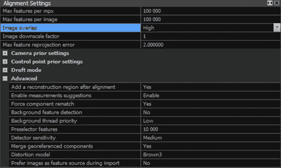

*在高质量数据集的复杂情况下工作良好的对齐设置。*

经过 36 分钟的处理后，我们得到了主成分，其中 933 个元素中有 897 个是对齐的。我们还有六个小组件，包含 3 到 6 个对齐的图像。当然，我们感兴趣的是更重要的组件，但是为了完整起见，让我向您展示我们如何链接回其他组件(如果它们包含所需的信息，这将非常有用)。我们将添加**控制点**来对齐尽可能多的图像。控制点是位置位于不同图像中的点。添加控制点的目的是添加使对齐更容易的约束。我们可以浏览在每个小组件中对齐的图像，决定在哪里添加控制点，然后尝试在主组件中对齐的图像中找到相同的点，以确保当我们进行新的对齐时，一切都将被链接在一起。

通过打开 2D 视图，然后进入“场景”选项卡，我们可以选择只查看**未注册的**图像(即根本没有对齐的图像)。这向我们展示了其他哪些领域需要控制点。

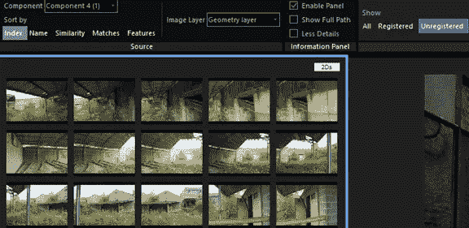

*未注册的图像。*

在现实捕捉中，我们可以通过点击“对齐”选项卡中的“控制点”按钮来添加控制点。

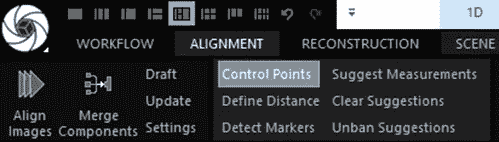

*添加控制点。*

然后，通过按住鼠标左键，我们可以调整图像中的位置。我们也可以使用鼠标滚轮来缩放。释放鼠标左键时，会添加控制点。可以添加另一个控制点，或者通过预先选择所讨论的控制点，可以在另一个图像中定位相同的控制点。

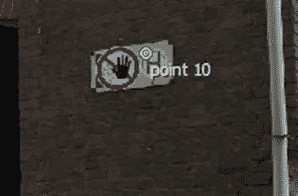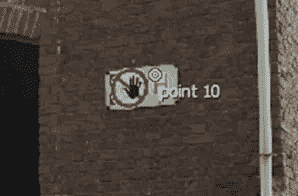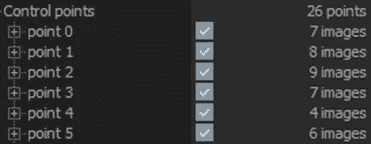

(*左)图像 1 中的控制点；图 2 中的(中间)控制点；(右)控制点列表。*

本项目使用了 18 个控制点。每个控制点位于 3 到 18 幅图像中。新的校准以与之前相同的设置开始。11 分钟后，校准完成。现在我们已经对齐了 98%的输入(933 张图像中的 918 张)，让我们检查一下定量结果。这首先通过查看**校准报告**来完成。平均重投影误差为 0.57 像素。通过对齐另外 21 幅图像，点数从 1280 万增加到了 1350 万。

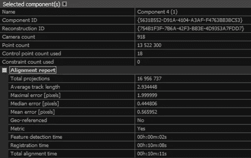

*对齐报告。*

然后，我们还可以通过观察点云来直观地检查对齐的结果。我们在寻找放置怪异的元素，双层墙，或者比例不够大的部分。

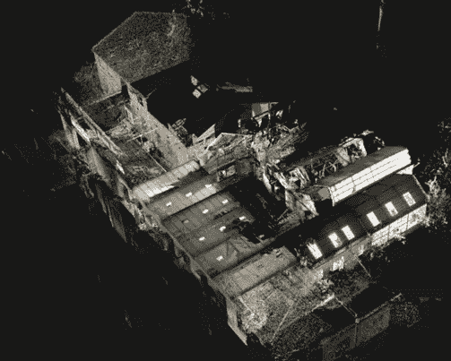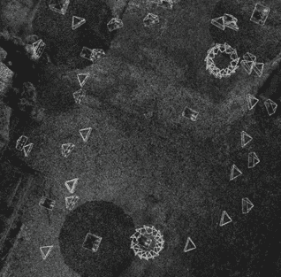

*对齐。全局视图(左)；详细视图(右)。*

我们注意到三台摄像机排列不整齐(它们的位置没有意义)。当这种情况发生时，我们可以尝试将这些相机与新的控制点对齐，或者禁用它们以进行进一步处理。当我们在这些照片所覆盖的区域中已经有足够的信息时，选择最后一个选项，因此使用它们并不重要。

💡**提示** : *输入可通过选择输入并按 CTRL+R 同时禁用所有任务的***。这些输入将被交叉输入到输入列表中，并以红色显示。**

*我们现在可以开始网格化。我们用默认参数开始一个正常细节的**重建**，除了“按部件的最大顶点计数”，它被设置在 3M 上。在“正常细节”中，“图像缩小”的值默认为 2。*

*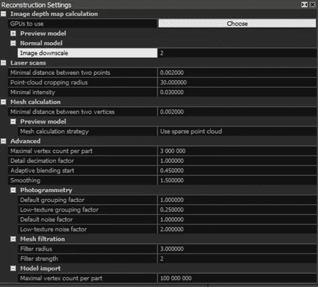*

**重建设置。**

*经过 5 小时 30 分钟的处理，我们得到了一个由 616.6 米三角形组成的模型。*

*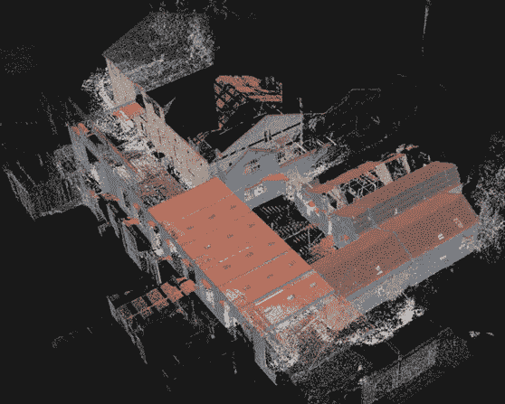*

**复杂场景实景捕捉重建的三维网格**

*模型太大，无法完全以“实体”模式显示，所以我们**剪切**一小部分来检查结果。通过调整感兴趣区域周围的重建框，选择框外的三角形(使用“框”选择工具)，并过滤选择来完成剪辑。结果是一个新的模型，可以显示在“固体”模式*

*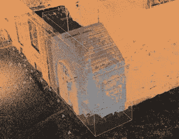**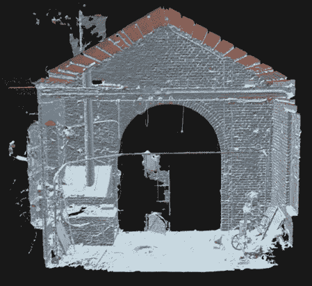

框选择(左)和现实捕捉中选择的 3D 网格视觉结果。* 

*剪裁还有助于在模型的小部分上执行测试，而不是同时对整个模型应用更改，这可能会导致较长的处理时间。例如，我们可以测试“图像缩小”值的影响我们禁用重建框外的输入，并连续开始三次重建，每次使用不同的“图像缩小”参数值。*

*下表给出了处理时间和用每个值获得的三角形计数。*

*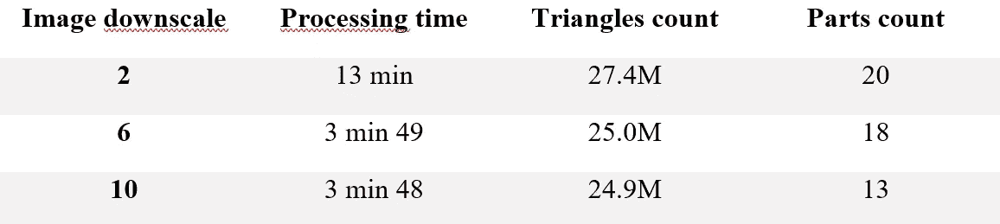*

**加工时间、三角形计数和零件计数取决于“图像缩小”的值。**

*“图像缩小”增加得越多(即图像缩小得越多)，处理时间就越短。但是，随着“图像缩小”的增加，某些区域的细节会丢失。*

*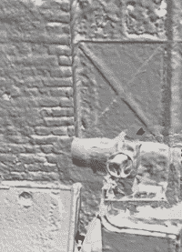**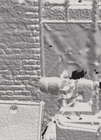**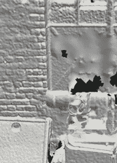

*用不同的“图像缩小”值创建的模型的详细视图。(左)2；(中)6；(右)10。** 

*在很大程度上，差异非常微妙，如下图所示。*

*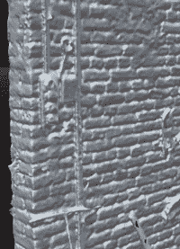**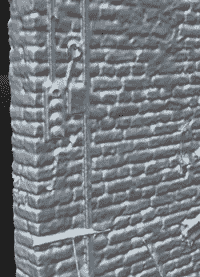**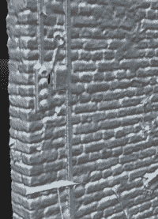

*用不同的“图像缩小”值创建的模型的详细视图。(左)2；(中)6；(右)10。** 

*另一个有用的测试是研究支持三角测量的合格点的数量。如果使用 0.01 米而不是 0.002 米的“两个顶点之间的最小距离”等约束，该值会低得多。这导致模型中包含的三角形更少(2 m 之前有 27.4 米)*

*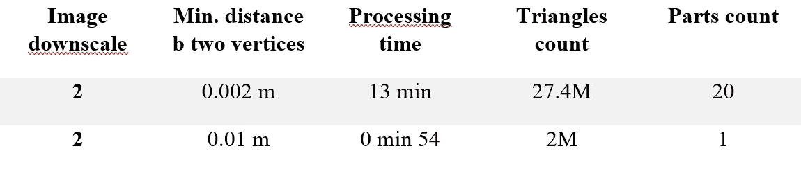*

***表二**。*加工时间、三角形计数和零件计数取决于“两个顶点之间的最小距离”。**

*这还会导致模型中出现较大尺寸的三角形，从而可能会丢失非平面区域的清晰几何图形。*

*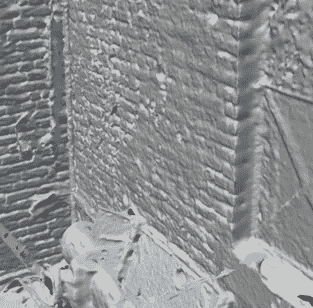**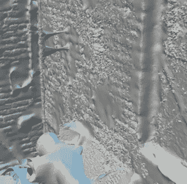

*增加“两个顶点之间的最小距离”的效果。(a)最小距离为 0.002 米；最小距离为 0.01 米** 

*我们还可以尝试减少“按部件计算的最大顶点数”参数的值。三角形数量没有变化，但我们现在有 61 个零件，而不是 20 个。好处是处理时间要短得多(2 分钟对 13 分钟)。*

*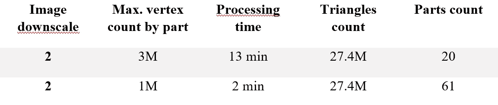*

***表 3** 。*加工时间、三角形计数和零件计数取决于“零件的最大顶点计数”。**

*💡**提示** : *根据已经使用的* ***激光扫描*** *可以设置三个重建参数。这些参数是“两点之间的最小距离”、“点云裁剪半径”(距离激光扫描范围较远的点被认为是不可靠的，不用于计算)，以及“点的最小强度”(强度较低的点不用于计算)。要找到应该使用的设置，我们可以参考激光扫描用户手册。**

*现在，让我们做一些**清理**，用本章前面提到的【高级】**选择**工具选择边缘和大三角形。此功能需要 1 分钟来推送结果。我们还**平滑**模型以去除噪声。要调整的设置有“平滑类型”(“去噪”或“强”)，“平滑样式”(平滑边界顶点、曲面顶点曲面或两者)，以及算法的“平滑权重”和“迭代次数”。权重越大，平滑程度越高(因此，可能会删除更多细节)。我们在模型的一小部分上执行一些测试，如下所示和解释。*

*****

*取决于迭代次数的平滑结果。(左)0.5 和 5 次迭代的平滑权重；(中)0.5 和 50 次迭代的平滑权重；(右)0.5 和 100 次迭代的平滑权重。** 

*我们可以观察到一些变化，但它们并不明显，因为这个模型一开始并不是很吵。*

*****

*取决于平滑权重的平滑结果。(左)0.1 和 100 次迭代的平滑权重；(中)0.5 和 100 次迭代的平滑权重；(右)1 和 100 次迭代的平滑权重。** 

*如果我们看一个更嘈杂的数据集，我们可以更好地看到平滑的效果。平滑是在曲面上完成的，而不是在边上，执行 100 次算法迭代，权重设置为 0.5。平滑在 10 分钟内完成。*

**

**平滑工具的设置。**

*这些参数可确保高效平滑，而不会丢失太多细节。*

***

*“平滑工具”对另一个数据集的影响。(a)原始网格；(b)平滑网格。** 

*在这一点上可以使用的另一个工具是“简化工具”可以**简化**模型以达到固定的三角形数量(类型:“绝对”)或保留一定百分比的三角形。*

**

**简化工具设置。**

*在这个项目中，我们不使用这个工具，因为我们不打算导出并继续处理模型。否则，简化对于减轻 3D 模型的重量以将其导入其他软件非常有用。例如，我们的模型可以简化到 2000 万个三角形(“目标三角形数”)，同时保持令人满意的质量。我们应用**颜色校正**来标准化图像的外观。为此，我们**禁用**扫描，因为颜色不自然，会干扰正常化。扫描也不用于纹理化。色彩校正在 3 分钟后完成。*

**

**校正颜色工具。**

*最后，我们进行**纹理**。这一次，我们也保留默认的“图像缩小”因子，设置为 2。我们使用 16k 的纹理分辨率和 1 mm 的纹理尺寸，这在我们的案例研究中给出了极好的结果。*

**

**纹理设置。**

*纹理是在 1h30 中执行的，我们通过裁剪来显示它，就像我们对重建所做的那样。*

***

3D 纹理网格(左)和放大剪辑视图的结果，用于评估真实捕捉的质量。* 

*现在，为了科学起见，让我们测试其中一个纹理参数对模型一小部分的影响。定义的重建框外的摄像机被禁用，所有激光扫描也被禁用。如果图像缩小比例增加，处理时间会有所不同，但我们可以看到结果可能会更好。如下所示。*

*****

*图像缩小对纹理的影响。(左)图像缩小 2 倍，处理时间为 3 分 11 秒；(左)图像缩小 6 倍，处理时间 3 分 4 秒；(左)图像缩小 10 倍，处理时间为 3 分 8 秒。** 

*在开始纹理化之前，还可以完成一个步骤:**展开**。默认情况下，展开是在纹理化开始时执行的，但也可以显式执行，以获得更好的结果并使纹理化更快。在展开选项中，可以设置“最大纹理分辨率”，以及展开“样式”*

**

**展开工具。**

*展开样式是用于创建 UV 贴图的策略。可以设置“最大纹理尺寸”,以便计算满足该约束所需的纹理元素尺寸。反之，可以固定**纹理元素大小**。程序会计算出一个最佳的纹理尺寸。使用此纹理元素大小进行纹理处理会产生 100%的纹理质量**，而使用较小的纹理元素大小会产生大于 100%的纹理质量。因此，使用较大的纹理元素大小会导致纹理质量低于 100%。纹理质量并不是纹理质量的良好指标，而仅仅是最佳纹理元素大小和已用纹理元素大小之间的比率。***

******

*****表 7** 。*“纹理元素大小”对“纹理质量”的影响。****

***纹理质量可以在下面的纹理报告中找到。我们可以看到，我们的纹理元素等于 0.001 毫米每纹理元素，这就是我们想要的。最后，如果我们有许可证，我们可以将我们的模型导出为 OBJ 文件。可以在项目设置中设置坐标系，并检索以进行输出。我们可以选择是否导出纹理，也可以选择它们的文件格式***

************

***纹理报告(左)和导出参数(右)***

***在总共 **8 小时**的时间里，我们获得了一个几何精确的纹理模型，它很好地代表了物理环境。这一次，我们没有系统地保留默认参数，而是对它们进行了调整以获得最佳结果。虽然我们没有测试每个参数，但我们已经检查了最关键的参数，并看到它们的影响相对容易理解。我们还回顾了一些工具，这些工具允许获得一个干净的模型。***

***最后，这里有几张我们用现实捕捉制作的重建效果图。***

*********************

*通过现实捕捉获得的模型的 3D 渲染图。F. Poux**** 

## ***选项 b .网络空间***

***哈哈，如果你需要强烈的咖啡因，现在是时候了🤣。我们现在将研究相同的过程，并评估使用 Meshroom 可以做什么。在 Meshroom，我们只能**导入**我们的 777 张图像(而不是 156 张激光扫描)。因此，仅由激光扫描覆盖的部分不会被建模。由于本节仅旨在说明更大规模的项目也可以在不需要付费软件(如 Reality Capture)的情况下进行，因此这不是问题。然而，采集方法应适应为处理选择的软件，反之亦然。换句话说，如果你没有可以处理激光扫描的软件，你就必须用摄影测量学仔细收集所有数据。导入数据后，我们就可以开始处理了。这一次，我们也保留默认管道。***

******

****在网络空间中使用的连续任务。****

***超过 13 个小时后，处理完成，我们可以看看结果。首先，我们可以从视觉上检查**运动结构**节点的结果。***

************

****稀疏点云和相机位置。(左)俯视图；(右)透视图。****

***在报告中，我们看到 777 个摄像机位置中只有 554 个被估计(71%的摄像机)。这对应于场景的主要建筑。***

******

****运动结构报告****

***接下来，我们可以检查网格。我们在“Meshroom Cache”文件夹内的“ **Meshing** ”文件夹中找到 OBJ 文件，并使用 3D Viewer 应用程序打开它。这比小比例模型花费的时间多一点。***

*********

*三维网格。(左)全局观；(右)详细视图。**** 

***该报告指出，网格由 6.8 米三角形的几乎 3.5 米顶点组成。***

******

****啮合报告****

***最后，我们可以看看我们在“**纹理**”文件夹中找到的纹理网格。***

*********

*用 Meshroom 得到的三维纹理网格。(左)全局观；(右)详细视图。**** 

***可以在管道中添加节点来进行后处理或测试不同的参数，然后在最终的工作流程中保留最优的参数，这非常方便！不过这一集我会给大家展示如何使用另一个软件进行后期处理，这个软件非常强大: **Blender** 。***

***🎵**注意** : *Blender 也可以用来对用 Reality Capture 或任何导出 3D 网格的软件制作的模型进行后处理。Blender 可以在这里免费下载:*[*https://www.blender.org/*](https://www.blender.org/)*。****

***安装程序后，我们**导入**纹理网格。***

******

****搅拌机中的 3D 网格导入****

***模型需要**清理**:重建边缘的三角形必须移除(就像我们用现实捕捉过滤边缘和大三角形一样)。***

******

****型号导入搅拌机。****

***要修改几何图形，我们切换到**编辑模式**。首先，我们使用“**删除**”工具，顾名思义，该工具用于删除选定的顶点、边或面。***

*********

Blender 的编辑模式(左)及其删除工具(右)。*** 

***我们使用它来消除网格边界的伪像和三角形，使它更干净。***

*********

*清洗模型。(左)之前；(右图)使用工具后。**** 

***“**删除松散的**”工具删除断开的顶点、边或面。该工具位于“网格”选项卡的“清理”部分。我们可以应用的另一个工具是“**填孔**”。基于周围的几何图形和纹理来填充孔洞。我们选择“边缘选择”模式来选择我们想要填充孔洞的模型部分。***

*********

删除搅拌机中的松散工具和边缘选择模式*** 

***选择完成后，我们按 ALT+F。所选零件中的孔将被填充。***

*********

*孔洞填充。(左)之前；(右图)使用工具后。**** 

***其他有趣的工具有“**溶解**”和“**抽取**”工具(**图 62** )。溶解允许将小平面合并为一个小平面，以便保留原始几何体。抽取可以将三角形的数量减少到特定的比例，同时保持形状尽可能接近原始形状。***

*********

(左)溶解工具；(右)抽取工具。*** 

***我们可以打开**纹理绘制**标签来查看我们的纹理模型并修改纹理贴图。***

******

****mesh room 中的纹理贴图和纹理模型。F. Poux****

***Meshroom 和 Blender 允许我们在超过 **15 个小时**的加工后获得一个有纹理的网格。使用 Blender，我们解决了 Meshroom 使用默认参数生成的模型的一些问题，并获得了一个干净的模型，而不必对管道的每个步骤进行参数化。然而，根据最终的应用，使用 Meshroom 进行后处理可能会更有效，并且会产生更好的结果，尽管这需要事先熟悉程序。***

# ***结论***

***真诚地，如果你读到这里，恭喜你！这是一个超级密集的 3D 实践指南，当然可以作为你未来项目的参考！如果我必须用 4 个要点来总结这两个软件上展示的 3D 摄影测量过程:***

*   ***您需要调整采集策略，这在很大程度上取决于感兴趣对象的规模、范围和材料，以及应用所需的细节和精度水平。***
*   ***对于大型项目，激光扫描是对通过摄影测量收集的信息的极好补充，并允许避免精度的大漂移。然而，并不是所有的软件都允许处理这些信息。***
*   ***摄像机、计算机和软件应适应输入和期望的输出。现在，您已经很好地了解了依赖于所有这些参数的加工时间和约束条件。***
*   ***各种处理步骤和参数允许根据项目的最终目标灵活调整。对于经常性项目，对它们进行分类以建立整个自动工作流程的预设是很有趣的。***

***如果你像我一样渴望知识，你可以查看下面的各种资源来加深你的专业知识或探索新的 3D 主题，包括 [3D GeoAI](/how-to-represent-3d-data-66a0f6376afb) 、 [3D 点云处理](/how-to-automate-lidar-point-cloud-processing-with-python-a027454a536c)、 [3D 机器学习](/3d-machine-learning-course-point-cloud-semantic-segmentation-9b32618ca5df)等等。***

***🎆喜欢阅读这篇文章吗？***

***✅可以随时[关注](https://medium.com/@florentpoux)，或者[订阅我的简讯](https://medium.com/@florentpoux/subscribe)。***

***🎆**新手到中等，考虑全面使用？*****

***✅可以使用我原来的独家推荐链接注册成为一名媒体会员。(个人超级强烈推荐！)***

***🎆你想专攻某一领域成为专家？***

***✅查看了我其他关于 [3D 点云处理](/how-to-automate-lidar-point-cloud-processing-with-python-a027454a536c)、 [3D 机器学习](/3d-machine-learning-course-point-cloud-semantic-segmentation-9b32618ca5df)或 [3D 体素建模](/how-to-automate-voxel-modelling-of-3d-point-cloud-with-python-459f4d43a227)的文章。***

***✅在 [3D 学院](https://learngeodata.eu/)查看在线课程，尤其是 [3D 摄影测量课程](https://learngeodata.eu/3d-reconstructor-formation/)。***

***[](https://learngeodata.eu/)  

**所有图片均为作者所有，如需重用，请联系*[*f . Poux*](https://medium.com/@florentpoux)*。****