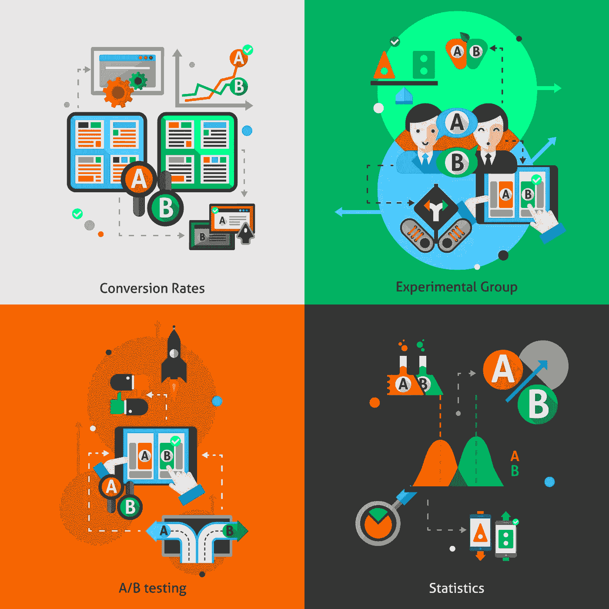
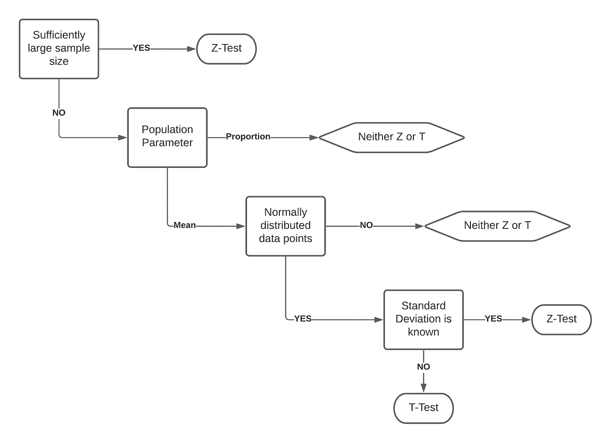

# 用 Python 进行 A/B 测试的终极指南

> 原文：<https://towardsdatascience.com/the-ultimate-guide-to-a-b-testing-with-python-b2c560b7ab26>

## 使用概率规划测试假设

由 [Freepik](http://www.freepik.com) 上的[宏向量](https://www.freepik.com/macrovector)设计的向量

在我们今天生活的网络世界中，企业非常依赖于通过网站、移动应用程序或广告等在线渠道发展客户群。那么，你如何增加访问你的人数呢？你如何把他们变成你生意的潜在消费者？答案很简单，你问用户他们想要什么。这正是 A/B 测试寻求实现的目标。企业观察人们更倾向于什么，因此他们可以以最大化增长的方式设计他们在线存在的特征。

> A/B 测试，在最基本的层面上，是一种比较一个产品的两个版本的方法，试图了解哪个版本的性能更好。

为潜在的产品改进进行假设检验的一个常见策略是 A/B 检验。我们将在下面的章节中探讨这个策略，以理解 A/B 测试和假设测试在现实世界的设计问题中是如何执行的。

## 置信区间和假设检验

在执行和理解 A/B 测试的结果之前，我们需要做一些统计基础工作。这些概念将有助于培养在各种不同条件下进行这些测试的直觉。

**置信区间**

置信区间是一个数值范围，它可能代表具有一定置信度的总体平均值。最常见的置信水平是 95%,它由一个下限和一个上限松散地限定。这基本上意味着，如果多次重复相同的抽样技术，您可以 95%确信总体平均值将位于上限和下限之间。

> **这里的信心，在于抽样的方法而不在于区间本身。**对于不同的样本，样本均值(置信区间的中心)仍会变化。但是，如果同样的抽样方法一遍又一遍地重复，我们就有信心在给定的区间内得到总体均值。

**假设检验**

假设可以被看作是对世界上某些事物的有根据的猜测，可以通过实验或观察来检验。在一般的语言世界中，假设语句应该是这样的:

> 如果我对一个**自变量做 *X* ，那么 ***Y*** 就会发生在 ***因变量上。*****

**赢得假设检验通常会遭到拒绝。这个想法是从给定的数据中建立一个零假设陈述，并在提出新的证据时得出结论，最初建立的假设是错误的。无效假设通常看起来像一个陈述。例如，一名研究人员指出，如果膝盖手术患者每周进行两次理疗(而不是四次)，他们的恢复会更快。为了拒绝这一点，我们需要新的证据和测试来证明，每周两次的物理治疗不会导致更快的愈合。**

**在上面的例子中，我已经非常简要地解释了假设和置信区间。如果你是统计学新手，这些解释可能没什么意义。因此，我建议您按照我在下面参考资料部分提到的特定链接来更好地理解这些统计概念。**

# **个案研究**

**为了理解我上面讨论的所有理论信息，让我们采取案例研究的方法，并尝试通过使用 Python 在网站上进行的 A/B 测试来编写我们的程序。确保[这个代码库](https://github.com/rjrahul24/statistics_with_python/blob/main/A:B%20Testing/Hypothesis%20(AB)%20Testing.ipynb)在故事旁边打开，以便理解理论和代码。**

## **问题陈述**

**网站的登陆页面是一个新用户的介绍点，通常是业务流量的来源。简而言之，订阅您网站的用户将通过登录页面完成他们各自的购买(如果他们觉得足够吸引人，也许？).这里的问题是设计一个登陆页面，引导更多的消费者浏览网站。我们得到了现有的设计和一些新的功能，可以在现有的设计上实现，以形成一个新的设计。目标是从两个设计中选择一个作为网站的最终登录页面。**

## **解决方法**

**这是一个经典的 A/B 测试题。我在这里解释的方法是计算两个登录页面的转换率(用户访问登录页面并完成购买)。 ***从统计上来说，既然问题只是想增加顾客的数量，我们就用单尾假设检验。*** 衡量标准是转换率，此外，我们将使用 z 测试建立一个置信区间，在此区间内，我们的测试不会产生任何错误(类型 II)**

**为了理解解决 A/B 测试的方法，我将我的分析(以及包含代码的笔记本)分成三个不同的部分，这将有助于简明地理解和构建假设测试。**

1.  ****定义成功的标准** 在我们正在探索的例子中，我们的想法是设计一个增加网站订阅的登陆页面。对于这个分析，我将使用**转换率**作为成功的衡量标准。这被定义为看到新页面并加入订阅的用户数量，与旧页面的比率相同。**
2.  ****制定零备假设** 定义假设对于能够从中得出结论很重要。在这种情况下，零假设表示，“新设计并不决定用户加入网站的概率是否成功”。由于我们只关心新页面的用户数量是否增加，我们将使用一个**单尾**假设检验来尝试并拒绝零假设。**
3.  ****定义一个测试指标来衡量分析的成功** 理解任何分析的一个重要部分是能够自信地断定它是正确的。为了测量这种正确性，我们需要执行一些测试来证明我们的分析确实是正确的。在这种情况下，我将执行一个 **z 测试**来判断是否可以忽略零假设。此外，我还将执行**功率分析**来预测提交错误的概率。**

## **理解测试策略**

**在一个典型的假设检验中，我们看到 [t 检验](https://www.investopedia.com/terms/t/t-test.asp)和 [z 检验](https://www.investopedia.com/terms/z/z-test.asp)具有一定的显著性水平，帮助我们决定拒绝零假设。**

****

**何时使用 t，z 测试。|作者图片**

## **计算 Z 值**

**我们在分析的输出中观察到 z 测试的 alpha 值是 1.64，基于这个 alpha 值和 95%的置信度，我们只能拒绝该组(是，否)。通过下面的权力分析也可以得出同样的结论。**

## **执行功率分析**

**通常，0.8 的功率水平被认为是一个好值。该组(是，否)是上面功率分析中唯一一个值大于 0.8 的组。至于样本的大小，理想情况下，样本越大，得分越准确，因此我们使用了样本中所有可用的条目。**

## **了解结果**

**从我们的假设、z 分数检验和功效分析中，我们可以得出结论，相对于对照组(否，否)，只有一个实验组(是，否)具有成功拒绝零假设的影响。以下是我们可以从这一分析中得出的结论。**

1.  **在 95%的置信度下，我们可以说，与对照组相比，设计的改进(是，否)是 0.56%。**
2.  **对于(1)为真，在得出上述结论时犯 I 型错误的概率约为 5%。**
3.  **对于(1)为真，在得出上述结论时犯第二类错误的概率约为 10%。**

## **代码库**

**虽然我已经包含了在这个故事中执行 A/B 测试的关键代码结构，但是浏览整个笔记本还是有好处的。我宁愿建议你在阅读这个故事的过程中，让它在后台保持打开状态。**

**<https://github.com/rjrahul24/statistics_with_python/tree/main/A:B%20Testing>  

# 结论

这个故事讲述了假设检验、置信区间、z 分数和 A/B 检验。这些是统计世界中的重要概念，经常在围绕数据的实验中使用，特别是当组织希望更新他们的产品时。在我上面解释的实验中，该组织希望修改他们的登录页面以增加流量，随后提高他们的订阅量。通过我们的 A/B 测试，我们以 95%的信心得出结论，在看到带有旧图片的新版本登录页面时，与旧设计相比，他们加入订阅的机会至少提高了 0.56%(可能更多)。我们还考虑了 I 型和 II 型错误，以消除错误分析的可能性。

设计选择(“A”和“B”)|照片由 [Greg Jeanneau 拍摄🗾](https://unsplash.com/@gregjeanneau?utm_source=medium&utm_medium=referral) on [Unsplash](https://unsplash.com?utm_source=medium&utm_medium=referral)

> 测试任何假设的一般工作流程都遵循相同的步骤和说明。我们从零假设开始，引入证据来比较零假设和另一个假设。然后，我们得出结论，如果新的证据可以肯定地推翻零假设。无论在哪种情况下，我们都应该注意测试分析中可能存在的错误。

如果你喜欢这个故事，我经常写关于数据科学、统计学、机器学习和气候变化的文章。这里有一些阅读材料可以帮助你前进。

<https://medium.com/geekculture/probability-has-nothing-to-do-with-the-likelihood-of-an-events-occurrence-a9475a365ac0>  </algorithmic-thinking-for-data-science-ab8c91416d83>  </the-ultimate-guide-to-emotion-recognition-from-facial-expressions-using-python-64e58d4324ff>  

# 关于我

我是纽约哥伦比亚大学的一名软件工程师兼数据科学研究员，目前正在研究如何减少气候变化对世界贫困人口的影响。这些人受我们砍伐树木和在地球表面推混凝土的行为影响最大。如果你的研究或工作抱负也与我一致，请务必与我联系到 [Twitter](https://twitter.com/rjrahul24) 或 [LinkedIn](https://www.linkedin.com/in/rjrahul24/) ，我们可以一起努力建设 ***负责任的人工智能。***

## 参考

1.  [https://www.investopedia.com/terms/h/hypothesistesting.asp](https://www.investopedia.com/terms/h/hypothesistesting.asp)
2.  [https://en . Wikipedia . org/wiki/Statistical _ hypothesis _ testing](https://en.wikipedia.org/wiki/Statistical_hypothesis_testing)
3.  [https://www . aha journals . org/doi/full/10.1161/circulation ha . 105 . 586461](https://www.ahajournals.org/doi/full/10.1161/circulationaha.105.586461)
4.  [https://www . optimize ly . com/optimization-glossary/a b-testing/](https://www.optimizely.com/optimization-glossary/ab-testing/)
5.  [https://hbr.org/2017/06/a-refresher-on-ab-testing](https://hbr.org/2017/06/a-refresher-on-ab-testing)
6.  [https://vwo.com/ab-testing/](https://vwo.com/ab-testing/)**