# Power BI 中行级和对象级安全性的终极指南

> 原文：<https://towardsdatascience.com/the-ultimate-guide-to-row-level-and-object-level-security-in-power-bi-3a98f5422bad>

## “谁能看到报告中的内容？”是 Power BI 中的关键安全问题之一。了解实现访问控制的两种可能方式


作者图片

恭喜你！在之前的文章中，您已经了解了如何[设计和构建大格式数据集](https://data-mozart.com/mastering-dp-500-exam-design-and-build-a-large-format-dataset/)、[聚合如何加速您的 Power BI 报告](https://medium.com/p/abd38fee0e78)，以及如何利用[复合模型特性](https://medium.com/p/f4ab9fceb28c)在设计企业级表格模型时获得最大的灵活性。不仅如此，您还发现了【DirectQuery 如何在 Power BI 中工作，什么是[外部工具](https://medium.com/p/736b9f355e86)，以及如何通过创建[计算组](https://medium.com/p/90f55b37944c)来扩展您的数据建模技能。不要忘记一些关于变量、虚拟关系和迭代器的 DAX 小技巧

现在，我们来总结一下如何保护您的数据，或者更好地说，如何控制对 Power BI 解决方案某些部分的访问。您可以在行级安全性(RLS)和对象级安全性(OLS)之间进行选择。需要说明的是，这并不是说选择一个就排除了使用另一个的可能性——您可以在同一个解决方案中同时使用 RLS 和 OLS。

让我们快速区分这两者，以及在哪些场景中使用 RLS、OLS 或两者都使用是有意义的。我们将从“更老”的表亲——RLS 开始，它是 Power BI 中一个长期可用的特性。

# 行级安全性简而言之

RLS 的思想是在行级别上限制指定用户对数据的访问。然而，在我看来，RLS 的这个定义——它可以在行级别上限制特定用户对数据的访问——可能有点令人困惑。让我解释一下为什么…

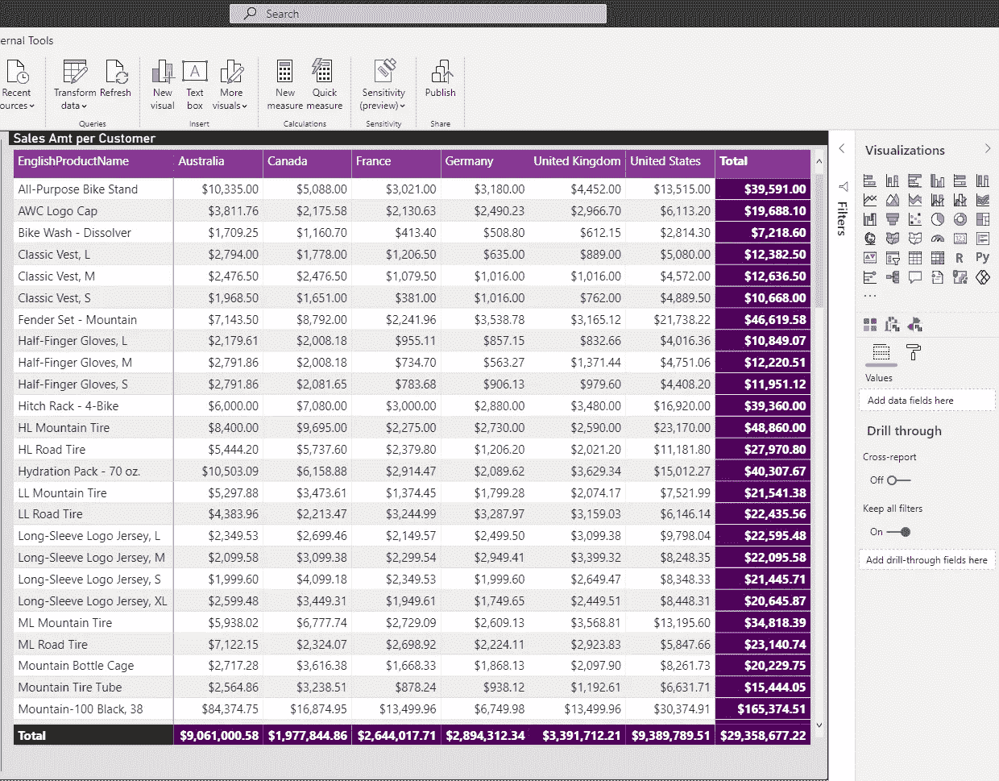

作者图片

假设我有一个显示每个产品和国家的总销售额的矩阵。国家是我们矩阵中的*列*，假设我们想限制特定用户组的访问权限，使其只能看到加拿大的数字。

我们将转到“建模”选项卡，管理角色并创建角色加拿大，这将仅过滤加拿大的数据:

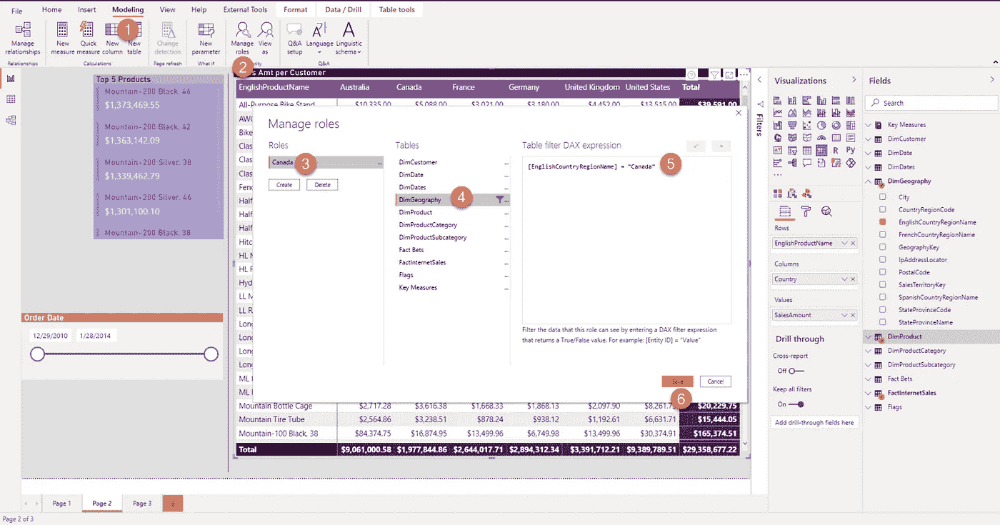

作者图片

如果我选择“查看”角色“加拿大”，您会发现报告中只留下了加拿大号码:


作者图片

现在，如果您认为行级安全性是严格应用于行的，那么，在这种情况下，它是一个列:)

因此， ***我喜欢将行级安全性理解为限制对特定属性的访问—例如，国家(仅像加拿大)、产品类别(即经济、常规等)。)、客户的位置等等。无论它们是否在报表中显示为行！***

***另一方面，我更倾向于将对象级安全性理解为限制对数字(度量)的访问，例如单位成本、公司开支或完整的数据对象——例如，整个表或表的整个列！***

但是，回过头来更详细地解释 RLS…首先，RLS 对导入模式和 DirectQuery 都有效，但它在与 Analysis Services 或 Azure Analysis Services 数据源的实时连接模式下不可用。或者，最好这样说:RLS 实际上在实时连接模式下可用，但必须在源端定义(在 as 或 AAS 中)，而不是在 Power BI Desktop 中！

首先定义角色(就像我在上面的例子中所做的那样),并使用 DAX 设置特定的过滤器——在我们的例子中，我设置的过滤器是:只显示国家等于“加拿大”的那些行。如果您来自 SQL 世界，您可以将这些条件视为 SQL 语句中的 WHERE 子句。

Power BI 中有两种主要类型的 RLS:

*   ***静态 RLS***
*   在基本场景中很有用，当用户不多、没有复杂的限制要求、访问规则不经常改变时(根据我们前面的例子来考虑:来自加拿大的所有用户总是只能看到加拿大的数字)
*   静态 RLS 的规则在 PBIX 文件中维护
*   通常设置简单明了
*   一些缺点:维护开销，大量手工工作，不可重用
*   ***动态 RLS***
*   设置稍微复杂一点，但是您可以在更精细的级别上控制访问
*   访问控制是通过表和关系在数据模型中定义的
*   可重复使用，需要较少的维护
*   一些缺点:增加了模型的复杂性

网上有很多很棒的文章，一步一步地解释了如何创建和管理静态和动态的 RLS，比如来自 Reza Rad 的这篇文章。本质上，您可以利用 DAX 中的 *USERPRINCIPALNAME()* 函数来捕获当前浏览报表的用户的登录信息。而且，根据您在数据模型中指定的规则，具有特定登录凭证的用户将只能看到数据的特定部分。

虽然设置静态 RLS 是一个简单明了的过程，但动态 RLS 提供了各种实现选项—基于您的业务场景，您可能希望将用户和角色拆分到不同的维度表中。此外，您应该评估过滤器的性能，因为您必须在启用双向交叉过滤或编写 DAX 来处理过滤器之间做出选择。

# RLS 注意事项

*   *一个用户扮演多个角色* — RLS 滤波器以累加方式工作。这意味着，如果用户是限制访问属性“薪金”的角色“雇员”的成员，如果同一用户也是有权访问属性“薪金”的角色“财务”的成员，他们将能够看到数据
*   *性能影响* — RLS 是一个非常强大的功能，但像任何其他强大的功能一样，它也有代价。由于 RLS 将对每个 DAX 查询应用额外的过滤器，因此可能会发生 RLS 对性能降级负责的情况。尝试遵循 Power BI 数据建模的一般建议(世卫组织说，星型模式和 1:M 单向关系)，并确保在维度表而不是事实表上实施 RLS 过滤器
*   尝试为定义的数据集角色分配 AAD 组，而不是单个用户帐户(减少维护开销)
*   查看来自微软的[官方 RLS 指南](https://docs.microsoft.com/en-us/power-bi/guidance/rls-guidance),了解更多推荐实践

# 简而言之，对象级安全性

在 Power BI 中引入 OLS 之前，我使用了一个简单的 RLS 技巧对特定用户隐藏整个表。假设我想在我的数据模型中限制对整个 DimGeography 表的访问。我可以去做这样的事情:

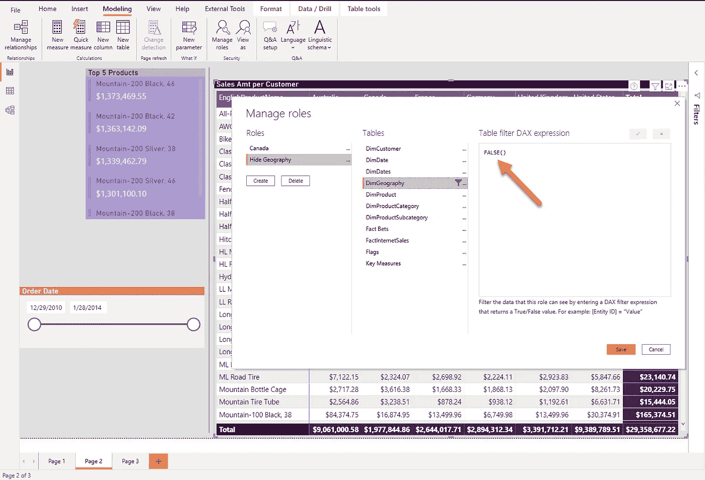

作者图片

我已经创建了一个名为 Hide Geography 的角色，选择了 DimGeography 表，并将 FALSE()作为 DAX 表达式！


作者图片

嘣！矩阵现在完全空了！这很好，但是如果我只想隐藏特定的度量，例如，总销售额(我的意思是，实际上，您可能会限制对比销售额更敏感的度量的访问，但是让我们假设只有选定的一组人可以在我们的报表中看到总销售额)。

OLS 特写来拯救世界了！

## 等等…我怎样才能在力量 BI 中控制 OLS？！

对，这是第一个……姑且称之为限制吧！你不能直接从 Power BI Desktop 指定 OLS——相反，你需要一个叫做表格编辑器的外部工具[。](https://data-mozart.com/mastering-dp-500-exam-external-tools-in-power-bi/)

我们已经研究了表格编辑器提供的一些特性(例如，[创建计算组](https://data-mozart.com/mastering-dp-500-exam-creating-calculation-groups/)，无论是否适用于 OLS，您都应该使用它。一旦你从[这里](https://tabulareditor.com/)下载了表格编辑器，你应该能够直接从 Power BI 桌面访问它。只需转到 External Tools 选项卡，您将看到所有可用的外部工具(您已经安装在 Power BI 桌面所在的同一台计算机上的工具)。

## 问题 2——不是每个表格编辑器版本都适合 OLS！

在这个例子中，我使用的是 2.11.6 版本的表格编辑器，我没有定义 OLS 的选项！

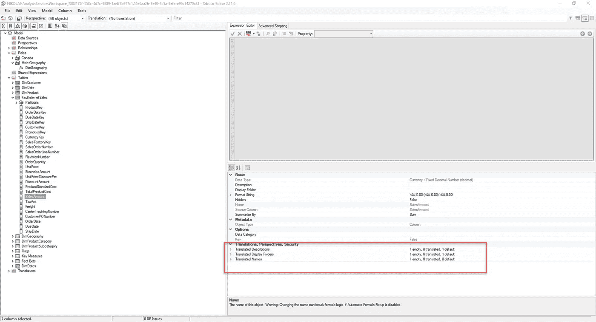

作者图片

一旦安装了最新版本，我就可以看到特定列的一整套新选项，其中之一是对象级安全性:

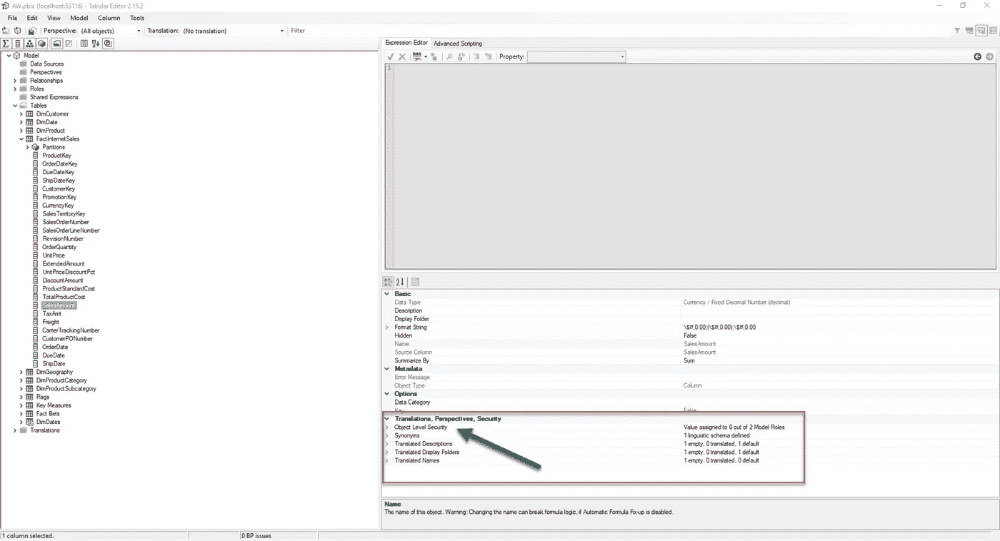

作者图片

现在，对于“销售额”列，我将设置“无”值来隐藏地理位置角色，而不是默认的 OLS:

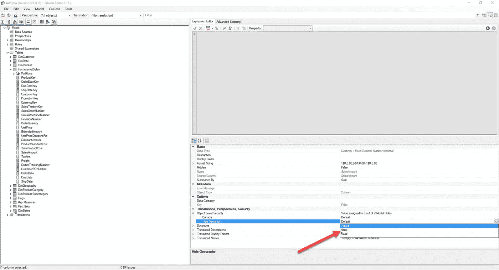

作者图片

然后，我将保存在表格编辑器中所做的更改，并返回到 Power BI Desktop，检查当我作为隐藏地理位置角色成员开始查看报表时会发生什么:

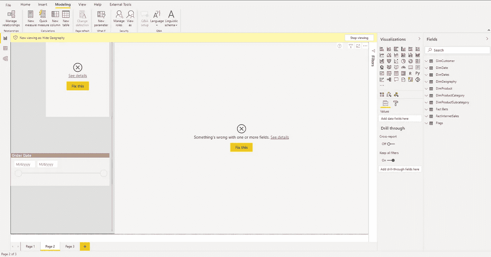

作者图片

等等，什么？？！！我的报告中有错误！但是，为什么，我做错了什么？我刚刚限制了对销售额指标的访问…

如果我是一个试图了解哪里出了问题的用户…好吧，假设我会发现这条消息非常尴尬:

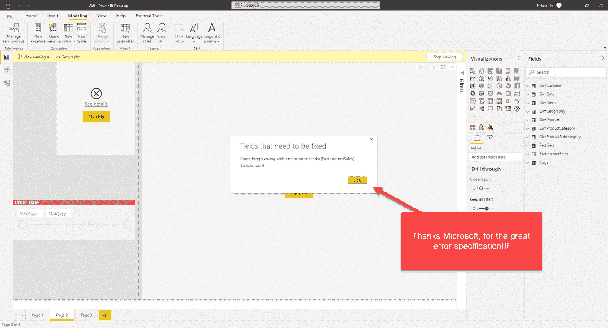

作者图片

## 第三个问题——不要试图“理解”错误信息！

这个奇怪的结果来自于这样一个事实:当您将 OLS 应用到某个列 ***时，它的行为就像您从数据模型中删除了它一样！*** 并且，下图证实了:

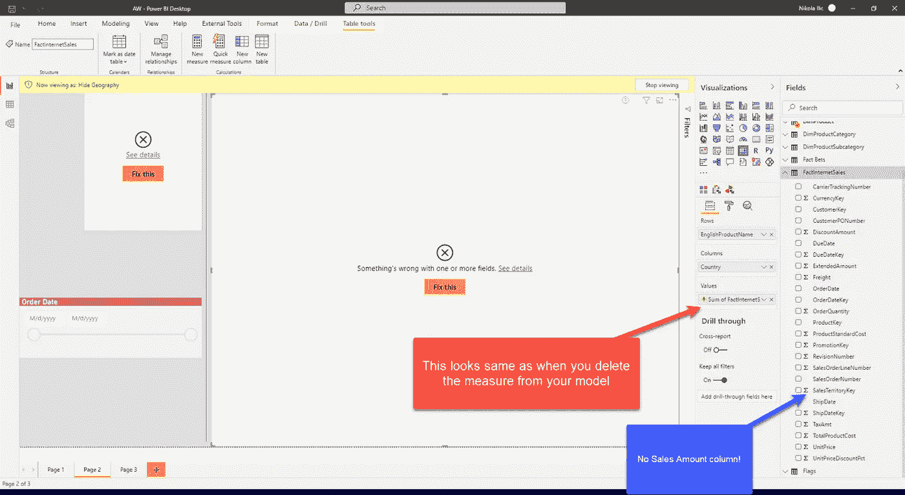

作者图片

***RLS 和 OLS 的主要区别在于，当您使用 DAX 过滤器应用 RLS 时，数据将不会显示在报告中，但基础元数据对象仍然存在于模型中！***

****

此外，引用受限列的所有度量也将从数据模型中“消失”！

看看这个:

```
Sales Amt = SUM(FactInternetSales[SalesAmount])
```

这是一个超级简单的[显式度量](https://data-mozart.com/understanding-explicit-vs-implicit-measures-in-power-bi/)，显示销售额的总和。并且，当角色有权访问列 Sales Amount 时，这将按预期工作:

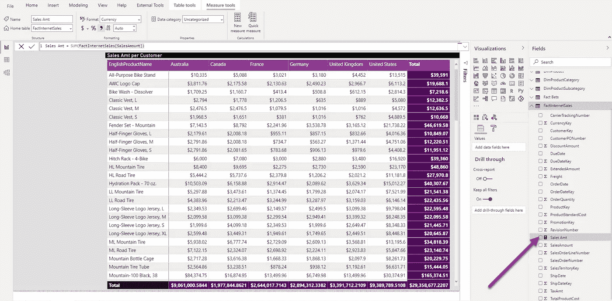

作者图片

但是，当我作为 Hide Geography 角色的成员开始浏览报表时，我会(再次)看到这个“直观的”错误:

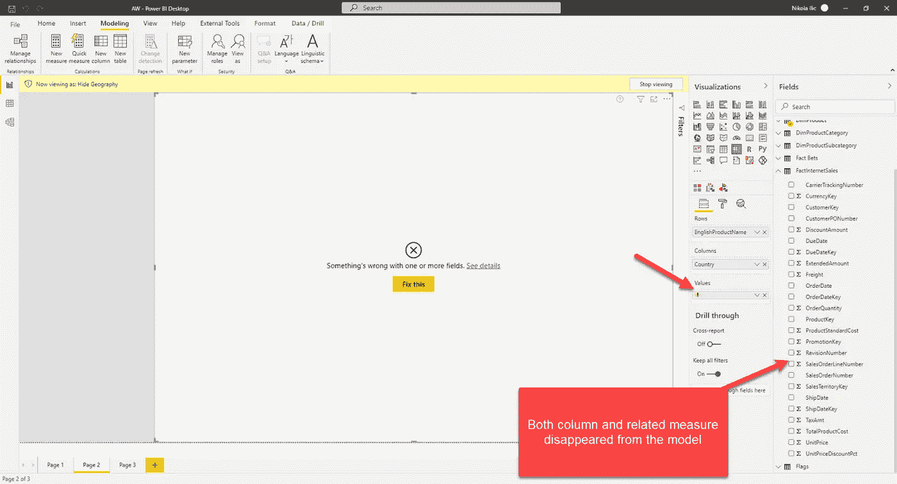

作者图片

# 结论

Power BI 中的 RLS 和 OLS 都是强大的功能，为您提供了全方位的能力来控制 Power BI 解决方案中“谁能看到什么”。

但是，不要急于下结论，认为两者之间的唯一区别是应用规则的“方向”——水平与垂直。RLS 和 OLS 的工作方式完全不同——不仅因为您不能从 Power BI 本身配置 OLS(不像 RLS)——更因为它们对用户“隐藏”数据的方式:使用 RLS，对象仍然存在于模型中，而使用 OLS，它们完全被省略了！

感谢阅读！

成为会员，阅读 Medium 上的每一个故事！