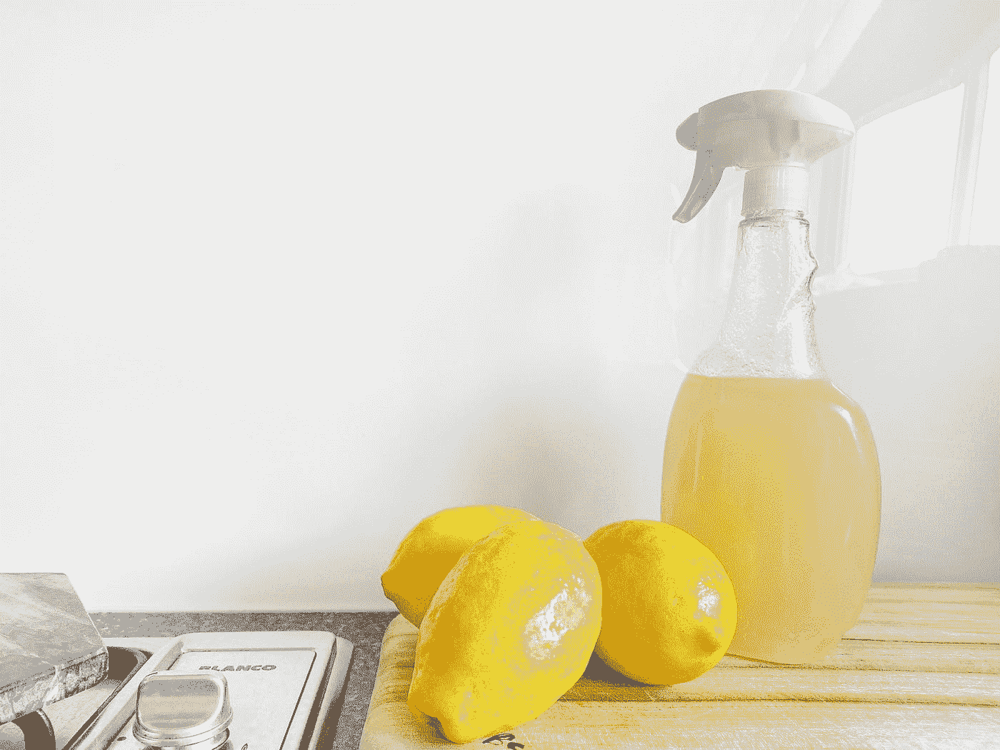

# 清洁熊猫代码的最终参考

> 原文：<https://towardsdatascience.com/the-ultimate-reference-for-clean-pandas-code-413df676e63c>

## 一种清理数据的干净方法



由 [Precious Plastic Melbourne](https://unsplash.com/ja/@preciousplasticmelbourne?utm_source=medium&utm_medium=referral) 在 [Unsplash](https://unsplash.com?utm_source=medium&utm_medium=referral) 拍摄的照片

熊猫可以将最混乱的数据转化为原始的机器学习数据集。不过，这个过程本身可能会相当混乱。

熊猫的代码很难读懂，原因有很多。首先，熊猫有许多不同的方式来完成同样的基本任务。子集化数据、添加新列、删除列、删除空值和许多其他过程可以通过许多不同的方式完成，这导致了不一致和混乱的代码。

对熊猫来说，管理数据清理步骤的顺序也是一个挑战。我职业生涯早期的大部分数据清理代码如下所示:

```
# Import data
df_raw = pd.read_csv("path/to/data/file.csv")

# Clean data
df_raw["id"] = df_raw["id"].astype(str)
df_merged = df_raw.merge(df2, on="id")
df_final = df_merged.drop(columns=["col_5", "col_6", "col_7"])

# Investigate data
df_agg = df_final.groupby("id").size()
```

“意大利面条式代码”，就像上面的例子，很难解释和调试。此外，命名空间中有如此多的数据框会耗尽内存，并且在处理大型数据集时可能会特别成问题。

最后，熊猫代码可能会变得混乱，因为很多时候它是在匆忙中编写的。无论您是渴望构建模型并需要提前快速清理数据集，还是有一批新的输出数据需要分析，作为一名数据科学家，熊猫通常是达到目的的一种手段。

那么，一劳永逸地编写干净的熊猫代码的秘诀是什么呢？两个字:**方法链接**。

在这篇文章中，我与您分享了一组精选的 clean Pandas 方法，我用它们来预处理、调查、聚集和分析 Twitter 数据，在一个单独的项目[中，我用它们来训练一个 Transformer 模型。利用这些例子将扩展您对方法链的理解，并作为您编写自己干净的 Pandas 代码的参考指南。](https://github.com/m-newhauser/distilbert-senator-tweets)

# 清洁熊猫的基本知识

Pandas 库附带了大量的内置方法。回想一下，在 Python 中，[方法](https://docs.python.org/3/tutorial/classes.html#:~:text=A)是属于一个特定类的对象的函数，并且被附加到对象本身上，就像`df.to_csv()`一样。方法也可以被链接，这意味着您可以一次对一个对象应用几个方法。

```
new_df = (                          # Wrap everything in ()'s
    original_df                     # Name of data frame to modify
    .query("text_length > 140")     # Subset based on text length
    .sort_values(by="text_length")  # Sort entire df by text length
    .reset_index()                  # Reset index of subsetted df
)
```

强迫自己使用 Pandas 方法而不是操作符一开始可能会令人沮丧，因为在大多数情况下，您正在重新学习您已经知道的东西。但是这就是为什么您应该坚持使用方法链的原因:

*   它使代码更具可读性。
*   它消除了对多个中间数据帧的需要，从而节省了内存。
*   更容易调试。只需一行一行地注释掉数据帧操作，看看哪种方法给你带来了问题。

# 数据清理

我有一个由美国参议员制作的原始推文的数据框架，我通过具有提升访问凭证的 [Twitter API v2](https://developer.twitter.com/en/docs/twitter-api) 获取。以下是一些数据:

现在让我们做一些链接来清理这一点。在这一次调用中，我们将选择并删除列，格式化日期列，清理 tweet 的原始文本，计算文本长度，合并两个数据框，删除重复的行，重命名列，重新排序列名，按日期排序，并删除 tweet 长度为零的所有行。

你可能对这些方法中的大部分都很熟悉。也许这里最重要的方法是`.assign()`，它允许您创建新列或覆盖旧列。我主要出于两个目的使用`assign()`方法。

1.  更改现有列的数据类型:

```
.assign(column_name=original_df["column_name"].astype(str)
```

2.将函数应用于整列:

```
.assign(new_column=original_df["column_name"].apply(function_name)
```

请注意，您也可以将多个函数按顺序应用于一个列。

# 数据调查

在对原始 Twitter 数据实现了这个庞大的链之后，我们有了一个整洁的、可读的数据框架，我们想要检查它。

简单的方法`.info()`为您提供了关于数据框的大量信息，包括:

*   行数(和索引范围)
*   列数
*   列名
*   列的数据类型
*   每列非空值的数量
*   内存使用

这个方便的一行程序可以获得每列的空值数量:

`.describe()`方法为您提供了每个列中数据的实际值和分布的概述。根据列的数据类型将`.describe()`应用于列，以获得更清晰的输出，如下所示:

在`dtype="object"`上调用`.describe()`的结果不是特别有洞察力，因为列`id`、`username`和`text`包含字符串值而不是分类数据。然而，`party`列的行值可能会显示一个潜在的模式。

# 数据汇总和分析

分类变量的数据聚合通常是我为 NLP 项目进行的任何分析的第一部分。tweet 数据集中最明显的聚合变量是`party`。

接下来，让我们转到一些更高级的聚合。像这样按顺序链接`.groupby()`和`.agg()`函数可以更容易地从整体上理解聚合:

应用聚合后，生成的索引难以阅读。`.pipe()`方法是将一个函数应用于整个数据帧的干净熊猫方法。

# 结论

编写干净的熊猫代码的关键是强迫自己使用**方法链接**。这样做最终会使您的代码更具可读性和可解释性，更易于调试，甚至节省内存。正如本文所展示的，您可以在数据生命周期的每个部分使用方法链，包括清理、调查、聚集和分析数据。有关方法链接的更多信息，请查看下面的参考资料。

*如果您想了解最新的数据科学趋势、技术和软件包，请考虑成为中级会员。你将可以无限制地访问像《走向数据科学》这样的文章和博客，并且你会支持我的写作。(每个会员我赚一小笔佣金)。*

<https://medium.com/@mary.newhauser/membership>  

# 想要连接吗？

*   📖跟着我上[媒](https://medium.com/@mary.newhauser)
*   🔗查看我的其他[项目](https://www.datascienceportfol.io/marynewhauser)

# 资源

*   [本文的支持代码](https://github.com/m-newhauser/clean-pandas)
*   马特·哈里森的《有效的熊猫》
*   [现代熊猫](https://tomaugspurger.github.io/modern-1-intro)
*   [熊猫文档](https://pandas.pydata.org/docs/)

# 参考

(1) M. Newhauser， [DistilBERT 参议员推文](https://github.com/m-newhauser/distilbert-senator-tweets) (2022)。

(2) T. Augspurger，[现代熊猫(上)](https://tomaugspurger.github.io/modern-1-intro.html) (2016)。

(3) M. Harrison & T. Petrou， [Pandas 1.x cookbook:使用 Python 进行科学计算、时间序列分析和探索性数据分析的实用食谱(第二版)](https://www.packtpub.com/product/pandas-1-x-cookbook-second-edition/9781839213106) (2020)。

(4) Python 软件基础， [9。类别](https://docs.python.org/3/tutorial/classes.html#:~:text=A%20method%20is%20a%20function,%2C%20sort%2C%20and%20so%20on) (2022)。

(5) Twitter， [Twitter API 文档](https://developer.twitter.com/en/docs/twitter-api) (2022)。