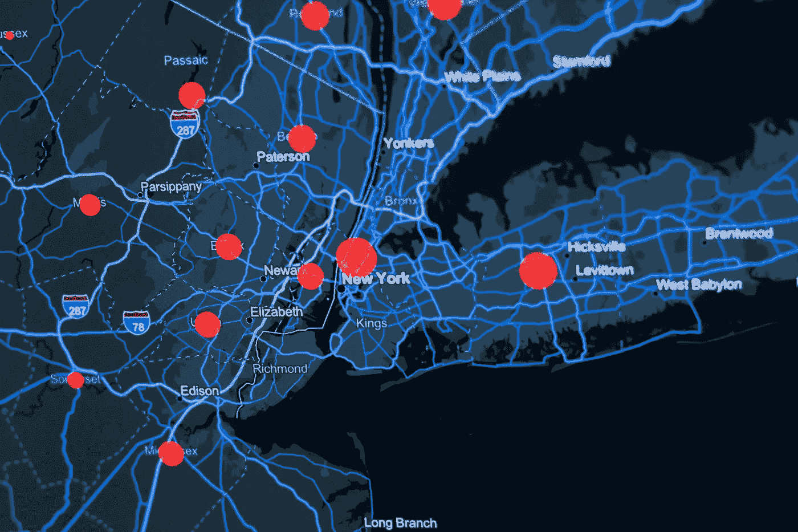
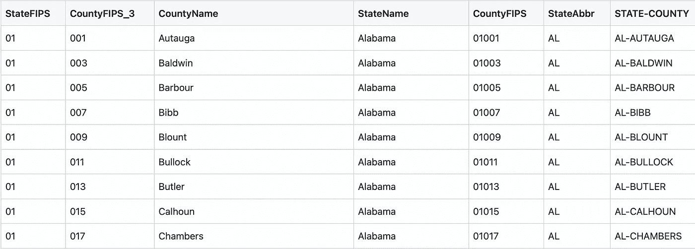

# 州-县-FIPS 的终极工具

> 原文：<https://towardsdatascience.com/the-ultimate-state-county-fips-tool-1e4c54dc9dff>

## 唯一的工具，你需要映射美国 FIPS 代码到国家，县，缩写，反之亦然



[KOBU 机构](https://unsplash.com/@kobuagency?utm_source=unsplash&utm_medium=referral&utm_content=creditCopyText)在 [Unsplash](https://unsplash.com/s/photos/usa-maps?utm_source=unsplash&utm_medium=referral&utm_content=creditCopyText) 上拍摄的照片

# 问题是

当使用地理位置进行数据科学研究时，经常会篡改美国 FIPS 代码、州名、县名、缩写等。互联网上有各种各样的信息表，但我找到的每一个都在某些方面有所欠缺。缺少州名缩写，或者县名格式不一致，或者表是可视化的，不容易下载用于编程，或者其他一些问题。

# 解决方案

本文用一个通用的美国 FIPS-州-县表解决了所有这些问题。您可以轻松地将其导入任何电子表格、数据准备层或编程语言。如果你想检查我工作的正确性或者添加一个特性，用于创建表格的 [Python/pandas 代码](https://github.com/ChuckConnell/articles/blob/master/MakeFipsToCounty.py)可供检查或修改。

[可下载表格](https://github.com/ChuckConnell/articles/blob/master/fips2county.tsv)允许您:

*   通过 FIPS 代码查找州和县，反之亦然。
*   查找州名的官方缩写，反之亦然。
*   将 FIPS 代码转换成可读的州-县字符串，反之亦然。
*   将两位数的 FIPS 州代码转换为州名或缩写，反之亦然。

该表如下所示:



作者图片

请注意，完整的 FIPS 县代码由一个 2 位数的州代码加上一个 3 位数的州内县代码组成。

要使用该表，只需将其导入您喜欢的数据软件或编码语言。对于 Python/pandas:

```
path = "~/Desktop/fips2county.tsv"FipsDF = pd.read_csv(path, sep='\t', header='infer', dtype=str, encoding='latin-1')
```

然后翻译州，县和代码的任何方式你想要的。假设您有一个名为 MyDF 的数据帧，其中包含 5 位 FIPS 县代码，如下所示:

```
PLACE         FIPSManhattan     36061
Bedford MA    25017
Yosemite      06043
```

并且您想要可读的州和县名。编写类似这样的代码:

```
StateCountyDF = FipsDF[["CountyFIPS", "CountyName", "StateName"]]MyDF = MyDF.merge(StateCountyDF, how='left', left_on="FIPS", right_on="CountyFIPS")MyDF = MyDF.drop(columns=["FIPS"])   # get rid of duplicate column
```

这产生了:

```
PLACE        CountyFIPS   CountyName      StateNameManhattan    36061        New York        New York
Bedford MA   25017        Middlesex       Massachusetts
Yosemite     06043        Mariposa        California
```

如果要添加州缩写:

```
StateAbbrDF = FipsDF[["StateAbbr", "StateName"]].drop_duplicates()MyDF = MyDF.merge(StateAbbrDF, how='left', on="StateName")
```

这产生了:

```
PLACE        CountyFIPS   CountyName    StateName       StateAbbr
Manhattan    36061        New York      New York        NY
Bedford MA   25017        Middlesex     Massachusetts   MA
Yosemite     06043        Mariposa      California      CA
```

# 我是如何做桌子的

这个项目的真实来源来自美国人口普查。我用 MacOS 工作表手动打开了那里的 XLSX 文件，并将它们导出到 TSV 文件，做了一些小的编辑，以便更容易导入到熊猫文件中。那些 TSV 文件代表[州 FIPS 代码](https://github.com/ChuckConnell/articles/blob/master/state-geocodes-v2021.tsv)和[县 FIPS 代码](https://github.com/ChuckConnell/articles/blob/master/all-geocodes-v2021.tsv)，它们必须组合在一起才能使用。

使用 Python/pandas，我将原始代码处理成最终的单个表格，其中包含了上面列出的所有特性。请随意修改或扩展此代码，遵守麻省理工学院的许可证，该许可证要求对我的作品进行署名。

# 欲了解更多信息

*   [https://www . census . gov/programs-surveys/geography/guidance/geo-identifiers . html](https://www.census.gov/programs-surveys/geography/guidance/geo-identifiers.html)
*   [https://en.wikipedia.org/wiki/FIPS_county_code](https://en.wikipedia.org/wiki/FIPS_county_code)