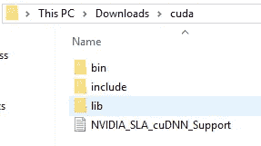
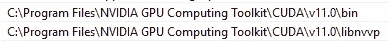

# 2022 年及以后的终极 TensorFlow-GPU 安装指南

> 原文：<https://towardsdatascience.com/the-ultimate-tensorflow-gpu-installation-guide-for-2022-and-beyond-27a88f5e6c6e>

## 无论如何，始终在您的 PC 上安装最新 GPU 版本的 TensorFlow 的终极指南


[本工程照片拍摄于](https://unsplash.com/@thisisengineering?utm_source=unsplash&utm_medium=referral&utm_content=creditCopyText)[un plash](https://unsplash.com/@thisisengineering?utm_source=unsplash&utm_medium=referral&utm_content=creditCopyText)

过去十年，深度学习的崛起令人瞩目。它凭借其创新和突破性的技术在几乎每一场比赛中占据主导地位，同时也带来了几种新型的研究和训练方法。处理深度学习模型以解决复杂计算问题的最流行的方法之一是借助深度框架。

TensorFlow 就是这样一个流行的深度学习库，用于构建和构造模型，以找到众多任务的解决方案。TensorFlow 被认为是解决几乎任何与神经网络和深度学习相关的问题的最佳库之一。虽然这个库可以有效地处理大多数更小更简单的数据集，以在 CPU 上完成任务，但它真正的强大之处在于对图形处理单元(GPU)的利用。

GPU 即兴发挥这种深度学习框架的性能，以达到新的高度和峰值。然而，深度学习程序员、开发人员和爱好者面临的最令人烦恼的问题之一是 CUDA 错误的困扰。对于大多数个人来说，这种经历相当令人沮丧，因为这是在处理深度学习模型时经常发生的事情。

在本文中，我们将探讨如何获得 TensorFlow 的最新版本，并与现代技术保持同步。在你深入研究之前，你可以访问我以前的一个博客，并通过下面提供的链接了解你是否真的需要一个 GPU 来开始深度学习。

</do-you-really-need-a-gpu-for-deep-learning-d37c05023226>  

如果读者不想在本地安装 TensorFlow 的麻烦，并希望在 GPU 支持下在云上免费使用它，请查看 [Saturn Cloud](https://saturncloud.io/) ，这是一个面向团队的协作、可扩展的数据科学平台。

# 对安装问题的理解:

如果您总是希望使用 GPU 运行 TensorFlow 的最新版本，那么 Anaconda 环境中的以下命令将不起作用。

```
conda install -c anaconda tensorflow-gpu
```

虽然上面的命令仍然会安装 TensorFlow 的 GPU 版本，但如果您有可用的版本，它最终会安装 TensorFlow 的早期版本，如 TF 2.3、TF 2.4 或 TF 2.5，而不是最新版本。您可能需要等待相当长的时间才能收到 TensorFlow 最新版本的支持更新，在撰写本文时，该版本是 TensorFlow 2.7。

在本文中，我们将分解完整的步骤，以便无论如何都能收到 TensorFlow 的最新 GPU 版本。请坚持阅读这篇文章，并跟随阅读 TensorFlow-GPU 最新版本安装过程的完整指南。

# 要遵循的步骤:

让我们来看看我们必须严格遵循的所有步骤，以便始终能够下载更现代版本的 TensorFlow。

## 1.官方版本来源:

第一步是访问[官方 TensorFlow 网站](https://www.tensorflow.org/install/source#gpu)，查看目前可用的 TensorFlow 最新版本。一旦你弄清楚并成功确定了你的操作系统的 TensorFlow 的最新版本，看看最新 GPU 版本的安装的基本要求。

相应地检查 CUDA 版本和 cuDNN 版本的精确列表，以获得要下载的精确元素的清晰图片。在撰写本文时，TensorFlow 的最新版本是 2.7。该版本需要额外下载 CuDNN 版本 8.1 和 CUDA 版本 11.2。查看适合您的最新版本，并下载具体内容。

此外，请确保检查您正在安装的 TensorFlow 变体所提供的 Python 支持版本。您不希望最终拥有一个当前版本的 TensorFlow 不支持的旧 Python 版本。

## 2.下载 Microsoft Visual Studio:

下一个关键的安装是[微软 Visual Studio](https://visualstudio.microsoft.com/vs/community/) 框架，这是在 Windows 平台上继续进一步安装过程所必需的。点击上面的链接，您将进入下载网站，在那里您可以按照简单的说明成功完成下载。目前，除非用户愿意，否则不需要安装任何额外的工作负载。

这个自由软件 IDE 帮助我们集成了众多编程语言的组件，如 Python、C、C++等等，使我们能够更好地执行一些特定的操作。成功下载该软件后，您可以关闭它，并进入下一个必要的安装。Visual Studio 代码也是我最喜欢的 Python ide 之一。查看下面的文章，了解更多不同类型的 ide。

</a-concise-guide-of-10-awesome-python-editors-and-how-to-choose-which-editor-suits-you-the-best-465c9b232afd>  

## 3.安装 CUDA 工具包:

下一个关键步骤是下载下面的 [CUDA 工具包](https://developer.nvidia.com/cuda-toolkit-archive)。选择与最新 TensorFlow 版本相匹配的正确版本。下载带有最新更新的 CUDA 工具包，并选择合适的参数作为您的系统设置。查看以下网站，了解如何填写您的下载信息。

我选择了 64 位架构的 Windows 操作系统平台。我会做一个本地的。但是查看者可以相应地选择他们偏好的参数。一旦所有正确的目标平台被选中，网站会给你一个下载链接，你可以点击。下载成功完成后，接下来是简单的快速安装。

## 4.安装 CuDNN:

现在是倒数第二步，也是稍微长一点的一步，去 [CuDNN 安装网站](https://developer.nvidia.com/cudnn)。继续点击屏幕上的下载 CuDNN 选项。要继续这一过程，您需要一个可以轻松免费使用的帐户，并登录以访问必要的内容。登录您的帐户后，下载 CuDNN 组件。



作者截图

在下载的文件夹中，复制文件夹内容并将其放在位于以下目的地的 CUDA 文件夹中。

```
C:\Program Files\NVIDIA GPU Computing Toolkit\CUDA\v11.0
```

替换下载文件夹的内容，并继续添加环境变量的最后一步。选择 bin 文件夹路径和 libnvvp 位置，并将其复制粘贴到环境变量的路径中。



作者截图

## 5.最终命令安装:

在最后一步，我们将首先重启我们的电脑。在 Anaconda 发行版中创建一个虚拟环境。如果您还没有下载它，那么安装相当简单，我强烈推荐您使用它。一旦您准备好了所有的需求，输入下面的命令。

```
conda create --name tf_2.7 python==3.9
```

现在开始激活新创建的环境，如下所示。

```
conda activate tf_2.7
```

在最后一步，您可以继续执行简单的 pip 安装，如下所示。

```
pip install tensorflow
```

上述命令将在给定的虚拟环境中，在您的系统上成功安装 CPU 和 GPU 版本。如果你对这个安装过程的书面版本有任何问题，我强烈推荐看看这个令人惊叹的 [YouTube 视频](https://www.youtube.com/watch?v=hHWkvEcDBO0)，它启发了这篇文章并经历了所有的步骤。

# 结论:


[Fotis Fotopoulos](https://unsplash.com/@ffstop?utm_source=medium&utm_medium=referral) 在 [Unsplash](https://unsplash.com?utm_source=medium&utm_medium=referral) 上拍摄的照片

> “人工智能、深度学习、机器学习——不管你在做什么，如果你不懂，就去学吧。因为否则你会在三年内变成恐龙。”
> ——**马克·库班。**

在数据科学领域保持更新总是至关重要的，尤其是在深度学习方面。对于最新版本，您将收到最新的更新、各自的修复程序和最新功能。即使是最小的变化，你也会获得更好的整体体验。这个事实对于 TensorFlow 也是成立的。

随着 TensorFlow 在每个开发版本中的不断更新，它们添加了所有用户都可以受益和利用的新功能和开发。因此，强烈建议您始终尝试获取 TensorFlow 的最新 GPU 版本。在深度学习的世界里，保持更新是至关重要的，因为你永远不知道一项新技术或新发现什么时候会在眨眼之间取代现有的方法。

与在本地安装 TensorFlow 相反，一个奇妙的替代方案是利用[土星云](https://saturncloud.io/)上提供的免费 GPU 支持。它为开发人员提供了一个绝佳的机会，让他们可以切换到云环境进行深度学习项目。

如果你想在我的文章发表后第一时间得到通知，请点击下面的[链接](https://bharath-k1297.medium.com/subscribe)订阅邮件推荐。如果你希望支持其他作者和我，请订阅下面的链接。

<https://bharath-k1297.medium.com/membership>  

如果你对这篇文章中提到的各点有任何疑问，请在下面的评论中告诉我。我会尽快给你回复。

看看我的一些与本文主题相关的文章，你可能也会喜欢阅读！

</develop-your-own-calendar-to-track-important-dates-with-python-c1af9e98ffc3>  </develop-your-weather-application-with-python-in-less-than-10-lines-6d092c6dcbc9>  </complete-python-starter-guide-for-data-science-for-2022-c1f880fa249d>  

谢谢你们坚持到最后。我希望你们都喜欢这篇文章。祝大家有美好的一天！