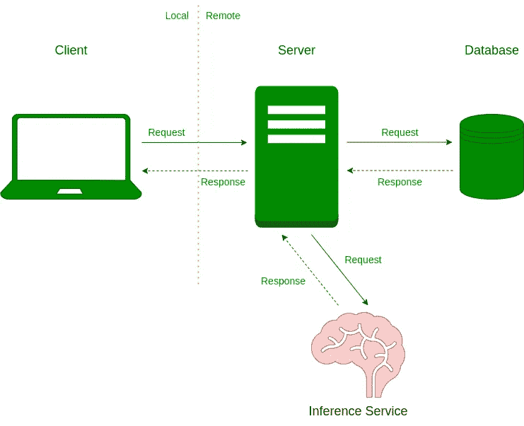

# ML 动力产品令人不安的最佳点

> 原文：<https://towardsdatascience.com/the-unnerving-sweet-spot-for-ml-powered-products-c34b54e17179>

## 维护一个推理服务器是痛苦的，但也是必要的。

瓦迪姆·博古洛夫在 [Unsplash](https://unsplash.com?utm_source=medium&utm_medium=referral) 上的照片

这篇文章是解决生产 ML 世界中最可怕的想法的系列文章的继续:把该死的东西投入生产。

在以前的故事中，我们看到了两种不同的方法来设计机器学习(ML)驱动的应用程序。首先，我们研究了为什么您希望将模型保存在 web 服务器中，以及为什么您不应该这样做。

将您的模型与您的核心业务逻辑放在一起是必须的，因为您尝试不同的想法，并且希望从一个信任的测试人员圈子中获得快速反馈，但是当在生产中部署时，这是不够的。

</keep-your-ml-models-out-of-your-application-servers-9fe58f9c91a5>  

我们讨论的第一个解决方案是一个非常简单的技术，它允许我们将模型从 web 服务器中分离出来。我们仔细研究了数据库中的模型解决方案，适合这种方法的用例，以及它的优缺点。

数据库中的模型方法实现起来很简单，但是它的范围有限。它也导致陈旧的模型，并不总是为我们的用户提供有价值的服务。

</pull-your-ml-model-out-of-your-server-the-database-solution-a00b212f5e0d>  

那么，我们如何解决前面两种方法所面临的问题呢？这个故事研究了最常见的架构设计:如何将您的模型放在它自己的推理服务器中。

推理服务架构——作者图片

为我们的模型创建和维护一个单独的 web 服务增加了基础设施的复杂性，但是，正如我们将看到的，这是大多数 ML 支持的产品的最佳选择。

> [Learning Rate](https://www.dimpo.me/newsletter?utm_source=medium&utm_medium=article&utm_campaign=model-as-a-service) 是一份时事通讯，面向那些对 AI 和 MLOps 世界感到好奇的人。你会在每个月的第一个星期六收到我关于最新人工智能新闻和文章的更新和想法。订阅[这里](https://www.dimpo.me/newsletter?utm_source=medium&utm_medium=article&utm_campaign=model-as-a-service)！

# 模型即服务方法

模型即服务(MaaS)架构范式允许我们在自己的推理服务中在线运行模型。这个推理服务就像其他后端一样，是专门为运行 ML 模型而设计的。这意味着它有适当的基础设施支持；一台或多台能够保持一个或一系列 ML 模型性能的机器。

我们的后端(即我们的 web 服务器)通过扮演客户机的角色进行交互:它发出请求并接收响应。例如，当它从客户端(例如，我们的用户)接收到识别图像中存在的对象的请求时，它将请求转发到推理服务器，模型进行预测，发回响应，最后，web 服务器将响应转发回客户端。

正如我们在介绍中所说的，这种方法似乎是大多数 ML 支持的应用程序的最佳选择。但这是为什么呢？让我们深入研究一下这种方法，什么时候应该使用它，并讨论一下它的优缺点。

# 赞成者

可以说，MaaS 方法是服务于 ML 模型的最常见的方法。这是大多数用例推荐的方法，这是有充分理由的。

首先，ML 模型代码中的一个错误不会导致整个应用程序崩溃。您将有机会优雅地处理错误，并仍然设法为您的用户提供可靠的服务。

然后，正如我们之前所说的，运行单独的推理服务允许我们为 ML 模型选择最佳的硬件，并适当地扩展它。需要 GPU 加速器吗？您需要垂直或水平扩展服务器吗？使用这种方法，您可以根据需要任意扩展服务，而不会影响应用程序的其他部分。

最后，这种方法提供了灵活性。您的模型现在已经成为一个独特的 web 服务。因此，您可以在多个应用程序、部分应用程序中重用它，甚至向公众开放它。你可以围绕它建立一个 API，并将其商业化，就像 OpenAPI 一样。

# 黑暗面

MaaS 方法最突出的缺点是它给系统增加了更多的延迟。当您的服务器与您的模型交互时，它必须通过网络发出请求。这会增加延迟，您应该衡量它对应用程序的影响。

最后，这种方法增加了基础设施的复杂性，因为您现在必须设计、运行和维护不同的服务。

马丁·鲍登在 [Unsplash](https://unsplash.com?utm_source=medium&utm_medium=referral) 上拍摄的照片

# 结论

这个故事考察了第三种架构范式，它可以帮助我们设计和实现一个 ML 应用程序。模型即服务方法是大多数 ML 支持的产品的最佳选择，这是有充分理由的。

其他方法的缺点太明显了。您需要能够独立地扩展您的模型，并且您需要它们足够灵活来处理请求中的任何类型的数据。

在下面的故事中，我们将看到如何使用 KServe 在 Kubernetes 集群上运行真正的、生产就绪的推理服务。

# 关于作者

我叫[迪米特里斯·波罗普洛斯](https://www.dimpo.me/?utm_source=medium&utm_medium=article&utm_campaign=model-as-a-service)，我是一名为[阿里克托](https://www.arrikto.com/)工作的机器学习工程师。我曾为欧洲委员会、欧盟统计局、国际货币基金组织、欧洲央行、经合组织和宜家等主要客户设计和实施过人工智能和软件解决方案。

如果你有兴趣阅读更多关于机器学习、深度学习、数据科学和数据运算的帖子，请关注我的 [Medium](https://towardsdatascience.com/medium.com/@dpoulopoulos/follow) 、 [LinkedIn](https://www.linkedin.com/in/dpoulopoulos/) 或 Twitter 上的 [@james2pl](https://twitter.com/james2pl) 。

所表达的观点仅代表我个人，并不代表我的雇主的观点或意见。