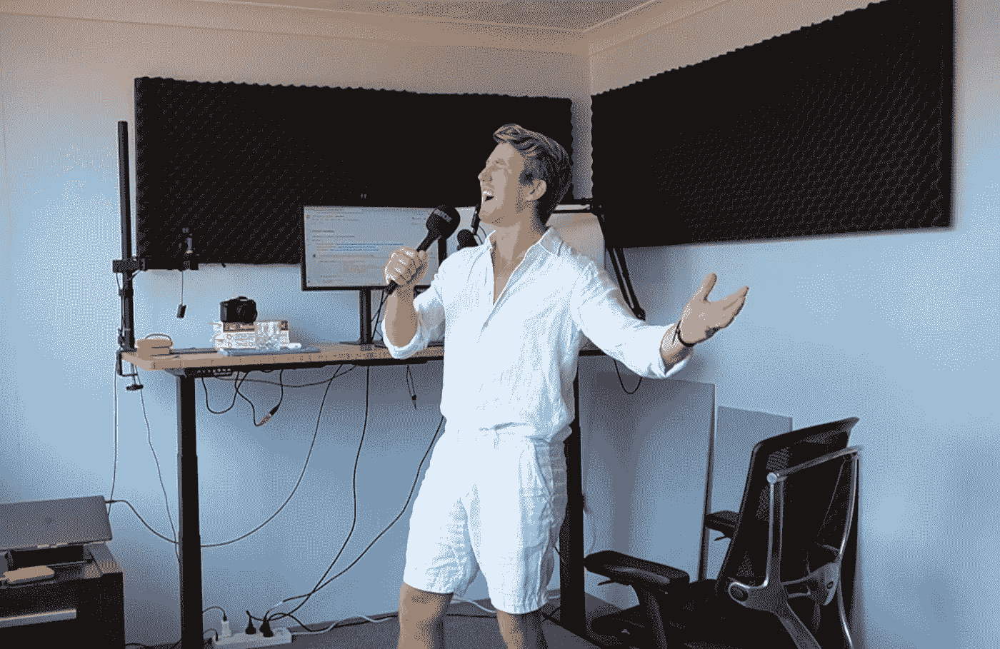
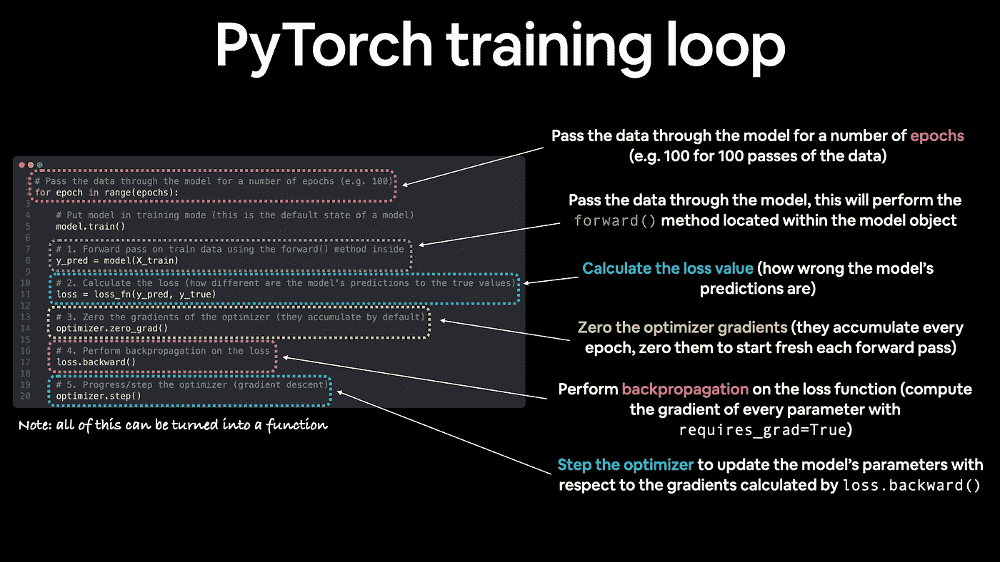
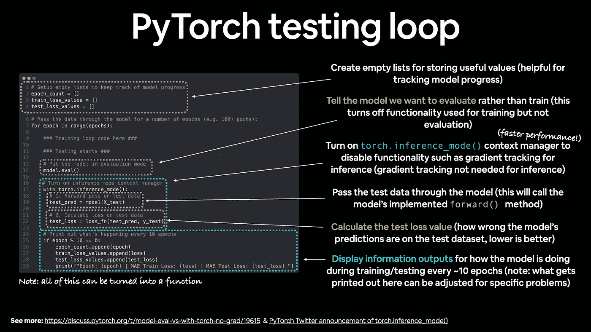
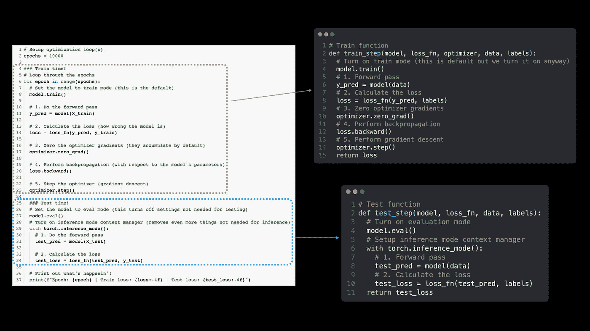

# 非官方 PyTorch 优化循环歌曲

> 原文：<https://towardsdatascience.com/the-unofficial-pytorch-optimization-loop-song-89657dd3a434>

## 一首有趣的顺口溜，帮助你记住 PyTorch 训练循环中的步骤

每个教程都需要一首歌。

我一直在学 PyTorch。

如果您也在学习 PyTorch，但来自 Scikit-Learn 或 TensorFlow 等框架，编写自己的训练和测试循环可能是一个陌生的概念(这两个框架都有一个漂亮的`model.fit()`系统)。

为了帮助自己学习，我写了一首顺口溜。

所以我永远不会忘记 T2。

你可以在 YouTube 上看到[我唱这首歌的视频版本。](https://youtu.be/Nutpusq_AFw)

托奇，放音乐！

# 什么是优化循环？

在说歌词之前，先定义一下我说的优化循环(或者训练循环)是什么意思。

在 PyTorch 或一般的机器学习中，**优化循环**遍历数据集，目标是**训练**模型(通常是神经网络)学习数据集中的模式。

该模型通过结合前向传播(前向传递，数据通过模型)、**后向传播**(后向传递，通过模型返回)和**梯度下降**来更新其内部数字(权重)，从而进行学习(请参阅参考资料一节中关于这两者的更多信息)。

**测试循环**的目标是评估模型在**训练循环**中学习的模式。

# 抒情诗

> 我们训练吧！
> 
> 对于一个范围内的一个时期
> 
> 呼叫模型点火车
> 
> 向前传球
> 
> 计算损失
> 
> 优化零梯度
> 
> 向后丢失
> 
> 优化器步骤步骤步骤
> 
> 考试时间！
> 
> 调用模型点评估
> 
> 在火炬推断模式下，
> 
> 向前传球
> 
> 计算损失
> 
> 打印出发生了什么
> 
> 让我们再做一次‘增益’增益
> 
> 另一个时代
> 
> 呼叫模型点火车
> 
> 向前传球
> 
> 计算损失
> 
> 优化零梯度
> 
> 向后丢失
> 
> 优化器步骤步骤步骤
> 
> 考试时间！
> 
> 调用模型点评估
> 
> 在火炬推断模式下，
> 
> 向前传球
> 
> 计算损失
> 
> 打印出发生了什么
> 
> 如果你想的话，继续走
> 
> 但是不要忘记拯救拯救拯救

# 解释歌词

歌词描述了训练循环中发生的事情(向前传递**训练数据**，损失计算，将优化器梯度归零，通过步进优化器执行反向传播和梯度下降)。

PyTorch 训练循环的步骤。来源:[学习 PyTorch 用于深度学习的书第 01 章](https://www.learnpytorch.io/01_pytorch_workflow/#pytorch-training-loop)。

以及测试循环中发生的情况(正向传递，对**测试数据**的损失计算——模型从未见过的数据)。

PyTorch 测试循环中的步骤(注意没有通过`loss.backward()`的反向传播，也没有通过`optimizer.step()`的梯度下降，这是因为评估/测试/做出推断不需要这两个步骤)。来源:[学习深度学习 PyTorch 书籍第 01 章](https://www.learnpytorch.io/01_pytorch_workflow/#pytorch-training-loop)。

它们被称为循环，因为它们遍历数据中的各种样本(训练集和测试集)。

因为这是机器学习模型的全部思想，查看数据样本并执行数值计算以找到数据中的模式。

就订单而言，在计算损失之前，您需要执行正向传递。

在进入优化器(`optimizer.step()`)和执行梯度下降之前，您可能想要执行反向传播(`loss.backward()`)。

损失衡量模型的错误程度，越低越好。

优化器告诉模型如何更新其学习的模式，以改善损失。

# 制作培训和测试功能

当然，您可以将上面的代码函数化。

你应该这么做。

它可以防止你发疯和学这样的顺口溜。

但是你只需要学一次。

然后将上面的代码函数化。

并利用它再次‘增益’增益。

不需要记住所有的步骤，您可以将训练和测试循环步骤函数化(在编码一两次之后)，这样您就可以在不同的项目和数据集上重用它们。

# 材料和资源

这首歌来自于寻找一种记忆和教授 PyTorch 优化循环中的步骤的方法。

许多学习 PyTorch 的资源从未真正讨论过每一步或步骤的顺序。

所以我自己做了。

*   [学习深度学习 GitHub 的 PyTorch](https://github.com/mrdbourke/pytorch-deep-learning)—学习 py torch 代码的资源——首先从基础开始。
*   [Learn py torch for Deep Learning Book](https://www.learnpytorch.io/)—以上代码资料的在线书籍版本(更多章节即将推出)。
*   [编写上述广告歌的代码](https://colab.research.google.com/drive/1DLKoq8v1A6glr8yc4hrp_VTqfQGzGyaF?usp=sharing)——py torch 代码的一个小功能版本，用于编写广告歌。

使神经网络能够学习的两个主要算法是反向传播和梯度下降。

PyTorch 实现了幕后人员的机制。

但是如果你想了解每一个，我推荐以下内容:

*   [梯度下降，神经网络如何学习](https://youtu.be/IHZwWFHWa-w)视频由 3blue1brown
*   反向传播到底在做什么？视频由 3blue1brown 制作

PS 你可能已经猜到了，这首歌并没有得到 PyTorch 的认可，我只是为了好玩才创作的，因此*是非官方的。*