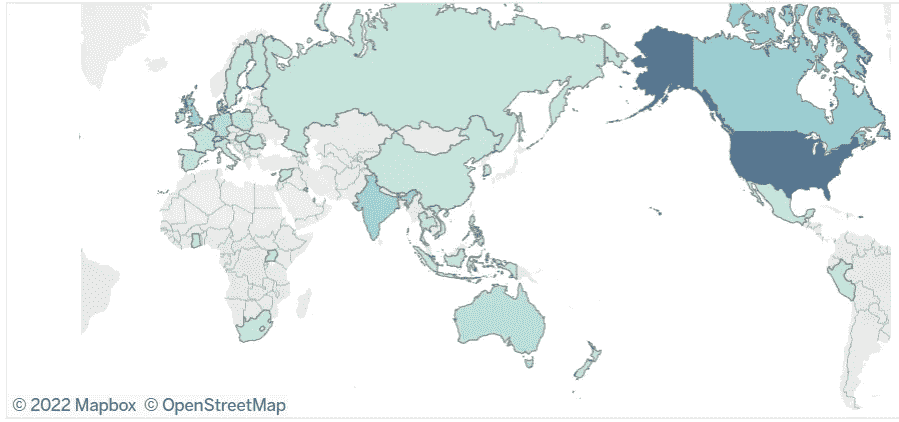
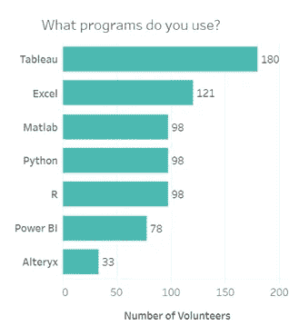
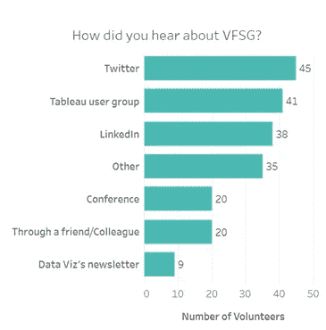
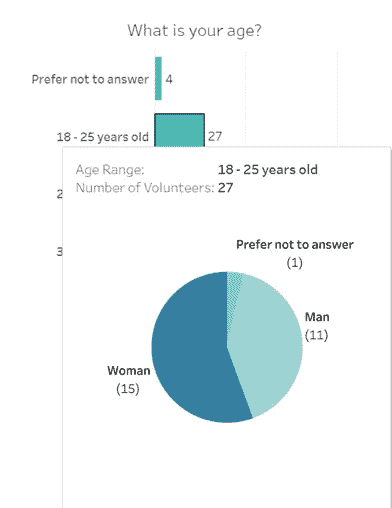
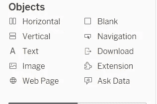
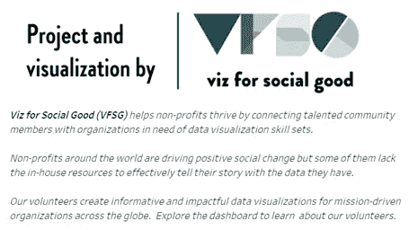
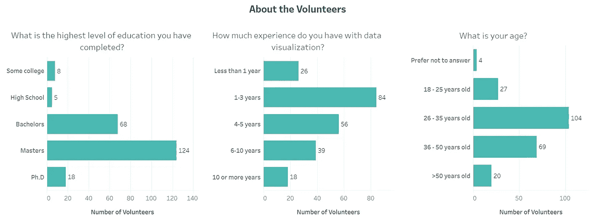
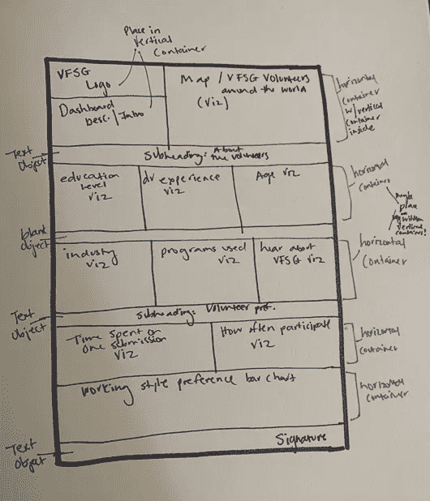

# 面向社会公益社区的 Viz 使用 Python 和 Tableau 进行分析

> 原文：<https://towardsdatascience.com/the-viz-for-social-good-community-an-analysis-using-python-tableau-63d19ed8376d>

## 了解面向社会公益志愿者的 Viz，为您的下一次可视化获取有用的提示，并了解如何参与其中

作者图片:Viz 代表世界各地的社会公益志愿者

最近，我通过 [Viz for Social Good (VFSG)](https://www.vizforsocialgood.com/) 参与了一个项目，这是一家帮助使命驱动型组织利用数据可视化的力量来促进社会变革的社会企业。你可能听说过他们之前与一些组织合作的项目，如[无国界学者](https://www.awb-usf.org/)、[通向繁荣的桥梁](https://www.vizforsocialgood.com/join-a-project/bridges-to-prosperity)和[女孩+数据](https://www.vizforsocialgood.com/join-a-project/2018/12/10/girls-data)。

VFSG 的最新项目 *Visualize our Community* ，让志愿者分析来自 VFSG 社区民意调查的数据，以帮助他们更好地了解他们当前的志愿者基础，确定招募工作，并帮助确定他们应该与哪些非营利组织合作。

在这篇文章中，我将提供一个项目的概述，有趣的见解，和有用的提示，你可以应用到你的下一个仪表板！

# 项目概述

对于 *Visualize our Community* 项目，VFSG 志愿者获得了一个数据集，以帮助 VFSG 了解他们当前的志愿者，并确定未来的合作组织。

[数据集](https://drive.google.com/drive/folders/1-YFp_09yx9uI2LRrm3CnpZEe9Aor7PJ-)由 19 个字段组成，每个字段代表一个来自 VFSG 社区匿名投票的问题。调查中的问题涵盖了广泛的人口统计信息，如年龄、教育水平和原籍国。其中两个问题是自由文本回答，而其他几个问题允许受访者从多个选项中进行选择。数据集的性质促使我决定使用 Python 和 Tableau Public 来分析数据——Python 用于快速清理和操作数据，Tableau Public 用于设计有效的可视化。

使用 Python，我从现有字段中创建了一些新字段，包括*程序数量*，它反映了志愿者用于数据可视化的不同技术的数量，以及志愿者使用的每种技术的单独布尔列(即 Tableau、Excel、Cognos、Alteryx 等)。).

这个 Python 脚本随后被用来生成一个新的数据集，该数据集被上传到 Tableau Public 以开发可视化。完整的 Python 脚本和最终数据集可以在[这里](https://github.com/payalnpatel/Tableau/tree/main/VFSG/VisualizeOurCommunity)找到。

# 洞察力

一旦我创建了一个干净的数据集，我就开始在 Tableau 中开发可视化工具，最终用于 VFSG 的仪表板。

从这个数据集中获得了一些有趣的见解，我在下面强调了其中的一些。

## 洞察 1 : Tableau 和 Excel 是 VFSG 志愿者使用最多的两个工具。

下图显示了 VFSG 志愿者在项目中使用的 7 大工具，包括许多市场领先的开源、商业智能和数据混合工具。Tableau 和 Excel 是当今市场上众多工具中 VFSG 志愿者的最爱。

作者图片:VFSG 志愿者使用的 7 大程序

## 洞察力 2:大多数 VFSG 志愿者在美国或加拿大。

虽然大多数 VFSG 志愿者位于美国和加拿大，但也有一些志愿者遍布全球。如下文所述，一些志愿者也在欧洲和亚洲工作，特别是在英国和印度。

作者图片:全球 VFSG 志愿者

## **洞察 3:大多数志愿者是通过推特找到 VFSG 的。**

下图显示了志愿者发现 VFSG 的前 7 个渠道。Twitter、Tableau 用户群和 LinkedIn 占据了前 3 名。有趣的是，大量的流量来自 Tableau 用户群，正如我们之前看到的，大量的 VFSG 志愿者使用 Tableau 来创建数据可视化。

作者图片:志愿者发现 VFSG 的 7 大途径

要了解更多信息，请查看 [Tableau Public](https://public.tableau.com/views/VizforSocialGood-VisualizetheCommunity/VFSGDashboard?:language=en-US&:display_count=n&:origin=viz_share_link) 上的整个仪表盘。

# 有用的提示

在为 VFSG 创建可视化和仪表板时，我使用了几种技术——下面我重点介绍了几个关键技术，您可以在下一个可视化或仪表板中实现它们！

## 技巧 1:利用 Tableau 的双轴特性将多个度量值合并到一个图表中

双轴是两个相互层叠的独立轴。它们允许您在单个可视化中比较多个度量。

VFSG 的数据集中有一栏列出了每个人自愿使用的技术。在 Python 中，我将这个列分成多个布尔列，每个产品一个。如果一名志愿者使用了特定的技术来创建可视化效果，那么这个值就被设置为 1，如果没有，那么这个值就被设置为 0。

为了在一个可视化视图中查看所有这些产品专栏，我利用了 Tableau 中的双轴特性。

为了创建可视化，如上面的洞察#1 所示，我执行了以下步骤:

1.  在新的工作表中，将两个度量放在*行*架上(例如 Alteryx 和 Tableau)
2.  选择下拉菜单选择*行 s* helf 上的一个测量
3.  从下拉选项中选择*双轴*
4.  从*演示*选项卡中选择*水平条形图*
5.  在*滤镜卡*上，选择*编辑滤镜*
6.  选择您希望包含在可视化中的所有度量，然后选择*确定*(在此可视化中，我选择了产品特定的度量。)
7.  添加完所有度量后，对可视化进行格式化和排序

*注意:在第 6 步中，从过滤器卡中选择度量可以更快地将每个度量添加到图表中，而不是将每个度量单独添加到行架中*

## 技巧 2:给工具提示添加可视化效果

在 Tableau 中，工具提示是当您将鼠标悬停在可视化标记上时显示的细节。工具提示是一种很好的方式，可以在可视化中添加额外的上下文和信息，同时充分利用您的仪表板空间。

对于 VFSG 仪表板，我在一些工具提示中添加了可视化效果，包括显示志愿者年龄分布的条形图。

作者图片:来自“你的年龄是多少？”条形图

通过在*的工具提示中添加可视化效果，“你的年龄是多少？”*条形图，我能够为用户提供另一个视图来进一步深入数据。在上面的例子中，我们可以看到 18-25 岁年龄组的性别细分。

向工具提示添加可视化效果:

1.  导航到包含要添加工具提示的可视化的工作表(在上面的示例中，这将是*“你的年龄是多少？”*条形图)
2.  从左侧的*标志卡*中选择*工具提示*
3.  在随后的屏幕上，从菜单选项中选择*插入*
4.  选择包含要添加到工具提示中的可视化效果的工作表(在上面的示例中，这是包含性别身份细分饼图的工作表)
5.  选择*确定*，然后悬停在可视化上的标记上，查看更新的工具提示！

## **提示 3:使用容器在你的仪表板中放置可视化效果**

在 Tableau 中创建仪表板时，有几个对象可以利用，比如水平和垂直容器！

按作者分类的图像:Tableau 仪表板的可用对象

容器是在仪表板中组织对象的好方法。水平容器允许您将可视化效果并排放置在一行中，而垂直容器允许您将可视化效果堆叠在一列中。使用容器，您还可以选择在容器内均匀分布可视化效果。

对于 VFSG 仪表板，我使用了一个垂直容器来保存 VFSG 徽标和仪表板描述，如下图所示。这个垂直容器包含一个 VFSG 徽标的图像对象和一个仪表板描述的文本对象。

作者图片:VFSG 仪表板中的垂直容器

我还使用了几个水平容器。在*关于志愿者*部分的条形图中使用了一个水平容器。

作者图片:VFSG 仪表板中的水平容器

这个水平容器由 3 个条形图组成，均匀分布在容器中。

要平均分配容器中的内容物:

1.  选择容器中的一个可视化效果或对象
2.  选择对象的下拉菜单
3.  从下拉菜单选项中选择*选择容器:水平*
4.  选择容器的下拉菜单
5.  最后，选择*平均分配内容*

使用容器可能有点棘手，所以就我个人而言，在我创建仪表板之前，我喜欢勾画出一个布局来作为指南。在处理多个容器时，有一个草图是有帮助的——仅仅因为你画出了一些东西，并不意味着以后不能调整它！

**额外提示:**水平&垂直容器可以互相使用！我为 VFSG 仪表板这样做了，当您想在一个仪表板中使用多个对象和可视化时，我强烈推荐这样做！

看看我为 VFSG 仪表板画的草图，看看我是如何使用水平和垂直容器的。

作者图片:VFSG 仪表板草图

在 [Tableau Public](https://public.tableau.com/views/VizforSocialGood-VisualizetheCommunity/VFSGDashboard?:language=en-US&:display_count=n&:origin=viz_share_link) 上查看最终仪表板，在 [GitHub](https://github.com/payalnpatel/Tableau/tree/main/VFSG/VisualizeOurCommunity) 上查看代码/数据集。

即社会公益运动有几名积极分子。如果你对志愿服务感兴趣，注册 VFSG 时事通讯，随时了解你可以参与的新项目。

*Payal 是 IBM 的一名数据科学家。在业余时间，她喜欢阅读、旅游和写作。如果你喜欢她的作品，* [*在这里订阅*](https://medium.com/@payal-patel) *她的列表，不要错过任何一个故事！*

*以上文章是个人观点，不代表 IBM 的立场、策略或观点。*

**参考文献**

[1]:即社会公益。(2022 年 1 月 12 日)。 *Viz for Social Good- Visualize 我们的社区数据集*[https://drive . Google . com/drive/folders/1-YFp _ 09 yx 9 ui 2 lr m3 cnpzee 9 AOR 7 pj-](https://drive.google.com/drive/folders/1-YFp_09yx9uI2LRrm3CnpZEe9Aor7PJ-)