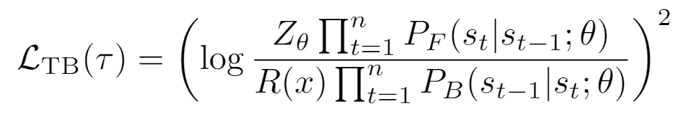
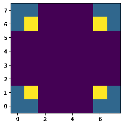
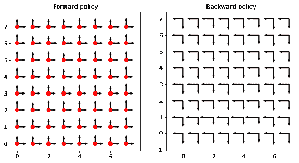
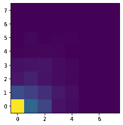
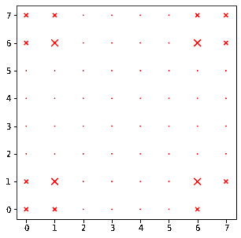
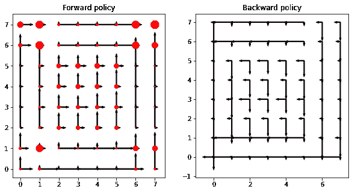
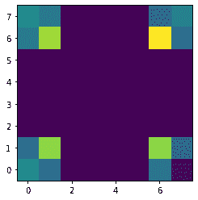

# 生成流网络是什么，为什么和如何

> 原文：<https://towardsdatascience.com/the-what-why-and-how-of-generative-flow-networks-4fb3cd309af0>

## 在 TensorFlow 2 中构建第一个 GFlowNet 的指南


组合对象是由积木组成的。(照片由[鲁本·汉森](https://unsplash.com/@rhfhanssen?utm_source=medium&utm_medium=referral)在 [Unsplash](https://unsplash.com?utm_source=medium&utm_medium=referral) 上拍摄)

生成流网络(GFlowNets)是一种机器学习技术，用于以与其相关联的回报成比例的频率生成合成对象。

在本文中，我们将解释所有这些词的含义，概述 GFlowNets 为什么有用，讨论它们是如何被训练的，然后我们将剖析 TensorFlow 2 的实现。

# 建立你的直觉

2021 年，Emmanuel Bengio 和合著者在 [NeurIPS 推出了 GFlowNets。GFlowNets 是一种深度学习技术，用于以与环境中这些对象的预期回报成比例的频率“构建对象”。](https://arxiv.org/abs/2106.04399)

他们第一篇论文中令人振奋的例子是新化学结构的发现(或者我也将它们称为“分子”)。化学结构或分子是“组成的”，因为它们是由离散的构件(原子)组成的。可以测试化学结构的感兴趣的性质，例如抗生素活性。一些分子是强效抗生素——当在实验室中对细菌进行测试时，大多数细菌都会死亡，并获得一个我们可以认为是巨大“奖励”的测量值。大多数分子不会杀死细菌，因此，从实验室测试中返回一个小的“奖励”值。


分子是由原子构成的。一些分子具有抗生素特性，但大多数没有。(照片由[特里·维利迪斯](https://unsplash.com/@vlisidis?utm_source=medium&utm_medium=referral)在 [Unsplash](https://unsplash.com?utm_source=medium&utm_medium=referral) 上拍摄)

GFlowNet 是构建对象的概率模型。一般来说，GFlowNet 的使用方式如下:

1.  从起点开始，它输出可能的构建块的概率分布。
2.  它根据预测的分布随机选择一个构造块。请注意，这一步是随机的。有些行动会更有可能，有些会更少。
3.  添加完第一个构建块后，它接受到这一点的构建对象作为输入，并在可能的构建块上生成一个新的概率分布，然后添加下一个。
4.  它以这种方式进行，直到选择一个终止动作。
5.  终止操作完成生成的对象，然后可以根据环境查询该对象以获得相关的奖励值。

需要了解的一些关键事项:

*   施工被视为一个[马尔可夫过程](https://en.wikipedia.org/wiki/Markov_chain)。也就是说，当选择下一个构建块时，唯一的输入是正在构建的对象的当前状态。
*   我们一直使用“积木”的形象，但“行动”可能是更合适的术语。当构建一个分子时，你不仅要选择一个碳原子，还要选择它的位置。将每一步都看作是选择一个动作，这样更容易想象 GFlowNets 的其他应用。在下面的代码示例中，我们通过在网格中移动来构建路径。每个动作都是对相邻单元的一步。
*   学习可能行动的概率分布(我们将很快讨论如何完成)。预测的分布被称为“策略”。
*   该模型最直观的部分是“远期政策”。这是建设性的部分，输出了下一步行动的概率分布。该模型还包括一个“向后策略”，它描述了可以导致当前状态的动作的分布。
*   从开始到结束的一系列完整的动作称为“轨迹”。

现在你知道了 GFlowNets 是构造对象的概率模型。GFlowNets 的关键特征是，它们以与回报成比例的频率构建对象*。*

如果你多次重复这个随机的构建过程，你会在高回报区域得到更多的物体，在低回报区域得到更少的物体。以我们的抗生素分子为例，该模型将生成更多类似于强抗生素的分子，但也会生成一些类似于弱抗生素的分子。输出概率将与回报成正比。

Emmanuel Bengio 写了一篇[博文](http://folinoid.com/w/gflownet/)和附带的[教程](https://milayb.notion.site/GFlowNet-Tutorial-919dcf0a0f0c4e978916a2f509938b00)，值得研究。

# 物流网的应用

现在你明白 GFlowNet 是做什么的了。你为什么想要一个？它们是用来做什么的？

它们用于从非常大的环境中进行智能采样。

例如，坚持化学结构的例子，假设你有一些训练数据开始(一堆化学结构和它们相关的抗生素活性)。你首先训练一个模型(独立于你的 GFlowNet ),它可以预测给定化学结构的抗生素活性。我们姑且称之为*代理*奖励函数，因为它是目前化学结构和抗生素“奖励”之间关系的最佳表征。现在你想用你的代理模型来挑选新的、未经测试的化学结构，在实验室里进行试验。

那么，你的下一步是什么？一种继续进行的方法是使用你的训练数据作为起点，详尽地生成每一种可能的化学结构。困难在于空间呈指数增长。即使从仅仅 10 或 20 个可能的“积木”开始，你也可以在每个分子上有许多可能的位置，导致数百个可能的动作。如果你详尽地列举这种行为的每一种组合，仅仅经过几个步骤，你就会有数十亿种可能性，你很快就会淹没你的计算资源，甚至没有开始探索可能的化学空间。

另一种方法是随机选择行动，这将让你更深入地探索，但不是穷尽。这种方法的问题是均匀随机性。由于大多数分子不是抗生素，很可能绝大多数取样结构的回报很低。

这就是 GFlowNets 的切入点。首先训练一个 GFlowNet 来反映代理模型学习到的奖励函数。然后，使用 GFlowNet 生成许多结构，并使用代理模型对它们进行优先级排序。这样，你已经从可能的化学空间中取样，但是以一种丰富有希望的候选者的方式，同时也允许对不太有希望的结构进行一些探索。

换句话说，GFlowNets 用于从非常非常大的环境中进行智能采样。

# 如何训练 GFlowNets

现在你知道什么是 GFlowNets，以及它们是如何使用的了。你如何训练一个模型来展示你想要的行为？你如何训练一个模型来生成与奖励成比例的对象？

关于这个主题的深入讨论，我将向您推荐[这篇论文](https://arxiv.org/abs/2201.13259)，它讨论了可用于训练 GFlowNets 的各种目标函数。出于本文的目的，我们将坚持轨迹平衡。

现在我们到了 GFlowNets 的“流”部分。作者让我们把环境中所有可能的轨迹想象成一个有水流过的管道网络。每个“管道”都是从一个状态到另一个状态的动作。水从原点(所有轨迹的起点)流过所有的动作，在已知“回报”的终点状态流出。目标是通过管道分配水，使流出的水量与回报成比例。

弹道平衡损失函数是实现这一目标的一种方法。对于每条轨迹，概率的前向流动(从起点到终点状态)应该与从终点状态到起点的回报流动成比例。也就是说，沿着轨迹的前向政策概率的乘积应该与沿着相同轨迹的后向政策概率和回报的乘积成比例。写成一个损失函数，看起来像这样:



来自[马尔金等人](https://arxiv.org/abs/2201.13259)的方程 14。

其中:

*   z 是一个单一的学习值，表示从原点通过整个网络的总流量。
*   P_F 是前向策略，P_B 是后向策略。注意，对于每一条轨迹，你沿着轨迹取每一个动作的概率的乘积。
*   r 是与特定轨迹相关的报酬。也就是说，它是轨迹产生的物体的回报。
*   θ代表将被改变以最小化该函数的模型参数。
*   n 是计算损失值的轨迹长度。

直观来看，内部分是前向流(从起点到终点)与后向流(从回报到起点)的比值。理想情况下，该比率将收敛到 1。取该比值的*对数*意味着如果向前的流量较大，*对数*将大于零。如果回流较大，对数将小于零。取整件事的平方，最小值将为零(即 *log* 内部的比值将为 1)。

这种安排的另一个好处是，当把许多概率相乘时，我们避免了下溢的问题。乘法变成对数下的和。

为训练集中的每个样本计算该轨迹平衡损失函数。很关键的一点是，奖励和终态在你的训练数据中是固定值，但是*轨迹是学习到的*。在每一个学习时期，向前和向后的政策都将改变，模型将决定平衡概率的行动顺序，以便正确地反映回报。

# 在 TensorFlow 2 中构建一个 GFlowNet

现在，您已经理解了什么是 GFlowNets，为什么它们有用，以及它们是如何被训练的，您已经准备好构建一个 GFlowNets 了。作者在 github 上提供了他们所有的[代码，你绝对应该研究一下。虽然本吉奥实验室使用](https://github.com/GFNOrg/gflownet) [PyTorch](https://pytorch.org/) 实现了他们的 GFlowNets，但我们将使用 [TensorFlow 2](https://www.tensorflow.org/) 。

本教程的所有代码可以在:[https://github.com/mbi2gs/gflownet_tf2/](https://github.com/mbi2gs/gflownet_tf2/)找到

## 环境

首先，在最初的 GFlowNet 出版物中描述的环境是一个 n 维立方体，其边长为 *H* ，奖励函数在角上最高。对于这个例子，我们将使用一个 2 维的 8x8 网格，因为它很容易绘制和观察发生了什么。文件` [env.py](https://github.com/mbi2gs/gflownet_tf2/blob/main/env.py) '定义了**re warden environment**类。奖励环境的核心是一个基于输入坐标计算奖励的函数:

```
def reward_fn(self, coord):
   """Calculate reward function according to section 4.1 in
   [https://arxiv.org/abs/2106.04399.](https://arxiv.org/abs/2106.04399.)
   :param x_coord: (array-like) Coordinates
   :return: (float) Reward value at coordinates
   """
   assert len(coord) >= 1
   assert len(coord) == self.dim
   r1_term = 1
   r2_term = 1
   reward = self.r0
   for i in range(len(coord)):
      r1_term *= int(0.25<np.abs(coord[i]/(self.length-1)-0.5))
      r2_term *= int(
                 0.3 < np.abs(coord[i]/(self.length-1)-0.5)<= 0.4)
      reward += self.r1*r1_term + self.r2*r2_term
   return reward
```

最终的环境看起来是这样的，较低的奖励用紫色，最高的奖励用黄色。



[电池 3 输出](https://github.com/mbi2gs/gflownet_tf2/blob/main/gflownet_demo.ipynb)

## 向前和向后采样

**GFNAgent** 类在 [gfn.py.](https://github.com/mbi2gs/gflownet_tf2/blob/main/gfn.py) 中定义，从转发策略采样需要:

*   从原点`(0,0)`开始。
*   使用该模型生成可能动作(向上、向右或终止)的概率分布。
*   根据概率选择行动。
*   应用终止或移动到新位置的动作。
*   继续，直到终止操作。

理解采样过程是理解 GFlowNet 实际工作的最佳方式。在 python 中，前向采样函数如下:

```
def sample_trajectories(self, batch_size=3, explore=False):
   """Sample `batch_size` trajectories using the current policy.
   :param batch_size: (int) Number of trajectories to sample
   :param explore: (bool) If True, mix policy with uniform
                   distribution to encourage exploration.
   :return: (tuple of nd.array) (trajectories, one_hot_actions,
            rewards)
   """
   # Start at the origin
   still_sampling = [True]*batch_size
   positions = np.zeros((batch_size, self.dim), dtype='int32')
   trajectories = [positions.copy()]
   one_hot_actions = []
   batch_rewards = np.zeros((batch_size,))
   for step in range(self.max_trajectory_len-1):
      # Convert positions to one-hot encoding
      one_hot_position = tf.one_hot(
                           positions, self.env_len, axis=-1)
      # Use forward policy to get log probabilities over actions
      model_fwrd_logits = self.model.predict(one_hot_position)[0]
      model_fwrd_probs = tf.math.exp(model_fwrd_logits)
      if explore:
         # Mix with uniform distribution to encourage exploration
         unif = self.unif.sample(
                   sample_shape=model_fwrd_probs.shape[0])
         model_fwrd_probs = self.gamma*unif + \
                           (1-self.gamma)*model_fwrd_probs
      # Don’t select impossible actions (like moving out of
      # the environment)
      normalized_actions = self.mask_and_norm_forward_actions(
                                   positions, model_fwrd_probs)
      # Select actions randomly, proportionally to input
      # probabilities
      actions = tfd.Categorical(probs=normalized_actions).sample()
      actions_one_hot = tf.one_hot(
                          actions, self.action_space).numpy()
      # Update positions based on selected actions
      for i, act_i in enumerate(actions):
         if act_i == (self.action_space — 1) and still_sampling[i]:
            still_sampling[i] = False
            batch_rewards[i] = self.env.get_reward(positions[i,:])
         elif not still_sampling[i]:
            positions[i,:] = -1
            actions_one_hot[i,:] = 0
         else:
            positions[i, act_i] += 1
      trajectories.append(positions.copy())
      one_hot_actions.append(actions_one_hot)
   return np.stack(trajectories, axis=1), \
          np.stack(one_hot_actions, axis=1), \
          batch_rewards
```

一些需要强调的细节:

*   在提供给模型之前，位置坐标被转换成一个热点矢量。
*   有一个“探索”的选项，将统一分布与模型策略混合起来，作为一种鼓励非策略决策的方式。Gamma 是控制探索程度的参数(通过控制策略和统一的混合比例)。
*   有些动作是不可能的，但是模型一开始并不知道(比如将模型带出环境的动作)。我们执行一个屏蔽步骤来迫使不可能的动作的概率为零。同时，你稍后会看到，我们也在训练模型识别那些不可能的步骤。
*   上面的函数一次采样多个轨迹。对于每个终止的轨迹，添加一个填充符号(`-1`)，而其余的完成采样。

采样反向轨迹非常相似(参考" [back_sample_trajectory()](https://github.com/mbi2gs/gflownet_tf2/blob/aece0a5463dc0df4d1773bebdb136efbb35fe317/gfn.py#L183) "函数)，但是使用向后策略而不是向前策略。落后的政策可能感觉没有必要，但它是实现工作模式的关键。在训练过程中，每次一对*(位置，奖励)*被输入到模型中，它就从反向策略中采样，将奖励流回原点，然后将正向策略与反向采样的轨迹匹配，一个动作接一个动作。我们将在下一节中看到它是如何在代码中工作的，但是要知道向后策略是必要的！

## 训练循环

训练过程从采样轨迹开始，并通过查询环境来确定奖励。可以反复采样，然后训练，然后采样，然后训练。每次迭代，模型都会更好地逼近环境，如果 GFlowNet 可以学习任何奖励结构，它将通过从未知区域智能采样来加速探索过程。也可以从独立于 GFlowNet 策略收集的训练数据集开始(这被称为“离线”训练)。对于本教程，我们将使用离线培训。

训练过程从混洗和分批训练数据开始。在这个演示中，我们使用一个生成器函数" [train_gen()](https://github.com/mbi2gs/gflownet_tf2/blob/aece0a5463dc0df4d1773bebdb136efbb35fe317/gfn.py#L286) "来生成 10 个(位置，回报)对的混洗批次，每个时期遍历整个数据集。

“ [train()](https://github.com/mbi2gs/gflownet_tf2/blob/aece0a5463dc0df4d1773bebdb136efbb35fe317/gfn.py#L376) ”函数遍历预设数量的历元。在每个时期内，它为每个训练样本计算一个损失值，并由此对模型权重进行梯度更新。如果历元期间的平均损失低于任何先前的损失，则保存模型权重。这样，最后可以加载最佳的一组砝码。

```
def train(self, verbose=True):
   """Run a training loop of `length self.epochs`.
   At the end of each epoch, save weights if loss is better
   than any previous epoch.
   At the end of training, read in the best weights.
   :param verbose: (bool) Print additional messages while training              
   :return: (None) Updated model parameters
   """
   if verbose:
      print('Start training...')
   # Keep track of loss during training
   train_loss_results = []
   best_epoch_loss = 10**10
   model_weights_path = './checkpoints/gfn_checkpoint'
   for epoch in range(self.epochs):
      epoch_loss_avg = tf.keras.metrics.Mean()
      sampler = self.train_gen()
      # Iterate through shuffled batches of deduplicated data            
      for batch in sampler:
         loss_values, gradients = self.grad(batch)                
         self.optimizer.apply_gradients(                    
          zip(gradients, self.model.trainable_variables + [self.z0])                
         )
         losses = []
         for sample in loss_values:
            losses.append(sample.numpy())
         epoch_loss_avg(np.mean(losses))
      # If current loss is better than any previous, save weights                     
      if epoch_loss_avg.result() < best_epoch_loss:                      
         self.model.save_weights(model_weights_path)                    
         best_epoch_loss = epoch_loss_avg.result()
      train_loss_results.append(epoch_loss_avg.result())            
      if verbose and epoch % 9 == 0:
         print(f'Epoch: {epoch} Loss: {epoch_loss_avg.result()}')       
      # Load best weights              
      self.model.load_weights(model_weights_path)
```

使用“ [grad()](https://github.com/mbi2gs/gflownet_tf2/blob/aece0a5463dc0df4d1773bebdb136efbb35fe317/gfn.py#L364) 函数计算渐变。这个函数使用 tf。GradientTape()对象来计算每个模型参数相对于损失的梯度。请注意，参数“`z0`”被添加到正在更新的参数列表中。

## 损失函数

训练过程的核心是轨迹平衡损失函数。回想一下，还有其他损失函数可以使用，但是轨迹平衡往往优于以前的方法(见脚注 3)。

```
def trajectory_balance_loss(self, batch):
   """Calculate Trajectory Balance Loss function as described in
   [https://arxiv.org/abs/2201.13259.](https://arxiv.org/abs/2201.13259.)
   I added an additional piece to the loss function to penalize
   actions that would extend outside the environment.
   :param batch: (tuple of ndarrays) Output from self.train_gen()    
                 (positions, rewards)
   :return: (list) Loss function as tensor for each value in batch
   """
   positions, rewards = batch
   losses = []
   for i, position in enumerate(positions):
      reward = rewards[i]
      # Sample a trajectory for the given position using
      # backward policy
      trajectory, back_actions = self.back_sample_trajectory(
                                                    position)
      # Generate policy predictions for each position in trajectory
      tf_traj = tf.convert_to_tensor(
                   trajectory[:,…], dtype=’float32')
      forward_policy, back_policy = self.model(tf_traj)
      # Use “back_actions” to select corresponding forward
      # probabilities
      forward_probs = tf.reduce_sum(
          tf.multiply(forward_policy, back_actions),
          axis=1)
      # Get backward probabilities for the sampled trajectory
      # (ignore origin)
      backward_probs = tf.reduce_sum(
         tf.multiply(back_policy[1:,:],
         back_actions[:-1,:self.dim]),
         axis=1)
      # Add a constant backward probability for transitioning 
      # from the termination state
      backward_probs = tf.concat([backward_probs, [0]], axis=0)
      # take log of product of probabilities (i.e. sum of log 
      # probabilities)
      sum_forward = tf.reduce_sum(forward_probs)
      sum_backward = tf.reduce_sum(backward_probs)
      # Calculate trajectory balance loss function and add to 
      # batch loss
      numerator = self.z0 + sum_forward
      denominator = tf.math.log(reward) + sum_backward
      tb_loss = tf.math.pow(numerator — denominator, 2)
```

损失分别应用于每个*(位置，奖励)*对。注意，给定一个训练位置，第一步是使用向后策略对返回原点的轨迹进行采样。然后，为该采样轨迹中的每个位置计算相应的前向概率。`z0`乘以向前概率与回报乘以向后概率的比例形成了最终的损失值，但是我们应用了对数，所以乘法变成了加法。

请注意，本演示中的向后策略不包括终止可能性。相反，第一个向后动作总是被假定为终止动作，所以我们只在第一个向后步骤中包括一个恒定的可能性。从那里一直回到原点，我们只采样转移概率。请注意，从原点的转移概率没有定义，并被排除在后向轨迹之外。

最后，我们增加了一些额外的损失条款来惩罚不可能的行为，比如离开环境。我们通过识别环境边缘的位置，合计从该边缘到环境之外的概率，并将这些错误的总和加到损失中。我们对向前和向后策略都这样做。

```
 # Penalize any probabilities that extend beyond the 
      # environment
      fwrd_edges = tf.cast(
         np.argmax(trajectory, axis=2) == (self.env_len-1),
         dtype=’float32')
      back_edges = tf.cast(
         np.argmax(trajectory, axis=2) == 0,
         dtype=’float32')
      fedge_probs = tf.math.multiply(
         tf.math.exp(forward_policy[:,:self.dim]),
         fwrd_edges)
      bedge_probs = tf.math.multiply(
         tf.math.exp(back_policy[:,:self.dim]),
         back_edges)[1:,:] # Ignore backward policy for the origin
      fedge_loss = tf.reduce_sum(fedge_probs)
      bedge_loss = tf.reduce_sum(bedge_probs)
      combined_loss = tf.math.add(
         tb_loss, tf.math.add(fedge_loss, bedge_loss))
      losses.append(combined_loss)
   return losses
```

## 示范

笔记本“ [gflownet_demo.ipynb](https://github.com/mbi2gs/gflownet_tf2/blob/main/gflownet_demo.ipynb) ”将所有的片段放在一起，组成一个离线培训工作流程。

我们首先初始化一个 GFlowNet 代理(它也初始化一个奖励环境)。

```
from gfn import GFNAgent
agent = GFNAgent()
```

调用`agent.model.summary()`向我们展示了模型结构，默认情况下，它由两个密集层组成，每层 32 个单元，一个密集的向前策略和一个密集的向后策略。共有 1765 个可训练参数，另外还有一个用于`z0`。

未经过训练的策略，在初始化之后看起来非常一致。垂直或横向转变(箭头)或终止(红色八边形)的可能性在每一点上基本一致。

```
agent.plot_policy_2d()
```



[电池 8 输出](https://github.com/mbi2gs/gflownet_tf2/blob/main/gflownet_demo.ipynb)

我们可以通过对许多轨迹进行采样，并估计在环境中每个位置结束的可能性，来可视化这种未经训练的策略的结果。

```
l1_error_before = agent.compare_env_to_model_policy()
```



[电池 9 输出](https://github.com/mbi2gs/gflownet_tf2/blob/main/gflownet_demo.ipynb)

请注意，大多数轨迹都在原点附近结束。鉴于每个职位都有很高的终止可能性，这是意料之中的。训练的目标是让这个情节看起来更像奖励景观(每个角落的模式)。记住，一个训练有素的 GFlowNet 生成对象的概率与回报成正比。

出于演示的目的，我们从环境中深入取样，直到大多数职位及其相关报酬都在数据集中。请注意，训练数据是重复的，因此只表示唯一的*(位置，奖励)*对。在这种情况下，在对 5000 个轨迹进行采样后，我们最终得到了所有四种模式(每个角中的最大值)和几乎所有的 64 个(8×8)位置。采样数据显示在下图中，x 的大小与该点的回报成比例。

```
agent.sample(5000)
agent.plot_sampled_data_2d()
```



[电池 6 输出](https://github.com/mbi2gs/gflownet_tf2/blob/main/gflownet_demo.ipynb)

现在我们训练模型！

```
agent.train()
```

训练进行 200 个时期，在停止之前，损失大约减少两个数量级。

```
Start training…
Epoch: 0 Loss: 5.823361873626709
Epoch: 9 Loss: 1.9640847444534302
Epoch: 18 Loss: 1.6309585571289062
Epoch: 27 Loss: 1.0532681941986084
… … … …
Epoch: 171 Loss: 0.03023693338036537
Epoch: 180 Loss: 0.050495393574237823
Epoch: 189 Loss: 0.046723444014787674
Epoch: 198 Loss: 0.06047442555427551
```

经过训练，我们可以再次可视化策略，看起来有了很大的改善。

```
agent.plot_policy_2d()
```



[电池 11 输出](https://github.com/mbi2gs/gflownet_tf2/blob/main/gflownet_demo.ipynb)

最后，我们[通过使用学习到的向前策略对 2000 个轨迹进行采样，来可视化环境](https://github.com/mbi2gs/gflownet_tf2/blob/aece0a5463dc0df4d1773bebdb136efbb35fe317/gfn.py#L412)中每个位置的结束概率。

```
l1_error_after = agent.compare_env_to_model_policy()
```



[电池 12 输出](https://github.com/mbi2gs/gflownet_tf2/blob/main/gflownet_demo.ipynb)

这看起来更像他们奖励景观！当然，它并不完美，你可以花很多时间调整超参数来完善模型。但是，这无疑是在学习一个明智的政策。

我们还可以使用 L1 误差(每个位置差异的绝对值)来比较学习的概率分布(根据学习的策略绘制许多轨迹来估计)和目标(归一化奖励环境)。

在训练之前，L1 误差是 1.5，而在训练之后，它减小到 0.2。

# 结论

现在你知道什么是 GFlowNet，它们为什么有用，以及它们是如何被训练的。您已经完成了演示，可以研究 TensorFlow 2 中的实现。您已经准备好构建自己的应用程序并将其应用到自己的工作中。祝学习优秀政策好运！