# Word2vec 分类器

> 原文：<https://towardsdatascience.com/the-word2vec-classifier-5656b04143da>

## [单词嵌入入门](https://towardsdatascience.com/tagged/word-embeddings-primer)

## 如何训练单词嵌入

由[穆库尔·瓦德瓦](https://unsplash.com/@mukulwadhwa)在 [Unsplash](https://unsplash.com/?utm_source=medium&utm_medium=referral) 上拍摄的照片

本文是 4ᵗʰ系列文章**中关于单词嵌入的入门:** 1。[word 2 vec 后面有什么](https://medium.com/@jongim/a-primer-on-word-embeddings-95e3326a833a) | 2。[单词成向量](https://medium.com/@jongim/words-into-vectors-a7ba23acaf3d) |
3。[统计学习理论](https://medium.com/@jongim/statistical-learning-theory-26753bdee66e) | 4。**word 2 vec 分类器** |
5。[word 2 vec 超参数](https://medium.com/@jongim/the-word2vec-hyperparameters-e7b3be0d0c74) | 6。[单词嵌入的特征](https://medium.com/@jongim/characteristics-of-word-embeddings-59d8978b5c02)

上一篇文章 [**统计学习理论**](https://medium.com/@jongim/statistical-learning-theory-26753bdee66e) 回顾了逻辑回归的概念和数学，以及如何使用浅层神经网络确定回归系数。在本文中，我们将扩展这些知识，学习 Word2vec 用来导出单词嵌入的分类算法的概念和数学。

# 基于预测的嵌入

在本系列第二篇文章讨论的向量空间模型中， [**单词到向量**](https://medium.com/@jongim/words-into-vectors-a7ba23acaf3d) ，向量是从全局语料库统计创建的。向量可以被修改、重新加权，甚至降维，但它们的来源是一种基于计数的方法。

适用于基于计数的方法的相同思想也包含在我们将在这里探讨的用于创建单词嵌入的神经网络方法中。

当使用机器学习来创建单词向量时，该算法使用关于单词的邻近关系的信息来训练其权重。使用 Word2vec，上下文信息是基于教导单词向量来预测单词所在的上下文。这就是为什么神经网络学习的单词向量，如 Word2vec 中的那些，据说使用了基于*预测的*方法(Almeida and Xexéo，2019；Voita，2020)。

此外，术语*嵌入*用于单词向量，因为从神经网络训练的角度来看，单词向量的值被“嵌入”在较低维度的空间中。

# Word2vec 的模型:CBOW 和 Skip-gram

Mikolov 等人的第一篇介绍 Word2vec 的论文(Mikolov 等人，2013a)描述了两种对数线性模型，可用于使用 Word2vec 导出单词嵌入:*连续单词包* (CBOW)和*连续跳格*，他们使用下图对其进行了对比:

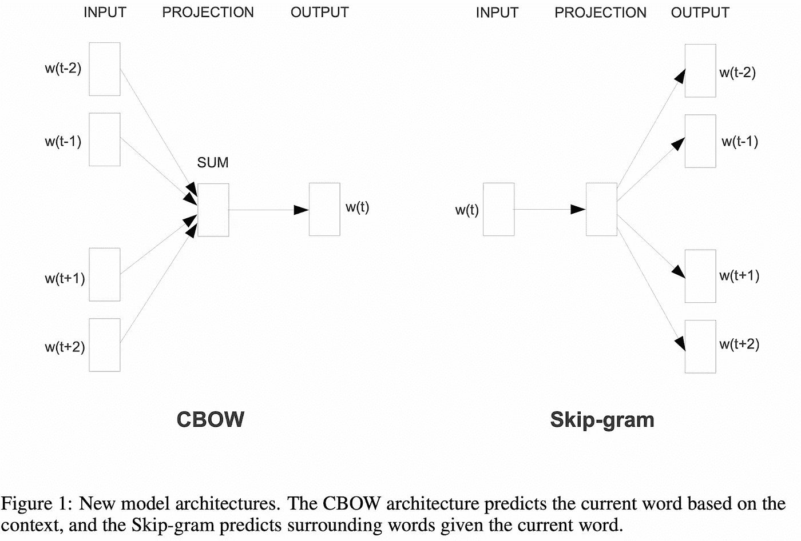

**Word2vec 模型架构** (Mikolov 等人，2013a)

在其基本形式中，CBOW 和 Skip-gram 使用多项式逻辑回归执行分类任务，这在本系列的前一篇文章 [**统计学习理论**](https://medium.com/@jongim/statistical-learning-theory-26753bdee66e) 中有所描述。对于分类，不是二元响应(用 0 或 1 表示的肯定或否定结果)，而是有多个结果(或类别)，其中每个单词是一个类别。多项式逻辑回归使用 softmax 函数作为其激活函数，而不是为逻辑回归引入的 sigmoid 函数。

与 CBOW 相比，Skip-gram 在每个语料库中执行更多的训练示例，并且对于小语料库和罕见单词产生更好的单词嵌入，但是 Skip-gram 在计算上更加密集。

Mikolov 等人的第二篇论文介绍了 Word2vec (Mikolov 等人，2013b)，详细介绍了采用 Skip-gram 模型时减少计算要求的两种方法:分层 Softmax 和负采样。

*分层 Softmax* 使用语料库词汇上霍夫曼编码的二叉树，在进行多项逻辑回归时，将 Softmax 的训练计算从 *O* ( *v* )减少到 *O* (log₂ *v* )。

*另一方面，负采样*将算法从多项式逻辑回归简化为更简单的逻辑回归，其中一个单词是匹配的(阳性)，而其他单词的子集(样本)不是匹配的。这种方法是噪声对比估计(NCE)的简化，它使用了前一篇文章中描述的二进制分类数学(包括 sigmoid 激活函数)。

在下一节中，我们将详细研究使用负抽样的跳格模型。

# 负采样跳跃图

让我们重温一下本系列第二篇文章中的共现矩阵示例， [**单词成向量**](https://medium.com/@jongim/words-into-vectors-a7ba23acaf3d) 。它包括出现在语料库中每个文档中的成对单词的计数。

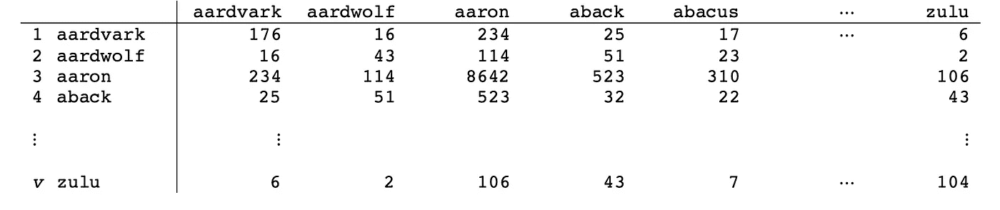

**同现矩阵示例**
(图片由作者提供，灵感来自 Potts 和 MacCartney，2019)

不包括文档级别的计数，现在让我们考虑当文档被读取时，每个单词之前的 *l* 个单词和之后的 *l* 个单词的窗口；也就是说，我们将在彼此的 *l* 单词距离内创建一个单词的连续单词对计数。我们将被评估的单词定义为目标单词 *t* 和围绕它的上下文单词 *c* 。

这种计数方法的结果是一个 *v* × *v* 矩阵(其中 *v* 是词汇表中的字数)。然而，当我们创建词对时，我们将通过机器学习技术来处理它们，将词向量长度限制在更少的维度，通常为 50-1000，最典型的是 300(Jurafsky 和 Martin，2019；曼宁，2021)。

这种机器学习技术是 Word2vec 的基础。该技术最大化了成对单词之间的点积，它将点积用作单词相似度的近似值。回想一下本系列的第二篇文章， [**单词成向量**](https://medium.com/@jongim/words-into-vectors-a7ba23acaf3d) ，那个余弦相似度，也就是归一化的点积，是最典型的比较单词向量的方式。

在每个训练步骤，我们将训练一个分类器，使用逻辑回归的概念，通过降维近似。对于每个目标单词，我们将最大化与其周围上下文单词的点积，同时最小化所有其他非上下文单词的点积。这种方法是 Word2vec 中 Skip-gram 算法的核心，它形成单词嵌入来预测每个目标单词周围的 2 个 *l* 上下文单词。

Skip-gram 负采样(SGNS)中的*负采样*通过允许算法仅处理上下文窗口中不存在的单词子集来简化训练。它还允许将训练算法的复杂性从多项式逻辑回归降低到二元逻辑回归。

作为题外话，回想一下 Word2vec 也可以以相反的方式训练。也就是说，Word2vec 可以通过让上下文单词预测最可能的目标单词来进行训练。这个版本的 Word2vec 被称为连续单词包(CBOW)。

在接下来的部分中，我们将开发 Word2vec SGNS 的数学，但是首先让我们回顾一些 Word2vec SGNS 的高级概念:

*   研究人员根据他们对最适合其应用的理解，在 Word2vec 之外对单词进行预处理(参见本系列第二篇文章中的“实验设计考虑”部分， [**单词到矢量**](https://medium.com/@jongim/words-into-vectors-a7ba23acaf3d) )。Word2vec 并不是简单地将原始文本作为数据。Word2vec 作者甚至提供了一种额外的预处理技术来查找文本中的短语，以便这些短语可以作为训练中的一个单元(Mikolov 等人，2013b)。
*   目标单词的“窗口”由目标单词之后的*和*之前的单词组成，不像一些早期的*n*gram 语言模型通过仅在目标单词之前查找来建立单词向量。
*   Word2vec 最大化由窗口大小定义的文本中彼此靠近的单词的向量的点积，同时最小化没有出现在窗口中的随机单词的点积。点积被用作余弦相似性的代理，余弦相似性在概念上也接近皮尔逊相关系数。
*   Word2vec 使用机器学习逻辑回归技术来训练分类器(对数线性),该分类器区分正面和负面(真和假)示例。训练的回归权重被用作单词嵌入。
*   Word2vec 在训练时使用了多种重新加权技术，包括下面这些，将在本系列的下一篇文章中详细讨论，[**word 2 vec 超参数**](https://medium.com/@jongim/the-word2vec-hyperparameters-e7b3be0d0c74) :

  P 修剪生僻字

 年代 子采样常用词

  D 根据与目标单词的距离，动态加权上下文窗口中的单词

  S 选择否定样词

*   需要优化培训的一组参数，并且需要完成充分的培训。

请注意，Word2vec 算法的某些方面没有公布或没有得到很好的定义(Goldberg 和 Levy，2014)。研究人员不得不通过阅读代码并从 Mikolov 等人的论文(Mikolov 等人，2013aMikolov 等人，2013 年 b)。

Word2vec 具有微妙性和复杂性，它的一些成功即使在今天也没有得到很好的理解(Goldberg 和 Levy，2014；Jurafsky 和 Martin，2019 年)，但这里有一个从 Goldberg 和 Levy 那里获得的有趣信息，为了与本文中使用的术语保持一致，对其进行了重新措辞:

> SGNS 没有建模 *P* ( *c|t* ) *，*而是一个与目标词 *t* 及其每个上下文 *c* 的联合概率相关的量。联合学习 *t* 和 *c* 的表示，使模型非凸。如果固定目标单词并仅在上下文表示上训练，或者固定上下文表示并仅学习目标表示，则该模型简化为逻辑回归，并且是凸的。*(戈德堡和利维，2014)*

对于统计师来说，Word2vec 值得强调的几点包括:

*   Word2vec 并不是从独立同分布(iid)的随机变量的原始数据开始的。我们处于机器学习领域，寻找最有效的方法，并应用统计学原理来帮助获得最成功的结果。
*   Word2vec 做了一个简化的假设，即语境词是独立的，这是不成立的(Jurafsky 和 Martin，2019)。
*   Word2vec SGNS 算法使用概率分类器，该分类器使用逻辑回归机器学习技术(如 softmax 或 sigmoid 函数进行归一化)的各个方面来分配概率，但结果并不完全是概率性的。
*   最后，尺寸受到设计的限制，使得 Word2vec 的结果只是一个近似值。

在高层次上，上面概述的几点是 Word2vec 如此重要的原因。Manning 是 GloVe (Pennington 等人，2014 年)的合著者，GloVe 是一种在 Word2vec 一年后推出的性能稍好的单词嵌入算法，他在*自然语言处理与深度学习*中对 Word2vec 这样说:

> “从某种意义上说，对将 NLP 世界转向神经网络方向产生最大影响的是托马斯·米科洛夫在 2013 年提出的一种算法，称为 Word2vec 算法。这是一种非常简单、非常可扩展的学习单词矢量表示的方式，它真正打开了闸门。”*(曼宁，2019)*

现在，让我们回顾一下 SGNS 的数学。

# SGNS 分类器

当在他们关于 Word2vec 的第二篇论文中定义负采样与 Skip-gram 一起使用时，Mikolov 等人从他们在第一篇论文中使用的 softmax 转向引用 sigmoid 函数的使用(Mikolov 等人，2013bMikolov 等人，2013a)。

在统计学中，sigmoid(或逻辑函数)在进行逻辑回归(即二元分类)时创建概率分布；然而，对于名义多项式模型，softmax 函数定义了概率分布。

SGNS 执行二元分类任务。给定两个词，来自上下文窗口内的目标词 *t* 和潜在上下文词 *c* ，SGNS 应该返回上下文词确实是来自语料库的上下文词的概率。

为了更好地说明这种二元分类是如何工作的，让我们来看一个句子中的短语:

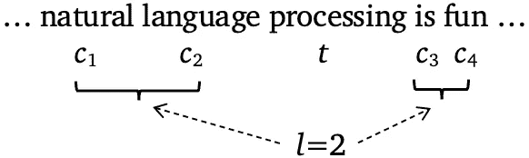

(图片由作者提供，短语灵感来自 Chia，2018)

使用窗口 *l* =2，当单词‘处理’是目标单词 *t* 时，有 2=4 个上下文单词: *c* ₁、 *c* ₂、 *c* ₃、 *c* ₄.

对于每个目标词 *t* 和上下文词 *c* ，让我们创建一个二元分类器，预测 *c* 为 *t* 的真实( *y* =1 其中 *y* ∈{0，1})上下文词的概率(Jurafsky 和 Martin，2019；戈德堡和利维，2014):

因此， *c* 是 *t* 的假上下文词的概率，即不真实情况( *y* =0)，是 1 减去真实情况:

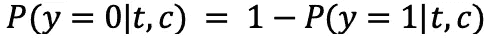

Word2vec 算法使用向量 **t** 和 **c** 的点积，通过近似公式计算这些概率:

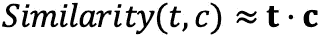

您可能还记得本系列的第二篇文章，余弦相似性的等式(通常用于测量单词向量相似性)是归一化的点积:

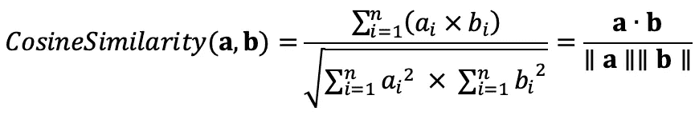

其中 **a** 和 **b** 是两个大小为 *n* 的向量。

因为 **t c** 的点积不产生从 0 到 1 的实际概率值，所以在 SGNS 模型中使用了逻辑或 *sigmoid* 函数 *σ* ( *z* ):

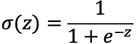

使用 sigmoid 转换为概率来源于本系列上一篇文章讨论的逻辑回归， [**统计学习理论**](https://medium.com/@jongim/statistical-learning-theory-26753bdee66e) 。在逻辑回归中，*z =***X*β***≡**X*β***为模型提供了线性回归中的最优直线，但在本例中 *z =* **t c** *。*所以，根据点积的*相似度*公式， *c* 为 *t、*的真实上下文词的近似概率为(Jurafsky and Martin，2019；戈德堡和利维，2014):

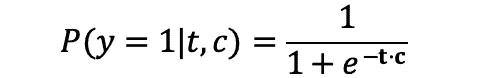

*c* 为假上下文词，即 *y* =0，对于 *t* 的近似概率为:

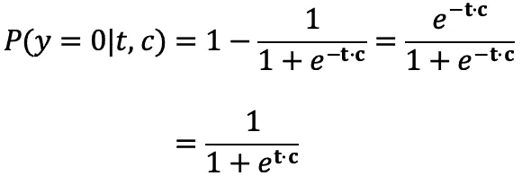

接下来，我们来回顾一下 Word2vec 的神经网络模型对 SGNS 使用的学习过程。

# SGNS 损失函数

SGNS 通过抽取否定情况的样本(即，是错误上下文单词的单词)来简化处理。因此，如果我们取*一个*目标/上下文单词对( *t，c* )并将其与 *k* 负样本单词 *s* ₁ *…sₖ* 相结合，则学习目标是最大化 *t* 和 *c* 匹配且负样本不匹配的概率。

为了做到这一点，SGNS 做出了不正确但数学上简化的假设，即所有上下文词和负样本都是独立的，这允许它们的概率被相乘(Jurafsky 和 Martin，2019)。因此，我们需要找到这个似然函数的最大值:

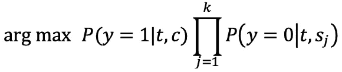

为了进一步简化数学，我们可以像将最大似然法应用于逻辑回归时一样使用对数。自然对数不会影响结果，因为函数是单调递增的。如前一节所示，Word2vec 使用一个近似公式计算*相似度*，使用单词向量的点积。因此，学习目标 *L* 是(Jurafsky 和 Martin，2019):

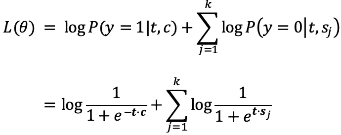

这里，θ被认为是目标和上下文词向量的串联，即它们的权重矩阵(Kim，2019)。

在机器学习中，*损失函数*(也称为目标函数或成本函数) *J* ( *θ* )，是将*最小化*的函数，因此是上述对数似然方程的负数(Kim，2019；Voita，2020):

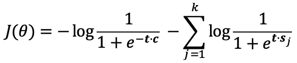

# SGNS 训练和随机梯度下降

为了在数学上找到损失函数中的最小值，我们取其导数，然后将其设置为零。在机器学习中，人们估计每一步向最小值的方向，并向它迈出一小步(Voita，2020):

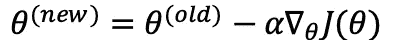

在这里，𝛼就是那一小步，也就是*学习速率*。朝着最小值前进被称为*随机梯度下降*。

在 SGNS 中，相对于*、 ***c*** 、以及负样本、 ***s*** *ⱼ* ，使用上面所示的 *J* ( *θ* )的偏导数来确定朝向最小值的方向。因此，对于每个第 *m* 个训练实例，单词向量值更新如下(Jurafsky 和 Martin，2021):*

*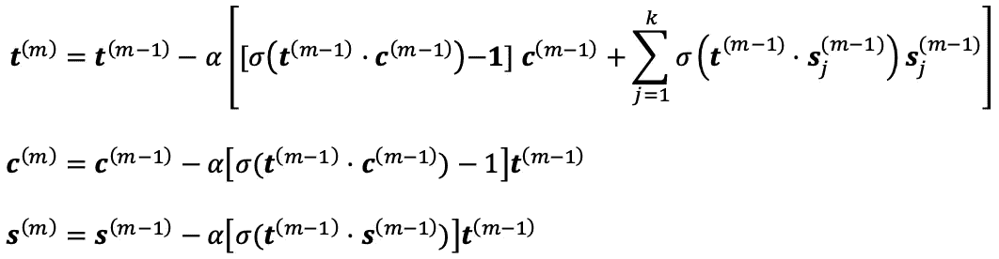*

*其中 *σ* ( *z* )是上面定义的 sigmoid 函数。*

*我们通过在目标单词向量矩阵 **T** 和上下文单词向量矩阵 **C** (权重矩阵)中为每个单词建立随机向量来进行学习过程。有时初始值采用 1 和 1 之间的均匀分布。然而，2017 年科奇米和 Ondřej 证明，使用以零为中心的低方差随机正态分布(例如，𝒩(𝜇=0，𝜎 =0.01)，会导致更快的优化。*

*注意，对于负采样，我们可以通过选择取多少负样本来调整计算量。然而，Skip-gram 的训练时间与窗口大小 *l* 成比例。*

# *SGNS 权重矩阵*

*训练完成后，每个单词有两个嵌入， ***t*** *ᵢ* 和 ***c*** *ᵢ* 。通常在实践中， **C** 矩阵被忽略，而 **T** 将每个单词嵌入定义为向量 ***t*** *ᵢ* 。然而，也可以将两个嵌入相加或平均，或者连接两个嵌入，以创建两倍长的向量(Jurafsky 和 Martin，2019；曼宁，2019)。*

*下图显示了训练过程中的一个更新，其中目标单词“processing”与上下文单词“language”配对，单词“aardvark”被随机选为负样本。*

*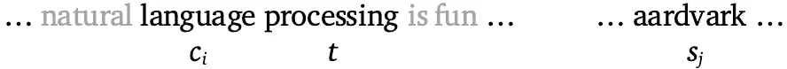**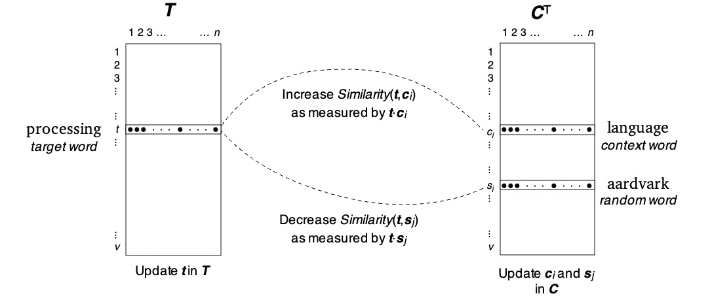*

***用一个否定样本**更新目标/上下文单词对
的权重矩阵 T 和 C(图片由作者提供，灵感来自 Jurafsky 和 Martin，2019)*

*重要的是要理解，在训练期间，*矩阵、**矩阵、**矩阵和**矩阵和**矩阵中的单词嵌入都会更新。更具体地说，在本例中， **T** 中的“处理”被更新为 **C** 中“语言”的目标词，而*不是*中“土豚”的目标词，并且 **C** 中的“语言”被更新为 **T** 中“处理”的上下文词，而 **C** 中的“土豚”被更新为*同样，训练使用点积作为*相似性的度量。**

*这也是进行二元分类的前馈神经网络的框架:*

**

***二元分类器的神经网络框架**
(图片由作者提供，灵感来自 Raschka，2020)*

*在这个简单的浅层神经网络中，向量 **w** 中的权重代表预测系数，它们可以用于对一组新的输入 **x** 进行预测。然而，在 Word2vec 中,“权重”是单词嵌入本身，有两组。 **T** 中的行是单词嵌入，每个都被优化以预测它们在 **C** 中的上下文单词，并且 **C** 中的列是单词嵌入，每个都被优化为用于 **T** 中的每个目标单词的那些上下文单词。*

*虽然 **T** 和 **C** 都包含词汇表的所有单词，但是 **T** 和 **C** 针对不同的条件进行了优化，因此包含不同的信息。然而，正如 Jurafsky 和 Martin (2019 年)和 Manning (2019 年)指出的，通常会忽略 **C** 矩阵。*

*一个有趣的问题是，*当* ***C*** *矩阵被忽略时会丢失什么？**

*Word2vec SGNS 不是典型的神经网络。Word2vec SGNS 算法训练速度很快，并且具有使其成为研究对象的品质。例如，Levy 和 Goldberg (2014b)证明了 SGNS 分解移位的 PMI 矩阵，Aggarwal (2018)补充说，SGNS 执行一种逻辑矩阵分解，即一种自动编码。*

# *摘要*

*在本文中，我们了解到 Word2vec 使用两个基本模型，一个是对上下文单词集进行平均来预测目标单词(CBOW)，另一个是目标单词预测上下文单词(Skip-gram)。这些模型使用执行多项式回归的浅层神经网络。我们还看到了如何使用负采样减少 Skip-gram 的计算需求，负采样将算法转换为二进制分类器。*

*然后，我们从概念上和数学上研究了负采样跳过图(SGNS)是如何工作的。*

*在下一篇文章中，[**Word2vec 超参数**，](https://medium.com/@jongim/the-word2vec-hyperparameters-e7b3be0d0c74)我们将了解 word 2 vec 用来优化训练其单词嵌入的一组附加技术。*

*这篇文章是 4ᵗʰ系列文章**中关于单词嵌入的初级读本:** 1。[word 2 vec 背后有什么](https://medium.com/@jongim/a-primer-on-word-embeddings-95e3326a833a) | 2。[单词成向量](https://medium.com/@jongim/words-into-vectors-a7ba23acaf3d) |
3。[统计学习理论](https://medium.com/@jongim/statistical-learning-theory-26753bdee66e) | 4。Word2vec 分类器|
5。[word 2 vec 超参数](https://medium.com/@jongim/the-word2vec-hyperparameters-e7b3be0d0c74) | 6。[单词嵌入的特征](https://medium.com/@jongim/characteristics-of-word-embeddings-59d8978b5c02)*

***关于这个主题的更多信息:**与其他单词嵌入技术相比，我推荐学习 Word2vec 的一个资源是斯坦福大学的这个在线计算机科学课程:Manning，C. (2021)， [*CS224N 自然语言处理与深度学习*](https://www.youtube.com/playlist?list=PLoROMvodv4rOSH4v6133s9LFPRHjEmbmJ) 。*

# *参考*

*阿加瓦尔，C. (2018)。*神经网络和深度学习:一本教科书*。瑞士查姆:施普林格国际出版公司。*

*阿尔梅达，f .和 Xexéo，G. (2019)。词汇嵌入:一个综述。可从 [arXiv:1901.09069v1](https://arxiv.org/abs/1901.09069) 获得。*

*Goldberg 和 o . Levy(2014 年)。word2vec 解释:推导 Mikolov 等人的负采样单词嵌入法。可从 [arXiv:1402.3722v1](https://arxiv.org/abs/1402.3722v1) 获得。*

*Chia，D. (2018)。使用 NumPy 和 Google Sheets 的 Word2Vec 实现指南。*走向数据科学。**

*jurafsky d .和 Martin j .(2019 年)。*语音和语言处理:自然语言处理、计算语言学和语音识别导论*。徒弟堂，[第三版，2019 稿](https://web.stanford.edu/~jurafsky/slp3/)。*

*jurafsky d .和 Martin j .(2021)。*语音和语言处理:自然语言处理、计算语言学和语音识别的介绍*。徒弟堂，[第三版，2021 稿](https://web.stanford.edu/~jurafsky/slp3/)。*

*金，E. (2019)。[揭秘 Skip-Gram 语言建模中的神经网络](https://aegis4048.github.io/demystifying_neural_network_in_skip_gram_language_modeling)。 *Github* 。*

*t .科奇米和 b . ondřej(2017 年)。深度学习任务中单词嵌入初始化的探索。P *第十四届国际自然语言处理会议论文集(ICON-2017)*第 56–64 页。P [DF。](https://www.aclweb.org/anthology/W17-7508)*

*Levy 和 y . Goldberg(2014 年 b)。神经单词嵌入作为隐式矩阵分解。第 27 届国际神经信息处理系统会议录，2:2177–2185。 [PDF](https://papers.nips.cc/paper/5477-neural-word-embedding-as-implicit-matrix-factorization.pdf) 。*

*Manning，c .(2019)[*cs 224n 自然语言处理与深度学习*](https://web.stanford.edu/class/cs224n/) 。在线计算机科学课程。加州斯坦福:斯坦福大学。*

*Manning，c .(2021)[*cs 224n 自然语言处理与深度学习*](https://www.youtube.com/playlist?list=PLoROMvodv4rOSH4v6133s9LFPRHjEmbmJ) 。在线计算机科学课程。加州斯坦福:斯坦福大学。*

*Mikolov、Corrado、G . Chen、k .和 j . Dean(2013 年 a)。向量空间中单词表示的有效估计。可从 [arXiv:1301:3781v3](https://arxiv.org/abs/1301.3781) 获得。*

*Mikolov、Corrado、G . Chen、k . Sutskever 和 j . Dean(2013 年 b)。词和短语的分布式表示及其组合性。可在 [arXiv:1310.4546v1](https://arxiv.org/abs/1310.4546) 获得。*

*Pennington、r . Socher 和 c . Manning(2014 年)。GloVe:单词表示的全局向量。*2014 年自然语言处理经验方法会议论文集*，第 1532–1543 页。 [PDF](https://www.google.com/url?sa=t&rct=j&q=&esrc=s&source=web&cd=&ved=2ahUKEwj_r9_nsartAhUMC-wKHXu4BqYQFjABegQIAxAC&url=https%3A%2F%2Fnlp.stanford.edu%2Fpubs%2Fglove.pdf&usg=AOvVaw3XPTcwWcbYOXnahjvpeDTu) 。*

*Potts c .和 MacCartney b .(2019)。 [*CS224U 自然语言理解*](https://web.stanford.edu/class/cs224u/2019/index.html) ，在线计算机科学课程。加州斯坦福:斯坦福大学。*

*沃伊塔湖(2020)。[自然语言处理课程:单词嵌入](https://lena-voita.github.io/nlp_course/word_embeddings.html)。 *Github* 。*

**除非另有说明，数字和图像均由作者提供。*