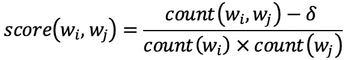
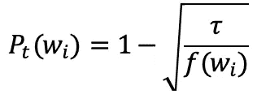
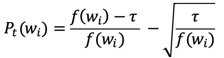
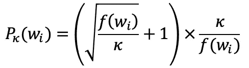
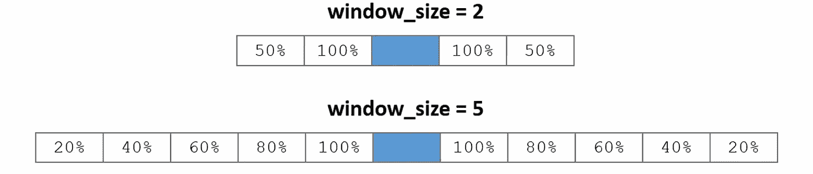
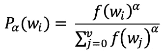

# Word2vec 超参数

> 原文：<https://towardsdatascience.com/the-word2vec-hyperparameters-e7b3be0d0c74>

## [单词嵌入入门](https://towardsdatascience.com/tagged/word-embeddings-primer)

## 一组创造性的重新加权

由[阿迪·戈尔茨坦](https://unsplash.com/@adigold1)在 [Unsplash](https://unsplash.com/?utm_source=medium&utm_medium=referral) 上拍摄的照片

本文是 5ᵗʰ系列文章**中关于单词嵌入的入门:** 1。[word 2 vec 后面有什么](https://medium.com/@jongim/a-primer-on-word-embeddings-95e3326a833a) | 2。[单词成向量](https://medium.com/@jongim/words-into-vectors-a7ba23acaf3d) |
3。[统计学习理论](https://medium.com/@jongim/statistical-learning-theory-26753bdee66e) | 4。[word 2 vec 分类器](https://medium.com/@jongim/the-word2vec-classifier-5656b04143da) |
5。**word 2 vec 超参数** | 6。[单词嵌入的特征](https://medium.com/@jongim/characteristics-of-word-embeddings-59d8978b5c02)

在上一篇文章[Word2vec 分类器](https://medium.com/@jongim/the-word2vec-classifier-5656b04143da)中，我们学习了 word 2 vec 算法的概念和数学，重点是负采样的跳格模型(SGNS)。

然而，并不仅仅是 SGNS 的算法使它有效。2015 年，Levy 等人将来自传统的基于计数的方法(如 PPMI 矩阵和 SVD 降维向量)的最新单词向量与当时可用的基于预测的方法(包括 Word2vec SGNS 和 GloVe)进行了比较。他们发现，Word2vec 的大部分性能提升来自其系统设计选择和“超参数”，而不仅仅来自神经网络启发的训练。

在本文中，我们将回顾 Word2vec 的性能改进预处理建议和算法优化参数。

# 短语识别

Mikolov 等人强调了预处理原始文本的重要性，提出了一种识别语料库中出现频率足够高的短语的方法，为短语创建嵌入比单独为单词创建嵌入效果更好(Mikolov 等人，2013b)。在 NLP 中识别短语通常与*命名实体识别*相关联，这允许像‘Bush’(植物)和‘Bush’(总统)这样的词可以单独嵌入。Mikolov 等人定义的短语识别公式是:

其中*分数*是选定的值，高于该值的短语被识别。这里， *δ* 是*折现系数*。Mikolov 等人解释说，他们更喜欢对数据运行得分方程 2 到 4 次，每次减少 *δ* 的值。

# 词频阈值

Word2vec 不是简单地根据单词在原始文本中的外观来训练单词。首先，根据训练前设定的阈值从语料库中去除生僻字。罕见的单词被删除，因为语言模型不太可能需要它们，并且正确训练它们的上下文更少。

Mikolov 等人定义了以下公式，其中可以根据参数𝜏(通常在 10⁻⁵附近)设置阈值(Mikolov 等人，2013b):

其中 *f* ( *wᵢ* )是由单词 *wᵢ* 表示的语料库的分数。但是，请注意，根据 Levy 等人(2015 年)的说法，Mikolov 等人的代码的 C 编程语言实现使用了以下稍加修改的等式:

# 子采样率

此外，为了减少训练时间，根据 Mikolov 等人的代码(McCormick，2019)的 C 编程语言实现中的以下子采样函数，Word2vec 训练更频繁的单词的频率低于它们在语料库中的出现频率:

这里再次说明， *f* ( *wᵢ* )是由单词 *wᵢ* 表示的语料库的分数，参数𝜅控制进行多少次子采样。当𝜅设置为默认值 0.001 时，最常见的英语单词“the”的 80%的实例可能会被跳过，但当单词的频率 *f* ( *wᵢ* )小于 0.0026 时，不会发生跳过。

# 上下文位置加权

当对目标单词周围的窗口 *l* 中的上下文单词进行训练时，Word2vec 不会像最初出现在文本中一样使用这些单词。首先，根据前两节中解释的公式，在训练开始之前删除不常用的单词，跳过常用单词的实例。移除这些单词后，上下文窗口实际上比保留这些单词时要宽。

接下来，Word2vec 对距离目标单词 *t* 较近的上下文单词的线性加权比距离较远的上下文单词大。例如，如果窗口大小为 *l* =5，则位于最远位置的单词有/₅机会被包括在训练中，而恰好在目标单词之前或之后的单词总是被包括在内，如下图所示:

**上下文位置加权示例**(麦考密克，2019，经许可转载)

根据 Levy 和 Goldberg 在 2014 年发表的一篇论文(Levy 和 Goldberg，2014 年)，对于广泛的主题嵌入，窗口大小通常为 5。

# 负样本的加权

在 SGNS 中，第 *k* 个否定样本词不是根据它们在文本中的出现频率来选择的(unigram)；也不是同等(统一)选择的。相反，Word2vec 使用加权单字频率 *P* 𝛼( *w* ，其中 *wᵢ* 是单词， *f* ( *wᵢ* )是该单词在语料库中的总单词数， *v* 是词汇表中的单词数，𝛼 是米科洛夫等人定义的权重(米科洛夫等人，2013b 麦考密克，2019):

当𝛼=1 时，根据单词在语料库中的出现频率来选择单词。对于 SGNS，Mikolov 等人发现𝛼=0.75 效果最好:

> “我们调查了许多关于*p*【𝛼](*w*】的选择，发现在我们尝试的每个任务中，一元分布 *U* ( *w* )的 3/4rd 次方(即*u*(*w*)/⁴/*z*)明显优于一元分布和均匀分布……*(米科洛夫等人，2013 年 b)*

当𝛼=0 *。* 75，训练生僻字的概率增加，训练频繁字的概率减少(McCormick，2019)，反映了本系列第二篇文章 [**字成向量**](https://medium.com/@jongim/words-into-vectors-a7ba23acaf3d) 中讨论的重新加权方法的一个客观。

根据 McCormick (2019)的说法，“这种单词选择在[Mikolov 等人的] C 代码中实现的方式很有趣。麦考密克解释说，米科洛夫等人创建了一个包含 1 亿个元素的大数组，并根据等式 *P* 𝛼( *w* 用词汇表中每个单词的索引填充它。在训练过程中，他们通过选择 0 到 1 亿之间的随机数来随机选择表中的一个词索引值，从而选择负样本。

# 摘要

在本文中，我们学习了一些建议用于创建单词向量的文本预处理技术，以及一些基于训练的重新加权“技巧”，这些技巧用于在使用 Word2vec 创建单词嵌入时优化结果并减少训练时间。

在下一篇文章 [**单词嵌入的特点**](https://medium.com/@jongim/characteristics-of-word-embeddings-59d8978b5c02) 中，我们将看看 Word2vec 单词嵌入的优缺点。

这篇文章是 5ᵗʰ系列文章**中关于单词嵌入的初级读本:** 1。[word 2 vec 背后有什么](https://medium.com/@jongim/a-primer-on-word-embeddings-95e3326a833a) | 2。[单词成向量](https://medium.com/@jongim/words-into-vectors-a7ba23acaf3d) |
3。[统计学习理论](https://medium.com/@jongim/statistical-learning-theory-26753bdee66e) | 4。[word 2 vec 分类器](https://medium.com/@jongim/the-word2vec-classifier-5656b04143da) |
5。Word2vec 超参数| 6。[单词嵌入的特征](https://medium.com/@jongim/characteristics-of-word-embeddings-59d8978b5c02)

**关于这个话题的更多内容:**我推荐的一个了解 Word2vec 算法更多内容的资源是:McCormick，C. (2019)。[*word 2 vec*](https://www.chrismccormick.ai/word2vec-ebook)的内部运作方式(电子书)。

# 参考

Levy 和 y . Goldberg(2014 年)。基于依存关系的单词嵌入。在*计算语言学协会第 52 届年会会议录(第 2 卷:短文)*(第 302–308 页)。可在 doi[10.3115/v1/P14–2050](http://dx.doi.org/10.3115/v1/P14-2050)处获得。

Levy、y . Goldberg 和 I . Dagan(2015 年)。利用从单词嵌入中获得的经验改进分布相似性。计算语言学协会汇刊，3:211–225。可在 doi[10.1162/tacl _ a _ 00134](https://www.aclweb.org/anthology/W14-1618/)处获得。

麦考密克，C. (2019)。*word 2 vec 的内部工作原理* (Pro 版，第一版)。电子书。[*McCormickml.com*](https://mccormickml.com)。

Mikolov、Corrado、G . Chen、k . Sutskever 和 j . Dean(2013 年 b)。词和短语的分布式表示及其组合性。可从 [arXiv:1310.4546v1](https://arxiv.org/abs/1310.4546) 获得。

*除非另有说明，数字和图像均由作者提供。