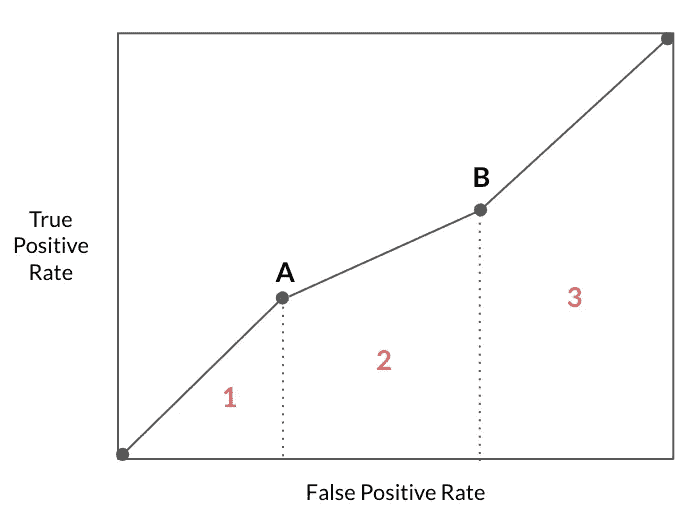
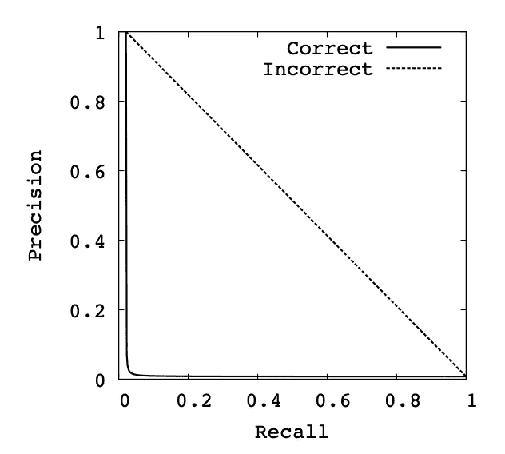

# 精确召回曲线下面积近似的正确与错误

> 原文：<https://towardsdatascience.com/the-wrong-and-right-way-to-approximate-area-under-precision-recall-curve-auprc-8fd9ca409064>

## 总结 AUPRC 的方法有很多，但并不是所有的方法都有相同的优点


由[雷蒙·克拉文斯](https://unsplash.com/@raimondklavins?utm_source=medium&utm_medium=referral)在 [Unsplash](https://unsplash.com?utm_source=medium&utm_medium=referral) 上拍摄的照片

精确召回(PR)曲线下的面积(AUPRC)是一个总结 PR 曲线信息的单一数字。有许多方法可以估算它的封闭面积，但并不是所有的方法都有同样的优点。本文试图分析近似 AUPRC 的两种常见方法:使用梯形规则或使用平均精度分数，以及为什么一种方法比另一种方法更正确。

## **通过 PR 曲线的梯形近似获得的 AUC 与平均精密度分数不同:例如**

我看到人们经常犯的一个错误是，假设通过 PR 曲线的梯形插值获得的 AUC(在 scikit-learn 中用`auc(precision, recall)`表示)与平均精度分数(在 scikit-learn 中用`average_precision_score(y_true, y_score)`表示)完全相同。虽然这两种度量在许多情况下产生非常相似的估计，但它们是根本不同的。梯形方法使用了过于乐观的线性插值。当数据高度偏斜时，更有可能观察到这种不正确插值的影响([，这正是 PR 曲线优于 ROC 曲线](/precision-recall-curve-is-more-informative-than-roc-in-imbalanced-data-4c95250242f6)的情况)。

为了说明这一点，我在从 UPenn 机器学习基准(PMLB)套件中选择的不平衡数据集上训练了一个虚拟分类器。这个名为“spambase”的数据集有 4，601 个观察值，57 个特征，以及 0.04 个阳性率的二进制目标。虚拟分类器根据 80%的训练数据进行训练，并根据 20%的排除数据进行评估。当比较梯形规则产生的 AUPRC 估计值与平均精度得分时，前者明显更高(0.53 比 0.41)。下面提供了您自己实验的代码片段——由于虚拟分类器和训练/测试分割的随机性，您可能看不到完全相同的估计值。然而，与平均精度分数相比，梯形规则计算的 AUPRC 过于乐观，这一观点应该是明确和一致的。

<https://replit.com/@TamTran26/AUPRC-different-estimations#main.py> [## AUPRC 不同估计

与平均精度分数相比，使用梯形规则获得的 AUPRC 过于乐观。使用 repl.it 生成的交互式代码。](https://replit.com/@TamTran26/AUPRC-different-estimations#main.py) 

## 为什么梯形近似适用于 ROC 空间…

给定 ROC 空间中的一组点，其 x 坐标表示假阳性率(FPR)，y 坐标表示真阳性率(TPR)，梯形近似使用线性插值来连接相邻的点以形成 ROC 曲线。简单来说，我们画一条连接两点的直线。该曲线下的面积(AUC)是所有梯形面积的总和。



连接 4 个 ROC 点的 ROC 曲线。曲线下面积(AUC)分数可以通过梯形规则计算，该规则将曲线下的所有梯形 1、2 和 3 相加。图片作者。

已经证明，通过投掷加权硬币来决定两个端点所代表的分类器，可以在连接两个现有 ROC 点的这条线上实现任何级别的性能。假设点 a(在上图中)代表模型 a，它在 fₐ的 FPR 下实现了 tₐ的 TPR，而模型 b(由点 b 代表)同样在 fᵦ.实现了 tᵦ的 TPR 在分类器 a 和分类器 b 之间，通过以概率 pᵦ = (f-fₐ)/(fᵦ-fₐ)选择 b 的输出和以概率 pₐ=1-pᵦ.选择 a 的输出，可以产生具有 FPR f 的新分类器

> 线性插值实际上是 ROC 空间中凸包的关键思想所要求的主要标准之一。

## …但不是在公关领域？

在 ROC 空间中，TPR(或召回)相对于 FPR 绘制，而在 PR 空间中，召回相对于精确度绘制。随着召回水平的变化，精确度不一定线性变化。召回被定义为 TP/(TP+FN)，其中 TP+FN =实际阳性的数量不依赖于分类器阈值。这意味着降低分类器阈值可以通过增加真阳性结果的数量来提高召回率。也有可能降低阈值会使召回率保持不变，而精确度会波动。另一方面，Precision=TP/(TP+FP)的定义表明，通过增加返回的肯定预测结果的数量，降低分类器的阈值可以增加分母。如果阈值先前设置得太高，新的结果可能都是真阳性，这将提高精确度。如果先前的阈值大约合适或太低，进一步降低阈值将引入假阳性，降低精度。例如，PR 空间中的基线曲线是一条水平线，其高度等于正类的流行度，这意味着对于每个召回值，对应的精度值保持不变，并且等于流行度。

所以在 PR 空间中，点与点之间的线性插值是不正确的。线性插值是一个错误，它对 PR 空间的性能估计过于乐观。当要插值的点之间的距离非常大时，不正确插值的影响尤其明显。



考虑从具有 433 个阳性和 56，164 个阴性的数据集由单个点(0.02，1)构建并延伸到端点(0，1)和(1，0.008)的曲线。正确的插值将产生 0.031 的 AUPRC，而线性插值将严重高估 0.50 的 AUPRC。图片来自 Davis 和 Goadrich (2006)的论文“精确召回和 ROC 曲线的关系”。

## 对于 AUPRC，什么是更好的近似？

希望到现在为止，我们都同意非线性插值是 PR 空间的发展方向。有多种不同的方法和变体可用于构建该 PR 曲线。Davis 和 Goadrich (2006)根据对应于每个 PR 点的真阳性(TP)和假阳性(FP)的数量来检查插值。假设我们有一个包含 20 个阳性和 2000 个阴性的数据集。让 TPₐ=5、FPₐ=5、TPᵦ=10 和 FBᵦ=30.为了找到一些中间值，Davis 和 Goadrich (2006)建议首先找出多少个负数等于一个正数，或者局部偏差，由(FBᵦ-FPₐ)/(TPᵦ-TPₐ).)定义在本例中，局部偏斜=(30–5)/(10–5)= 5，这意味着每 5 个负值就有 1 个正值。现在，我们可以为 x 的所有整数值创建新点 TPₐ+x，使得 1≤x≤TPᵦ-TPₐ，并通过由局部偏斜线性增加每个新点的假阳性来计算相应的 FP。具体来说:

```
+-------+----+----+--------+-----------+
| Point | TP | FP | Recall | Precision |
+-------+----+----+--------+-----------+
| A     | 5  | 5  | 0.25   | 0.5       |
| .     | 6  | 10 | 0.30   | 0.375     |
| .     | 7  | 15 | 0.35   | 0.318     |
| .     | 8  | 20 | 0.40   | 0.286     |
| .     | 9  | 25 | 0.45   | 0.265     |
| B     | 10 | 30 | 0.5    | 0.25      |
+-------+----+----+--------+-----------+
```

请注意，结果精度插值在 0.5 和 0.25 之间不是线性的。

另一个较好的估计是平均精度(AP)。AP 方法完全避免了经验曲线的构建，这意味着我们不需要担心使用什么插值方法。AP 计算为每个阈值达到的精度的加权平均值，其中权重是从上一个阈值开始的召回增加:

> ap=σ(rₙ-rₙ₋₁)pₙ

其中 Pₙ和 Rₙ是第 n 个阈值的精度和召回率。

AP 和工作点下的梯形面积都是概括精度-召回曲线的常用方法。但是，它们可能会导致不同的结果，尤其是当数据高度倾斜时。在这些情况下，AP 是更合适的估计值。

*参考文献*

[1] J.Davis 和 M.Goadrich，(2006)，ICML 2006 年第 23 届机器学习国际会议论文集

**如果你喜欢这篇文章，你可能也会喜欢:**

</precision-recall-curve-is-more-informative-than-roc-in-imbalanced-data-4c95250242f6>  </performance-curve-more-intuitive-than-roc-prc-and-less-assumptive-than-threshold-metrics-391e777da566> 