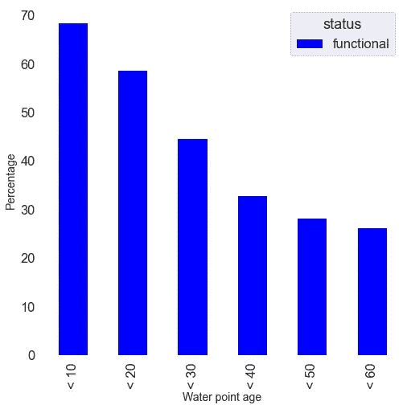
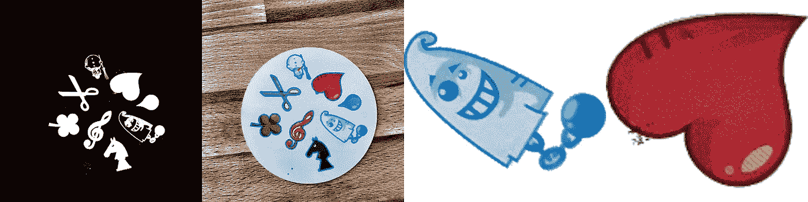
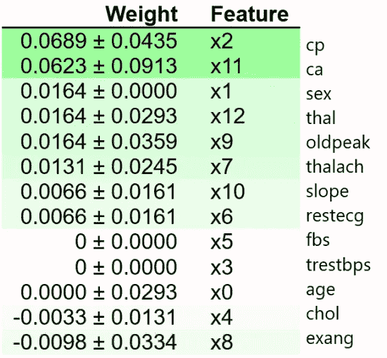
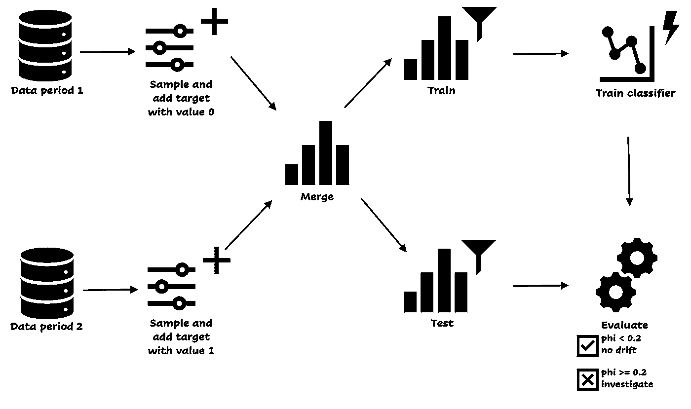

# 这些是您创建一个好的数据科学产品需要采取的步骤

> 原文：<https://towardsdatascience.com/these-are-the-steps-you-need-to-take-to-create-a-good-data-science-product-697b22d335c5>

夏嫣·米克尔森在 [Unsplash](https://unsplash.com?utm_source=medium&utm_medium=referral) 上拍摄的照片

## 意见

## 从问题到生产

**几年前，我为一家公司开发了一个机器学习应用程序。它有预测，对预测的解释，一个结合了许多数据源的仪表板等等。然后工具上线了。而且……几乎没怎么用。哪里出了问题？我对此一无所知:我每周都与业务部门联系，该工具与现有系统紧密集成，并且我仔细倾听用户的意愿。**

事后看来，我认为我本应该以不同的方式做很多事情。这个工具相当复杂，而且不直观。我认为我们等了太久才上线，应该让更多的商业人士参与进来。这让我想到一个重要的问题:*应用机器学习解决商业问题的正确方式是什么？*本文将指导您完成基本步骤。你一开始就需要回答的问题，数据问题，建模和操作模型的技巧。我希望这能防止你犯和我一样的错误！

哎呀。照片由[莎拉·基利安](https://unsplash.com/@rojekilian?utm_source=medium&utm_medium=referral)在 [Unsplash](https://unsplash.com?utm_source=medium&utm_medium=referral) 上拍摄

以下是我将在本文中解释的步骤概述:

*   第一步。抓住问题的核心
*   第二步。理解并了解数据
*   第三步。数据处理和特征工程
*   第四步。对数据建模
*   第五步。操作模型
*   第六步。改进和更新

并不总是从第一步开始，到第六步结束。有时候需要迭代。在步骤 4、5 或 6 中，您可以发现改进模型的方法，例如在执行错误分析之后。您可以返回到上一步，例如创建新要素(步骤 3)或收集更多数据(步骤 2)。

# 第一步。抓住问题的核心

第一步可能是最重要的一步。如果你真的想开发一个好的产品，你应该抓住问题的核心。你应该深入材料，与利益相关者交谈，问正确的问题，思考技术需求。这可能需要一些时间，但最终您会节省时间，因为问题的范围变小了。你预先知道哪里可能会出现障碍。

你可以系统地处理这一步。为了简单起见，我把这个步骤分成了六个子部分。这些部分是价值和目的、可能的解决方案、人员、技术方面、过程和立法。让我们穿过它们。

## 价值和目的

产品的目标是什么？它解决什么问题？有时候实际问题并不是问题背后的真正问题。为了回答真正的问题，试着理解商业动机并测试你的假设。如何衡量成功？对最终用户有什么好处？深入当前流程(如果存在)可能会有所帮助。这可以给你一个基准性能，并有助于理解背景。

谈到性能，现在是建立性能指标的时候了。如果可能的话，使用单一的度量标准，因为这样可以更容易地根据性能对模型进行排序。尝试找到一个简单的、可观察的度量标准，它易于向不太懂技术的人解释，并且涵盖了问题的目标。

另一个有趣的问题是:还有其他人可以从产品中受益吗？这有助于说服人们，使产品更加有趣。

## 可能的解决方案

定义了产品的价值和用途之后，你就可以开始思考可能的解决方案了。你可以做一些研究:阅读处理类似问题的文献，或者和团队组织一次头脑风暴会议。

这一部分并不意味着完全解决问题，但它将在实际解决阶段提供指导。也许你会发现机器学习不是必要的，但是基于规则的方法也可能有效。

## 人

相关人员包括用户、利益相关者、赞助商和开发团队。开发团队是否涵盖了所有需要的方面？你有足够的技术专长来成功完成这个项目吗？如果出现障碍，你应该去哪里？

与用户讨论他们如何测试产品。让他们参与进来，越快越好。在早期阶段，改变和调整更容易:如果你很早就收到反馈，你可以马上实施。确保您定期与所有相关人员交谈，这将引导我们进入流程。

## 过程

流程是如何管理的？定期更新用户和利益相关者是最佳实践。当你按照敏捷原则工作时，例如使用 scrum，很容易将标准会议(起立，回顾，回顾)固定在特定的时间段。有可能流程不固定，比如因为你在一家小公司工作。至少每隔一周向相关人员提供一次更新。尝试快速交付产品的第一个版本，以便您的最终用户可以测试产品并提供反馈。

## 技术方面

该说数据了！数据从哪里来？它对开发团队来说是可访问的和可用的吗？什么时候更新？除了数据之外，还要考虑其他技术方面，比如部署、架构、基础设施、维护以及将要使用的工具。

如果解决方案将与其他系统集成，不要有过于乐观的规划。构建一个独立的产品更容易，但风险是它会被更少地使用。延迟和吞吐量也是需要考虑的事情。

## 法规

没那么有趣，但同样重要。你应该考虑法律或道德方面的问题吗？考虑监管问题以及如何安排安全措施。您可能还想确定错误预测的影响。你如何防止人们因为你的模型的预测而受到伤害？

“抓住问题的核心”的六个部分。图片作者。

问正确的问题，使问题的范围变小，会节省你以后的时间！如果你对上述所有问题都没有一个(深入的)答案，那就不是问题。问题的范围和复杂程度各不相同。完成这一步最简单的方法是与相关人员协商，填写机器学习用例画布。网上有许多可用的用例画布，你可以根据上面描述的部分，尝试找到一个符合你需要的或者为你自己创建一个。

# 第二步。理解并了解数据

下一步就是数据了。数据源、理解数据和数据探索。

## 数据源

您使用的数据源很重要，因为数据质量越好，模型的表现就越好。你有足够的数据吗？还是有必要通过网络搜集、数据扩充或购买数据来获取更多信息？

有时没有可用的数据模式或数据描述。如果是这样的话，你应该找个人问问题。没有任何解释或描述，很难(或不可能)理解表格和列的含义。

## 探索性数据分析

现在是时候动手了，从探索性的数据分析开始。创建汇总统计数据并绘制分布图、直方图、条形图和计数图。尝试找出变量和目标之间的第一个关系，发现具有预测价值的特征，例如相关矩阵。没有差异或有许多空值的要素可以标记为在下一步中移除。

年龄(特性)和功能(目标)之间有明确关系的简易条形图。图片作者。

# 第三步。数据处理和特征工程

来自探索性数据分析的见解被输入到下一步:数据处理和特征工程。

## 数据处理

在数据处理步骤中，您丢弃不相关的数据，清除丢失的值，删除重复的行，并且[检测](/are-you-using-feature-distributions-to-detect-outliers-48e2ae3309)和[处理异常值](/dont-throw-away-your-outliers-c37e1ab0ce19)。数据中的错误也需要解决。

## 特征工程

然后，您可以开始创建特征。这取决于什么样的功能最有效。量化变量的一些基本建议是变换或宁滨。如果数据集有大量的维度，像 UMAP 或主成分分析这样的降维可能是有效的。对于分类变量，您可以尝试一种热编码或散列。

当您处理非结构化数据时，这一步会稍微复杂一些。对于文本数据，你需要注意词干、词汇化、过滤、词袋、n 元语法和单词嵌入。对于图像，您需要处理噪声、色阶、增强图像或检测形状。

图像处理可能很耗时。图片作者。

# 第四步。对数据建模

对处理后的数据尝试不同的模型。模型的类型取决于多种因素，如训练和预测速度、数据的数量和类型以及要素的类型。一些项目需要一个可解释的模型，而对于其他项目，性能更重要。如果你想使用一个很难解释但可解释性很重要的模型，[这里有一些你可以使用的方法。](/model-agnostic-methods-for-interpreting-any-machine-learning-model-4f10787ef504)

在模型评估阶段，您可以使用训练、验证和测试分割和/或交叉验证。调整超参数并比较不同的模型。发现不同功能的重要性，并检查(如有必要，与业务部门一起)这些功能是否有意义。调整模型以避免过度拟合，并确保处理数据不平衡。在完整数据集上训练最终模型。

与团队和利益相关者分享您的结果和绩效。在此步骤中，您可以决定继续操作模型，或者返回到数据处理步骤提取新要素。

排列特征重要性，解释机器学习模型的方法之一。图片作者。

# 第五步。操作模型

部署过程称为 MLOps。您可以使用不同的工具，如 [MLflow](https://mlflow.org) 、 [Airflow](https://airflow.apache.org) 或基于云的解决方案。决定你是否可以批量预测或者是否有必要实时预测。这决定了您是否需要分别关注高吞吐量或延迟。混合方法也是可能的。

当性能下降时，应该有一个用新数据自动重新训练模型的过程。注意数据漂移，如果模型真的很重要，了解数据如何变化也很有趣，那么[数据漂移过程](https://medium.com/bigdatarepublic/detecting-data-drift-with-machine-learning-adb177544312)可能是一个很好的补充。

用机器学习检测协变量漂移的方法。点击放大。图片作者。

# 第六步。改进和更新

如果你能说:‘我的模型是活的，让我们从新的开始吧！’不幸的是，在现实生活中，大多数时候事情并不是这样的。您应该跟踪模型和业务目标，以确保您的模型保持其应有的性能。您可以执行误差分析来分析错误的预测。

误差分析。照片由[Cookie Pom](https://unsplash.com/@cookiethepom?utm_source=medium&utm_medium=referral)在 [Unsplash](https://unsplash.com?utm_source=medium&utm_medium=referral) 上拍摄

# 摘要

创造一个好的数据科学产品可能很难。除了建模，你还必须处理许多事情，比如用户和利益相关者、数据、部署和维护。本文通过解释机器学习生命周期各阶段的最佳实践来帮助您。

首先，抓住问题的核心。现在还不需要解决它，但是要确保你得到了所有你需要的信息来说服自己*可以*解决它，并且这个案子是值得的。这一步包括聚集合适的人员，建立产品目标和成功的度量，基线性能，以及技术方面的概述，如数据源和部署。

当你真正理解了问题，你就可以钻研数据了。从探索性的数据分析开始，然后是数据处理和特征工程。然后，是时候对数据建模了。你可能会在数据源、特征工程和建模之间来回切换。例如当模型的性能不够好时。

如果模型的结果令人满意，您就可以部署您的模型了。记录绩效，确保你有一个再培训的过程。如有必要，继续改进模型，例如通过误差分析。

# 相关文章

     