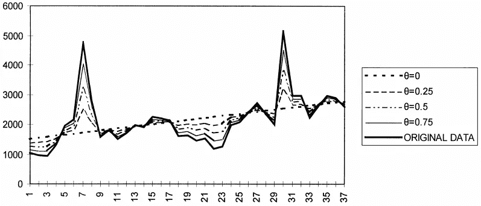
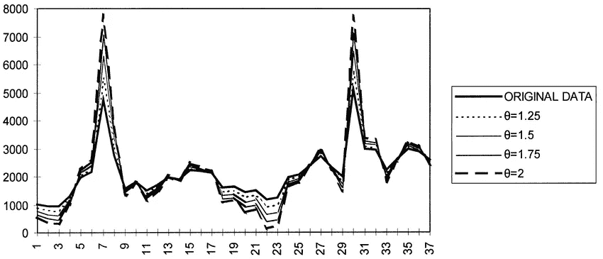
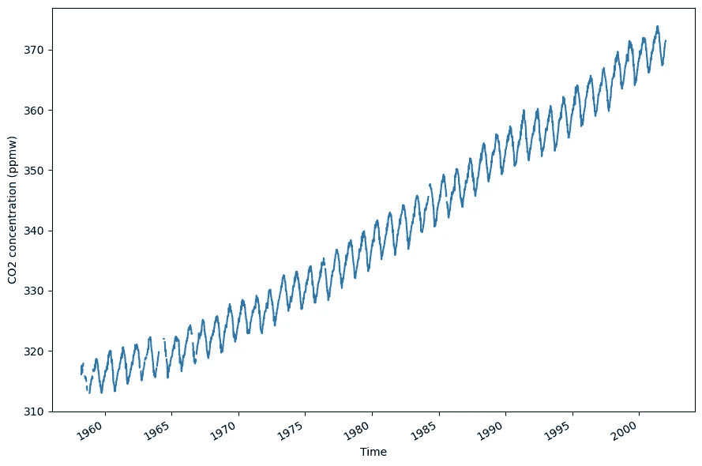
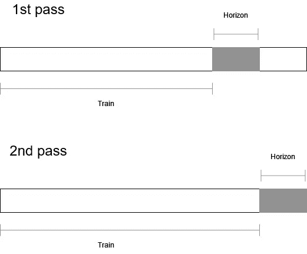
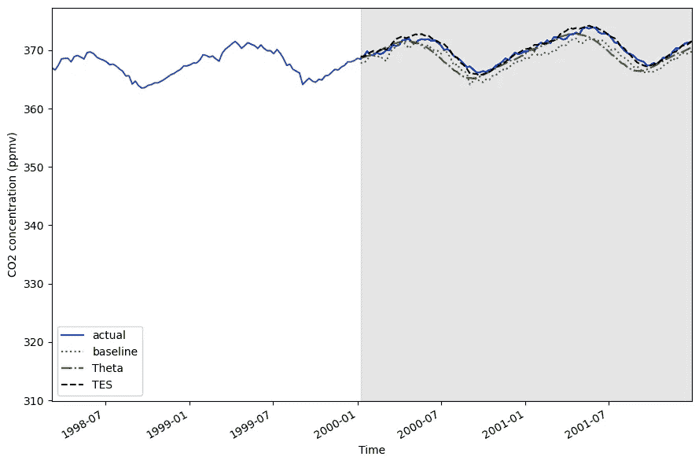
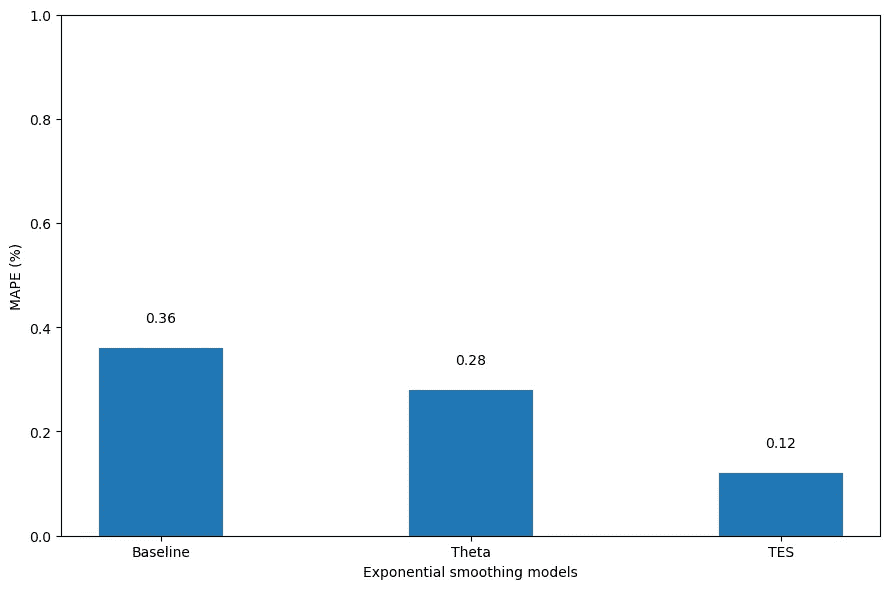

# 时间序列预测的 Theta 模型

> 原文：<https://towardsdatascience.com/theta-model-for-time-series-forecasting-642ad1d00358>

## 关于如何在 Python 中应用 Theta 模型进行时间序列预测的实践教程


汉斯·雷尼尔斯在 [Unsplash](https://unsplash.com?utm_source=medium&utm_medium=referral) 拍摄的照片

当谈到时间序列预测时，我们通常会将注意力转向 SARIMAX 系列或指数平滑中的模型。然而，有一种预测技术很少被提及:Theta 模型。

尽管简单，Theta 模型可以产生精确的预测。它在最大的学术时间序列预测竞赛 M-3 竞赛中表现如此出色，以至于在随后的几年中成为一个基准。

在这篇文章中，我们首先从理论的角度探索模型的内部工作原理。然后，我们将 Theta 模型应用于预测实践，并将其性能与 SARIMA 模型和指数平滑模型进行比较。当然，所有的代码都是 Python 的。

我们开始吧！

> **用 Python 中我的** [**免费时间序列小抄**](https://www.datasciencewithmarco.com/pl/2147608294) **学习最新的时间序列分析技术！获得统计和深度学习技术的实现，全部在 Python 和 TensorFlow 中！**

# Theta 模型是如何工作的

Theta 模型基本上依赖于分解。我们知道时间序列可以分解成三个部分:趋势部分、季节部分和残差部分。

因此，合理的方法是将一个序列分解成它的每个组成部分，预测每个组成部分的未来，然后组合每个组成部分的预测来创建您的最终预测。

不幸的是，这在实践中行不通，特别是因为很难分离残差并预测它们。

所以 Theta 模型是这个想法的一个发展，但是它依赖于将序列分解成一个长期部分和一个短期部分。

在形式上，Theta 模型基于修改时间序列的局部曲率的概念。这个修改由一个名为 *theta* 的参数管理(因此得名 theta 模型)。这种修改应用于系列的第二个差异，这意味着它是差异两次。

当*θ*在 0 和 1 之间时，系列“放气”。这意味着短期波动较小，我们强调长期影响。当*θ*达到 0 时，数列转换为线性回归线。这种行为如下图所示。



当θ在 0 和 1 之间时级数的收缩。注意，当它等于 0 时，我们得到一条线性回归线。图片由 V. Assimakopoulos，K. Nikolopoulos 从[theta 模型:预测的分解方法](https://www.researchgate.net/publication/223049702_The_theta_model_A_decomposition_approach_to_forecasting)

或者，当*θ*大于 1 时，则短期波动被放大，因此我们强调短期效应。在那种情况下，我们也说这个系列是“膨胀”的。这种行为如下图所示。



当θ大于 1 时级数的膨胀。注意短期波动是如何被放大的。来自[的 V. Assimakopoulos，K. Nikolopoulos 的图片 theta 模型:预测的分解方法](https://www.researchgate.net/publication/223049702_The_theta_model_A_decomposition_approach_to_forecasting)

对于每一个θ值，我们说我们创建了一条“θ线”。理论上，我们可以生成尽可能多的θ线，预测每一条线的未来，然后将它们组合起来进行最终预测。

在实践中，我们经常只使用两条θ线:一条是*θ*为 0，一条是*θ*为 2。第一条 theta 线( *theta* = 0)给出了数列的趋势信息，而第二条 theta 线( *theta* = 2)放大了短期波动。然后，我们预测每一行，并结合预测。

## 季节性呢？

Theta 模型的程序适用于非季节性数据。但是，它仍然可以用于季节性数据，因为季节性可以很容易地被删除，并在结束时再次添加。

因此，Theta 模型的实现遵循以下步骤:

1.  **去除季节性**:进行季节性测试。如果检测到季节性，则通过分解去除。
2.  **分解成两条θ线**:我们生成两条θ线；一个是*θ*= 0，表示为 Z(0)，一个是*θ*= 2，表示为 Z(2)。
3.  外推:我们将两条θ线外推至未来。Z(0)是使用线性回归外推的，因为它本身是线性回归线。使用简单的指数平滑外推 Z(2)。
4.  **组合**:我们组合两条θ线的外推，以获得一条预测线。
5.  **把季节性加回来**:如果季节性在第一步中被移除，我们在最后把它加回来。

现在我们了解了 Theta 模型的工作原理，让我们在预测练习中应用它！

# 使用 Theta 模型进行预测

在这个练习中，我们将预测从 1958 年 3 月到 2001 年 12 月在莫纳罗亚天文台记录的二氧化碳浓度。数据每周都被记录下来。

在任何时候，都可以在 [GitHub](https://github.com/marcopeix/time-series-analysis/blob/master/theta_model.ipynb) 上随意查阅源代码。

第一步当然是导入必要的库并加载数据。

```
import numpy as np
import pandas as pd
import statsmodels.api as sm
import matplotlib.pyplot as plt# Load the data
df = sm.datasets.co2.load_pandas().data
df.head()
```

然后我们可以可视化我们的数据集。结果如下图所示。

```
fig, ax = plt.subplots()ax.plot(df['co2'])
ax.set_xlabel('Time')
ax.set_ylabel('CO2 concentration (ppmw)')fig.autofmt_xdate()
plt.tight_layout()
```



从 1958 年 3 月到 2001 年 12 月的每周 CO2 浓度。请注意，我们在数据集的开头有一些缺失的值。图片由作者提供。

查看上图，我们注意到三个重要元素:

1.  我们的系列有一个积极的趋势，因为二氧化碳浓度随着时间的推移而增加。
2.  我们的系列具有年度季节性，因为冬季的二氧化碳含量高于夏季。
3.  我们在数据集的开头有一些缺失的值。

所以，让我们去掉缺失的值。这里，我们简单地使用两个已知点来插值缺失值。

```
df = df.interpolate()
```

这就解决了任何缺失的值，我们准备好继续进行预测了。

## 预测

对于这种情况，我们为测试集保留最近两年的观察结果。由于我们有周数据，并且一年有 52 周，这意味着最后 104 个点是用于测试集的，其余的是用于训练的。

```
train = df[:-104]
test = df[-104:]
```

然后，我们必须设定一个预测范围。在这里，我们将其设置为 52 周，或一年。这意味着我们想要建立一个模型来预测未来 52 周的二氧化碳浓度。

由于我们的测试集有 104 周的数据，我们将执行滚动预测。这意味着我们在训练集上训练模型，预测未来 52 周，然后在更新的训练集上重新训练模型，该训练集包括另外 52 周的数据，以预测未来 52 周。

用文字描述滚动预测是相当混乱的，所以这里有一个图表来形象化整个过程。



可视化滚动预测。在第一遍中，我们预测了测试集的前 52 周。在第二遍中，我们预测了测试集的最后 52 周，但是使用了更新的训练集。图片由作者提供。

从上图中，我们可以看到我们预测了 104 周的整个测试集，但是一次预测了 52 周。这样，我们就可以在做出新的预测之前模拟收集新数据并添加到训练集的过程。

在继续之前，我们还需要选择一个基线模型。在这里，由于我们有季节性数据，一个合理的基线将是简单地预测已知的最后一个季节。因为我们有每年的季节性，并且每年有 52 次观察，这相当于在未来重复最后的 52 个数据点。

有了所有这些设置，我们现在可以构建我们的函数来进行滚动预测。

```
from statsmodels.tsa.forecasting.theta import ThetaModeldef rolling_forecast(df: pd.DataFrame, train_len: int, horizon: int, window: int, method: str) -> list:

    total_len = train_len + horizon
    end_idx = train_lenif method == 'last_season':
        pred_last_season = []

        for i in range(train_len, total_len, window):
            last_season = df[:i].iloc[-window:].values
            pred_last_season.extend(last_season)

        return pred_last_season

    elif method == 'theta':
        pred_theta = []

        for i in range(train_len, total_len, window):
            tm = ThetaModel(endog=df[:i], period=52)
            res = tm.fit()
            predictions = res.forecast(window)
            pred_theta.extend(predictions)

        print(res.summary()) #Optionalreturn pred_theta
```

从上面可以看出，我们的函数需要一个时间序列数据集、训练集的初始长度、测试集的长度以及一个窗口或一个范围。

训练集和测试集的长度很容易从我们之前进行的划分中恢复，我们的窗口将是 52 周，如前所述。

```
TRAIN_LEN = len(train)
HORIZON = len(test)
WINDOW = 52
```

我们现在准备预测我们的时间序列，使用基线模型和 Theta 模型。

```
test = test.copy()test.loc[:, 'pred_last_season'] = pred_last_season
test.loc[:, 'pred_theta'] = pred_thetatest.head()
```

## 添加三重指数平滑

为了便于比较，让我们在这种情况下也应用三重指数平滑法。这样，我们可以将 Theta 模型的性能与基线和另一个相对简单的模型进行比较。

为此，我们必须更新我们的 *rolling_forecast* 函数来实现三重指数平滑。

```
from statsmodels.tsa.holtwinters import ExponentialSmoothingdef rolling_forecast(df: pd.DataFrame, train_len: int, horizon: int, window: int, method: str) -> list:

    total_len = train_len + horizon
    end_idx = train_lenif method == 'last_season':
        pred_last_season = []

        for i in range(train_len, total_len, window):
            last_season = df[:i].iloc[-window:].values
            pred_last_season.extend(last_season)

        return pred_last_season

    elif method == 'theta':
        pred_theta = []

        for i in range(train_len, total_len, window):
            tm = ThetaModel(endog=df[:i], period=52)
            res = tm.fit()
            predictions = res.forecast(window)
            pred_theta.extend(predictions)return pred_theta

    elif method == 'tes':
        pred_tes = []

        for i in range(train_len, total_len, window):
            tes = ExponentialSmoothing(
                df[:i],
                trend='add',
                seasonal='add',
                seasonal_periods=52,
                initialization_method='estimated'
            ).fit()

            predictions = tes.forecast(window)
            pred_tes.extend(predictions)return pred_tes
```

然后，我们简单地运行它来添加来自三重指数平滑的预测。

```
pred_tes = rolling_forecast(df, TRAIN_LEN, HORIZON, WINDOW, 'tes')test.loc[:, 'pred_tes'] = pred_testest.head()
```

## 估价

现在，我们已经有了来自基线、Theta 模型和三重指数平滑的预测，让我们评估每一个并确定冠军模型。

这里，我们使用平均绝对百分比误差，或 MAPE，来评估我们的模型。

在实际测量性能之前，让我们首先将模型的预测与实际值进行对比。结果如下图所示。

```
fig, ax = plt.subplots()ax.plot(df['co2'])
ax.plot(test['co2'], 'b-', label='actual')
ax.plot(test['pred_last_season'], 'r:', label='baseline')
ax.plot(test['pred_theta'], 'g-.', label='Theta')
ax.plot(test['pred_tes'], 'k--', label='TES')ax.set_xlabel('Time')
ax.set_ylabel('CO2 concentration (ppmv)')
ax.axvspan('2000-01-08', '2001-12-29', color='#808080', alpha=0.2)ax.legend(loc='best')ax.set_xlim('1998-03-07', '2001-12-29')fig.autofmt_xdate()
plt.tight_layout()
```



我们可以看到，从基线得到的预测值与实际值相差最远。否则，三重指数平滑似乎更接近实际值。图片由作者提供。

看上面的图，我们可以看到基线的预测值与实际值相差最远。我们还看到来自三重指数平滑的线(黑色虚线)似乎最接近实际值。

让我们通过实际计算 MAPE 来验证一下。

```
def mape(y_true, y_pred):
    return round(np.mean(np.abs((y_true - y_pred) / y_true)) * 100, 2)mape_baseline = mape(test['co2'], test['pred_last_season'])
mape_theta = mape(test['co2'], test['pred_theta'])
mape_tes = mape(test['co2'], test['pred_tes'])
```

注意，在写这篇文章的时候，MAPE 还没有在 scikit-learn 的稳定版本中实现，但是它很快就要实现了！

最后，让我们用柱状图直观地展示每个模型的 MAPE。

```
fig, ax = plt.subplots()x = ['Baseline', 'Theta', 'TES']
y = [mape_baseline, mape_theta, mape_tes]ax.bar(x, y, width=0.4)
ax.set_xlabel('Exponential smoothing models')
ax.set_ylabel('MAPE (%)')
ax.set_ylim(0, 1)for index, value in enumerate(y):
    plt.text(x=index, y=value + 0.05, s=str(value), ha='center')

plt.tight_layout()
```



在这里，三重指数平滑显然是赢家，因为它实现了最低的 MAPE。图片由作者提供。

看上面的图，我们可以看到我们的冠军模型是三重指数平滑，因为它实现了 0.12%的 MAPE。

至于 Theta 模型，它优于基线，但不如三重指数平滑。

# 结论

虽然 Theta 模型在这种特定情况下不是冠军模型，但它仍然是一个很好的预测方法，可以放在您的工具箱中。

它的分解方法使它成为预测时间序列的一种灵活而快速的方法。至少，它可以作为比较其他更复杂模型的坚实基准。

本文到此为止！祝贺你坚持到最后，我希望你喜欢它并且学到了新的东西！

一定要下载我用 Python 写的[免费时间序列预测小抄](https://www.datasciencewithmarco.com/pl/2147608294)，涵盖统计和深度学习模型！

干杯🍺

# 资源

Grzegorz Dudek — [使用 Theta 方法的短期负荷预测](https://www.e3s-conferences.org/articles/e3sconf/pdf/2019/10/e3sconf_pe2019_01004.pdf)

罗布·j·海德曼，叶鬼·比拉— [揭开西塔方法的面纱](https://robjhyndman.com/papers/Theta.pdf)

动词 （verb 的缩写）Assimakopoulos，k . Nikolopoulos—[theta 模型:预测的分解方法](https://www.researchgate.net/publication/223049702_The_theta_model_A_decomposition_approach_to_forecasting)

K.Nikolopoulos，V. Assimakopoulos，N. Bougioukos，a . Litsa—[Theta 模型:供应链规划的重要预测工具](https://www.researchgate.net/publication/288135300_The_Theta_Model_An_Essential_Forecasting_Tool_for_Supply_Chain_Planning)