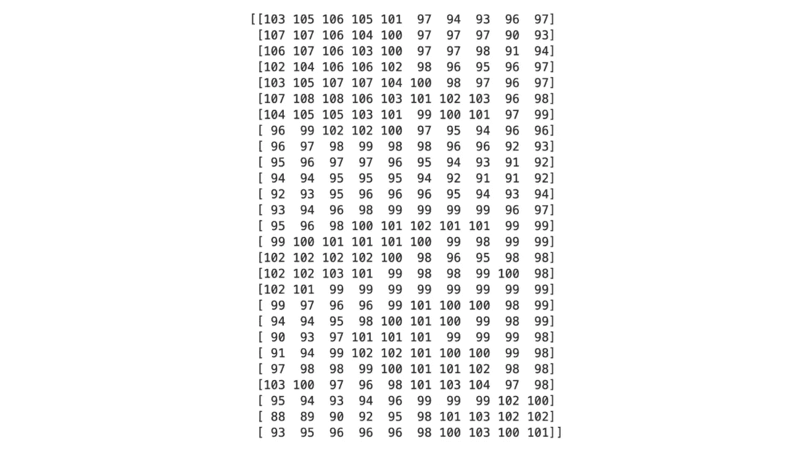
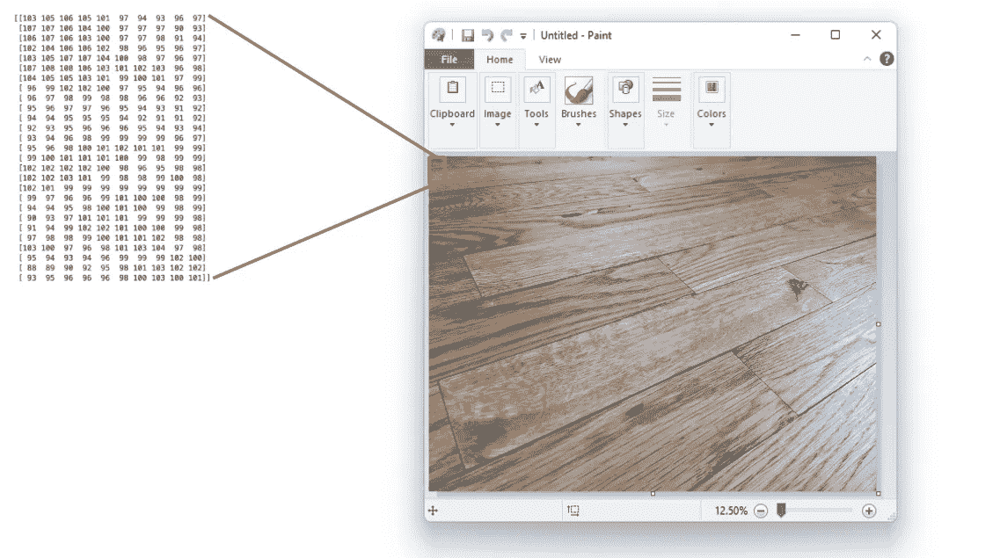
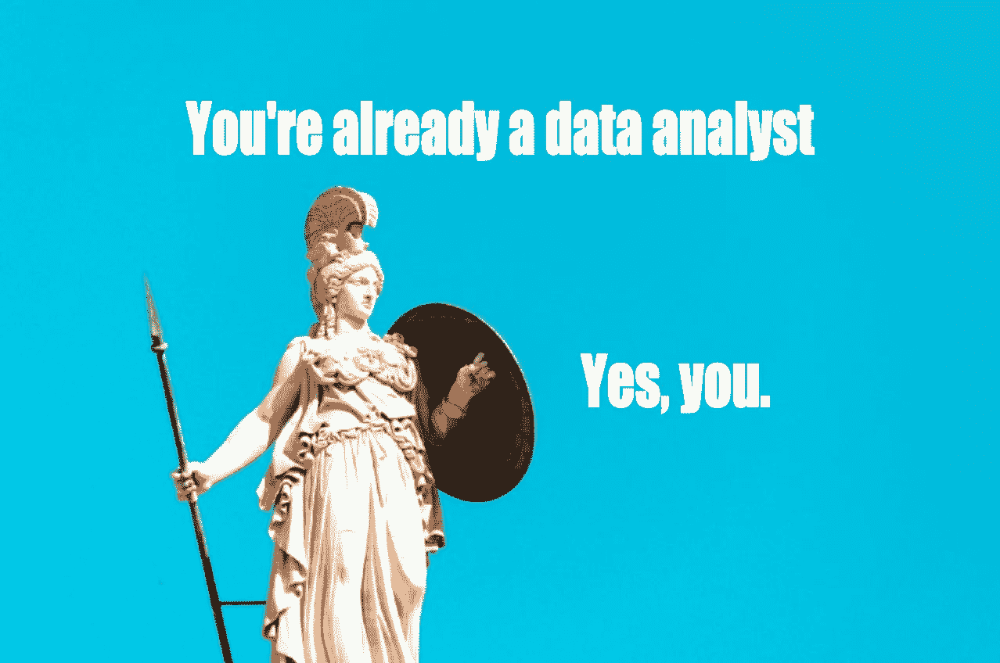
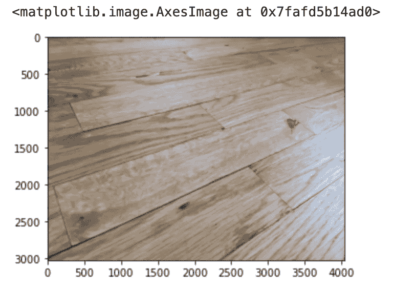

# 想成为一名数据分析师？你已经是一个了！

> 原文：<https://towardsdatascience.com/thinking-of-becoming-a-data-analyst-youre-already-one-5773b63ae83b>

## 是的，你。

你觉得自己“不是数据人”吗？或者，也许你渴望成为一名数据分析师，但你担心你需要参加一门课程，或者更糟，一个完整的博士学位，只是为了开始？我想借此机会向你证明你已经是一名数据分析师了。(对，就是你。)

先从一起分析一些数据开始吧！

这一桶数字——呃，我是说，矩阵——看起来枯燥无味，难以理解。而这只是整个事情的极小一部分，它重复了十万次类似的主题。

如果你出了一身冷汗，那是因为你有一种完全正常的人类反应:厌倦感。你猜怎么着，你是对的！

这个矩阵很无聊。

# 上下文使数据变得有趣

无论是谁告诉你[数据](http://bit.ly/quaesita_hist)会自动令人兴奋，他要么是在撒谎，要么是有古怪的癖好。为了让这个矩阵更有趣，你需要 ***上下文*** 。两大类:

1.  使这些数字**有用的上下文**。
2.  让这些数字**变得熟悉**的背景。

第一类将数据与您的需求联系起来——如果您有特定的问题，如果我告诉您这个矩阵包含解决方案，您会很感兴趣。当谈到数学动机时，疼痛的减轻是一个游戏规则的改变者。

第一类是关于**增加与数据交互的收益**，第二类是关于**降低成本**。

换句话说，也许我们可以找到一种方法，让这些数据背后的意义轻松地从屏幕跳到你的大脑。即使结果很无聊，也许也不会比我们开始时那么无聊。让我们试试用一些超级机密的博士专用图像处理软件来绘制它…

哒哒！在 MS Paint 的帮助下，我们了解到这个数据集只是我的(无聊的*)木地板的一张照片。通过使用软件，我们降低了与该数据集交互的成本——现在理解它就像看照片一样简单。更重要的是，我们知道你已经是分析师了。

你在那里做的事情被称为 ***数据可视化*** ，它是分析师核心技能的一部分，另外还有 ***数据转换*** (例如，删除你的前任)和 ***数据汇总*** (例如，抱怨 1722 张自拍中只有 3 张对你的[状态](https://www.instagram.com/datacassie/?hl=en))。

# 你已经是数据分析师了

如果有人试图恐吓你，让你相信你没有资格分析数据，这里有一些提醒，让你免受他们的不良影响。

如果你曾经看过照片，你已经是一名数据分析师了。(如果你正在看这个屏幕，欢迎！此时此刻，你正在用软件从数据中提取意义。)

(我用照片来证明我的观点是不是作弊了？我会不认罪。数码照片是合法的数据集——它们以一种对你的大脑不友好的形式存储，但如果用正确的工具分析，它们可能充满意义。还有许多其他的[数据类型](http://bit.ly/quaesita_datatypes)和[数据源](http://bit.ly/quaesita_provenance)，但是相同的核心原则适用于所有领域。)

*如果你曾经* [*进行过网上搜索*](http://bit.ly/quaesita_versus) *，你已经是一名数据分析师了。*

如果你曾经跳过一个. mp3 文件，你已经是一个数据分析师了。

如果你曾经使用过地图来找路，你已经是一名数据分析师了。

如果你曾经查看过世界另一端的天气，你已经是一名数据分析师了。

如果你曾经打开过电子表格，你已经是一名数据分析师了。

我从未见过真正“不是数据人”的人——花一点时间将你的计算机增强的存储、处理和传输信息的能力与典型的古希腊人进行比较。对他们来说你基本上就是雅典娜。

照片由[赫特尼克](https://unsplash.com/@hertwashere?utm_source=medium&utm_medium=referral)在 [Unsplash](https://unsplash.com?utm_source=medium&utm_medium=referral) 上拍摄

你认为所有这些都是理所当然的原因是你已经学会了如何使用数据处理工具。从 Microsoft Paint 到 Google Maps 再到 Spotify，一切都是作为日常必需品的分析软件。这些工具的制造者知道不应该这样称呼它们，但它们就是这样。现代世界充满了奇迹，你已经是其中的一部分了。

# 这是否意味着你准备好成为一名专业分析师？

不完全是。业余分析师和专业分析师之间有一些很大的区别。如果你很想知道它们是什么，看看我的下一篇文章 …但是好消息是它们都是关于实践和经验的。如果你梦想从事分析职业，停止梦想，开始行动吧。简单地挑战自己，尽可能多地查看新的数据格式，并在此过程中，尝试学习有望加速这一过程的工具。没有什么能阻止你！玩得开心！

如果你渴望用一些分析职业概念来补充你的实践课程，请前往我的[分析迷你课程](http://bit.ly/quaesita_sminianalytics)。

  

## *脚注:我无聊的木地板

我用了一张我所在楼层的无聊照片来提醒我们，我们对数据的探索并不总能带来惊天动地的发现。有时候会，但大多数时候不会。这是工作的一部分。

这些数据很无聊，对你来说也不是特别有用，但是以一种熟悉的格式查看它们会让你更容易理解其中的含义(并继续前进)。这是分析师工作的一半——把数字转化成你能理解的东西。另一半是关于最大化每分钟的灵感，但那是[另一篇文章](http://bit.ly/quaesita_speed)。

我用 MS Paint 来表达我的观点，你生气了吗？好吧，这是 Python！同样的想法。

*附言:你有没有试过在 Medium 上不止一次地点击拍手按钮，看看会发生什么？* ❤️

# 喜欢作者？与凯西·科兹尔科夫联系

让我们做朋友吧！你可以在 [Twitter](https://twitter.com/quaesita) 、 [YouTube](https://www.youtube.com/channel/UCbOX--VOebPe-MMRkatFRxw) 、 [Substack](http://decision.substack.com) 和 [LinkedIn](https://www.linkedin.com/in/kozyrkov/) 上找到我。有兴趣让我在你的活动上发言吗？使用[表格](http://bit.ly/makecassietalk)取得联系。