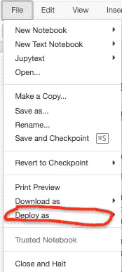
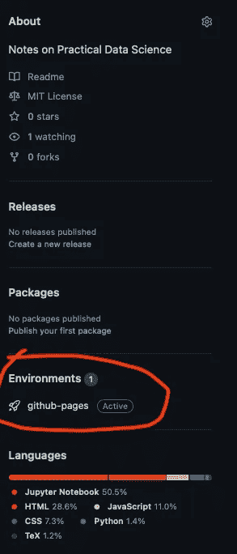

# 这篇文章写在朱庇特的笔记本上

> 原文：<https://towardsdatascience.com/this-article-was-written-on-jupyter-notebook-767ca864cb48>

## jupyter-book 和 jupyter_to_medium 简介


图片来自 [Unsplash](https://unsplash.com/photos/U-Vu_r6qyyU) 感谢 [Erik](https://unsplash.com/@introspectivedsgn)

很长一段时间，我都把笔记保存在本地的苹果页面上。为此，我毫无怨言。Pages 是一款令人惊叹的软件，它可以让您快速制作高质量的文档(带有非常棒的图表),所用时间仅为 Overleaf、Word 或 Google Docs 的一小部分。

然而，有几件事一直让我很恼火:

*   不可能进行版本控制
*   这些文档不容易共享
*   记录代码真的很难

这些也不是页面独有的。Word、Docs 和 Overleaf 在很大程度上都存在同样的问题。这些工具都不适合持续更新共享笔记、创建文档或合并代码。

好消息是，我最近学会了如何使用两个新的 Python 库，它们将帮助我大大加快记笔记和写文章的速度。这些是`jupyter-book`和`jupyter_to_medium`。

在这篇文章中(我碰巧写在 Jupyter 笔记本上！)我将解释如何使用这两种工具来加快记笔记和写文章的速度。

> 这些引文是我通过`*jupyter_to_medium*`转换后在媒体上**添加的。我很高兴它正确地格式化了副标题！切片(例如……)是在培养基上手动完成的。此外，Unsplash 分钟是在发表之前添加到介质上的，因为我忘记了 XD**

# 什么是`jupyter_to_medium`？

`jupyter_to_medium`是一个 Python 包，可以让你直接把你的 Jupyter 笔记本文章部署到 Medium。如果你的大部分文章都是基于 Jupyter 笔记本上的内容，这是很有用的。我对这个包已经好奇了一段时间，但我只是刚刚开始尝试它...让我们看看它能做什么！如果一切顺利，我可能会强烈考虑把它作为我文章的主要来源。

## 装置

```
%%capture

# install jupyter_to_medium
!pip install jupyter_to_medium
```

对于大多数人来说，这样做应该可以让你访问 Jupyter 笔记本中的“文件”下的“部署”按钮。

如果不是(像我这样)，那么您需要运行`jupyter bundlerextension enable --py jupyter_to_medium._bundler --sys-prefix`。



> 图像似乎像一个魔咒一样传入！

现在，您可以使用它将您的笔记本电脑部署到中型。有一些关于如何压缩图像的选项，以及你是否希望你的代码转换成 gists。对于本文，我只是使用默认选项来看看结果是什么样的。

## Jupyter 到 Medium 的测试

1.  我想看看数学公式压缩后是什么样子…

$ $ \ frac { \ partial } { \ partial t }(\ rho \ underline { u })+\ nab la \ cdot(\ rho \ underline { u } \ otimes \ underline { u })=-\ nab la p+\ nab la \ cdot \ underline { \ underline { \ tau } }+\ rho g $ $

> 为方程式感到羞耻！

1.  Numpy 数组

```
import numpy as np
np.array([1,2,3,4])array([1, 2, 3, 4])
```

> 代码块及其输出被视为一个整体

1.  命令行日志

```
!echo "TESTING"TESTING 
```

> 与介质一致，您无法继续编号！

# 什么是`jupyter-book`？

> 这个标题必须手动放大，即使它在减价时更大

`jupyter-book`是一个软件包，允许您使用 markdown 文件和 jupyter 笔记本文件轻松制作类似书籍的文档。因此，它们非常灵活，可以让您在很短的时间内快速生成丰富的文档。更重要的是，它们可以与 GitHub 动作集成以支持 CI/CD 行为。如果您正在寻找没有任何 CI/CD 特性的`jupyter-book`的快速安装，只需运行:

```
%%capture

# install jupyter-book
!pip install jupyter-book

# create a book
!jupyter-book create your_book_name
```

如果您当前的工作目录，这会创建一个名为`your_book_name`的书。目录结构如下所示:

```
your_book_name:
    - _config.yml
    - _toc.yml
    - intro.md
    - logo.png
    - markdown.md
    - notebooks.ipynb
    - references.bib
    - requirements.txt
```

现在，您可以通过编辑。md 或者。ipynb 文件！你甚至可以添加自己的文件。记住，`_toc.yml`文件包含了你的书的结构，所以要确保任何添加到那里的书都被正确引用。

更多信息，请访问 jupyter-book 官方文档[这里](https://jupyterbook.org/intro.html)。

请注意，添加了`%%capture`魔术命令，以防止打印安装输出。

## 使用 cookiecutter 安装

我更喜欢通过`cookiecutter`安装`jupyter-book`。这个方法附带了额外的文件，这些文件与 GitHub 动作接口，以在项目上启用 CI/CD。要使用此方法安装，首先确保您已经安装了`cookiecutter`:

```
%%capture

# install cookiecutter
!pip install -U cookiecutter
```

然后，使用以下 cookiecutter 命令下载最新的 jupyter-book 配置:

```
%%capture

!cookiecutter git@github.com:executablebooks/cookiecutter-jupyter-book.git
```

这允许你添加一些关于你的项目的元数据，比如标题、作者姓名、许可证等等。我特别想让大家注意一下`book_slug`和`select include_ci_files`。对于前者，它是用于下载目的的项目名称，例如，如果你想运行`pip install project`。我还没有使用过这个特性，但是我提到它是为了让你有兴趣了解更多。关于`cookiecutter`中什么是鼻涕虫的帖子，请参见[本](https://github.com/audreyfeldroy/cookiecutter-pypackage/issues/487) GitHub 问题。

更有趣的标签是`select include_ci_files`。选择 1 将下载 GitHub 的 CI/CD 配置(而选择 2 将下载 GitLab 的 CI/CD 配置)。我将经历这为 GitHub 做了什么。

## CI/CD 文件

Cookiecutter 会自动添加一个名为`.github`的隐藏文件夹，其中包含一个. yml 文件`workflows/deploy.yml`。当您对项目进行更改时，GitHub 使用它的内容来触发测试和部署。默认情况下，它被配置为在 GitHub 上寻找主分支的变化。如果检测到了变化，那么它会在一个 ubuntu 环境中用指定版本的 Python 运行一些测试。这些包括依赖项安装(例如从`requirements.txt`开始)以及监视哪个文件夹中的项目新版本。

```
# test import pandas
try:
    import pandas
    print('Pandas import successful.')
except:
    print('Pandas import failed.')Pandas import failed.
```

因为我在本地运行，所以我看到“熊猫导入失败”以上，因为我所处的环境不是用熊猫。然而，该项目的需求文件中确实有熊猫。这意味着该页面的发布版本(参见此处的[和](http://namiyousef.github.io/test-jupyter-book/medium.html))。实际上应该输出不同的消息。

## 推送至 GitHub

为了将您的笔记本发布到 GitHub，首先按照此处的说明[激活 GitHub 页面](https://pages.github.com)。一旦完成，您将拥有一个指向同名网页的存储库`{your_github_username}.github.io`。现在，您创建的任何新项目都可以在`{your_github_username}.github.io/project_name`有一个与之关联的网页。

因此，你可以将你的书放在 GitHub 的一个项目下。因此，为您的项目创建一个新的存储库，然后将`your_book_name`中的所有文件(注意:不是之前创建的那个，而是使用 cookiecutter 创建的那个)推送到其中。在 GitHub repo 上，确保您创建了一个空的`gh-pages`分支(这是 GitHub actions 将图书内容推送到的分支)，并将您的项目 GitHub 页面的位置指向该分支(这可以通过进入您的项目 repo 设置，然后进入 pages，然后启用该功能并将目录指向 gh-pages 根目录来完成)。

## 做出改变

一旦您的项目链接到 GitHub，任何对项目的新提交都将触发 GitHub 动作。这将自动在 GitHub 上运行一些测试。

在您最近的提交中，您将能够看到一个橙色的点，表明测试正在运行。完成后，你会得到一个叉号或一个勾号。


这表明测试是否成功。如果没有，您需要查看测试日志。记住测试运行的细节可以在`.github/workflows/deploy.yml`找到，所以从那里开始总是好的。

如果成功，那么你的项目将被部署在 GitHub 页面上！您可以在存储库的侧面看到最新的构建，并从那里访问它:



# 想法和要点

## Jupyter 到 Medium

就我个人而言，我通常不会在 Jupyter 笔记本上写文章。我真的很喜欢在 Jupyter(或者通常只是 Python)上运行实验，然后在头脑中写一篇清晰的叙事文章以吸引读者的清晰划分。因此，我认为我不会经常使用`jupyter_to_medium`。我发现在媒体上上传图片和给图片加标题要简单得多，而且可能会继续这样下去。

不过总的来说，我认为这是一个很棒的软件包，对很多作家都有帮助。确实可以加速文章的写作进程。

## 朱庇特书

`jupyter-book`似乎极有希望。到目前为止，我非常喜欢它，我想我会开始在那里记笔记，而不是在本地，同时慢慢开始迁移我的旧内容。还有很多要学的...还有许多功能我需要探索，如引用，图形和标题的正确使用，与代码的正确集成。

尤其是因为我还没有弄清楚为什么这些图片会导致 GitHub 上的构建失败，而在本地却成功了…

*所有图片均由作者提供，除非另有说明。*