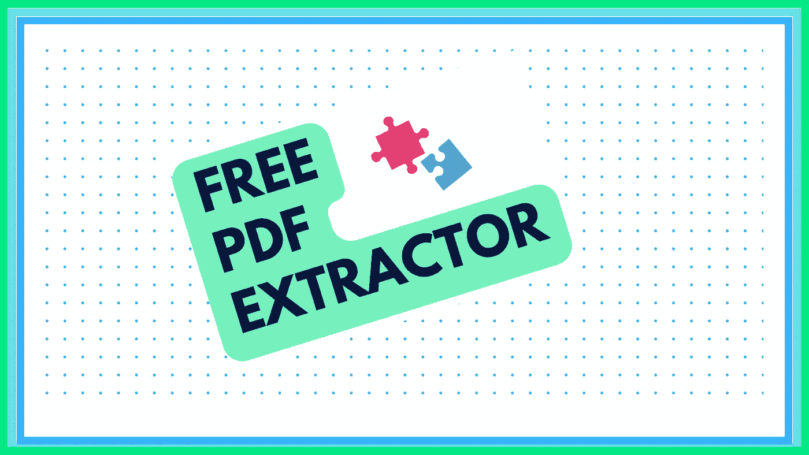
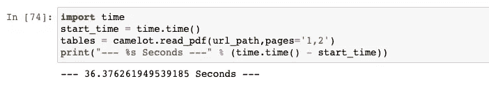
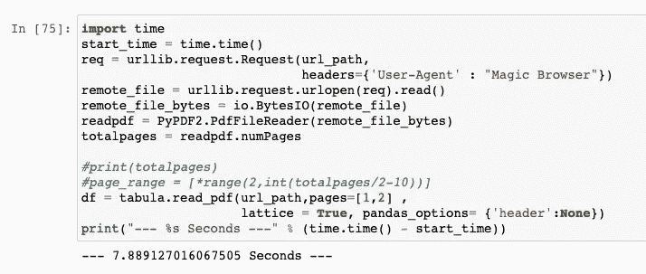
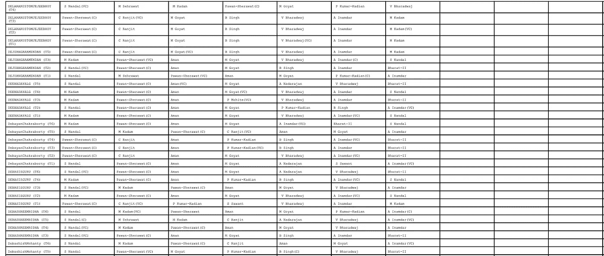
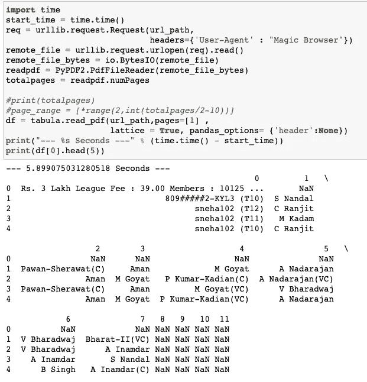
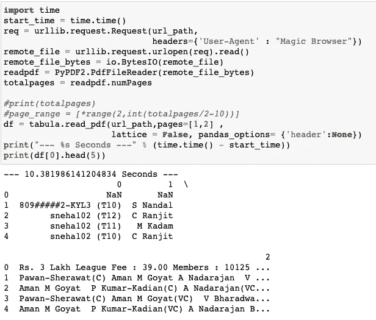
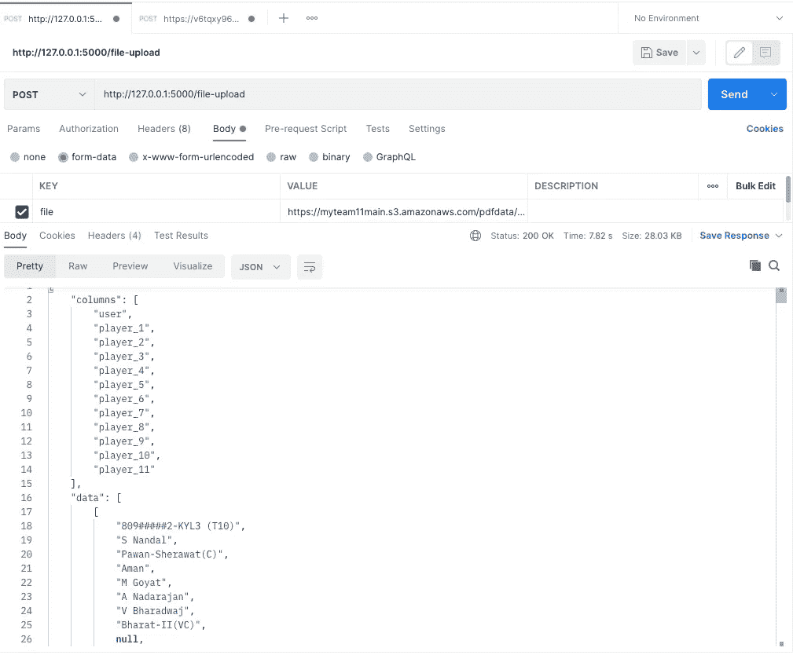

# 这就是我如何使用我的编码技能来构建免费的 Pdf 提取器

> 原文：<https://towardsdatascience.com/this-is-how-i-used-my-coding-skills-to-build-free-pdf-extractor-51f87ce68cc3>

## 使用 Python



由 [Canva](http://canva.com) 中的 [T.AI](https://medium.com/u/d0dfffad1523?source=post_page-----51f87ce68cc3--------------------------------) 创建

# 简介-故事:

我总是想用我的编码技能为我自己或我的朋友做点什么。让我告诉你一些关于我父亲的事情，他是一个自学成才的技术员，在没有得到教育或机构的太多帮助的情况下，他成功地在我们的小镇上经营了一家修理店，为任何电气和电子设备提供服务。他总是非常有兴趣自己做点什么，猜猜看，在我的童年，我们有两台电视，一台收音机和一台录音机，它们都是由我父亲用各种二手零件组装而成的，并且都运转得非常好，超过了 10 年。

每当他做出这样的东西时，我总是为他的技术感到高兴和感动。如果你真的观察到到处都在发生这种事，木匠喜欢为自己做东西，画家喜欢为自己画东西。但不幸的是，这不是我们在软件或数据科学领域经常看到的趋势。


一张由[布鲁纳·阿劳霍](https://unsplash.com/@brucaraujo?utm_source=medium&utm_medium=referral)在 [Unsplash](https://unsplash.com?utm_source=medium&utm_medium=referral) 拍摄的旧电视照片

查看您在笔记本电脑或手机上使用的应用程序或服务中有多少可以由您或您的朋友完成？至少要有一个。虽然它涉及到一些财务储蓄，但你不能低估它给你的信心和满足感。

因此，尝试使用 python 制作 pdf 提取器是让自己开心的想法之一。

## 我为什么做 PDF 提取器的技术方面-

如果你在网上搜索 pdf 提取器，你会得到一堆免费的资源，而且它们还不错。他们在将 PDF 转换为 CSV 方面做得非常好。

在我的特殊情况下，我需要 JSON 格式的 PDF 中的表格，这样我就可以将数据插入或更新到数据库中。为此，我需要正确可行格式的数据，因为这往往是一个重复的过程。我想要一个将 PDF 格式的表格转换成 JSON 格式的 API，当然也不想掏空我的口袋去使用这项服务。

因此，在本文结束时，您可以了解到

1.  如何使用 Python 将 PDF 转换成 JSON 和
2.  如何为其编写 API

# 选择

Python 的好处是它有很多库，几乎可以满足您想要运行的每个作业。对于 Pdf 的提取，有很多如下的库

*   PyPDF2
*   Textract
*   阿帕奇蒂卡
*   pdf 木材
*   pdfMiner
*   **白板**
*   **卡梅洛特**

我不打算在这里涵盖所有库之间的差异，但有一个很好的[如何从 PDF 中提取文本](/how-to-extract-text-from-pdf-245482a96de7)，你可以检查。

底线是不是所有的库都是好的，对我有用的不一定对你有用。这完全取决于您的场景和 pdf 格式。

## 哪个图书馆最好？

> 建议-如果执行时间对你来说不成问题，那么卡梅洛特就是完美的选择。

我想根据三件事来选择库

1.  输出的准确性
2.  执行时间
3.  易于在云中部署

带着这三点，我总结了我对卡梅洛特和塔布拉的选择。

卡梅洛特的参数非常丰富，提供了很多选项。

但是我最终没有在这个项目中使用卡米洛特。

你可能会想为什么🤔？

因为正如我所说的，我希望以后能够灵活地将代码部署为 API。在本地这可能行得通，但是随着执行时间的增加，在部署期间或部署之后处理云配置确实是一件令人头疼的事情。



卡梅洛特耗时约 36 秒



白板花费的时间约为 8 秒

卡梅洛特用了 36 秒，塔布拉尔用了 8 秒。

所以要回答**他们中最好的一个是什么？**由于执行时间，我说 Tabula 为我。

卡梅洛特确实提供了很多选择，但执行起来需要很多时间。

最后，我和塔巴鲁一起去了

## 怎么做？

我已经使用 pycharm 和 Jupyter 笔记本来编写和测试我的代码。您可以使用自己选择的任何 IDE。

如果你想看完整的代码请参考— [*Github 链接*](https://gist.github.com/tejeshb/96203007c6cff7f141f67f89208dcb7e)

密码

我们来看看主函数`pdf_to_df()`

主要功能

正如您可能已经预料到的，我们在函数中所做的是获取 URL，然后使用 PyPDF2 读取它

```
PyPDF2.PdfFileReader(remote_file_bytes)
```

神奇的是，从 pdf 文件中提取数据只用了一行代码，如下图所示`read_pdf()`是从`tabula library`导入的

```
read_pdf(url_path, pages=[1,2], lattice=True, pandas_options={'header': None})
```

这里的重要参数是`lattice`和`pandas_options`

让我们来看看在使用和不使用`lattice`的情况下，我所使用的示例 pdf 的输出有何不同



示例 PDF(由 [T.AI](https://medium.com/u/d0dfffad1523?source=post_page-----51f87ce68cc3--------------------------------) 创建)



晶格-对还是错

您可以看到，当 lattice 等于 True 时，代码如预期的那样生成了 12 列，而当它被设置为 False 时，它只生成了 3 列。这是因为 lattice 使用 pdf 表格中的线条来分隔列。您可以在此[文档链接](https://tabula-py.readthedocs.io/en/latest/tabula.html)中找到更多信息。

当我从函数`pdf_to_df()`中获取数据帧时，很容易使用`jsonify()`将其转换为 JSON

## Falsk 应用程序- API

我想生成 API，这样我就可以提供 pdf 的 Url 并获得 JSON 输出。为此，我使用了一个简单的 flask 应用程序结构和“post”方法。

您可以使用`python run <flask app.py>`在本地运行 flask 应用程序

我已经用 postman 在本地测试了这个应用，你可以在下面看到结果



Flask API 成功输出

# 结束了吗？

虽然写的代码为我做了工作。你能告诉我有什么问题吗？

我知道你们中的一些人肯定猜对了。这是我们在部署代码时面临的问题。在我写了这段代码之后，我意识到没有多少服务提供 PDF 给 JSON API，那么商业化怎么样呢？

为此，我需要部署 API，当我尝试使用`tabula-py`时遇到了困难，因为这个库是 tabula-java 的包装器。如果你有兴趣了解更多，并想知道我最终是如何部署它的，请留下评论，让我知道。

# 资源

要点链接-

1.  [https://gist . github . com/tejeshb/96203007 c 6 CFF 7 f 141 f 67 f 89208 dcb 7 e](https://gist.github.com/tejeshb/96203007c6cff7f141f67f89208dcb7e)

2.[https://gist . github . com/tejeshb/cf2f 10207959 b 57b 6 b 267155 e 070 f 185](https://gist.github.com/tejeshb/cf2f10207959b57b6b267155e070f185)