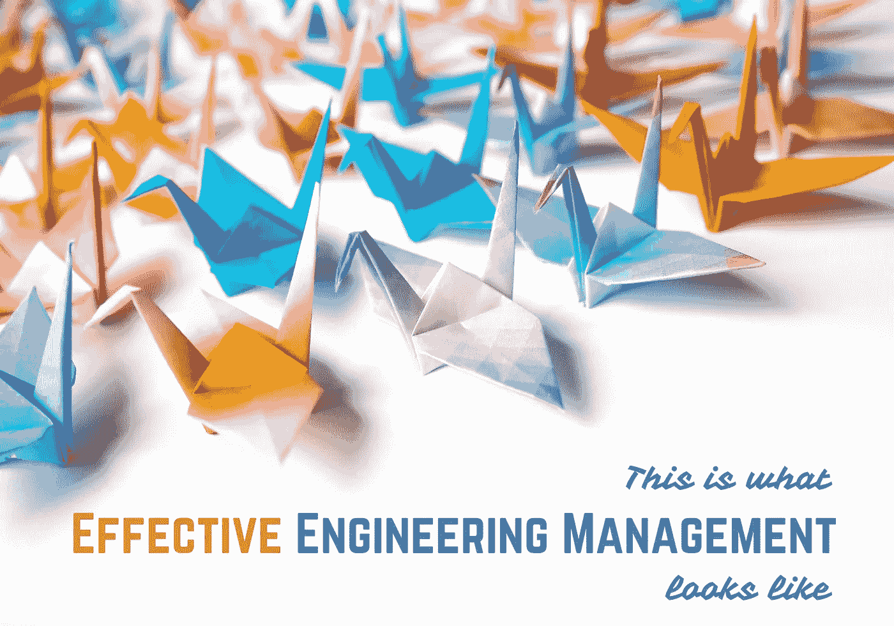

# 这就是有效的工程管理的样子

> 原文：<https://towardsdatascience.com/this-is-what-effective-engineering-management-looks-like-7c1e5e0877>

## 如何在工程领导角色中取得成功的 50 个洞见

作者图片

在转变为工程经理和总监之前，我已经担任[技术主管多年](/leading-a-software-development-team-be13b3f6b0f),我编制了这个列表，以提醒我必须不断发展和展示的所有技能和行为，以帮助我实现飞跃，以及我在担任该角色时获得的认识，希望它也能鼓励我的读者。

拥有扎实的工程基础是必须的，但要成为一名成功的工程领导者，还需要许多其他技能。

这绝不是一个详尽的列表，也没有按照任何特定的顺序排序，但它确实描绘了一个经理的技能组合:

1.  成为经理不是升职，而是一份完全不同的工作，事实上，这份工作会让你离你的专业领域更远。
2.  适应连续会议，即使感觉你在一天结束时没有完成多少。
3.  接受不断的上下文切换和被打断，但也要保证白天(或晚上)的一些思考时间。
4.  转变你的心态，成为一个推动者(甚至是乘数)，而不是执行者。
5.  创建路线图(短期与长期)并定义您的战略愿景。
6.  发布状态报告——掌握 KPI、突袭、实际与计划基线、预测里程碑、衡量项目的 ROI 等。
7.  管理工作组并为 SteerCo 会议做出贡献。
8.  知道何时构建内部软件，何时采用现成的软件。
9.  培养创新文化。
10.  让技术债务成为计划会议中反复出现的话题，同时不要失去对实际可交付成果的关注。
11.  交付一个有特定目标的项目，但是要考虑到企业的全局。
12.  帮助您的工程团队看到他们在这个大局中的目标。
13.  向另一个团队宣传你的框架/应用程序/解决方案，这样他们就不会重新发明轮子。
14.  与跨职能同事合作交付项目。
15.  放下你的项目，继续前进。
16.  理解“指挥链”，即权力在组织中的分配方式(又称组织结构图)，尤其是这些棘手的虚线…
17.  确定谁是真正的影响者，以及如何将他们添加到你的网络中。
18.  认识到什么在你的控制之内，什么在你的控制之外。
19.  把办公室政治抛在脑后，同时又不幼稚！
20.  认识到你的职业发展不仅依赖于你的经理或团队成员，也依赖于你的同事。
21.  建立你的权威，但也促进你的团队的授权和自主权。
22.  定期进行自我评估。
23.  把合适的人放在合适的岗位上。
24.  志愿参加有益于组织的项目，但在绩效评估和职业发展方面不一定有魅力、有挑战性或可提升性。
25.  向可能比你级别高的非技术观众解释技术观点，以获得支持或项目赞助。
26.  被叫去现场做报告。
27.  引导白板会议。
28.  掌握谷歌搜索的艺术！
29.  吸收不确定性和压力，这样你的团队才能把事情做好。
30.  反思负反馈。
31.  传递负面反馈。
32.  向你的上司传递负面反馈！
33.  接受不是每个人都喜欢你，这没关系！
34.  能够量化和测量几乎所有的东西。
35.  理解领导本地团队和领导全球团队是非常不同的(必读:[Erin Meyer 的文化地图](https://www.amazon.co.uk/Culture-Map-Breaking-Invisible-Boundaries/dp/1610392507)
36.  帮助你的团队成长，因为你管理的人是你的直接反映。
37.  管理一个比你聪明的工程师团队！
38.  无论成功是小是大，都要认可你的工程师。
39.  在信息共享方面对你的团队保持透明。
40.  提供技术指导和训练，但不是填鸭式的解决方案。
41.  确定目标，而不是规定过程。
42.  执行产能规划并建立招聘策略以雇佣高性能的工程师。
43.  新成员的入职、定向、指导和评估，以及离职，如果需要的话。
44.  在授权方面变得越来越有效。
45.  坚持到底——无论是给你的直接下属发一篇你读过的文章，还是给你的老板发他们要的材料。
46.  情绪成熟，能够领导一个由意志坚强(可能很难相处)的人组成的团队。
47.  首先解决冲突并防止其发生。
48.  评估现状(在开发实践、团队动态等方面)并设定新的优秀标准。
49.  鼓励你的团队参与决策过程。
50.  在问题出现之前，克服不愿意寻求帮助的心理。

现在是软件工程管理的大好时机！在大多数组织中，这些技能融合了多种角色，但无论你的级别如何，你都需要不断进化和发展。我希望我的观察和学到的教训对任何未来的工程领导者都有帮助。

感谢阅读！

*我经常在媒体上写关于领导力、技术&的数据——如果你想阅读我未来的帖子，请*[*‘关注’我*](https://medium.com/@semika) *！*

 [## 每当 Semi Koen 发布时收到电子邮件。

### 每当 Semi Koen 发布时收到电子邮件。我经常写关于领导力、技术和数据的文章——如果你愿意的话…

semika.medium.com](https://semika.medium.com/subscribe)