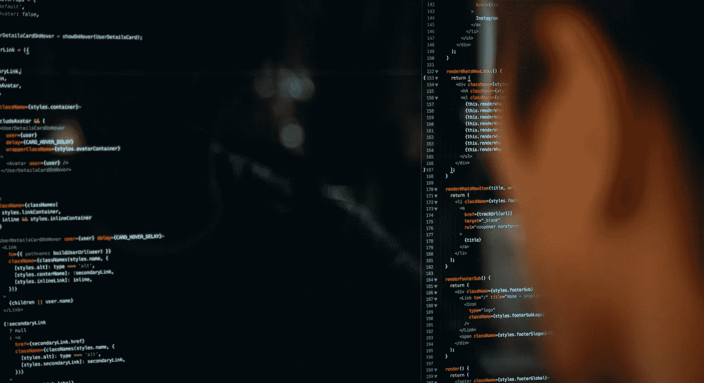
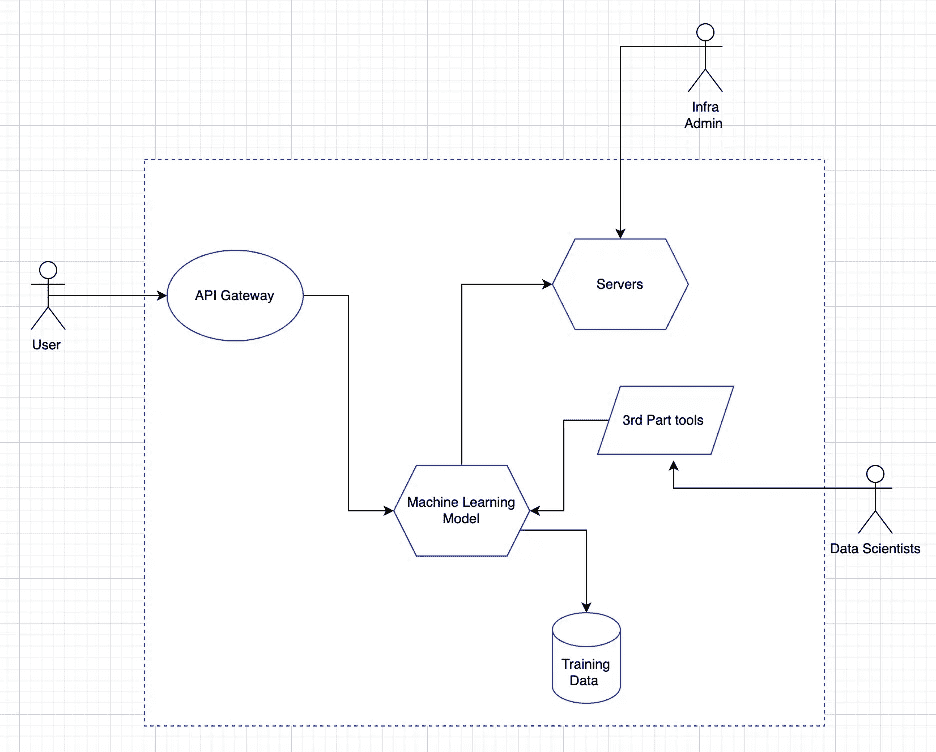

# 威胁建模人工智能和机器学习系统

> 原文：<https://towardsdatascience.com/threat-modeling-a-i-and-machine-learning-systems-8c1c6b86eb21>

## 使用威胁建模来识别 AI 和 ML 风险

由 [Unsplash](https://unsplash.com?utm_source=medium&utm_medium=referral) 上 [CharlesDeluvio](https://unsplash.com/@charlesdeluvio) 拍摄的照片

答人工智能和机器学习系统正在改变世界，并将成为当代最具颠覆性的技术。企业广泛采用这种系统以获得行业竞争优势，对于不习惯这种系统带来的独特风险的网络安全团队来说是一个巨大的挑战。

[**数据中毒、模型提取和成员推断**](https://taimurcloud123.medium.com/how-to-start-penetration-testing-of-artificial-intelligence-c11e97b77dfa) 攻击都是网络安全团队需要及早识别和缓解的新风险。最好的方法之一是将威胁建模的概念应用到这些应用程序中。

# 威胁建模

威胁建模是指一种识别系统安全威胁的结构化方法，通常包括以下内容:

●系统的高层次图表

●攻击者及其动机的简介

●系统面临的威胁以及这些威胁可能如何实现的列表

> 威胁建模类似于风险评估，但是您采用攻击者的视角，看看他们能造成多大的损害。有许多方法和工具可用于威胁建模，我们不必在此介绍，但老实说，如果您理解核心概念，您可以使用纸笔创建威胁模型！

# 威胁建模人工智能应用

最简单的形式是，你为你的 AI 应用程序创建一个高层次的图表，并设想威胁将会实现的场景。

让我们以一个简单的人工智能系统为例，我们为其创建了以下高级抽象:

来源:作者

即使这是一个非常基本的概念化，你仍然可以使用它来分解 AI 系统，并列出可能成为攻击者目标的关键资产。

一些关键资产是:

**●培训数据**

**●面向公众的 API**

**●机器学习模型**

**●托管模型的服务器**

**●基础管理员访问密钥或凭证**

现在假设一个攻击者的观点，试着想象他们会攻击哪些区域。你不必独自完成这项工作，应该让人工智能团队中的数据科学家和技术人员一起帮助你。集思广益威胁是一个伟大的方式来确定您的技术生态系统的薄弱领域与众多的方法。

> STRIDE 是微软的一种流行的威胁建模方法，我更喜欢它，它将威胁分为以下几类:

1.  **冒充** : *冒充某物或某人。*
2.  **篡改** : *修改数据或代码*
3.  **否认** : *声称没有执行某个动作。*
4.  **信息泄露** : *将信息暴露给未被授权查看的人*
5.  **拒绝服务** : *拒绝或降低对用户的服务*
6.  **特权提升** : *未经适当授权获得能力*

试着将你所有的威胁分成这些类别，并设想每一类至少有一个。**让我们通过一些示例威胁及其缓解措施来详细了解这些类别。**

# 电子欺骗

🚨**威胁场景**:攻击者可以恶意使用人工智能系统进行身份欺诈。例如，在远程采访中使用 Deepfakes 假扮成其他人的身份

🔒**缓解**:对敏感职位的面试进行“真实性检查”。确保人力资源经过培训，能够发现深度造假

# **T** 与

🚨**威胁场景**:攻击者毒害数据科学家使用的第三方工具的供应链；

🔒**缓解**:使用前扫描软件库。确保完整性检查存在

# 否认

🚨**威胁场景**:基于欺骗威胁，攻击者可以使用 deepfakes 实施身份威胁，并将这些行为归因于另一个人。

🔒**缓解措施**:确保认证建立在相互独立的多个级别的系统中。

# 一、信息披露

🚨**威胁场景**:攻击者获得模型的访问权并试图复制它

🔒**缓解**:限制暴露的 API 上存在的限制，以限制可以发出的请求的数量。异常呼叫数量警报。输出请求中的信息有限

# 服务期限

🚨**威胁场景**:攻击者通过删除训练数据引发拒绝服务攻击

🔒**缓解**:定期备份镜像。限制对培训数据的访问

# 特权的取消

🚨**威胁场景**:攻击者获得管理员凭证或密钥的访问权

🔒**缓解**:管理员使用多重身份认证通过强化的端点访问服务器。

# 结论

如你所见，威胁建模与其说是一门精确的科学，不如说是一门艺术，你做得越多，就会做得越好。你使用的具体方法并不重要，但重要的是你要坚持不懈地去做，并跟踪这些风险直到结束。这项工作应与技术和业务团队合作完成，他们将定期参与人工智能系统的培训/创建。

我希望这有助于你看到威胁建模如何以一种清晰易懂的方式帮助设想人工智能的风险和威胁。从本质上来说，威胁建模就是提出“什么会出错”的问题，并在像攻击者一样思考的同时回答这个问题。在人工智能的整个生命周期中执行这个过程，每当有重大变化时，你会看到你的人工智能安全状况的切实改善

> 我希望你喜欢阅读这篇文章。如果你觉得这个话题很有趣，那就去看看我的书《人工智能治理与网络安全》<https://www.amazon.com/gp/product/B09YHK8L2T/>****或者我的*** [***教程***](https://cloudsecguy.gumroad.com/l/aigovernance) ***。请考虑使用此*** [***链接***](https://taimurcloud123.medium.com/membership) 成为中等会员来支持我*