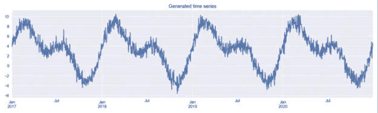
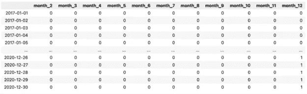
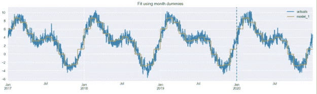
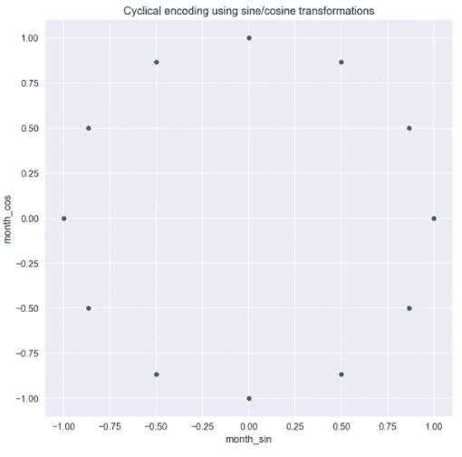
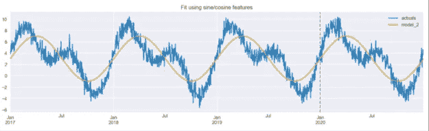
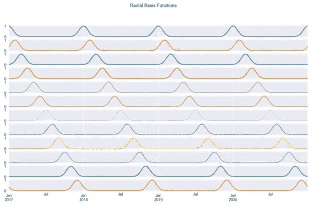
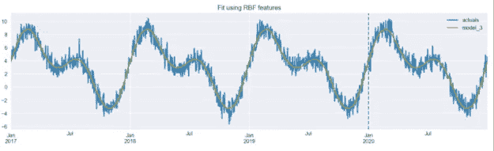
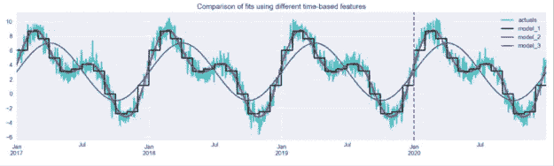
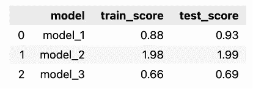

# 时间序列特征工程的三种方法

> 原文：<https://towardsdatascience.com/three-approaches-to-feature-engineering-for-time-series-2123069567be>


托马斯·博尔曼斯在 [Unsplash](https://unsplash.com/s/photos/clock?utm_source=unsplash&utm_medium=referral&utm_content=creditCopyText) 上的照片

## 使用虚拟变量、循环编码和径向基函数

假设您刚刚开始了一个新的数据科学项目。目标是建立一个预测目标变量 Y 的模型。你已经从利益相关者/数据工程师那里收到了一些数据，做了一个彻底的 EDA，并选择了一些你认为与手头问题相关的变量。然后你终于造出了你的第一个模型。分数可以接受，但是你相信你可以做得更好。你是做什么的？

有很多方法可以让你跟进。一种可能性是增加你使用的机器学习模型的复杂性。或者，你可以尝试提出一些更有意义的特性，继续使用当前的模型(至少暂时是这样)。

对于许多项目，企业数据科学家和 Kaggle 等数据科学竞赛的参与者都同意，后者——从数据中识别更有意义的特征——通常可以以最少的努力对模型准确性做出最大的改进。

您有效地将复杂性从模型转移到了特性上。这些特征不必非常复杂。但是，理想情况下，我们会找到与目标变量有着紧密而简单关系的特征。

许多数据科学项目包含一些关于时间流逝的信息。这并不局限于时间序列预测问题。例如，您经常可以在传统的回归或分类任务中找到这样的特征。本文研究如何使用与日期相关的信息创建有意义的特性。我们提出了三种方法，但我们首先需要做一些准备。

# 设置和数据

对于本文，我们主要使用非常著名的 Python 包，同时依赖一个相对不知名的包，`scikit-lego`，它是一个包含许多有用功能的库，扩展了`scikit-learn’s`的功能。我们导入所需的库，如下所示:

为了简单起见，我们自己生成数据。在这个例子中，我们使用一个人工时间序列。我们首先创建一个空的数据框架，其索引跨越四个日历年(我们使用`pd.date_range`)。然后，我们创建两列:

*   `day_nr`–代表时间流逝的数字指数
*   `day_of_year`–一年的第几天

最后，我们必须创建时间序列本身。为此，我们将两条变换后的正弦曲线和一些随机噪声结合起来。用于生成数据的代码基于`scikit-lego`的[文档](https://scikit-lego.readthedocs.io/en/latest/)中包含的代码。



图 1

然后，我们创建一个新的数据帧，在其中存储生成的时间序列。该数据框架将用于比较采用不同特征工程方法的模型性能。

```
results_df = y.to_frame()
results_df.columns = ["actuals"]
```

# 创建与时间相关的要素

在本节中，我们描述了生成时间相关要素的三种方法。

在我们开始之前，我们应该定义一个评估框架。我们的模拟数据包含了四年的观察结果。我们将使用前 3 年生成的数据作为训练集，并在第四年进行评估。我们将使用平均绝对误差(MAE)作为评估指标。

下面我们定义一个变量，它将为我们提供服务，用于切断这两个集合:

```
TRAIN_END = 3 * 365
```

# 方法 1:虚拟变量

我们从你最可能已经熟悉的东西开始，至少在某种程度上。对时间相关信息进行编码的最简单方法是使用[虚拟变量](https://en.wikipedia.org/wiki/Dummy_variable_(statistics))(也称为一键编码)。让我们看一个例子。

下面，你可以看到我们操作的输出。



首先，我们从`DatetimeIndex`中提取关于月份的信息(编码为 1 到 12 范围内的整数)。然后，我们使用`pd.get_dummies`函数来创建虚拟变量。每一列都包含观察值(行)是否来自给定月份的信息。

你可能已经注意到了，我们已经降了一级，现在只有 11 列。我们这样做是为了避免臭名昭著的*虚拟变量陷阱*(完美多重共线性)，这在处理线性模型时可能是一个问题。

在我们的例子中，我们使用虚拟变量方法来获取记录观察的月份。然而，同样的方法也可用于指示来自`DatetimeIndex`的一系列其他信息。例如，一年中的某一天/某一周/某一季度，某一天是否是周末的标志，某一时期的第一天/最后一天，等等。你可以在[pandas.pydata.org](https://pandas.pydata.org/pandas-docs/stable/user_guide/timeseries.html#time-date-components)找到一个列表，其中包含了我们可以从`pandas`文档索引中提取的所有可能的特性。

*额外提示*:这超出了这个简单练习的范围，但是在现实生活场景中，我们也可以使用关于特殊日子的信息(比如国庆节、圣诞节、黑色星期五等等)来创建特性。是一个不错的 Python 库，包含了每个国家特殊日子的过去和未来信息。

如引言中所述，特征工程的目标是将复杂性从模型方面转移到特征方面。这就是为什么我们将使用最简单的最大似然模型之一——线性回归——来看看仅使用创建的虚拟模型我们能多好地拟合时间序列。



图 2

我们可以看到，拟合线已经很好地遵循了时间序列，尽管它有点参差不齐(台阶状)，这是由虚拟特征的不连续性造成的。这就是我们接下来两种方法要解决的问题。

但是在继续之前，可能值得一提的是，当使用非线性模型如决策树(或其集合)时，我们并不明确地将特征如月数或一年中的某一天编码为哑元。这些模型能够学习有序输入特征和目标之间的非单调关系。

# 方法#2:使用正弦/余弦变换的循环编码

正如我们前面看到的，拟合线类似于台阶。这是因为每个虚拟对象都被单独处理，没有连续性。然而，时间等变量存在明显的循环连续性。那是什么意思？

想象一下，我们正在处理能源消耗数据。当我们包括观察到的消费月份的信息时，连续两个月之间有更强的联系是有意义的。使用这种逻辑，12 月和 1 月以及 1 月和 2 月之间的联系很强。相比之下，一月和七月之间的联系没有那么强。这同样适用于其他与时间相关的信息。

那么我们如何将这些知识融入到特征工程中呢？三角函数来拯救。我们可以使用以下正弦/余弦变换将循环时间特征编码成两个特征。

在下面的代码片段中，我们复制了初始数据帧，添加了带有月份数字的列，然后使用正弦/余弦转换对`month`和`day_of_year`列进行编码。然后，我们绘制两对曲线。


图 3

我们可以从转换后的数据中得出两个结论，如图 3 所示。首先，我们可以很容易地看到，当使用月份进行编码时，曲线是步进式的，但当使用日频率时，曲线要平滑得多；其次，我们也可以看到为什么我们必须使用两条曲线而不是一条。由于曲线的重复性，如果你在一年的时间里在图上画一条水平直线，你会在两个地方穿过曲线。这不足以让模型理解观察的时间点。但是有了两条曲线，就不存在这样的问题，用户可以识别每一个时间点。当我们在散点图上绘制正弦/余弦函数值时，这一点非常明显。在图 4 中，我们可以看到圆形图案，没有重叠的值。



图 4

让我们仅使用来自每日频率的新创建的特征来拟合相同的线性回归模型。



图 5

图 5 显示该模型能够获得数据的总体趋势，识别具有较高和较低值的时期。然而，预测的幅度似乎不太准确，乍一看，这种拟合似乎比使用虚拟变量实现的拟合更差(图 2)。

在我们讨论第三个特征工程技术之前，值得一提的是，这种方法有一个严重的缺点，当使用基于树的模型时，这一点很明显。根据设计，基于树的模型基于当时的单个特征进行分割。正如我们之前提到的，为了正确识别一个周期内的时间点，应该同时考虑正弦/余弦特性。

# 方法 3:径向基函数

最后一种方法使用径向基函数。我们不会详细讨论它们到底是什么，但是你可以在[这里](https://en.wikipedia.org/wiki/Radial_basis_function)读到更多。本质上，我们再次希望解决我们在第一种方法中遇到的问题，也就是说，我们的时间特征具有连续性。

我们使用方便的`scikit-lego`库，它提供了`RepeatingBasisFunction`类，并指定以下参数:

*   我们想要创建的基函数的数量(我们选择了 12)。
*   用于索引 RBF 的列。在我们的例子中，这是包含给定观察值来自一年中哪一天的信息的列。
*   输入的范围-在我们的例子中，范围是从 1 到 365。
*   如何处理我们将用于拟合估计量的数据帧的剩余列。`”drop”`将只保留创建的 RBF 特征，`”passthrough”`将同时保留新旧特征。



图 6

图 6 显示了我们使用天数作为输入创建的 12 个径向基函数。每条曲线都包含了我们离一年中的某一天有多近的信息(因为我们选择了那一列)。例如，第一条曲线测量从 1 月 1 日开始的距离，因此它在每年的第一天达到峰值，并随着我们远离该日期而对称地减小。

根据设计，基函数在输入范围内等距分布。我们选择 12，因为我们希望 RBF 类似于月。这样，每个函数大约显示(由于月份长度不等)到一个月第一天的距离。

与前面的方法类似，让我们使用 12 个 RBF 特征来拟合线性回归模型。



图 7

图 7 显示，当使用 RBF 特征时，该模型能够准确地捕捉真实数据。

使用径向基函数时，我们可以调整两个关键参数:

*   径向基函数的数量，
*   钟形曲线的形状——可以用`RepeatingBasisFunction`的`width`参数修改。

调整这些参数值的一种方法是使用网格搜索来确定给定数据集的最佳值。

# 最终比较

我们可以执行下面的代码片段，对编码时间相关信息的不同方法进行数值比较。



图 8

图 8 说明了径向基函数从所考虑的方法中产生最接近的拟合。正弦/余弦特征允许模型拾取主要模式，但不足以完全捕捉系列的动态。

使用下面的代码片段，我们计算了每个模型在训练集和测试集上的平均绝对误差。我们预计训练集和测试集之间的分数非常相似，因为生成的序列几乎完全是循环的——年份之间的唯一差异是随机成分。

自然，在现实生活中不会这样，在现实生活中，随着时间的推移，我们会遇到更多的相同时期之间的可变性。但是，在这种情况下，我们还会使用许多其他特征(例如，一些趋势或时间流逝的度量)来解释这些变化。

如前所述，我们可以看到使用 RBF 特征的模型得到了最佳拟合，而正弦/余弦特征表现最差。我们关于训练集和测试集之间分数相似性的假设也得到了证实。



# 外卖食品

*   我们展示了三种将时间相关信息编码为机器学习模型特征的方法。
*   除了最流行的虚拟编码，还有更适合编码时间循环特性的方法。
*   使用这些方法时，时间间隔的粒度对于新创建的要素的形状非常重要。
*   使用径向基函数，我们可以决定想要使用的函数的数量，以及钟形曲线的宽度。

您可以在我的 [GitHub](https://github.com/erykml/nvidia_articles/blob/main/three_approaches_to_encoding_time_information_as_features_for_ml_models.ipynb) 上找到本文使用的代码。一如既往，我们非常欢迎任何建设性的反馈。你可以在[推特](https://twitter.com/erykml1?source=post_page---------------------------)或评论中联系我。

*喜欢这篇文章吗？成为一个媒介成员，通过无限制的阅读继续学习。如果你使用* [*这个链接*](https://eryk-lewinson.medium.com/membership) *成为会员，你就支持我，不需要你额外付费。提前感谢，再见！*

您可能还会对以下内容感兴趣:

<https://medium.com/geekculture/investigating-the-effects-of-resampling-imbalanced-datasets-with-data-validation-techniques-f4ca3c8b2b94>  </time-series-diy-seasonal-decomposition-f0b469afed44>  </a-step-by-step-guide-to-calculating-autocorrelation-and-partial-autocorrelation-8c4342b784e8>  

# 参考

*   [https://sci kit-learn . org/stable/auto _ examples/applications/plot _ cyclic _ feature _ engineering . html](https://scikit-learn.org/stable/auto_examples/applications/plot_cyclical_feature_engineering.html)
*   [https://sci kit-Lego . readthedocs . io/en/latest/preprocessing . html](https://scikit-lego.readthedocs.io/en/latest/preprocessing.html)
*   [https://pandas . pydata . org/pandas-docs/stable/user _ guide/time series . html # time-date-components](https://pandas.pydata.org/pandas-docs/stable/user_guide/timeseries.html#time-date-components)

所有图片，除非特别注明，均为作者所有。

*最初发表于* [*NVIDIA 的开发者博客*](https://developer.nvidia.com/blog/three-approaches-to-encoding-time-information-as-features-for-ml-models/)*2022 年 2 月 17 日*