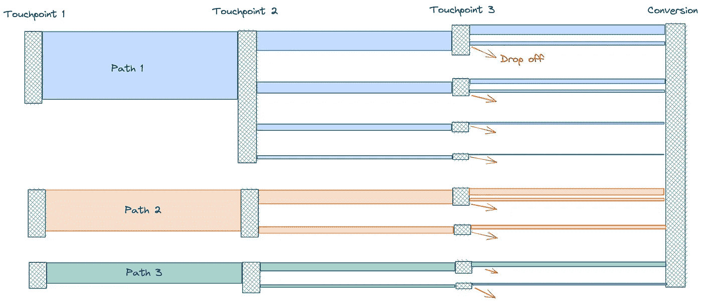
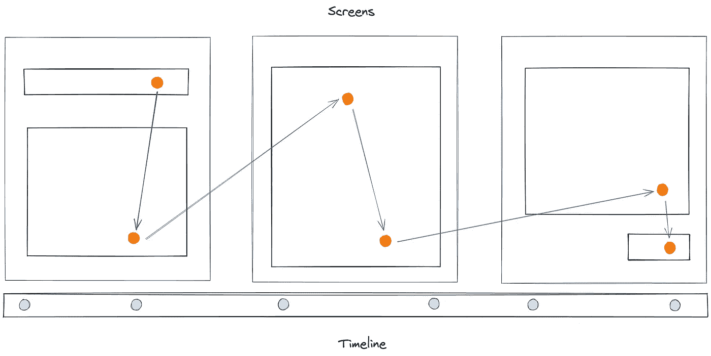
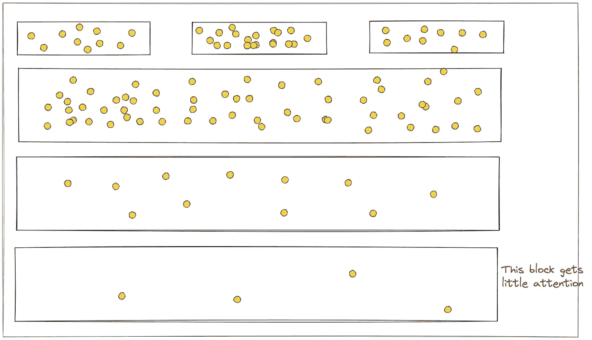
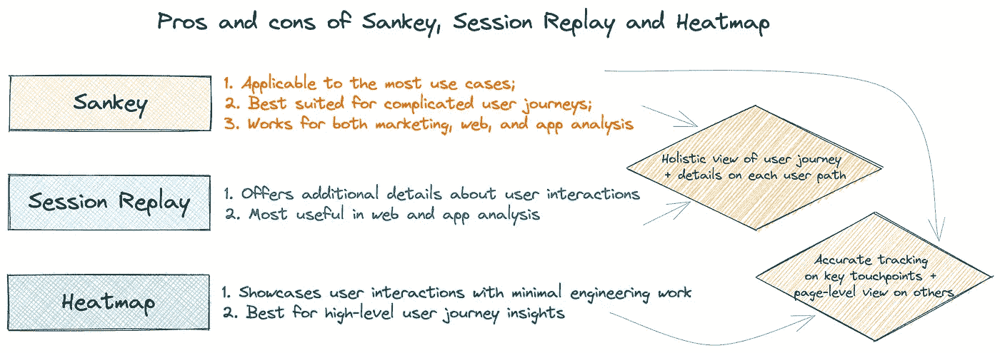

# 揭示用户旅程的三种方法

> 原文：<https://towardsdatascience.com/three-approaches-to-uncover-user-journey-98071e98e7eb>

## 通过构建能够产生强大洞察力的数据系统，更好地了解全局

公司投资数据科学只是因为它服务于他们的关键路径，即创造收入或节省成本。数据科学的独特之处在于它能够通过分析历史自动发现可行的方法。这种能力增强了获取客户的能力，这是关键路径中的一个关键部分。公司可以通过扩大已被证明有效的产品和削减无效的产品来更有效地获得客户。具体来说，公司关心他们的客户来自哪里，他们何时转换或放弃，以及为什么。

在“[连接数据战略中的点](/connect-the-dots-in-data-strategy-56f65a1e63a5)”一文中，我讨论了构建一个数据系统作为用户旅程的“数字双胞胎”如何帮助一家公司理解大图并回答上述基本问题。本文将深入探讨构建这种数字双胞胎的三种实用方法。

图片来自 Unsplash

# 用桑基图描绘高级用户旅程

作者图片

桑基图是最流行的图解顾客旅程的图。它显示了不同的用户组如何从一个点移动到另一个点，哪些用户路径最受欢迎，以及人们在哪里下车。由于 Sankey 图在可视化方面的优势，它是许多数据分析软件的关键特性。

桑基图最适合于高层商业决策。例如，如果图表显示一个特定的渠道驱动了大部分的流量，并且对一个企业来说具有高转换率，那么它将从加倍投资该渠道中获益。另一方面，如果用户经常在与网站进行特定的交互后离开，那么就有必要调查一下这个接触点出了什么问题。

然而，Sankey 图需要仔细的用户旅程映射才能正确工作。对于公司来说，试图通过为每个可能的接触点建立跟踪机制来映射网站上或应用程序中的用户交互是一个难以置信的挑战。这变成了一个悖论:需要了解用户旅程的公司往往没有对它的完整见解，因此无法绘制出旅程中所有重要的接触点。然而，只有在绘制了接触点并为其建立了跟踪机制时，桑基图才是准确的。

此外，桑基图没有讲述用户旅程背后的故事——为什么用户选择一条路径而不是另一条路径或放弃。幸运的是，第二种和第三种方法可以弥补桑基图的缺陷。

# 用户交互深入了解会话重放

会话重放是一种通过会话记录和回放历史用户交互的技术。由于它会自动记录每一次用户交互，因此不需要事先绘制用户旅程地图。因此，它大大降低了公司开始使用数据科学的门槛。

作者图片

会话重放记录用户屏幕或点击流数据以及每次点击或移动之间的时间。它为产品经理、设计师和工程师解释用户行为提供了丰富的细节，例如用户是否在特定屏幕上遇到问题或困惑，以及什么可能导致这些问题。

# 热图提供了更多方向

对于一些网页，公司不需要对每个接触点进行粒度跟踪，但对页面级用户交互的洞察仍然是有益的。例如，许多公司在有机营销上花费了大量资源，如在网站上放置创意和博客，他们需要了解用户是否查看或点击了内容。

测绘和跟踪所有的创意和博客将需要大量的工作，特别是考虑到这些经常更新和改变立场。公司也没有必要使用会话重放来了解所有用户交互细节。在这种情况下，热图是一个很好的选择。

作者图片

热图显示网页上的哪些部分更受关注。它帮助公司将关键内容转移到最受关注的地方，并可能重新设计网站或应用程序，将内容呈现在用户面前。

# 选择正确的解决方案

虽然每个例子都有优点和缺点，但结合一个或多个例子有助于公司获得用户旅程的必要细节。

在接下来的文章中，我将继续深入研究获取客户的数据科学技术。如果你想聊聊他们，请随时在 Linkedin 上联系我。