# 在 Python Pandas 数据帧中解析 JSON 文档的三种情况

> 原文：<https://towardsdatascience.com/three-cases-when-parsing-json-documents-in-a-python-pandas-dataframe-9c9dfea9ec34>


图片由 [Flore W](https://pixabay.com/users/wflore-11084744/?utm_source=link-attribution&utm_medium=referral&utm_campaign=image&utm_content=4395609) 来自 [Pixabay](https://pixabay.com/?utm_source=link-attribution&utm_medium=referral&utm_campaign=image&utm_content=4395609)

## 如果你知道这些技巧，在 Pandas 中标准化 JSON 对象并不困难

我们在做一些数据科学工作时，不得不处理 JSON 文档这样的半结构化数据是相当常见的。作为 Python 中最流行的数据处理框架，Pandas 提供了内置的 JSON 规范化特性“json_normalize()”。

当然，这篇文章的目的不仅仅是介绍如何在 Pandas 中使用 JSON 规范化方法。在现实世界中，数据并不完美。例如，当我们使用 JSON normalize 方法时，JSON 对象中可能会有丢失的数据，这可能会导致错误。

在本文中，我将描述三种情况，当我们试图用 Pandas 中丢失的数据来规范化 JSON 文档时。

# 0.熊猫 JSON 标准化方法


图片来自 [Pixabay](https://pixabay.com/?utm_source=link-attribution&utm_medium=referral&utm_campaign=image&utm_content=6495338)

在我们讨论特殊情况之前，让我们先看看`json_normalize()`方法在正常情况下的用法。假设我们有这样一个 JSON 文档。我们可以从 JSON 对象创建一个熊猫数据帧，如下所示。

```
import pandas as pddf = pd.DataFrame({
    'student_id': [1, 2, 3],
    'student_name': ['Alice', 'Bob', 'Chris'],
    'student_info': [
        {'gender': 'F', 'age': 20},
        {'gender': 'M', 'age': 22},
        {'gender': 'M', 'age': 33}
    ]
})
```

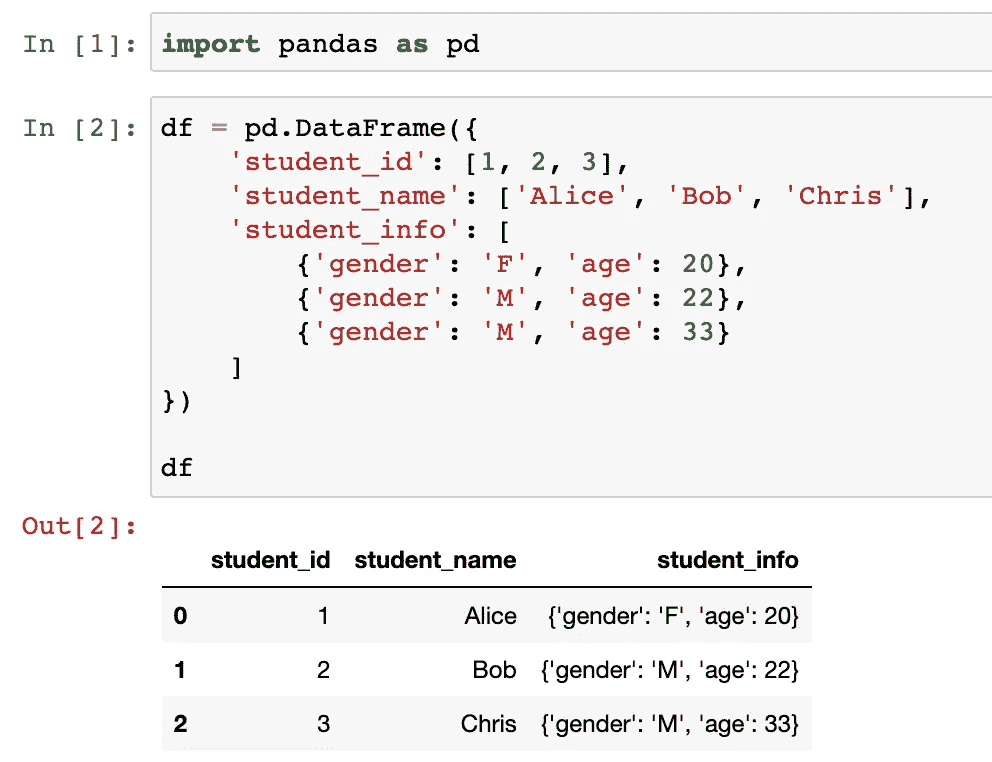

好的。现在，`student_info`字段嵌套在 JSON 对象中。是时候使用`json_normalise()`方法从 JSON 对象中解码它了。

```
pd.json_normalize(df['student_info'])
```

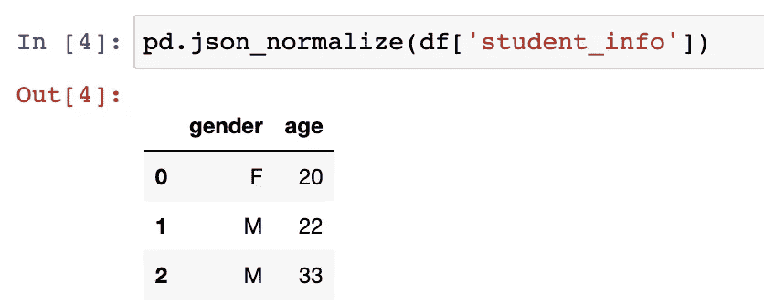

该方法非常方便。它聪明地计算出所有 JSON 对象的属性，并将它们用作列名。然后，提取它们的值并将它们转换成表格格式。

如果想把它放回原来的数据帧，可以用熊猫里的`concat()`方法。

```
df = pd.concat([
    df.drop('student_info', axis=1), 
    pd.json_normalize(df['student_info'])], 
    axis=1
)
```

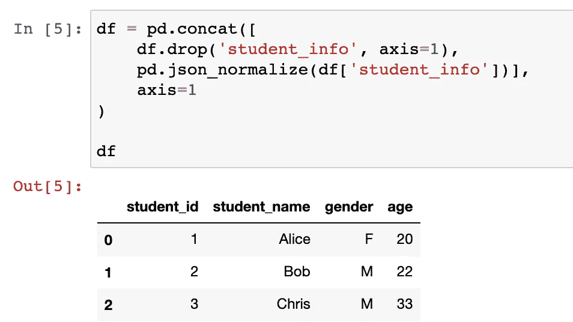

# 案例 1 — JSON 作为字典


图片由 [Liselle VD](https://pixabay.com/users/00firefly00-6414409/?utm_source=link-attribution&utm_medium=referral&utm_campaign=image&utm_content=2821388) 从 [Pixabay](https://pixabay.com/?utm_source=link-attribution&utm_medium=referral&utm_campaign=image&utm_content=2821388) 获得

现在，让我们看看 JSON 对象中丢失数据的一些情况。在第一种情况下，假设我们已经有了 Python 字典格式的 JSON。

```
df = pd.DataFrame({
    'student_id': [1, 2, 3],
    'student_name': ['Alice', 'Bob', 'Chris'],
    'student_info': [
        {'gender': 'F', 'age': 20},
        {'gender': 'M', 'age': 22},
        None
    ]
})
```

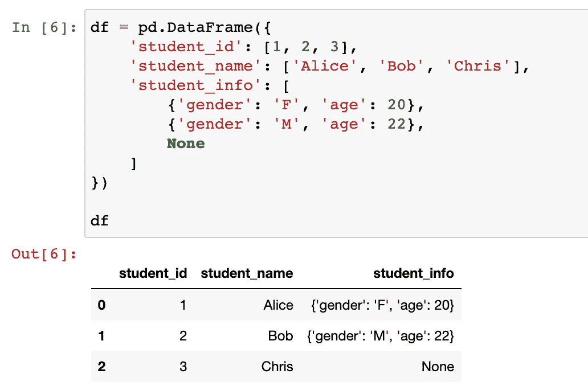

在这种情况下，所有的`student_info`类型都是 Python 字典。

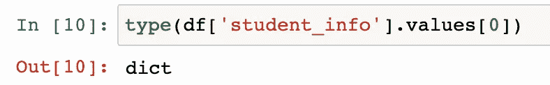

本案例模拟学生“Chris”的缺失数据。对他来说没有`student_info`。如果我们试图使用`json_normalize()`方法，将会抛出一个错误。

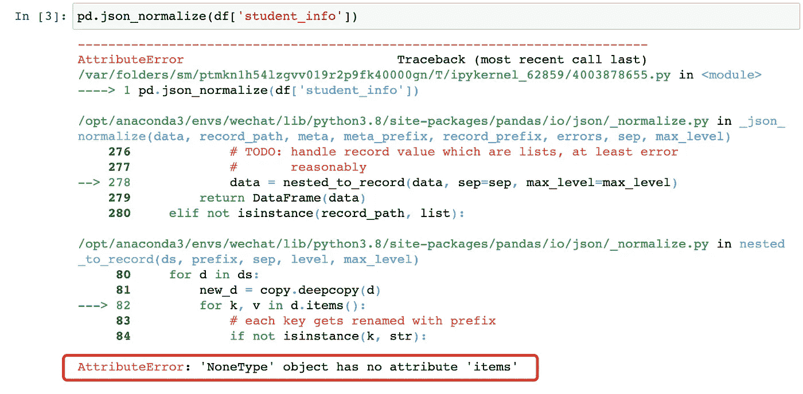

然而，我们不想使用`dropna()`来删除这些行，因为还有其他有用的字段。在这种情况下，我们需要用一个空字典来填充【无】`student_info`。

到目前为止，我相信没有问题。难的是我们可以很容易的使用`fillna()`方法如下。

```
df['student_info'].fillna({})
```

这根本行不通。

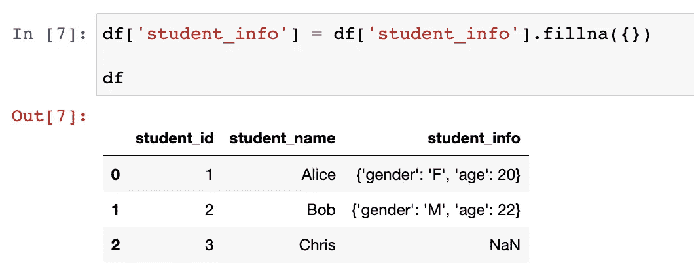

这是因为`fillna()`方法需要一个标量/文字值或者一个字典、序列，甚至是数据帧。换句话说，如果它是一个标量或文字值，它将用于填充所有缺失的单元格。否则，它必须是一个集合类型，可以告诉哪个单元格将填充什么。

显然，空字典`{}`或`dict()`不是标量，但不能用来告诉程序哪些字段应该填充什么值。因此，我们必须使用数据帧的索引来组成字典。

> 用于填补漏洞的值(例如 0)，或者是值的字典/系列/数据框架，指定每个索引(对于系列)或列(对于数据框架)使用哪个值。不在字典/系列/数据框架中的值将不会被填充。该值不能是列表。

```
df['student_info'].fillna({i: {} for i in df.index})
```

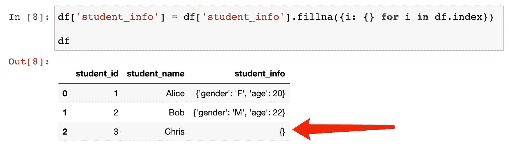

现在，我们可以使用`json_normalize()`方法。

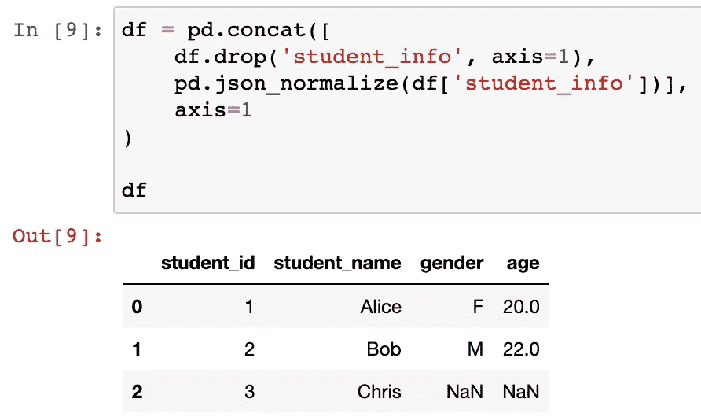

## *熊猫的重要更新*

在此添加本节是为了澄清上述问题已在 Pandas 更新版本 1.3.0 中涵盖。换句话说，上面的错误只会出现在 1.2.5 或更低版本中。

# 案例 2 —字符串形式的 JSON


图片来自[茱莉亚·罗曼](https://pixabay.com/users/julesroman-359800/?utm_source=link-attribution&utm_medium=referral&utm_campaign=image&utm_content=792912)来自 [Pixabay](https://pixabay.com/?utm_source=link-attribution&utm_medium=referral&utm_campaign=image&utm_content=792912)

在这种情况下，让我们假设我们得到的 JSON 文档是字符串格式的。这在实践中很常见。想象一下，我们从一些 CSV 文件中读取数据，这些文件是从 NoSQL 数据库中转储的(有人可能会这样做，不要惊讶)。

样本数据如下。

```
df = pd.DataFrame({
    'student_id': [1, 2, 3],
    'student_name': ['Alice', 'Bob', 'Chris'],
    'student_info': [
        '{"gender": "F", "age": 20}',
        '{"gender": "M", "age": 22}',
        None
    ]
})
```

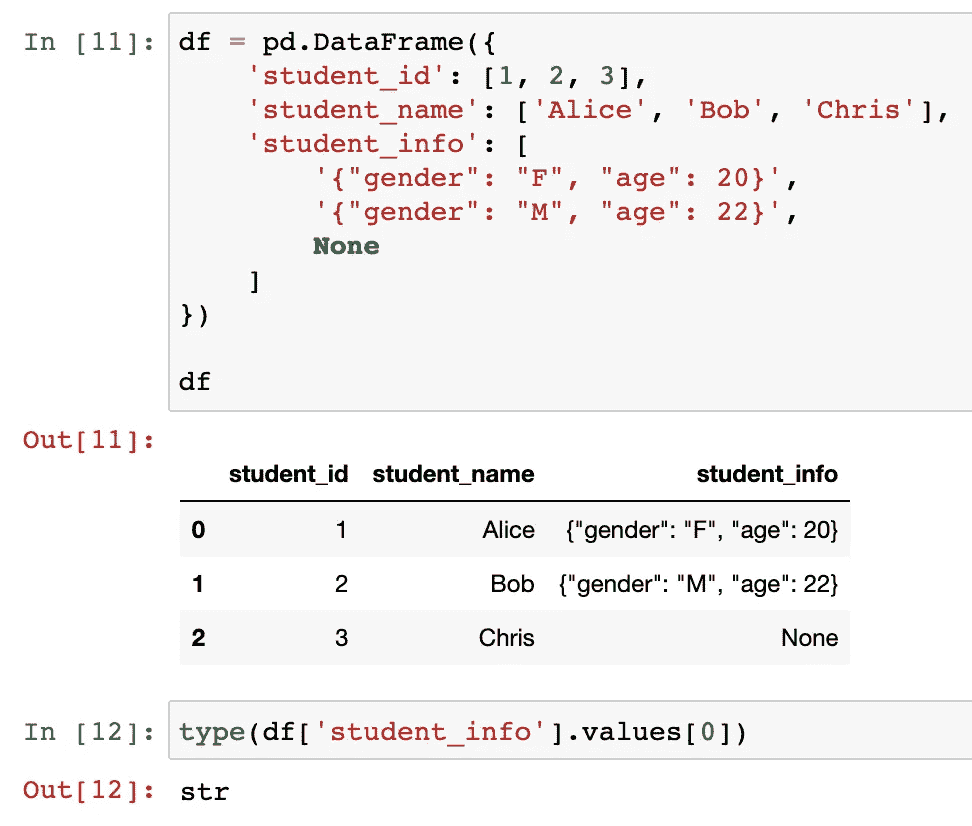

在这种情况下，我们需要使用一些魔法将 JSON 字符串转换成 Python 字典。我们可以使用内置的 JSON 库来加载它们，并将`json.loads()`方法放入`pands.apply()`方法中。然而，有更简单的方法。那就是使用 AST(抽象语法树)中的`literal_eval()`方法，这也是一个内置的库。

顺便说一句，避免使用`eval()`方法是很好的方式，因为它会立即评估一切，而不需要任何安全检查。不管我们之后会对数据做什么，我们都应该使用`literal_eval()`。简单来说，后者只会对字符串、字节、数字、元组、列表、字典、集合、布尔、None 求值。

```
from ast import literal_evalmy_dict = literal_eval('{"gender": "F", "age": 20}')type(my_dict)
```

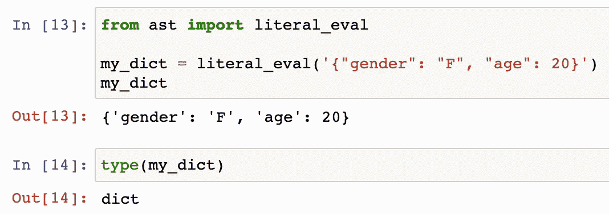

现在，我们可以使用`literal_eval()`方法将 JSON 字符串转换成 Python 字典吗？它将完成工作，但是不要忘记我们仍然没有价值。

```
df['student_info'].apply(literal_eval)
```

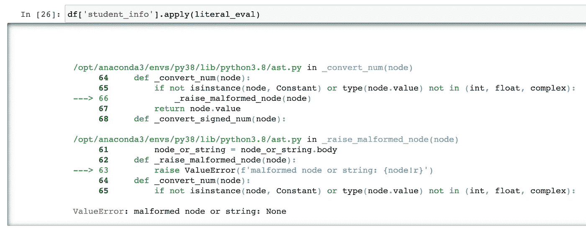

解决方案并不复杂，只需用一个空字典填充`None`值，但采用字符串格式`'{}'`。所以，它将被`literal_eval()`方法转换成一个空字典。

```
df['student_info'] = df['student_info'].fillna('{}')df = pd.concat([
    df.drop('student_info', axis=1), 
    pd.json_normalize(df['student_info'].apply(literal_eval))], axis=1)
df
```

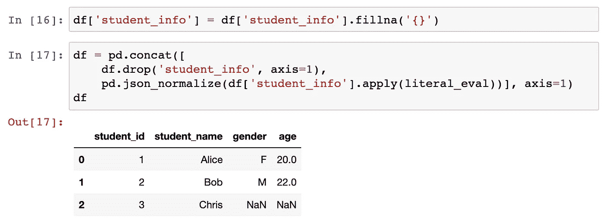

# 案例 3 —字符串形式的 JSON 数组


来自 [Pixabay](https://pixabay.com/?utm_source=link-attribution&utm_medium=referral&utm_campaign=image&utm_content=4300222) 的 [KAVOWO](https://pixabay.com/users/kavowo-6764465/?utm_source=link-attribution&utm_medium=referral&utm_campaign=image&utm_content=4300222) 的图像

最后，源数据中有大量 JSON 数组对象并不少见。如果能把它们读入 Python list，我们消费起来就容易多了。然而，有时它们也可能是字符串。

让我们这样来考虑这个案例。

```
df = pd.DataFrame({
    'student_id': [1, 2, 3],
    'student_name': ['Alice', 'Bob', 'Chris'],
    'student_exam': [
        '[{"math": 90, "english": 85}]',
        '[{"math": 85}]',
        None
    ]
})
```

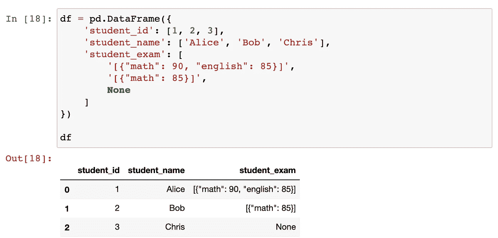

出于某种原因，这就是我们拥有的数据。我们没有别的选择，就改造吧。

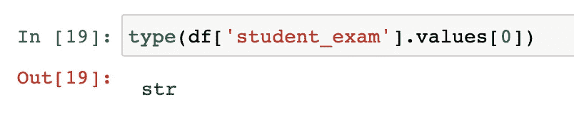

由于它们也是字符串，我们可以再次使用`literal_eval()`方法将它们转换成真正的 Python 列表。这一次，我们需要分别用`'[]'`填充 None 值。

```
df['student_info'] = df['student_info'].fillna('[]').apply(literal_eval)
```

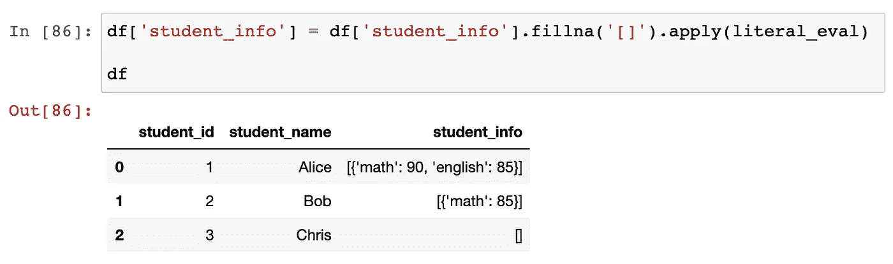

然后，重要的部分是我们需要使用 Pandas 中的`explode()`方法从列表中提取值。如果一个列表中有多个项目，那么这个特定的行将被重复几次，这样每个项目都在一行中。

此外，使用`explode()`方法不会产生数据帧的新索引。如果有任何包含多项的列表，数据帧索引也将重复。因此，我们可以添加`reset_index()`方法来重置索引，然后删除旧的。

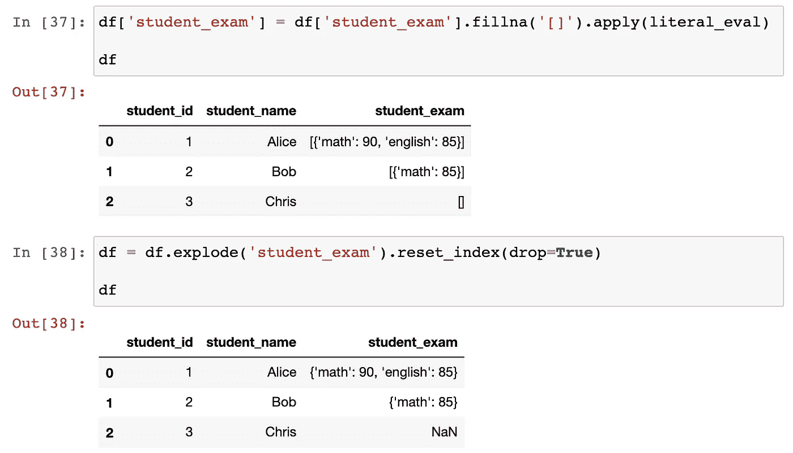

下一步，我们可以毫无问题地使用`json_normalize()`方法。

```
df = pd.concat([
    df.drop('student_info', axis=1), 
    pd.json_normalize(df['student_info'])], 
    axis=1
)
```

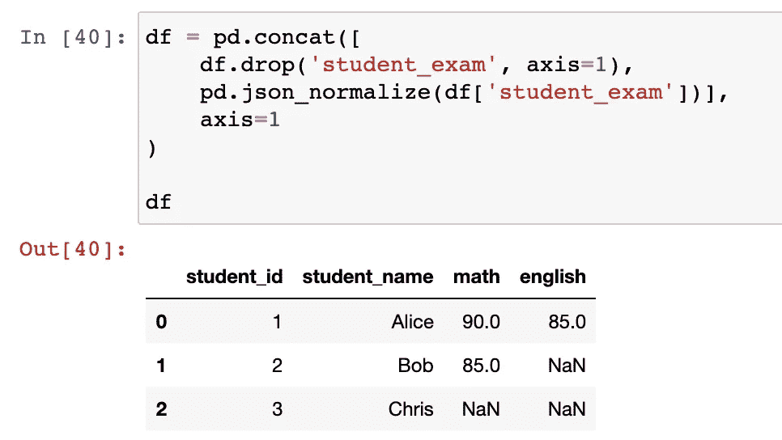

# 摘要


图片由[Seth OS](https://pixabay.com/users/seth0s-816508/?utm_source=link-attribution&utm_medium=referral&utm_campaign=image&utm_content=4301479)来自 [Pixabay](https://pixabay.com/?utm_source=link-attribution&utm_medium=referral&utm_campaign=image&utm_content=4301479)

在这篇文章中，我介绍了 Pandas 框架中最方便的方法之一`json_normalise()`。它很容易使用，可以节省大量的时间和精力，虽然有时它不能处理一些特殊情况。本文展示了 JSON 文档中有空值的 3 种情况以及如何处理它。

[](https://medium.com/@qiuyujx/membership) [## 通过我的推荐链接加入灵媒-陶

### 作为一个媒体会员，你的会员费的一部分会给你阅读的作家，你可以完全接触到每一个故事…

medium.com](https://medium.com/@qiuyujx/membership) 

如果你觉得我的文章有帮助，请考虑加入 Medium 会员来支持我和成千上万的其他作者！(点击上面的链接)