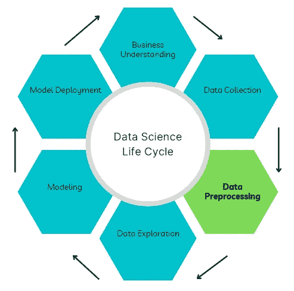
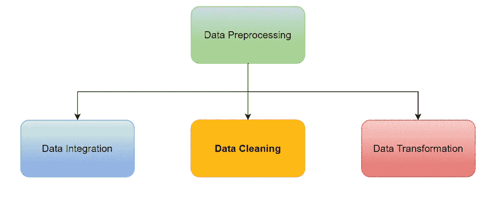
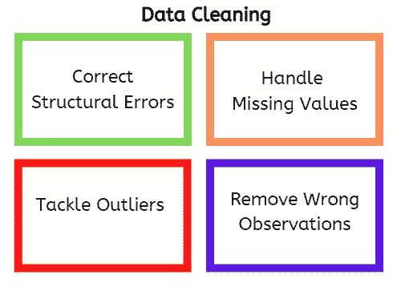
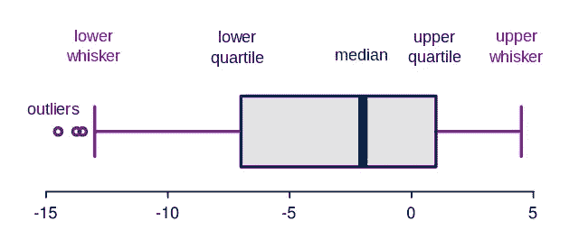

# 数据预处理的三个关键要素—第 2 部分

> 原文：<https://towardsdatascience.com/three-critical-elements-of-data-preprocessing-part-2-2078110ae8e7>

## 数据科学中建模的支柱

在 [Unsplash](https://unsplash.com?utm_source=medium&utm_medium=referral) 上由[Towfiqu barb huya](https://unsplash.com/@towfiqu999999?utm_source=medium&utm_medium=referral)拍摄的照片

数据预处理是数据科学项目生命周期中的主要步骤之一，包括将原始数据转换为适合数据分析的精确形式。

作者图片

在本系列的第一篇文章中，我介绍了数据预处理的数据集成组件，它涉及到组合来自不同来源的数据，以获得包含所有可用相关特性和示例的数据集。该文章的链接可在此处找到:

 [## 数据预处理的三个关键要素—第 1 部分

### 数据科学中建模的主干。

towardsdatascience.com](/three-critical-elements-of-data-preprocessing-part-1-3c16f46f8ced) 

在本文中，我将讨论数据预处理的下一个组成部分，也可能是建模目的中最关键的部分，即数据清洗。此外，我将分享处理数据清理过程不同部分的资源。

作者图片

# 数据清理

这是从收集的数据集中识别并移除或纠正重复、损坏和缺失数据的过程。

作者图片

数据清理提高了输入机器学习算法的数据质量，可以成就或破坏一个数据科学项目。尽管通常是一个耗时的过程，但数据清理会产生巨大的好处，尤其是在提高模型性能方面，因为模型的好坏取决于它接收到的数据。

> 因此，生成更清晰的数据比花费更多的计算能力和时间调整复杂的算法要好。

数据清理过程包括以下任务:

## 纠正结构性错误

这包括识别和修复数据中的不一致。例如，分类特征可能被标注为不同的大写字母(男性与男性)，或者目标变量可能被分配到错误的类别。后者很难检测，可能需要领域专家的知识才能发现。

Pandas DataFrame 中的 *value_counts* 方法可用于调查数据集中每一列的唯一标签。此外，独特标签计数的条形图可用于直观检查数据中的不一致性。

*资源:*

数据清理—[https://www . tableau . com/learn/articles/what-is-Data-cleaning #:~:text = Data % 20 cleaning % 20 is % 20 进程，to % 20be % 20duplicated % 20or 或%20mislabeled](https://www.tableau.com/learn/articles/what-is-data-cleaning#:~:text=Data%20cleaning%20is%20the%20process,to%20be%20duplicated%20or%20mislabeled) 。

熊猫值计数—[https://pandas . pydata . org/pandas-docs/stable/reference/API/pandas。DataFrame.value_counts.html](https://pandas.pydata.org/pandas-docs/stable/reference/api/pandas.DataFrame.value_counts.html)

## 处理缺失值

根据正在处理的缺失值的普遍程度和类型，可以估计缺失值或删除受影响的观察值(示例)。

根据经验，当缺失值的百分比“非常小”时，我会建议放弃观察值(比如< 5%) compared with overall available data. Similarly, features with more than 95% of the data missing may be dropped although these are hard not thresholds and can be changed based on domain knowledge.

Missing values occur in several forms including:

(1) *完全随机缺失(MCAR):* 在这种情况下，缺失数据与观察到的或未观察到的样本无关，不会引入偏差。因此，它们可以被删除。但是，可以分析的总人口比例减少了。

(2) *随机缺失(MAR):* 这里的缺失数据依赖于观测数据。例如，受观察数据属性(如年龄或性别)影响的缺失值可能会随机出现，但可能会也可能不会在数据集中引入偏差。这些值可以使用内插法或其他基于观察数据的统计估计来估算。

(3) *非随机缺失(MNAR):* 在这种情况下，缺失数据依赖于未观察到的数据，来自这类数据集的洞察更有可能出现偏差。这些缺失值通常是不可忽略的，不能用标准方法估算，因此很难分析。另一方面，有一类 MNAR 称为可分析的结构性缺失数据。

*资源:*

 [## 缺失数据的类型

### 虽然用 MCAR 数据对数据集进行的完整案例分析是无偏的，但有一个普遍的误解，即完整的…

www.ncbi.nlm.nih.gov](https://www.ncbi.nlm.nih.gov/books/NBK493614/)  [## 11.7 处理缺失数据:MCAR | R 健康数据科学

### 在进行标准回归分析之前，我们可以:删除带有缺失数据的变量，删除带有…

argoshare.is.ed.ac.uk](https://argoshare.is.ed.ac.uk/healthyr_book/handling-missing-data-mcar.html) 

## 处理异常值

异常值是存在于给定变量的预期值范围之外的数据点。根据定义，预期范围是主观的，取决于调查领域。

但是，有一些处理异常值的方法，包括彻底消除受影响的数据点，根据数据分布将值剪切到某个阈值，以及估计数据点的实际值(将该点视为缺失值)。

并非所有的异常值都是平等的。有些只是干扰你的机器学习模型的噪音，而另一些则是你的数据的真实属性的表示。

> 消除“好的”异常值可能会危及数据清理过程，并导致不具代表性的数据模型。

领域知识和专家咨询是发现差异的好方法。

你如何发现异常值？以下是检测异常值的方法列表:

(1) *数据可视化:*箱线图和直方图对于快速识别数据中的异常值很有用。许多绘图工具，如 Seaborn、Tableau 和 Power BI，都具有创建这些图形的功能。

原始照片由[罗伯斯布](https://upload.wikimedia.org/wikipedia/commons/b/b1/Elements_of_a_boxplot.svg)(语言由[鲁迪格 85](https://commons.wikimedia.org/wiki/File:Elements_of_a_boxplot_en.svg) 更改)， [CC-BY-SA-3.0](https://creativecommons.org/licenses/by-sa/3.0) ，通过维基媒体

(2) *标准差阈值:*对于近似正态分布的数据，离群值可以定义为距离均值+/-x 标准差的数据点。其中取决于应用领域，x 的值通常在 1 至 3 的范围内。

(3) *四分位数范围阈值:*异常值可以定义为在正负方向上位于四分位数范围 1.5 倍(1.5*IQR)之外的数据点。其中四分位数间距是第三(上)四分位数和第一(下)四分位数之间的距离。阈值可以增加到 3*IQR 以检测极端的异常值。

(4) *假设检验:*根据数据分布，统计检验可用于检测数据集中异常值的存在。一些例子包括 Grubb 检验、Dixon 的 Q 检验和卡方检验。在这种方法中，零假设表明数据中没有异常值，而替代假设表明至少有一个异常值。在显著性水平为α(比如 0.05)的情况下，如果测试的 P 值小于α，则拒绝零假设，并推断存在异常值。

(5) *异常检测模型:*可以构建监督和非监督机器学习模型，以基于数据集中的其他预测特征来学习变量的典型值。然而，这种方法在计算上是昂贵的，甚至是过度的。

*资源:*

识别异常值的方法—[https://statisticsbyjim.com/basics/outliers/](https://statisticsbyjim.com/basics/outliers/)

异常值检测的假设检验—[https://www . dummies . com/article/technology/information-technology/data-science/big-data/hypothesis-tests-for-data-outliers-141226/](https://www.dummies.com/article/technology/information-technology/data-science/big-data/hypothesis-tests-for-data-outliers-141226/)

## 去除错误的观察值

在数据整合过程中，一些观察结果可能会重复或损坏。消除受影响的数据点有助于避免数据模式的错误表述或建模过程中的过度拟合等问题。因此，清除错误的数据点可以显著提高模型性能。

# 结论

在本文中，我介绍了数据清理，这是数据预处理的一个关键元素。正如我们所看到的，这个过程非常复杂，但是它在模型性能改进方面有很大的好处。

在本系列的下一篇也是最后一篇文章中，我将讨论数据转换，其中也包括数据缩减策略。

我希望你喜欢这个系列，直到下次。干杯！

什么更有趣？你可以通过下面我的推荐链接订阅 Medium 来获得更多我和其他作者的启发性文章，这也支持我的写作。

 [## 通过我的推荐链接加入媒体

### 阅读 Abiodun Olaoye(以及媒体上成千上万的其他作家)的每一个故事。您的会员费直接支持…

aolaoye.medium.com](https://aolaoye.medium.com/membership)