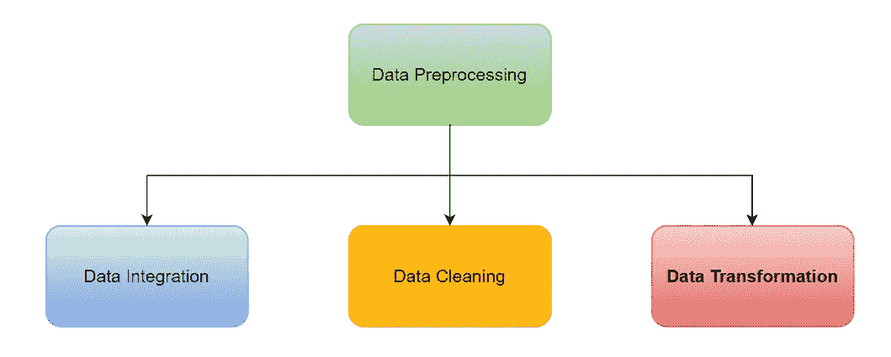
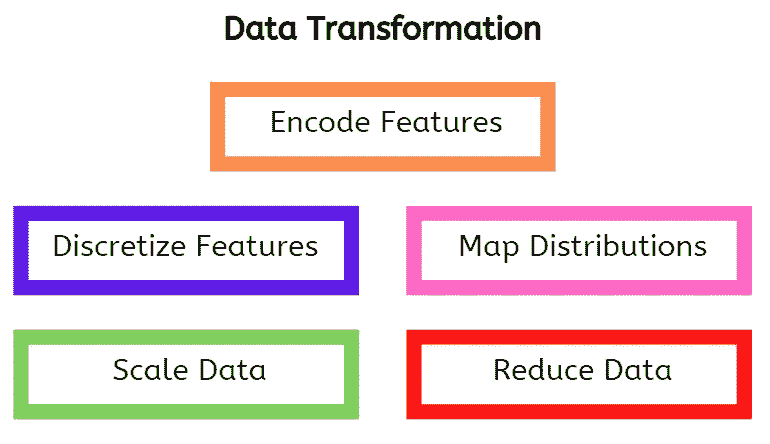

# 数据预处理的三个关键要素—第 3 部分

> 原文：<https://towardsdatascience.com/three-critical-elements-of-data-preprocessing-part-3-6a7da681ae16>

## 数据科学中建模的主干。

克里斯·劳顿在 [Unsplash](https://unsplash.com?utm_source=medium&utm_medium=referral) 上的照片

在本文中，我将讨论数据转换，这是数据科学项目生命周期中数据预处理步骤的一个关键元素。

作者图片

数据预处理是将来自不同来源的原始数据转换成可用于获得可操作见解的精炼形式的过程。它需要整合、清理和改造。

在本系列的第 1 部分中，我们讨论了数据集成，将不同来源的数据组合起来，获得一个包含所有可用相关特性和示例(如沙拉碗)的数据集😊。详情如下:

  

随后，我们探讨了数据清理，即在收集的数据集中查找和修复重复、损坏和丢失的数据的过程。详情可在此处找到:

  

在这里，我将从数据科学中建模的角度介绍数据预处理难题的最后一部分，即数据转换。

# 数据转换

在机器学习的上下文中，数据转换是将数据转换成最能代表数据模式并适合模型拟合的适当格式或结构的过程。

> 如果我们在建模之前恰当地应用转换，我们可以从数据中挤出更多的汁液。

机器学习算法接受不同的数据格式和类型，尽管数字数据是最可接受的格式。其中，数字数据是可以是小数或整数的数字，其值的范围从-无穷大到+无穷大。

相比之下，分类数据是表示为字符串的定性特征(例如，状态特征可以将“开”或“关”作为唯一的类别)。数据集还可能包含具有“真”或“假”特征值的布尔数据类型。

以下数据转换通常适用于数据科学建模，并且非常有价值。

**特征编码**

这是将分类数据转换成数字数据的过程。存在两种主要的方法，即顺序编码和独热编码。

*序数编码:*在这种情况下，分类数据中的层次结构在转换后保持不变。例如，风险级别特征可以转换如下:低风险-0，中风险-1，高风险-2。熊猫图书馆的[顺序编码器](https://scikit-learn.org/stable/modules/generated/sklearn.preprocessing.OrdinalEncoder.html)可用于此操作。

*One-hot 编码:*这种方法在分类特征中没有顺序，并且很少有唯一的类别(低基数)时使用。因为为每个类别创建了一个新列，所以当将这种方法应用于具有高基数的特性时，数据大小会显著增长。在这种情况下，可以应用基数编码，如这里的[所述](https://pycaret.gitbook.io/docs/get-started/preprocessing/data-preparation#cardinal-encoding)。

**离散化**

通过创建离散化数据的类区间可以更好地将连续数据呈现给算法。例如，一组年龄范围(0-12:0，13-19:1，20-35:2，35+:4)可以从连续年龄数据中创建，转换后的数据具有更好的预测能力。用于离散化的有用的熊猫方法包括[切割](https://pandas.pydata.org/docs/reference/api/pandas.cut.html)和[q 切割](https://pandas.pydata.org/docs/reference/api/pandas.qcut.html)。

此外，二进制化是一种特殊类型的离散化，它涉及将特征值分配给两组中的任何一组，即 0 或 1。Scikit-learn 预处理模块中的[二进制化](https://scikit-learn.org/stable/modules/generated/sklearn.preprocessing.binarize.html)工具可用于该操作。

**分布映射**

当输入数据具有特定分布(例如正态分布)时，一些机器学习算法表现更好。绘制分布图的著名方法包括:

*均匀映射:*这涉及到将数据映射到具有同等可能性结果的均匀分布。更多详情可点击查看[。此外，Scikit-learn 中的](https://scikit-learn.org/stable/modules/preprocessing.html#mapping-to-a-uniform-distribution)[分位数转换器](https://scikit-learn.org/stable/modules/generated/sklearn.preprocessing.QuantileTransformer.html#sklearn.preprocessing.QuantileTransformer)工具可用于此操作。

*高斯映射:*这里，数据被映射成尽可能接近正态分布，平均值、中值和众数大致相同。更多细节可以在[这里](https://scikit-learn.org/stable/modules/preprocessing.html#mapping-to-a-gaussian-distribution)找到。此外，Scikit-learn 中的[电源变压器](https://scikit-learn.org/stable/modules/generated/sklearn.preprocessing.PowerTransformer.html#sklearn.preprocessing.PowerTransformer)工具可用于此操作。

可以说，变换数据分布并不总是一个好主意，因为会产生意想不到的影响，例如掩盖残差的真实行为。更多解释可以在[这里](https://medium.com/peter-flom-the-blog/why-you-should-probably-not-transform-your-data-9ea098dcaddf)找到。

**数据缩放**

此过程可确保将具有不同单位和量值范围的要素转换为相同的比例，以避免将数据误报给模型。存在几种数据缩放方法，但为了简洁起见，我在这里只简要描述几种，如果有兴趣，还提供了进一步研究的链接。

*标准化:*这包括减去平均值并除以标准差。它确保数据以零为中心，并根据标准偏差进行调整。更多详情可在[这里](https://scikit-learn.org/stable/modules/preprocessing.html#standardization-or-mean-removal-and-variance-scaling)找到。

*标准化:*该方法确保每个观察值或每个特征的数据值都有一个单位标准。更多细节可以在这里找到[。此外，可以使用 Scikit-learn 预处理模块中的](https://scikit-learn.org/stable/modules/preprocessing.html#normalization) [normalize](https://scikit-learn.org/stable/modules/generated/sklearn.preprocessing.normalize.html#sklearn.preprocessing.normalize) 方法。

*缩放到一个范围:*这里，给定特征的数据值被映射到一个特定的范围。它通常包括减去平均值，然后除以要素的最小值和最大值之间的差值。更多详情可点击查看[。](https://scikit-learn.org/stable/modules/preprocessing.html#scaling-features-to-a-range)

其他缩放方法包括使用最小和最大阈值的对数缩放和限幅值。这个免费的 Google 课程对数据缩放(规范化)进行了更深入的解释。不同的缩放方法对有异常值的数据的影响可以[此处](https://scikit-learn.org/stable/auto_examples/preprocessing/plot_all_scaling.html#sphx-glr-auto-examples-preprocessing-plot-all-scaling-py)。

**数据还原**

在数据转换过程中，可能会出于很好的理由创建许多新功能。然而，随着特征数量的增加，计算成本和时间也会增加。此外，过多的特征可能会导致过度拟合等问题。这个问题通常被称为维数灾难。

> 因此，我们可能需要减少特征的数量，以有效地建立机器学习模型，同时提高预测性能。

多重共线性(两个或多个独立要素高度相关)是可能修剪要素的另一个原因。它会影响模型性能和可解释性，尤其是非基于树的算法，如线性回归。更多关于多重共线性的细节可以在[这里](/multicollinearity-why-is-it-bad-5335030651bf)找到。

数据简化的一些方法包括:

*主成分分析:*这是一种非常有用的方法，可以将数据特征映射到一个较低的正交维度空间，同时尽可能多地保留数据中的信息。然而，变换后的特征不像原始特征那样可解释。因此，它们在某些应用中可能不被使用。更多细节可以在[这里](https://scikit-learn.org/stable/modules/decomposition.html#principal-component-analysis-pca)找到。另外，Scikit-learn 中的分解模块有一个 [PCA](https://scikit-learn.org/stable/modules/generated/sklearn.decomposition.PCA.html) 工具可以用于这个动作。

*特征消除:*在这种情况下，最不相关的特征被去除，同时保留最具预测能力的特征。使用直观且大多可解释的原始特征，这避免了 PCA 遇到的可解释性问题。该方法可以递归执行，如这里的[所述](https://www.scikit-yb.org/en/latest/api/model_selection/rfecv.html#recursive-feature-elimination)。

# 结论

在本文中，我们讨论了数据转换，即将数据转换成适合模型的格式的过程。此过程还可能包括一些讨论过的数据简化策略。

这里探讨的数据转换与大多数数据科学建模应用程序相关，但并不详尽。应该注意的是，还有其他特定于不同领域的转换，例如用于自然语言编程的符号化和用于时间序列分析的滞后特征的特征创建。

这就把我们带到了数据预处理系列的结尾。耶！！我希望你喜欢这些文章，直到下次。干杯！

什么更有趣？你可以通过下面我的推荐链接订阅 Medium 来获得更多我和其他作者的启发性文章，这也支持我的写作。

 