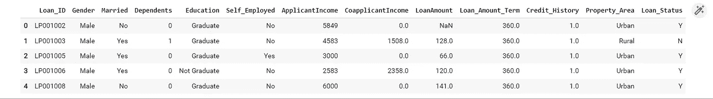
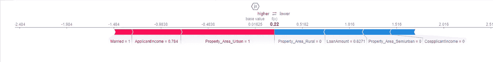
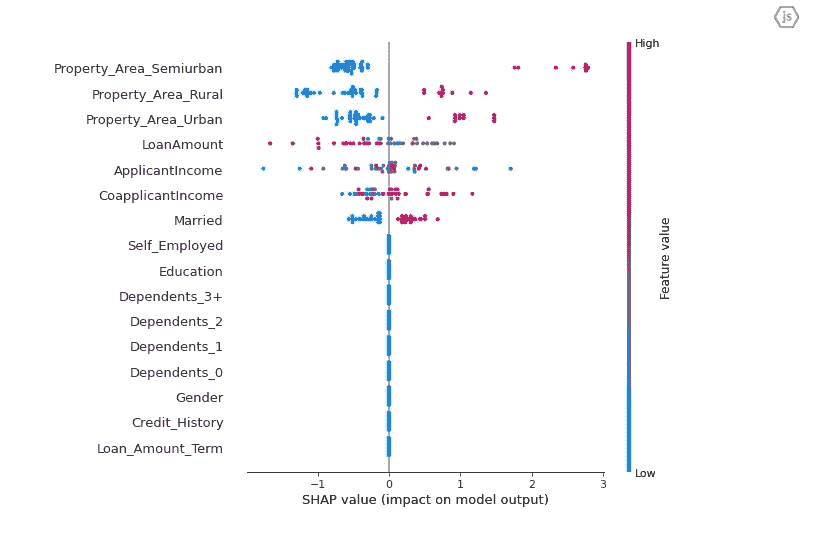
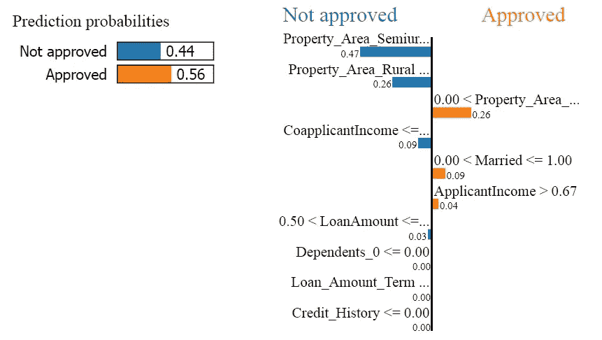
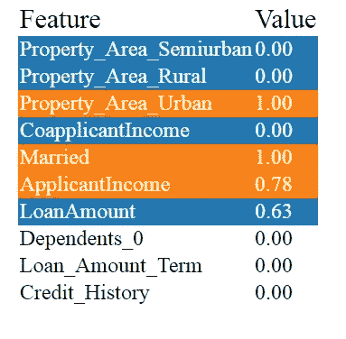
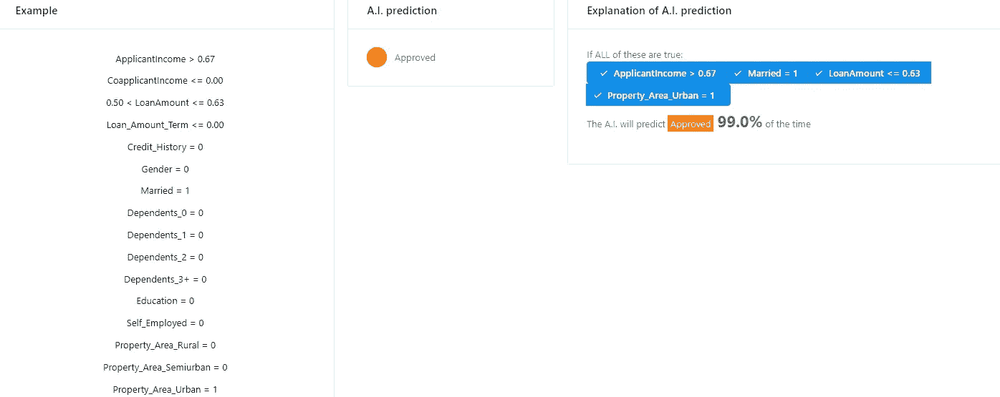
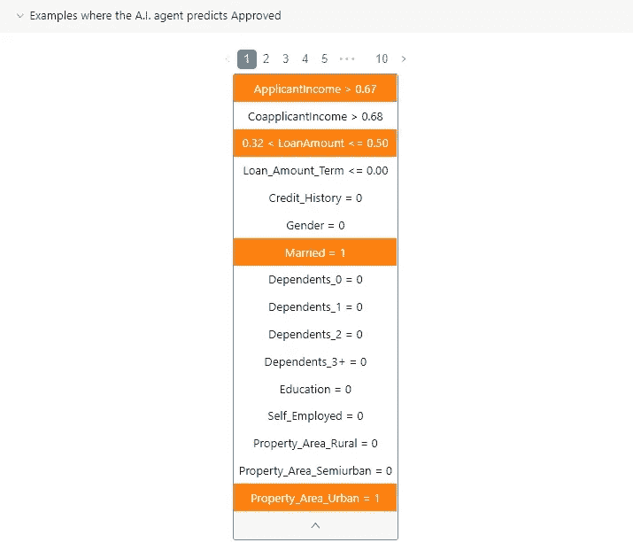
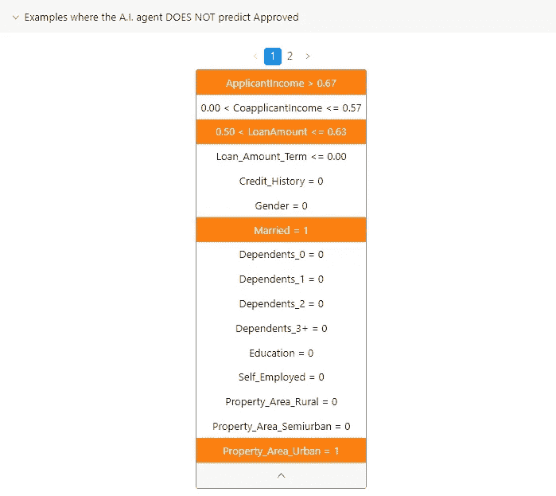

# 开发机器学习模型时要考虑的三种可解释性方法

> 原文：<https://towardsdatascience.com/three-interpretability-methods-to-consider-when-developing-your-machine-learning-model-5bf368b47fac>


照片由[米切尔罗](https://unsplash.com/@mitchel3uo?utm_source=medium&utm_medium=referral)在 [Unsplash](https://unsplash.com?utm_source=medium&utm_medium=referral)

F 继我的上一篇文章[了解机器学习可解释性](/understanding-machine-learning-interpretability-168fd7562a1a)之后，这篇文章介绍了机器学习可解释性分类、驱动力和重要性的介绍性概述——这篇文章介绍了在开发机器学习模型时可能需要考虑的 3 种可解释性技术。这些方法是 SHAP(沙普利加法解释)，石灰(局部可解释模型不可知的解释)，和锚。除了为每种方法提供例子之外，我们比较和对比这三种方法，讨论它们的限制并且为进一步的阅读提供论文和参考。

注意事项:

1.  本文不是关于这些方法的理论细节或者它们是如何精确工作的，而是我将提供一个关于每种方法的简短的直觉，并集中于如何使用它。
2.  这篇文章中的很多内容都是基于 Christoph Molnar 的这本书:可解释的机器学习:使黑盒模型可解释的指南。**强烈推荐阅读。**

## 内容

1.  短暂的直觉
2.  例子
3.  比较
4.  进一步阅读
5.  结论
6.  参考文献和参考书目

## 1.短暂的直觉

## 1.1 SHAP

SHAP 通过确定每个特征对最终预测的贡献来解释实例的预测。

这种方法是一种基于 Shapley 值的博弈论方法，每个特征值被视为游戏中的一个“玩家”，Shapley 值决定了如何在不同的特征之间公平地分配这笔支出。[1]

## 1.2 石灰

LIME 通过用本质上可解释的模型(如决策树)来近似模型，来解释模型对实例的预测。大致来说，LIME 所做的是，它获取模型并多次调用(探测)它，以了解模型如何或为什么做出预测，通过比较模型如何对数据的不同变化做出反应，通过这种探测，我们将有一个新的数据集，LIME 然后训练一个新的可解释模型，就像决策树一样，每个实例都根据它与新生成的数据集的样本实例的接近程度进行加权。[2]

## 1.3 锚

像 SHAP 和莱姆一样，主播们也采用了类似的策略来生成本地解释。但是，与 LIME 采用的可解释模型不同，这些解释被表达为简单、易于理解的 IF-THEN 规则，称为锚。“锚”的概念是不在锚规则中的其他特征值的变化不会影响或改变预测，因此该规则被称为“锚定”预测。[3]

## 2.例子

## 问题描述

为了说明如何利用这些方法，这里有一个贷款审批的例子，我们将使用来自 [GitHub](https://github.com/mridulrb/Predict-loan-eligibility-using-IBM-Watson-Studio/blob/master/Dataset/Dataset.csv) 的数据集，下图中提供了数据的 5 个最上面的行，以了解数据的样子。



这个数据集表示一个贷款批准数据集，由 13 列组成(12 个特性和 1 个目标变量 loan_status)。

出于本文的目的，我开发了一个简单的 XGBoost 分类器，准确率为 86.67%。这些可解释性方法所做的是，它接受黑盒模型变量“模型”并尝试解释它。这里我们需要理解的是，我们已经构建了一个 XGBoost 分类器模型，我们将我们的可解释性技术应用到这个模型中。【注意，本文所有代码都是在 Google Colab 平台上进行的】

请从 GitHub 下载数据集，并将其保存为 loan_approval.csv。构建模型的代码如下:

模型构建和培训

让我们安装并导入我们的 3 个库

## 2.1 口译

首先，我们需要提取预测中使用的数据集的特征(列)

下一个单元将为测试集中的第一个实例初始化、应用和显示 SHAP 解释。我们通过模型和 X_test(测试集)。



电池输出

上图中的红色表示对预测有积极影响的特征，即贷款获得批准，而蓝色的特征对贷款未获批准有消极影响。

在显示了单个实例的解释之后，下一个单元可用于绘制模型的总体特征重要性的摘要

输出如下，该图总结了每个特性的总体重要性，x 轴表示 SHAP 值，正值表示贷款批准，反之亦然，y 轴表示每个特性，红色表示该特性的高值，蓝色表示低值，那么如何理解该图呢？

例如，我们可以注意到，申请人的已婚状态(已婚=1)一直是积极的，而贷款金额高几乎对贷款批准产生消极影响，等等，查看每个特征，查看颜色指示并相应地读取 SHAP 值。



电池输出

## 2.2 用石灰解释

对于 LIME，类似的过程也适用，我们启动一个表格解释器，LIME 为每种类型的数据(如文本、表格、图像等)都有一个特定的解释器。LIME explainer 接受 4 个参数:训练数据、特性名、类名和模式(在我们的例子中是分类)

下一个单元格将显示 LIME 对测试集的第一个实例的解释



电池输出



电池输出

## 2.3 用锚点解释

与 SHAP 和莱姆类似，Anchors 接受一些参数，如类名、特征名和训练数据，此外还有一个参数是分类名。对于处理分类特征的锚点，您需要创建一个字典，将每个分类特征映射到其对应的类别，字典中的每个键都是训练数据中特征(列)的索引，每个字典中的值都是表示每个类别的字符串。例如，如果在训练数据中有一个分类特征作为第三列，并且它的值为:employees，Student-那么您的分类映射将类似于{ 2:[" employees "，" Student"]}

如果您使用的是独热编码，您可以将其写入下一个单元格{2:["0 "，" 1"]}。(确保将 0 和 1 写成字符串，否则会引发错误)

下一个单元格将打印测试集的第一个实例的预测

```
Output:
Prediction: Approved
```

下一个单元格将打印测试集的第一个实例的锚

```
Output:
Anchor: ApplicantIncome > 0.67 AND Married = 1 AND LoanAmount <= 0.63 AND Property_Area_Urban = 1
Precision: 0.99
Coverage: 0.01
```

不要看完整的锚，你可以只看锚的一部分(前 2 或 3 个从句)

```
Output:
Partial anchor: ApplicantIncome > 0.67 AND Married = 1Partial precision: 0.82Partial coverage: 0.11
```

最后，下面的单元格将输出锚点解释的可视化效果



电池输出



电池输出



电池输出

## 3.比较

## 3.1 相似性

1.  所有这三种方法:SHAP、LIME 和 Anchors，都提供了本地的、与模型无关的可解释性方法。局部意味着它解释了个别实例，SHAP 可以通过将个别预测的绝对 SHAP 值相加来提供全局可解释性。模型不可知意味着它是模型独立的，即它可以解释任何黑盒机器学习模型。
2.  这三种方法可以应用于不同的数据类型(表格数据、文本和图像)

## 3.2 利弊

## SHAP

## 赞成的意见

1.  “SHAP 在博弈论方面有坚实的理论基础”[1]
2.  这些解释是对比性的，因为预测在特征值中是公平分布的[1]。

## 骗局

1.  一般来说，SHAP 在计算上是昂贵的，除非是基于树的机器学习模型，如决策树、随机森林和 XGBoost，SHAP 有一个快速的实现[1]
2.  人们可以创造误导性的解释(SHAP 可以隐藏偏见)[15]

## 石灰

## 赞成的意见

1.  “LIME has fidelity measure 给出了一个好主意，说明可解释模型在解释黑盒预测时的可靠性”[2]
2.  LIME 易于使用，在 Python 和 R[2]中都可以实现

## 骗局

1.  “一个大问题是解释的不稳定性”[2]。在一篇文章[14]中，“作者表明，在模拟环境中，两个非常接近的点的解释差异很大，这种不稳定性意味着很难相信这些解释”[2]
2.  与 SHAP 相似，“数据科学家可以操纵石灰解释来隐藏偏见”[2][参考第 15 条]

## 锚

## 赞成的意见

1.  该算法的输出很容易理解，因为它是以 IF-THEN 规则的形式编写的。
2.  它效率很高

## 骗局

1.  “算法受到高度可配置设置的影响”[3](我们提供的示例中没有涉及到这一点，您应该自己尝试使用这些参数)
2.  构造锚点需要多次调用 ML 模型，算法运行时间则取决于模型的性能。[3]

## 4.进一步阅读

对于那些有兴趣详细阅读机器学习可解释性的人，我发现这些参考资料对我很有用:

书籍:

1.  可解释的机器学习:使黑盒模型可解释的指南
2.  使用 Python 的可解释机器学习:学习使用 Serg Masís 的实际例子构建可解释的高性能模型[5]
3.  可解释的人工智能，构建可解释的机器学习系统

论文:

1.  可解释的人工智能:机器学习可解释性方法综述[7]
2.  机器学习的可解释性:方法和度量的调查[8]
3.  解释解释:机器学习的可解释性概述[9]
4.  可解释的人工智能:机器学习可解释性方法综述[10]
5.  解释模型预测的统一方法(SHAP 原始论文)[11]
6.  “我为什么要相信你？”解释任何分类器的预测(LIME 原始论文)[12]
7.  Anchors:高精度模型不可知解释(Anchors 原始论文)[13]

## 5.结论

本文介绍了 3 种可解释性技术，在开发机器学习模型时考虑这些技术很有帮助:SHAP、莱姆和锚点。我们给出了每种方法的简短直觉，以及如何应用它们的例子。我们比较并简要讨论了它们之间的相似之处，每种方法的优缺点，通过参考一些有用的参考资料和论文进行进一步阅读，我们完成了这篇文章。

在接下来的文章中，我们将探索更多最新的可解释性技术，并讨论这些方法的理论基础。

如果您有任何意见、建议或其他任何事情，请随时在下面留下您的评论或通过 [LinkedIn](https://www.linkedin.com/in/salih-eihab/) 联系我们

非常感谢您的阅读，希望您觉得有用:)

## 6.参考文献和参考书目

[1]克里斯托弗·莫尔纳尔。可解释的机器学习。露露。com，2022。第 9.6 节，[https://christophm . github . io/interpretable-ml-book/shap . html](https://christophm.github.io/interpretable-ml-book/shap.html)

[2]克里斯托弗·莫尔纳尔。可解释的机器学习。露露。com，2022。第 9.2 节，[https://christophm . github . io/interpretable-ml-book/lime . html](https://christophm.github.io/interpretable-ml-book/lime.html)

[3]克里斯托弗·莫尔纳尔。可解释的机器学习。露露。com，2022。第 9.4 节，[https://christophm . github . io/interpretable-ml-book/anchors . html](https://christophm.github.io/interpretable-ml-book/anchors.html)

[4]克里斯托弗·莫尔纳尔。可解释的机器学习。露露。com，2022。，[https://christophm.github.io/interpretable-ml-book/](https://christophm.github.io/interpretable-ml-book/)

[5]塞尔吉·马西什。使用 Python 的可解释机器学习:学习使用实际例子构建可解释的高性能模型。帕克特出版有限公司，2021 年。，[https://learning . oreilly . com/library/view/interpretable-machine-learning/9781800203907/](https://learning.oreilly.com/library/view/interpretable-machine-learning/9781800203907/)

[6]Ajay Thampi，可解释的 AI，构建可解释的机器学习系统，作者 Ajay tham pi https(2021)://live book . manning . com/book/Interpretable-AI/

[7]Linardatos、Pantelis、Vasilis Papastefanopoulos 和 Sotiris Kotsiantis。"可解释的人工智能:机器学习可解释性方法综述."熵 23.1 (2021): 18。，[https://www.mdpi.com/1099-4300/23/1/18](https://www.mdpi.com/1099-4300/23/1/18)

[8]卡瓦略、迪奥戈、爱德华多·佩雷拉和海梅·卡多佐。"机器学习的可解释性:方法和度量的调查."电子 8.8 (2019): 832。，[https://www.mdpi.com/2079-9292/8/8/832](https://www.mdpi.com/2079-9292/8/8/832)

[9]Gilpin，Leilani H .等人，“解释说明:机器学习的可解释性概述”2018 IEEE 第五届数据科学与高级分析国际会议(DSAA)。IEEE，2018。，[https://ieeexplore.ieee.org/abstract/document/8631448](https://ieeexplore.ieee.org/abstract/document/8631448)。

[10]Linardatos、Pantelis、Vasilis Papastefanopoulos 和 Sotiris Kotsiantis。"可解释的人工智能:机器学习可解释性方法综述."熵 23.1 (2021): 18。，[https://www.mdpi.com/1099-4300/23/1/18](https://www.mdpi.com/1099-4300/23/1/18)

[11]Lundberg，Scott M .，和 Su-In Lee。"解释模型预测的统一方法."神经信息处理系统进展 30 (2017)。，[https://proceedings . neur IPS . cc/paper/2017/hash/8 a20 a 8621978632d 76 c 43 DFD 28 b 67767-abstract . html](https://proceedings.neurips.cc/paper/2017/hash/8a20a8621978632d76c43dfd28b67767-Abstract.html)

[12]里贝罗、马尔科·图利奥、萨梅尔·辛格和卡洛斯·盖斯特林。”“我为什么要相信你？"解释任何分类器的预测."第 22 届 ACM SIGKDD 知识发现和数据挖掘国际会议论文集。2016.，【https://dl.acm.org/doi/abs/10.1145/2939672.2939778 

[13]里贝罗、马尔科·图利奥、萨梅尔·辛格和卡洛斯·盖斯特林。"锚:高精度模型不可知的解释."AAAI 人工智能会议录。第 32 卷。№1.2018.，【https://ojs.aaai.org/index.php/AAAI/article/view/11491】T4

[14]Alvarez-Melis，David 和 Tommi S. Jaakkola。"论可解释性方法的稳健性."arXiv 预印本 arXiv:1806.08049 (2018)。，[https://arxiv.org/abs/1806.08049](https://arxiv.org/abs/1806.08049)

[15]Slack，Dylan 等人，“愚弄莱姆和夏普:对事后解释方法的对抗性攻击。”AAAI/美国计算机学会人工智能、伦理和社会会议录。2020.，[https://dl.acm.org/doi/abs/10.1145/3375627.3375830](https://dl.acm.org/doi/abs/10.1145/3375627.3375830)