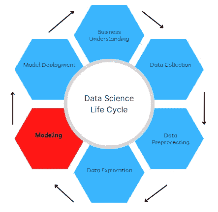
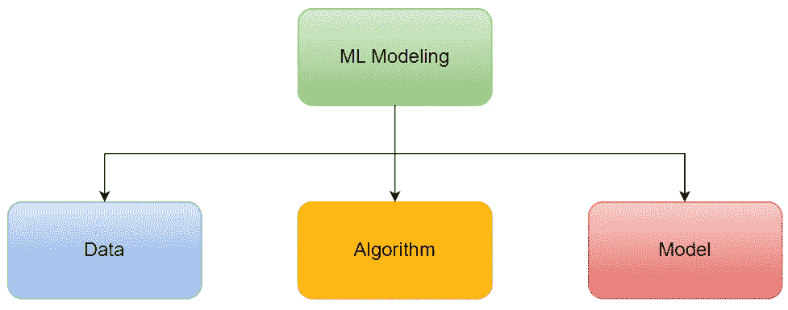

# 机器学习建模的三个主要组成部分

> 原文：<https://towardsdatascience.com/three-main-components-of-machine-learning-modeling-c9186658f7fe>

## 通过数据学习的艺术

马库斯·温克勒在 [Unsplash](https://unsplash.com?utm_source=medium&utm_medium=referral) 上的照片

## 介绍

本文涵盖了作为数据科学家或机器学习工程师应该掌握的机器学习(ML)建模的三个主要单元。ML 建模，通过数据学习的艺术，是数据科学项目生命周期中的重要一步，可能也是数据从业者最感兴趣的一步。

作者图片

我们每天都通过感知、视觉检查和听觉来学习。此外，我们根据以前的经历对明天做出决定。机器学习是人工智能的一个分支，它通过揭示数据模式(即特征和目标变量之间的关系)来模仿人类的学习能力。

特征是描述给定观察值或数据点的独立变量，而目标变量是我们感兴趣的因变量，通常用于建模以进行预测。

此外，机器学习的三种主要类型强调如下:

1.  *监督学习:*这里用例子中提供的目标变量来训练算法。更多细节可以在这里找到[。](https://www.ibm.com/cloud/learn/supervised-learning#:~:text=Supervised%20learning%2C%20also%20known%20as,data%20or%20predict%20outcomes%20accurately.)
2.  *无监督学习:*在这种情况下，算法只在没有例子中提供的目标的特征上进行训练。更多细节可以在[这里](https://www.ibm.com/cloud/learn/unsupervised-learning#:~:text=Unsupervised%20learning%2C%20also%20known%20as,the%20need%20for%20human%20intervention.)找到。
3.  *强化学习:*在这里，学习是通过与环境交互，同时根据需要向算法提供消极和积极的奖励来完成的。更多详情可在[这里](https://developer.ibm.com/learningpaths/get-started-automated-ai-for-decision-making-api/what-is-automated-ai-for-decision-making/)找到。

从发现创新的蛋白质结构到预测天气和能源需求，ML 建模的应用在学术领域和行业中各不相同。此外，ML 在欺诈检测、销售预测和客户细分领域为企业提供了巨大的价值。

## 机器学习建模的三个主要组成部分

ML 建模的主要组件(图片由作者提供)

现在，让我们深入研究 ML 建模的三个主要单元。

**数据**

这可能是 ML 建模最重要的组成部分。在用于建模之前，根据要解决的业务问题收集数据，对数据进行预处理和探索。数据质量很大程度上取决于勘探和预处理步骤。此外，在建模之前，可以进一步丰富原始数据。

> 数据质量是最大似然建模中影响预测性能的最重要因素。

在以前的文章中，我介绍了数据预处理的关键组件，即数据集成、清理和转换。此外，我还讨论了在数据探索过程中要避免的陷阱。这些链接可以在下面找到:

*数据整合:*

</three-critical-elements-of-data-preprocessing-part-1-3c16f46f8ced?sk=f383e05e79c640216fdb820cc74d6ed2>  

*数据清洗:*

</three-critical-elements-of-data-preprocessing-part-2-2078110ae8e7>  

*数据转换:*

</three-critical-elements-of-data-preprocessing-part-3-6a7da681ae16>  

*数据探索:*

</four-common-pitfalls-to-avoid-in-exploratory-data-analysis-85d822dd5e34>  

**算法**

这是 ML 建模的组成部分，它用数据拟合以学习特征和目标变量之间的模式和关系。存在几种基于它们如何从数据中学习的 ML 算法。一些例子包括[决策树](https://www.ibm.com/topics/decision-trees)、[随机森林](https://www.ibm.com/cloud/learn/random-forest)、 [KMeans](https://www.ibm.com/docs/en/db2-warehouse?topic=procedures-k-means-clustering) 、 [DBSCAN](https://scikit-learn.org/stable/modules/clustering.html#dbscan) 和[神经网络](https://www.ibm.com/cloud/learn/neural-networks)。

在数据科学实践中，当解决给定问题时，会考虑不同的算法。这个过程是实验性的，高度依赖于问题。

此外，Scikit-learn 是用于实现不同 ML 算法的最广泛使用的 Python 库。其他流行的用于 ML 建模的 Python 库还有 [LightGBM](https://lightgbm.readthedocs.io/en/v3.3.2/) 、 [XGBoost](https://xgboost.readthedocs.io/en/stable/) 、 [Tensorflow](https://www.tensorflow.org/) 、 [Keras](https://keras.io/) 、 [Pytorch](https://pytorch.org/) 和 [Lightning](https://www.pytorchlightning.ai/) 。

*拟合*方法是每个算法中的主要特征函数。

**型号**

ML 模型是通过将算法与数据相匹配而得到的对象。它已经过训练，可以识别数据模式，并在必要时做出预测。

在实践中，使用算法的超参数的不同值进行实验，以创建使用不同度量评估的几个模型。选择“最佳”模型并部署到生产中。

创建 ML 模型所涉及的过程超出了本文的讨论范围，将在另一篇文章中讨论。

*预测*方法是许多 ML 模型中的主要特征函数。

## 结论

在本文中，我们讨论了机器学习建模的主要组件:数据、算法和模型。我们还强调了不同类型的机器学习和一些应用领域。

我希望你喜欢这篇文章，直到下次。干杯！

你可以通过下面我的推荐链接订阅 Medium 来获得更多我和其他作者的启发性文章，这也支持我的写作。谢谢大家！

<https://aolaoye.medium.com/membership> 