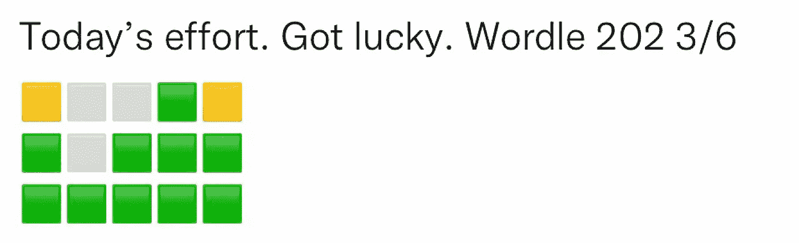
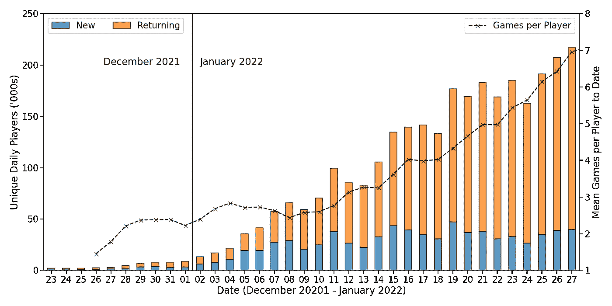
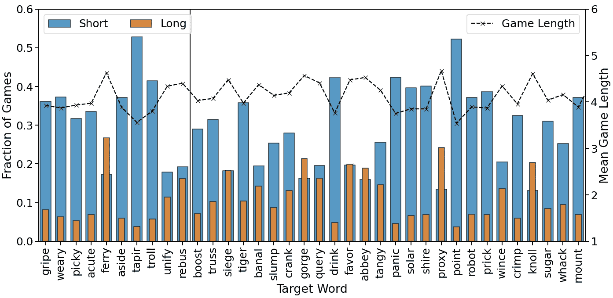
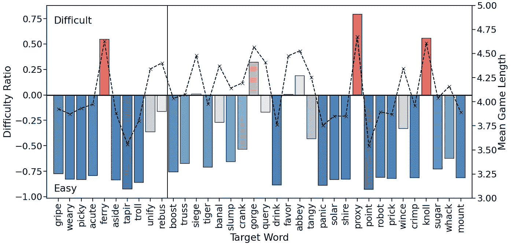
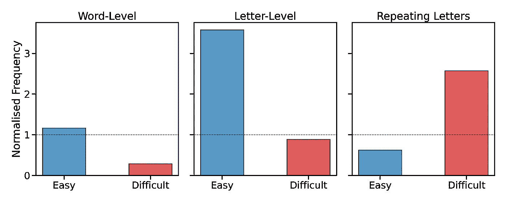
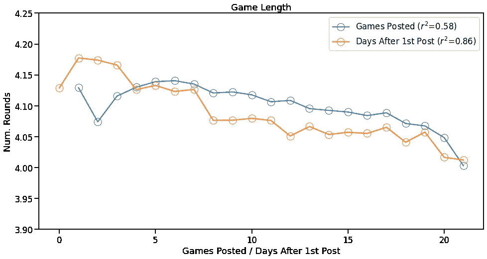
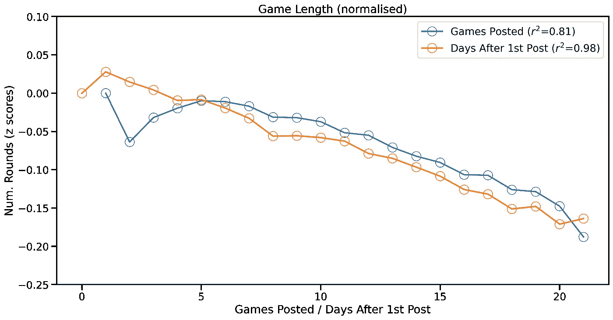

# 三百万条 Wordle 推文之后

> 原文：<https://towardsdatascience.com/three-million-wordle-tweets-later-3d3af23bd5c7>

## 对 tweets 的分析揭示了什么关于 Wordle，它的单词和它的玩家。

Twitter 上分享的几千个 Wordle 游戏。图片作者。

在这篇文章中，我分析了 2021 年 12 月 23 日至 2022 年 1 月 27 日期间发布的超过 300 万条 tweets，以展示以下内容

*   Wordle 在 Twitter 上仍然很受欢迎，但每天的增长很大程度上是因为回归的玩家发布了他们的最新成果；首次发布的每日新玩家数量似乎保持稳定。
*   有些单词比其他单词更有挑战性，这些难词大约每周出现一次。它们通常是不常见的单词，或者是字母组合不常见的单词，但它们也更有可能有重复的字母，这可能会让一些玩家出局。
*   熟能生巧:单词玩家确实会随着练习而提高，当我们控制单词难度时，平均游戏时间会随着经验的增加而减少。

# 推特上的沃尔多

Wordle 是一个在过去一个月左右的时间里迅速传播的单词查找游戏，当时,[被《纽约时报》](https://www.nytimes.com/2022/01/31/business/media/new-york-times-wordle.html)收购，成为其越来越多的单词游戏和谜题之一。简而言之，玩家每天有 6 次机会猜测一个新的 5 个字母的目标单词；每个人得到的单词都一样，而且每天只有一个单词。

一个 Wordle 游戏的例子和每次猜测后提供的提示。请注意，即使玩家第一次猜对了“L”(及其位置)，Wordle 也不会帮助他们识别“L”是目标单词中的重复字母。这就是为什么' *KNOLL* '被证明是一月份发现的最棘手的单词之一，以及它很少被使用和' KN '的使用不寻常的事实。图片作者。

每次猜中后，玩家会收到多达 3 个颜色编码的反馈，如上所示，可用于指导下一次猜中。Wordle 的病毒式成功与玩家分享他们游戏的*完形*的能力相关联——他们游戏的抽象图像——如下图所示，毫无疑问，这些推文的日益流行帮助推动了 Wordle 的成功。

Twitter 上分享的一个 Wordle 游戏示例。重要的是，共享游戏不公开使用的单词或目标单词，只公开收到的反馈。图片作者。

有如此多的人分享他们的努力，Twitter 成为现实世界数据的一个非常有用的来源，尽管它偏向于社交媒体和 Twitter 用户，并且可能认为用户更有可能分享他们更成功的努力；显然，没有未解决的单词被共享。

我可以通过申请 Twitter 学术许可证来获取这些数据，这允许我收集多达 1000 万条推文。为了收集这项研究中使用的数据集，我搜索了包含关键短语“ *Wordle n，r/6* ”的推文，其中 *n* 是有效的游戏号码(例如上面的 n *=202* )，而 *r* 是猜测的次数(例如上面的 *r=3* )。经过一些数据争论，以消除无效或被操纵的游戏，这给我留下了 12 月 23 日至 1 月 27 日(含)的 3，014，306 条推文。

# Wordle(在 Twitter 上)有多受欢迎

关于 Wordle 的惊人崛起，已经有很多报道，它从一月初的 30 万玩家激增到月底超过 2M。当我们在下面的条形图中看到每天在 Twitter 上分享游戏的玩家总数时，这一点就很明显了。本月初，每天的分享量不到 2 万，现在每天的分享量超过 20 万，总的来说，超过 80 万的独立玩家在此期间至少在 Twitter 上分享了一次他们的努力。

每天在 twitter 上分享 Wordle 成果的独特玩家(新老玩家)的数量。还显示了每个玩家分享的平均游戏次数。作者配图。

上面的柱状图区分了新玩家和回归玩家，虽然分享他们努力的新玩家数量有所稳定，但回归玩家的数量一直在稳步增长。因此，每个玩家平均分享的游戏数量也在增加。例如，到 1 月底，普通玩家在 Twitter 上分享了大约 7 个游戏，而在月初只有 2 到 3 个游戏；大多数玩家不会每天分享他们的努力，但他们会定期分享。

# 到目前为止，最难和最容易的目标词是什么？

回顾 Wordle 的第一个病毒月，找出那些特别难解决的单词是很有趣的。我们如何衡量一个词的挑战性？我们可以使用平均游戏时长。更多的猜测意味着一个更难的单词。另一种方法是查看*短*游戏(需要不超过 3 次猜测的游戏)和*长*游戏(需要最多 6 次猜测的游戏)的比例。

> 注意，沃尔多大约一周选一次难词。

在下面的图表中，我们看到了自 12 月 23 日以来对每个目标词的所有 3 种测量方法。目标词按日期顺序显示——因为它们在这个阶段是'*旧新闻'*。我们可以看到平均游戏时长在 3.5 到 4.7 回合之间变化，整体平均每场游戏 4.12 回合。正如所料，短游戏往往与高比例的短游戏和低比例的长游戏相关联。例如，‘*点’*是最简单的单词之一，因为它的游戏有 52%是短的，只有 3%是长的。相比之下，最难找到的词是“*代理*”:只有 23%的游戏是短的，超过 13%的游戏是长的。

短游戏(≤3 轮，蓝色)长游戏(6 轮，橙色)的比例，以及按日期顺序排列的每个最近 Wordle 目标单词的平均游戏长度(虚线)。

一种将这些措施结合成一个简单的*难度比率*的方法是将长游戏的分数除以短游戏的分数；我们从结果中减去 1，这样，对于一个给定的单词，*难度比> 0* 意味着长游戏比短游戏多，反之亦然。该难度比(和平均游戏时长)如下所示，根据最难(红色)和最容易(蓝色)单词的难度比是正还是负，分别突出显示这些单词；这些条也是用颜色编码的，所以颜色的强度反映了实际难度比的大小。

难(难度比> 0，红色)和易(难度比< 0, blue) words: every week or so Wordle uses a word that is much more challenging than usual (the red bars). Such challenging words are associated with much more long games than short games. Graph by author.

To date there have been 7 *难*单词，长游戏比短游戏所占分数大的单词。这些词是*渡口、围城、峡谷、修道院、恩惠(原文如此)、代理、*和*山丘；*虽然，*围攻*和*青睐*只是在难度比略高于 0 的情况下勉强存在，因为他们的长游戏比短游戏略多。

# 是什么让难词具有挑战性？

为什么有些单词比其他单词更难解决？这里有三个值得验证的假设:

1.  **单词级频率:**更罕见的单词(也就是说，使用频率更低的单词)会更难，因为它们可能不为我们所熟悉，或者至少在我们搜索新的猜测时不是*首选*。
2.  **字母级频率:**以类似的方式，具有不寻常字母组合的单词也将更加困难，因为可能更难想到使用这种字母组合的单词，即使单词本身相当常见。
3.  **重复字母:**包含重复字母的单词也可能更难识别，因为 Wordle 的反馈不会标记重复字母，并且因为玩家很自然地会避免重复字母，以试图最大化他们找到新目标字母的机会。

为了评估一个单词的*单词级*频率，我使用了一个英语单词及其频率的[数据集](https://github.com/dwyl/english-words)，相对于平均 5 个字母的单词频率进行了标准化。对于*字母级*频率，我计算了 5 个字母单词中单个字母的频率。然后，给定单词的字母频率是其字母的平均频率；与单词级频率一样，该字母级频率得分相对于 5 个字母单词的平均字母级频率被标准化。

这两个指标的结果显示在下面的前两个图表中，即简单单词和困难单词的平均单词级和字母级频率；在每种情况下，1 分对应于 5 个字母单词的平均单词级/字母级频率。很明显，简单的单词比困难的单词更常见，它们的字母也更频繁。例如，平均而言，简单单词比 Wordle 中典型的 5 个字母的单词更常见(标准化的单词级频率为 1.16)，但困难单词则不太常见(单词级频率为 0.28)；换句话说，容易的单词比难的单词常见 4 倍；如果我们使用字母频率，情况类似。这表明单词级别和字母级别的频率是区分易词和难词的一种方式。

标准化的单词级和字母级频率分数，以及简单和困难游戏中重复字母的标准化可能性。作者图表。

与简单的单词相比，困难的单词也更可能包含重复的字母。超过 70%的难词(7 个中的 5 个)包含重复字母，但只有 16%(29 个中的 5 个)的易词包含重复字母。平均来说，大约 27%的 5 个字母的单词有重复字母，所以简单的单词比预期的不太可能有重复字母，而困难的单词更可能有重复字母。毫不奇怪，重复字母的出现带来了挑战。首先，沃尔多的提示不能帮助我们找到重复的字母。第二，大多数玩家会尽量避免猜测重复的字母，因为这限制了目标词匹配的机会，尤其是因为我们凭直觉认为重复的字母相对较少。

> 如果你在单词上没有进步，那么不要忘记考虑重复字母的可能性！

# 论经验的益处

玩家是不是玩的游戏越多越好？风险总是存在的，人们只是在发布他们最大的努力，所以经验的价值可能不会在我们的 Twitter 数据中体现出来。此外，由于人们发帖的频率不同——有些人每天都发，有些人没那么频繁——有必要根据他们分享的游戏数量来衡量体验，另外，根据他们第一次发帖以来已经过去的天数来衡量体验。

下图显示平均游戏时长随着两项经验指标的增加而下降，表明玩家确实随着经验的增加而提高。显示的所谓的 *r 平方*值表示游戏长度和每个经验测量之间的关系强度。游戏时长和自第一次游戏以来的天数(r 平方= 0.86)之间的关系比游戏时长和所玩游戏的数量(r 平方= 0.58)之间的关系更强，这确实表明依赖自玩家第一次发帖以来已经过去的天数作为他们经验的衡量标准更好。

在 Twitter 上分享的每场游戏的平均回合数，由玩家迄今发布的游戏数或自其第一场游戏发布以来的天数来表示。作者配图。

然而，比较游戏的平均长度没有考虑到单词的不同难度水平，我们知道这是不同的；例如，难单词的 5 轮游戏可能比简单单词的 4 轮游戏更好。为了控制这一重要因素，我们可以相对于每个单词的平均游戏长度来标准化游戏长度。更准确地说，我们计算给定游戏的游戏长度的 *z 分数*——简而言之，这是给定游戏长度高于或低于单词的平均游戏长度的标准偏差的数量——因此 z 分数-0.1 表示特定游戏比该单词的平均游戏短 10%的标准偏差*，而 z 分数+0.05 表示游戏长度长 5%*。**

**这些 z 分数是根据以下两种体验绘制的。我们可以再次看到，经验似乎确实有助于玩家提高——游戏长度的 z 分数下降——但当使用这些标准化的游戏长度时，这种关系甚至更强；r 的平方值为 0.98，表明 98%的标准化游戏时长变化可以用玩家在 Twitter 上发布第一个游戏的天数来解释。和以前一样，自第一个游戏发布以来的天数与游戏长度(z 分数)的关系比共享游戏的数量更密切，这表明它是一个更好的衡量玩家体验的指标。**

****

**在 Twitter 上分享的每场游戏的回合数(按平均游戏长度标准化)的平均 z 值，由玩家迄今发布的游戏数或自第一场游戏发布以来的天数决定。作者配图。**

# **结论**

**在这篇文章中，我们分析了 80 万玩家的 300 多万条 Wordle 推文。Wordle 在 Twitter 上仍然很受欢迎，但目前的日常增长很大程度上是由重复发布新游戏的玩家推动的；自 1 月初至 1 月中旬以来，每天在 twitter 上发帖的新玩家数量基本保持稳定。**

**对于不同的目标单词，游戏长度的分布有很大程度的变化。大多数单词与短游戏的关联比长游戏多，但大约每周一个单词，Wordle 的目标单词更具挑战性，导致更多长游戏和更少短游戏。毫不奇怪，这些更具挑战性的单词往往是不太常见的单词，或者有更多不寻常的字母组合，但它们也更有可能有重复的字母，这可能会让玩家出局。**

**对于经常玩 Wordle 的玩家来说，好消息是熟能生巧。经验和游戏时长之间有很大的关系:随着玩家经验的增加，他们往往会以更少的猜测成功，特别是当我们控制不同的经验和单词难度时。**

**祝你明天的单词玩得开心，但要小心那些重复的字母！**

**如果你想知道更多关于 Wordle 的数据能告诉我们如何有效地打球，那么看看我最近的帖子:**

*   **[我从玩了一百多万次的 Wordle 游戏中学到了什么](/what-i-learned-from-playing-more-than-a-million-games-of-wordle-7b69a40dbfdb)**
*   **[如何在 Wordle 中猜对](/how-to-guess-well-in-wordle-d21167aae444)**