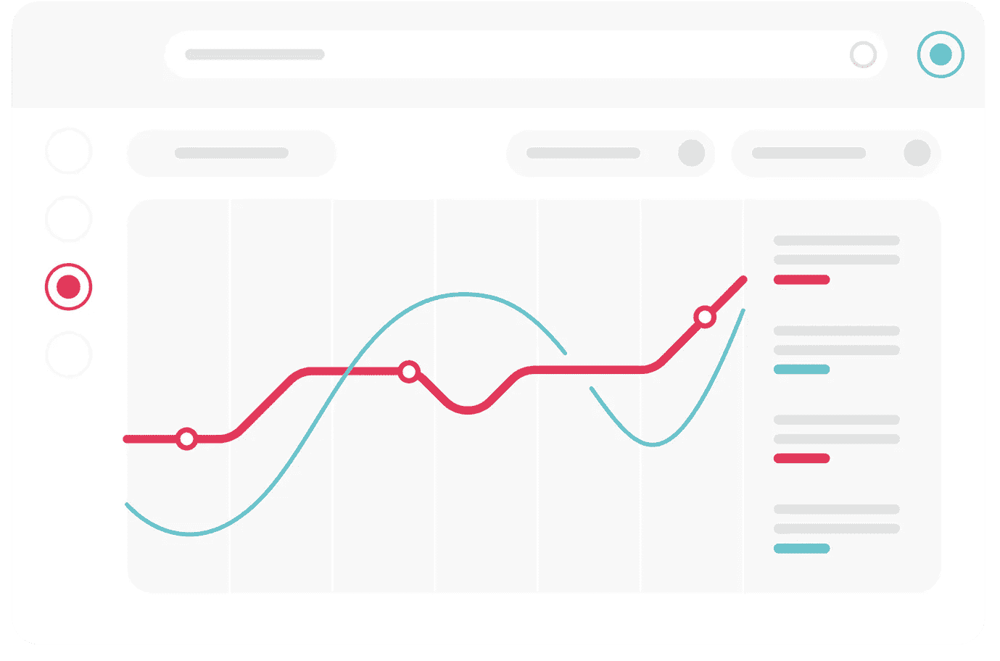

# 机器学习监控的三个必备

> 原文：<https://towardsdatascience.com/three-must-haves-for-machine-learning-monitoring-8f43cb8751be>

## 数据科学家评估解决方案指南

监控对于生产系统中部署的机器学习模型的成功至关重要。因为 ML 模型不是静态的代码片段，而是依赖于数据、超参数、评估指标和许多其他变量的动态预测器，所以深入了解训练、验证、部署和推理过程以防止模型漂移和预测停滞以及许多其他问题是至关重要的。然而，并非所有监控解决方案都是一样的。在这篇文章中，我强调了机器学习监控的三个必备条件，无论你是决定建立还是购买一个解决方案，它们都有望很好地服务于你。

来源:[莫娜](https://www.monalabs.io/)

# 完整的流程可见性

首先，模型必须在它们旨在服务的业务功能的上下文中进行评估。这种功能通常在模型下游的多个步骤中实现。在实验室之外，许多人工智能驱动的应用程序涉及多个协同工作的模型。此外，模型的行为可能依赖于上游多个步骤的数据转换。因此，关注单个模型行为的监控解决方案将不会捕捉到模型性能的全貌，因为它与全球业务环境相关，并且将无法发现在模型之外开始或结束的许多问题。对 ML 模型可行性的正确评估只能来自*完整的流程可见性*——洞察整个数据流、元数据、上下文和建模所依据的总体业务流程。

例如，作为信贷审批应用程序的一部分，银行可以部署一套模型来评估信用价值，筛选潜在的欺诈，并动态分配趋势优惠和促销。一个简单的监控系统可能能够单独评估这些模型中的任何一个，但是解决整个业务问题需要理解它们之间的对话。虽然它们可能有不同的建模目标，但是每个模型都依赖于训练数据、上下文和业务元数据的共享基础。因此，有效的监控解决方案将考虑所有这些不同的部分，并生成利用这些共享信息的统一见解。这些可能包括识别培训数据分布中的利基和未充分利用的客户群，标记概念和数据漂移的潜在实例，了解对业务 KPI 的聚合模型影响，等等。

最好的监控解决方案能够扩展到所有过程阶段，包括不涉及模型组件的阶段。

来源:[蒙娜丽莎](https://www.monalabs.io/)

# 自动化的精细洞察

一个常见的误解是，监控解决方案应该简单地实现与生产中的 ML 模型相关的常见指标的可视化和故障排除。虽然这很有帮助，但可视化和故障排除意味着您已经处于“调查模式”中。更糟糕的是，在企业抱怨某个 KPI 下降后，您可能正在“救火”(并询问“模型有什么问题？”).

那么，更主动一点怎么样？

如何在整体性能下降前几周甚至更长时间发现问题？

您应该期望您的监控解决方案能够在问题还很小的时候，在数据的粒度片段中自动检测到问题。让你有足够的时间采取纠正或先发制人的行动。“自动”的含义值得在这里进一步阐述。一些监控工具将提供仪表板，允许您手动调查数据的子部分，以查看哪些表现良好，哪些表现不佳。然而，这种肤浅的内省需要艰苦的人工干预，并且忽略了更重要的一点，即真正的监控解决方案将能够通过其自身的机制从本质上检测异常，而不需要外部依赖个人来提供他们自己的假设。

越是粒度大，越要注意[降噪](https://www.monalabs.io/blog/successful-monitoring-get-granular-but-avoid-noise)。预计单个异常会在多个地方传播问题。只有通过检测问题的根本原因，监控才能真正成功，而不仅仅是通过标记表面数据差异等。

来源:[莫娜](https://www.monalabs.io/)

# 总体可配置性

不同的 ML 系统有不同的数据和流程，不同的业务周期，不同的成功指标，以及不同类型的模型。[你应该严重怀疑“即插即用”监听解决方案](/the-platform-approach-to-ai-monitoring-dcc43dee6c6e)。

一个完整的 ML 监控解决方案必须能够针对任何问题并跨其所有组件进行配置。它应该能够接受任何模型指标、任何非结构化日志以及任何表格数据，并使其易于:

*   构建并持续更新单个性能数据库
*   创建和定制动态可视化和报告
*   设置和调整自动、精细的洞察和通知

可配置性需求的一个简单例子是系统之间的对比，在系统中，您可以获得模型保真度的(接近)实时反馈(例如，消费者推荐系统)，而在系统中，反馈循环需要人工干预和更多时间(例如，欺诈检测、信用评分等)。

大多数企业 ML 团队都在从事各种 ML 项目，解决非常不同的业务问题。因此，监测要求是广泛的，需要细微差别和灵活性，以适应差异。如果您是这些团队中的一员，您可能已经建立了强大的数据科学标准，这是一个用于数据准备、模型开发和部署的统一堆栈。现在，您能够使用统一标准和单一解决方案来监控和管理您的系统吗？你绝对应该期待这样做。

# 结论

鉴于围绕机器学习的不断增长的宣传，存在许多解决方案，这些解决方案将采用 ML 模型，并提供对其特征行为、输出分布和基本性能指标的肤浅见解。然而，展现出完整流程可见性、前瞻性、智能洞察力和总体可配置性的解决方案非常罕见。然而，正是这三个属性是从 ML 模型中挤出最高性能和下游业务影响的关键。因此，通过这三个必备条件来评估任何监控解决方案至关重要，并确保它不仅提供模型可见性，还提供对业务环境的更全面、更完整的理解。

*原载于*[*https://www . monalabs . io*](https://www.monalabs.io/blog/three-must-haves-for-machine-learning-monitoring-software)*。*