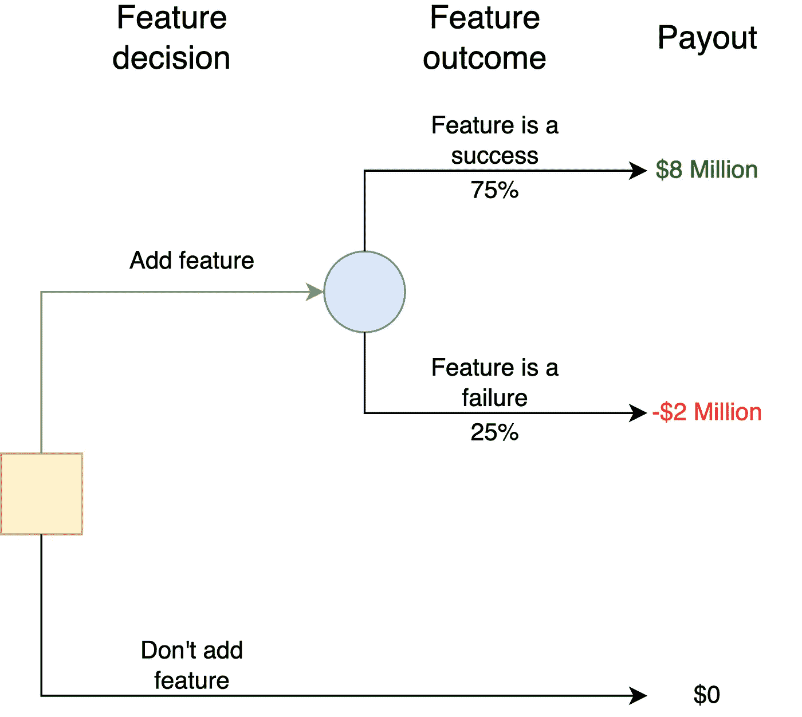
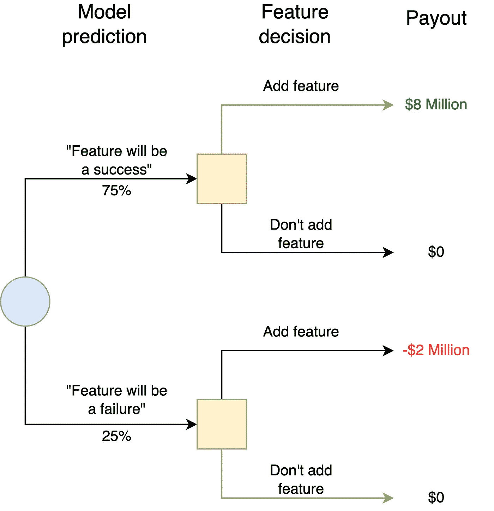

# 三个最被低估的数据科学概念

> 原文：<https://towardsdatascience.com/three-of-the-most-underrated-data-science-concepts-47d58ef7187d>

## 理解这些概念来提高你的影响力

照片由 [Unsplash](https://unsplash.com?utm_source=medium&utm_medium=referral) 上的[延斯·勒列](https://unsplash.com/@madebyjens?utm_source=medium&utm_medium=referral)拍摄

你熟悉随机森林、偏差-方差权衡和 k 倍交叉验证吗？如果你是一名专业的数据科学家，你可能就是。

您可能已经花了无数时间来学习各种构建高性能预测模型的技术。这并不奇怪，因为有大量的在线内容致力于我们用来解决问题的工具。

更少的内容探索我们需要识别正确的问题来解决的概念。本文概述了其中的三个概念。

## 3.说服力与逼真度

从根本上说，模型的目标是什么？在大多数数据科学应用中，目标是提供支持决策的信息。当一个模型擅长于这个目标时，它表现出*的说服力*。问题是，我们在追求逼真性的过程中常常忽略了说服力，逼真性是一个模型详细描述现实的属性。让我们考虑一个例子。

想象一下，一家企业面临一个重要的决定，这个决定取决于下个月的用户购买总数，因此他们要求两位数据科学家提供预测。

第一位数据科学家 Jim 构建了一个相对简单的时间序列预测模型，该模型关注历史月度购买计数。他的模型考虑了最近的趋势、季节性和几个宏观层面的变量，这些变量推动了每月购买数量的变化。

第二位数据科学家 Dwight 希望建立一个比 Jim 更好的模型。他认为 Jim 的模型过于粗糙，没有考虑到详细的用户级动态。Dwight 花了两周时间建立了一个复杂的模型，预测每个用户是否会购买下个月可以买到的每个产品。一旦 Dwight 完成了他的模型，他就将用户级别的预测汇总成一个最终数字——下个月的估计购买总数。

Dwight 的模型比 Jim 的更详细，但是它更好吗？

大概不会。

问题是，德怀特在努力描绘现实的详细画面时，忽略了手头的决定。

吉姆的模型优于德怀特的模型有几个原因:

1.  吉姆的模型建造和维护成本要低得多。
2.  德怀特的模型更难向决策者解释，因此不太可能有影响力。
3.  Jim 的模型可能会更准确，因为它经过优化，可以直接预测感兴趣的数量。Dwight 的用户级预测中的错误可以累积成宏观级别的重大错误。

吉姆的模型侧重于*的相关性*，而德怀特的模型侧重于*的逼真性。*

中肯和逼真之间的区别来自罗纳德·霍华德的书，“决策分析的基础重温[1]。”在这篇文章中，他写道:

> 逼真是决策模型的标准吗？包含“特拉华州销售税”的决策模型比不包含的要好吗？答案是否定的，除非这个因素对决策至关重要。决策模型的标准是相关性:模型是否为决策者带来清晰的行动。您应该消除任何对这个目标没有帮助的特性。

更详细的模型不一定是更好的模型。如果你正试图决定是否要打包一件毛衣，你不用担心大气中的分子间动力学。

我们应该在模型中包含多少细节？下面两个概念有助于回答这个问题。

## 2.不确定度传播中的“四分之一法则”

太多时候，我们担心减少实际上无关紧要的不确定性。它们无关紧要，因为更大的不确定性主导着决策。

让我们考虑一个例子。数据科学家的任务是预测平台上新用户的平均支出。他们很快建立了一个简单的线性回归模型，预测精度为+/- 5%。

这个模型是一个不错的起点，但是数据科学家相信他们可以做得更好。他们在接下来的一周投入不同模型和超参数的实验。他们最终选定了一套制作精良的模型，精确度高达+/- 1%。

数据科学家将模型交给利益相关者，对话是这样的:

> 利益相关者:“哇，你能够将预测误差从 5%降低到 1%，真是不可思议。这就减少了 80%的误差！”
> 
> 数据科学家:“谢谢。出于好奇，模型会用来做什么？”
> 
> 利益相关者:“我们将使用你的模型来预测新用户的总收入。我们对安装数量进行了预测。你的模型预测了新用户的平均消费。如果我们用你的模型的预测乘以我们的预计安装数，我们将估算出新用户的总收入。”
> 
> 数据科学家:“安装数量预测的不确定性是什么”
> 
> 利益相关者:“大约+/- 20%”

在这种情况下，利益相关者*实际上*关心来自新用户的总收入:

*总收入=(平均每次安装收入)x(安装数量)*

感兴趣数量的不确定性由两个不确定性因素造成，即数据科学家模型中的不确定性因素和安装数量预测中的不确定性因素。

在这种特殊情况下(两个不确定量的乘积)，相对不确定性贡献等于单个相对不确定性。因此，来自数据科学家模型的不确定性贡献为 1%，来自安装数量预测的不确定性贡献为 20%。换句话说，如果模型中只有*个*不确定性，那么总的不确定性将是 1%。如果安装数量预测中只有*的*不确定性，那么总体不确定性将为 20%。

不确定性贡献的结合方式有些令人惊讶。直觉上，人们可能认为不确定性的贡献增加了。这不是真的。数学更类似于勾股定理；不确定性贡献的*平方*相加。这是因为方差是相加的，而不是标准差。请查看维基百科关于[不确定性传播](https://en.wikipedia.org/wiki/Propagation_of_uncertainty)的页面，了解更多数学细节。

> 不确定性传播的数学方法放大了大的不确定性相对于小的不确定性的影响。

如果我们假设模型的误差与预测的误差不相关，那么总收入的不确定性实际上是 *sqrt(0.01 + 0.2 ) =* 20.0%(四舍五入)。

如果数据科学家使用不确定性为 5%的简单回归模型，总不确定性将为 *sqrt(0.05 + 0.2 ) =* 20.6%。他们还可以节省一周的时间。

数据科学家花费时间将总体不确定性从 20.6%降低到 20%是否值得？大概不会。

在这种情况下，主要的不确定性贡献仅比较小的不确定性贡献大四倍。

在进行项目时，问自己以下问题:

1.  决策时我们关心的量是多少？
2.  我们关心的量的不确定性的主要来源是什么？

> 根据经验，避免投入过多的时间和资源对不确定性贡献小于主要不确定性贡献的四分之一的组件进行建模。

即使你神奇地以完美的精度对组件建模，你也只会减少不到 3%的总体不确定性。通常情况下，改进对你所支持的决策来说是完全无关紧要的。

如果可能的话，数据科学家应该关注主要的不确定性。想象一下，如果数据科学家将他们的时间集中在改进安装计数预测上。如果他们将不确定性从 20%降低到 18%，总的不确定性将是 *sqrt(0.05 + 0.18 )* =18.7%。将不确定性从 20%降低到 18%听起来不如将不确定性从 5%降低到 1%那么令人印象深刻，但在这种情况下影响更大。

## 1.信息的价值

在我看来，这是数据科学中最被低估的一个概念。

根据维基百科，信息的[价值](https://en.wikipedia.org/wiki/Value_of_information) (VoI)是“决策者在做出决策前愿意为信息支付的金额”

对于专业的数据科学家来说，决策者通常是公司或客户。

VoI 非常重要，因为它向数据科学家展示了如何量化他们所做工作的价值。事实上，VoI 是我们在建模时关心的*实际*品质因数。在大多数情况下，诸如均方误差和分类器准确度之类的性能度量是 VoI 的替代。我们通常认为更高性能的模型更有价值。如果性能的提高可能导致不同的行为，那么这个假设是有效的。

要理解 VoI，我们必须考虑有信息和无信息情况下的价值差异。我们经常听到无处不在的流行语“数据驱动的决策”你有没有想过数据驱动的决策和“普通”决策在价值上的区别？这就是 VoI 的意义所在。

让我们再次考虑一个例子。一家公司有一个成功的披萨外卖网站。他们正在考虑扩展他们的网站，增加一个汉堡配送功能。该公司已经对这项功能是否会成功进行了初步的市场研究，但他们认为数据科学家可能会发现更多的见解来澄清决策。

在聘用数据科学家之前，该公司对汉堡配送功能将取得成功持乐观态度。为了简单起见，让我们假设一个具有两种结果的简单分布很好地描述了他们先前的信念:

1.  新功能有 75%的机会成功并赚到 800 万美元。
2.  新功能有 25%的可能性会失败，并损失 200 万美元。

公司*可以*在不雇佣数据科学家的情况下做出这个决定。在这种情况下，决策情况用下面的树来描述:

图片作者。基于先前的信念显示公司决策情况的决策树。黄色方块代表决定，蓝色圆圈代表不确定。绿色箭头表示使预期利润最大化的行动。

如果公司是风险中性的，它将推出该功能。该特性的期望值为*(0.75 x 800 万美元)-(0.25 x 200 万美元)*= 550 万美元，大于 0 美元。

尽管如此，该公司认为聘请一名数据科学家可能是值得的。方便的是，一位名叫克莱尔的申请人向公司提交了她的简历。克莱尔精通一种新的机器学习算法，该算法通过撕裂时空连续体来发布预测，从而直接看到未来。克莱尔有一种独特的能力，用一个价格创造出一个完全准确的模型。公司应该给克莱尔多少钱买她的礼物？

要回答这个问题，请考虑 Claire 的模型将如何改变决策树:

图片作者。用一个完美的模型显示决策情况的决策树。黄色方块代表决策，蓝色圆圈代表不确定性。绿色箭头代表最大化预期利润的行动。

关键的修改是，该公司现在将知道该功能是成功还是失败**之前**他们决定推出它。存在不确定性，因为公司不知道克莱尔会预测什么。

然而，一旦克莱尔提供了她的预测，就不再有不确定性。她有 75%的可能性预测这部电影会成功。在这种情况下，该公司将推出产品，并获得 800 万美元。

她有 25%的可能性预测到这个特性的失败。在这种情况下，该公司不会推出产品，产生 0 美元。将这种情况与前一种情况进行比较，在前一种情况下，公司将无条件地推出该功能，并可能因失败而导致 200 万美元的成本。

Claire 的模型有价值，因为它可能会预测功能的失败。该公司可能会取消该功能的推出，以回应她的预测。她的模型预测是**可操作** *。*

> 为了使信息有价值，它必须具有改变行动的潜力。

为了计算 VoI，我们必须确定具有自由信息的决策情况的价值(忽略 Claire 的服务成本)。这个值就是*(0.75 x 800 万美元)-(0.25 x 0 万美元)*= 600 万美元。Claire 的完美模型将决策情况的价值提高了 500，000 美元，因此其 VoI 为 500，000 美元。

现实中，我们都没有克莱尔那么熟练；我们的模型有误差。完美模型的 VoI 被称为千里眼的*值* (VoC)。VoC 很有帮助，因为它为数据科学工作的价值建立了上限。

> 一个数据科学家永远不应该在解决问题上投入超过千里眼的价值。

计算 VoI 比计算 VoC 更难，因为它必须考虑到我们模型的不完美性。考虑建模误差的 VoI 计算的细节超出了本文的范围。我强烈推荐[埃里克·比克尔关于主题](https://www.youtube.com/watch?v=IySVl8SqhP8)的网络研讨会，以了解更多信息。关于计算 A/B 测试 VoI 的讨论，我推荐[这篇博文](https://tyler-c-buffington.medium.com/quantifying-the-value-of-an-a-b-test-821aecfd2ef)。

> 为了理解一个问题的影响，数据科学家应该意识到千里眼的价值。如果你的企业可以付钱给一个透视者，让他 100%肯定地回答你试图回答的问题，你会付多少钱？

# 结束语

感谢你花时间阅读这篇文章。我希望这些概念对您的数据科学之旅有所帮助。

# 参考

1.  霍华德，R.A .，2007。决策分析基础再探。载于:Edwards，w .，Ralph，j .，Miles，f .和 Winterfeldt，D.v .(编辑)，《决策分析进展》。纽约剑桥大学出版社，第 32-56 页