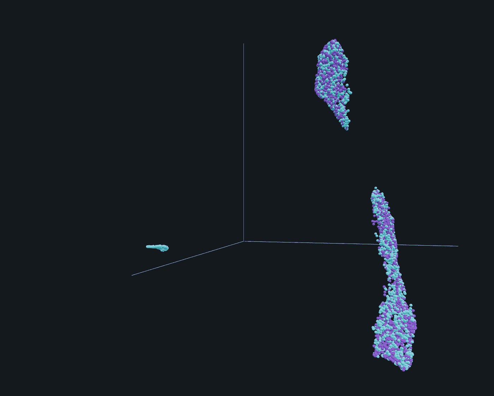
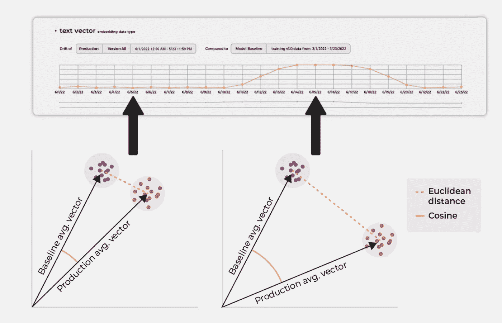

# 嵌入要避免的三个陷阱

> 原文：<https://towardsdatascience.com/three-pitfalls-to-avoid-with-embeddings-ec0c6ed07234>

作者图片

*与 Arize AI 的数据科学家*[*Francisco Castillo carr ASCO*](https://medium.com/@kiko-)*合作撰写。*

## 介绍

假设你读了一篇非常有帮助的文章，揭开了[嵌入](https://arize.com/blog-course/embeddings-meaning-examples-and-how-to-compute/)的神秘面纱，你真的很兴奋。你的社交媒体公司当然可以使用它们，所以你打开笔记本开始打字。随着时间的流逝，兴奋变成了沮丧，你会想:人们是怎么做到的？

有几个关于嵌入的问题。没有一篇帖子能够涵盖所有场景，但是这篇帖子将尝试在三个方面给你一些实用的建议:

1.  如何版本化您的项目，
2.  一旦上线，如何监控您的嵌入，以及
3.  如何对你的嵌入质量有一个直观的感觉？

但是首先，让我们看看如何创建一个嵌入。这里有一个示例代码，告诉你如何用几行代码组装一个简单的 [Bert 嵌入](https://colab.research.google.com/github/Arize-ai/client_python/blob/main/arize/examples/tutorials/Arize_Tutorials/Embeddings/NLP/Arize_Tutorial_HuggingFace_Sentiment_Classification.ipynb)到拥抱脸。

按作者

# 嵌入版本控制

迭代是这种努力的基础，迭代要求您能够跟踪您所做的事情。保持组织性可以节省你很多时间和麻烦，所以版本控制是关键。

在之前关于[嵌入](https://arize.com/blog-course/embeddings-meaning-examples-and-how-to-compute/)基础的文章中，您可以看到嵌入是如何实现跨团队协作的。现在，把你自己放在一个在自动驾驶汽车初创公司工作的工程师的位置上，培训停止标志的嵌入。假设您的前几个模型没有产生有趣的结果，但是在第五次尝试时，您得到了一些有趣的结果。您用更多的数据训练了嵌入，调整了一些参数，事情似乎进展顺利。您的同事推荐了一种有前途的新技术，您在下一次迭代中小规模地尝试了它。效果很好，所以你用更大的数据集来训练它。。。结果比你昨天吃的更糟。现在你想回到你最好的版本。你要找的是 untitled 5 _ 1 _ final . ipynb——还是 Untitled5_finalfinal.ipynb？

你的麻烦不会就此结束。你的老板说公司正在迅速向欧洲扩张，你必须用新的欧洲数据集重新培训嵌入。版本控制是嵌入式的永恒主题。你需要一个系统。

如何比较数据的两个矢量表示版本？这与一维的性能比较不同，它更复杂。对于这个问题还没有很多好的答案，但是有一些常见的原因可以解释为什么你要改变你的嵌入版本。嵌入会因为各种各样的原因而改变，但是这里有三个主要的原因，从大到小排列如下:

1.  模型架构的变化:这是比以前更大的变化。改变模型的架构可以改变嵌入向量的维度。如果图层变大/变小，你的矢量也会变大/变小。
2.  **使用另一种提取方法**:在模型不变的情况下，您仍然可以尝试几种嵌入提取方法并进行比较。
3.  **重新训练你的模型**:一旦你重新训练了提取嵌入的模型，定义它的参数将会改变。因此，向量的分量值也将改变。

与语义版本化相比，您可以将模型架构的变更视为主要的版本变更。嵌入可以具有非常不同的维度，使用不同的提取技术，并且需要重新训练。即使提取技术保持不变，尺寸的意义也完全改变了。这种改变必然会破坏向后兼容性。

第二个变化可以被视为较小的版本变化，因为维度的维度和含义可能会改变，但不需要重新训练。最好也将这些视为破坏兼容性。

第三个变化可以认为是补丁版本的变化。您并没有改变嵌入本身或它的提取方法，您只是用新数据重新训练了模型。下游团队在现有系统中使用新的嵌入应该不会有任何问题。

一个更现实的例子是吸收不同类型输入的模型。您可以将这种情况视为一种嵌入，它是其他嵌入的组合。您处理这些输入的方式的任何改变都会导致您的最终嵌入向量的改变。向量应该表示输入的组合，以便您的模型可以使用尽可能多的相关信息进行决策。现在你的版本问题开始变得非常复杂。

UMAP:作者的形象

# 使用嵌入了解您的数据

如果你能形象化你的嵌入，你就能理解它。机器学习工程师非常擅长理解二维甚至三维的数据表示。人类通常凭直觉进行聚类。直观地看到嵌入对帮助您理解它在做什么大有帮助。这应该是可能的，因为嵌入是一种向量表示，向量很容易绘制。如果你能看到点的集群，你通常至少能对每个维度的含义有所了解。唉，在数百个维度中可视化事物是非常具有挑战性的。

幸运的是，有大量关于降维的文献。出于几个原因，最成功的嵌入表示方法是邻图，特别是 UMAP(一致流形逼近和投影降维)。要了解更多关于可视化你的嵌入的信息，包括对 [UMAP vs t-SNE](https://arize.com/blog-course/sne-t-sne-umap/) 的剖析，请查看[我的同事 Francisco Castillo Carrasco 最近的这篇文章。](/visualizing-your-embeddings-4c79332581a9)

# 监控嵌入

嵌入不是静态的。想想也有道理——现实世界无时无刻不在出现新概念，人类也在不断更新旧范式。

现在你的嵌入已经出来了，你需要一种方法来监控它。最重要的是，什么时候失去意义？这是一个不小的问题，但幸运的是有一个正确的答案。

假设你的社交媒体公司现在有一个很棒的文本嵌入产品中。作为一名出色的工程师，您已经为您的模型设置了监控。当单词出现时，您会对其进行监控，并跟踪簇形心之间的平均距离。这个数字有一些随机波动，但这个水平通常是可预测的，所以您可以设置一个合理的阈值，超过这个阈值您将收到警报。这在一定程度上是可能的，因为当您第一次发布它时，您有了一个与您新训练的嵌入进行比较的点。

作者图片

## 结论

嵌入是一个强大的工具，但是像所有的电动工具一样，一些知识对于正确使用它们是必不可少的。知道如何正确地[版本嵌入](https://arize.com/blog-course/embedding-versioning/)会让你在迭代代码的时候省去很多麻烦。一旦你的嵌入被训练好了，你就可以开始了解它在使用降维和图形化方面做得有多好。一旦投入生产，适当的嵌入监控技术将确保为您的客户提供一致的价值。

想了解更多？阅读关于[监控非结构化数据](https://arize.com/blog/monitor-unstructured-data-with-arize/)的内容，了解为什么[开始使用嵌入式技术](https://arize.com/blog-course/embeddings-meaning-examples-and-how-to-compute/)比你想象的要容易。

## 联系我们

如果这个博客引起了你的注意，并且你渴望了解更多关于[机器学习可观察性](https://arize.com/ml-observability/)和[模型监控](https://arize.com/model-monitoring/)，请查看我们的其他[博客](https://arize.com/blog/)和[资源](https://arize.com/resource-hub/)！如果您有兴趣加入一个有趣的 rockstar 工程团队来帮助制作成功的模型，请随时[联系](https://arize.com/contact/)我们，或者[注册一个免费账户](https://app.arize.com/auth/join)，或者在这里[找到我们的空缺职位](https://arize.com/careers/)！