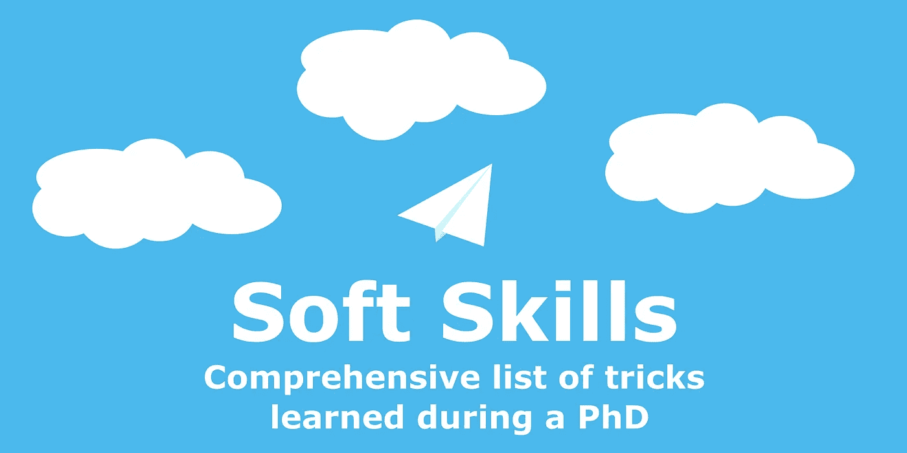

# 每个博士生免费获得的三项软技能

> 原文：<https://towardsdatascience.com/three-soft-skills-every-phd-student-gets-for-free-f63f4b1d3f2d>

## 我在攻读机器学习博士期间学到的关于研究、交流和团队工作的技巧和诀窍的综合列表

图片由作者提供。

这篇文章的动机是在一个播客上关于从博士项目过渡到行业的特殊性的对话，这个播客叫做[机器学习的冒险](https://adventuresinml.com/tools-tricks-and-learning-in-machine-learning-ft-aliaksei-mikhailiuk-ml-054)，我是其中的特邀嘉宾。从经验丰富的机器学习团队领导那里听到工程师和科学家由于缺乏基本的软技能，可能会减慢甚至破坏项目，这令人担忧。因此，对于技术职位来说，软技能的价值不亚于核心的数学和解决问题的技能。

下面，我总结了博士生可以无意识地获得的软技能，然而，在工作环境或早期教育阶段，这些软技能很难培养——研究、沟通和团队合作。由于我的博士学位是机器学习，所以大多数例子都集中在研究和交流以及管理机器学习项目上，然而，这些技巧也适用于任何创业或领导科技项目的人。

不多说了，我们开始吧！

# 研究

听到 PhD 大概在“苦”之后想到的第一个词就是“研究”。

高效执行研究的能力在行业中尤其有价值，因为许多商业机器学习产品都是基于最近的出版物。

研究的两个关键方面是搜索和分析。

## 搜索

对于任何研究问题，你首先需要确定工作的范围，以及工作在更广泛领域中的位置。这同样适用于启动一个新的应用程序——您想要了解市场、主要竞争对手及其解决方案。

因此，你需要从论文、博客、文章、专利或会议讨论中找到尽可能多的关于相同或相似问题的信息。那么你从哪里开始呢？

*   简单的谷歌请求将是一个很好的起点，然而也有像[门德利](https://www.mendeley.com)这样的专业工具，在寻找科学研究时是一个很大的帮助。
*   [在搜索相关作品时，谷歌学者](https://scholar.google.com)也是一个非常强大的工具。你可以通过关键词或作者姓名进行搜索。一旦你找到一篇相关的论文，你可以浏览引用这篇论文的作品，或者看看谷歌学者认为相关的文章。
*   另一个信息来源是会议记录或期刊——例如，在 [IEEE 网站上搜索关键词“](https://ieeexplore.ieee.org/xpl/tocresult.jsp?isnumber=8835130&punumber=83&sortType=vol-only-seq&searchWithin=image%20quality%20assessment)[图像质量评估](/deep-image-quality-assessment-30ad71641fac?source=your_stories_page----------------------------------------)”进行图像处理交易。
*   [IEEE 网站](https://ieeexplore.ieee.org/Xplore/home.jsp)也很有帮助，因为它可以让你浏览给定论文引用的论文
*   许多作者有专门介绍他们研究的网页——通常有大量有用的链接。与拥有数十名合作者的知名学者相比，博士生(大多数计算机科学论文的第一作者)的研究范围更窄。
*   与出版物相关的 GitHub 库也是一个非常有用的信息资源——通常你会找到基准和数据集的链接。有时，您还会查看使用存储库和提出问题的人员列表。
*   关键是要有条不紊，始终如一，坚持不懈。

现在，你有一吨的信息，你需要通过噪音削减..

## 分析

提取相关信息的挑战之一是从噪音中剔除。学术界以其“不发表就灭亡”的态度著称，经常迫使研究人员在没有足够时间进行深入研究的情况下发表论文。那么，如何让不相关的工作离开你的盘子呢？基于以下因素确定优先级:

*   作者名单和所属机构——作者是否在该领域知名，是否来自可信的机构。
*   引用数量，虽然不总是一个好的指标(特别是对于新发表的作品),但高引用数表明该作品在该领域得到了应用和认可。
*   发表作品的会议或期刊；大型和小型会议都很重要——专注于一个特定领域的小型会议和有很多主题的大型会议一样有价值。重要的是，提交的材料必须通过低接受系数的同行评审。
*   论文的格式——能够使用漂亮的图形包和熟悉 [latex](https://www.latex-project.org) (脚本语言和广泛用于 STEM 编写和编辑论文的框架)通常是一个很好的指标，表明读者为使作品易于理解付出了努力。
*   如果方法论部分有臃肿的数学，需要一个单独的表格来保存使用过的符号，很可能论文写得不好。你将花费大量的时间来记住希腊字母。

一旦初步扫描完成，文件堆至少减少了一半，深入挖掘也不失为一个好主意:

*   阅读摘要有助于确定作品是否符合方向。
*   录制的会议演讲(youtube 上有很多)是快速鸟瞰作品的好方法。
*   为了对作品有更深的理解，我大声朗读论文，用不同的颜色突出不同的观点。
*   好的论文将使用多个数据集上的多个指标报告结果，并确保公平比较，将重新运行基准方法(而不是直接从原始论文中获取结果)。

# 沟通

大多数成功的研究人员也是伟大的沟通者！虽然有新的发现很重要，但确保你的同事、评论家和更广泛的观众明白这一点也同样重要。如果你不能表达你的想法，它们就毫无价值。

## 写作技巧

博士生有望发表论文，最好是在顶级场所发表。然而，这些都很难通过。例如，我所在地区的顶级会议之一— [AAAI 在 2022 年的录取率不到 15%](https://github.com/lixin4ever/Conference-Acceptance-Rate)。当竞争如此激烈时，写作技巧往往是让作品被接受的关键。

因此，剑桥大学计算机科学博士生第一年的必修课之一是写作课。由于新生的文化差异很大，并不是所有的学生都习惯西方风格的学术写作——实际上东西方写作风格在[有着明显的差异](https://www.technosailor.com/2008/07/05/western-style-writing-vs-eastern-style-writing/)。那么，一篇写得好的论文有什么特点呢？

*   简明扼要。会议有非常严格的格式要求和页数限制——你没有冗长的奢侈。写作课上的一个练习是将 300 个单词的段落缩短为 20 个单词的句子。一般来说，句子长度不应该超过 1.5 行。
*   精确——出于以上同样的原因，避免空洞的陈述和明显的事实，你需要在前 1-2 句话中抓住读者的注意力。如果你想让你的论文被人阅读，你需要从噪音中脱颖而出。
*   如果这个想法需要解释两次或者是含糊不清的，这个段落必须重写。一个明确的指示哪里需要改变的是一个以“换句话说……”开头的结构。
*   图像是传达信息的强大工具。当处理图像时，首先考虑数字，然后考虑文本，确保情节和标题本身足够信息丰富——不要链接到论文的核心文本。
*   有数十亿种不同的工具可以用来制作漂亮的图片。我大量使用免费的软件——[draw . io](http://draw.io)和 [Inkscape](https://inkscape.org) (特别是 [textext](https://textext.github.io/textext/) 包，它允许你将乳胶配方嵌入图像)。
*   还有几篇关于制作格式良好图形的文章。我喜欢这个。也许一个好的情节最重要的特征就是字体大小。当一个图形嵌入到纸张中时，字体大小应该与文章本身的字体大小相匹配。
*   遵循“什么、为什么、如何”模式。**什么？每一部分(段落)的前 1-2 句话应该概述它将要讲述的内容。**为什么？**概述结束后(或同时)，*激励*为什么这个话题很重要。当读者知道为什么它们是相关的时，他们会更热衷于学习细节。**如何？**结果是如何取得的，问题是如何解决的。**
*   在符号和术语上保持一致。确保图上的符号和文本中的符号匹配。
*   即使你的母语是英语，也要在语法上使用[。](https://www.grammarly.com)
*   校对时，大声朗读。这将帮助你保持专注。
*   总是让别人也来读。

写作不仅仅涉及论文——写电子邮件也要精确和考虑周到，如果你需要寻求帮助，确保你缩小了需要帮助的确切范围，要具体——做好你的功课。网上有无数关于学术写作的课程，我推荐 Coursera 的科技写作课程。

## 呈现

博士生们不断地练习他们的演讲技巧，从五分钟的电梯演讲到酒吧里的新朋友，再到会议上长达一小时的谈话。一般来说，演示文稿有两个主要部分——文本和幻灯片。

首先是文本,可以在编辑幻灯片时对其进行修改，但你应该先决定你要讲什么，然后再创建演示文稿。

*   演示可以有多种目的，从问题的鸟瞰，到解释每一个整洁的细节。然而，如果没有倒带的选项，用耳朵来感知信息是非常困难的，所以文本越简单越好。让听众有时间跟上——不要一个接一个地用复杂的想法轰炸。
*   为了理解演示文稿的要点，一个非常好的练习是用一分钟时间总结内容，类似于电梯推销。

幻灯片是为了帮助你形象化，而不是逐字重复你的脚本，因此:

*   每张幻灯片应该有大约一分钟的演示时间。这使得观众有足够的时间阅读和理解幻灯片上的文本，同时提示演示者不要使幻灯片过于复杂。
*   演示是关于视觉内容的，它的要点是视觉化，而不是过多的文字。清晰的图表，没有效果，只有相关的图像。每张幻灯片不要超过五个简短的要点。
*   第一张幻灯片是开场幻灯片，包含关键信息、作者、演示名称、资助机构的附属机构和徽标。第二张幻灯片总结了演示者(您)的信息。第三张幻灯片描述了演示的内容，并列出了关键部分。
*   最后一张幻灯片，你通常会问观众是否有任何问题，这可能是展示中最长的一张——明智地使用它，总结演示或放入有用的链接。
*   有用链接的二维码是一个新领域，可以帮助观众快速找到你所指的信息。
*   如果观众想在问答环节返回，不要忘记幻灯片编号。
*   准备的时候，录下自己的声音，几个小时后再看一遍，这不失为一个好主意——总是有助于提高速度。
*   当创建海报而不是演示文稿时，请记住，在海报会议期间，您的观众将首先检查海报(它应该有足够的信息来理解论文)。当一个人看完海报后，他们可以提问。在这里，图像将服务于他们的目的。有人建议我把 30%/70%的文本/图像分开。

顶级会议演讲总感觉流畅随意，就好像主讲人在现场演讲一样。没有窍门——演示是一遍又一遍地排练的，重复十几次后，你就会自然流畅了。

录制演示文稿时，最好在你面前准备好文本，这会节省你大量的时间。PowerPoint 是一个非常强大的演示记录工具。确保你有一个好的麦克风——声音很重要。

最后，你的声音很重要，参加声音课程是个不错的主意。我拍了[这张](https://www.udemy.com/course/voice-training-30-days-to-a-more-confident-powerful-voice/)。

# 作为一个团队工作

大学做了大量工作来确保 STEM 学生在本科或硕士项目期间获得足够的合作经验。尽管这些都是进入现实世界项目的很好的速成课程，但是交互通常是短暂的，不需要日常交互。

## 协同工作

博士需要合作，每个博士生必然要建立的长期关系之一是与他们的导师和研究小组的其他成员的关系，这意味着你不可避免地会发展其中的一些特质:

*   拥有你的作品——对你写的每一行代码和每一段文字负责。你可能不是专家，甚至不知道答案，承认吧，做好你的功课，认真对待它。
*   如果出了问题，不要找借口。“那不是我的工作”是你永远不应该大声说出来的话。
*   解释时，确保使用观众容易理解的术语和例子。
*   如果有必要的话，忽略边界来完成你的项目。如果你发现了一个问题，而这个问题不在你的范围内，提出来并提供帮助来解决它。
*   思考你的决定对其他团队成员的影响，尤其是随着时间的推移。一个简单的例子是记录你的代码，确保其他人可以很容易地使用它。
*   考虑项目的未来结果—您的解决方案是否可扩展？它容易与项目的其余部分集成吗？
*   学会接受批评。最好的学习方法是培养一种成长的心态，就像马尔科姆·格拉德威尔的《局外人:成功的故事》
*   尽早提出问题——这可能是我得到的最好的工作建议。你越早养它们，你就能越早修复它们。人们讨厌你在最后一刻带着问题来找他们——但是你很快就知道了。

这里提到的许多方面都可以很好地概括为亚马逊在员工身上寻找的品质[。](https://www.amazon.jobs/en-gb/principles)

团队合作从来都不是一帆风顺的过程，要在职业关系的风暴中航行，我从博士学位中学到了两个教训，第一个是诚实地回答这个问题:“你想正确还是快乐？”另一个我从经验中学到的是:“私下批评，公开表扬。”我在克里斯·沃斯的《永远不要分割差异:谈判就像你的生活取决于它一样》一书中找到了很多有用的建议。

## 领导和项目管理

我的一个朋友指出，博士学位是学习项目管理核心原则的绝佳场所——你会得到大量实践，每一份出版物都是一个新项目，在一份入门级工作中，你很少被委以如此高的责任——管理从研究到交付的整个流程。

*   总是分配比你预期的项目需要更多的时间。《T2》中的卡尼曼从自己的经历中给出了一个很好的例子。一群学者想写一本书，在开始之前，每个成员都要预测一下这项工作需要多长时间。或许不足为奇，大家都低估了。
*   第二，构建一个简单的解决方案，然后增加复杂性。确保定期问自己:“你目前正在做的事情对当时的项目至关重要吗？”首先关注关键部分。
*   设定明确的目标——据说科洛列夫(伟大的俄罗斯工程师)说过:“80%的项目成功在于明确的任务和目标”。
*   委派。你很容易一头扎进问题中，然而，对于一个应该领导他人的人来说，理清思路，能够预见未来更为重要。
*   确保每一次谈话都被记录在电子邮件中或稍后发送的会议记录中——这允许团队作为一个整体成为过程的一部分，也有助于回顾未完成的任务，甚至有助于解决冲突。

# 结论

也许发展软技能的主要困难在于，如果你缺少了一项，很难发现。同样，注意到你已经获得了一个也是困难的。我发现，只有在重读了第一年的报告(一份总结你博士第一年成就的评估报告)后，我的写作技能才有所提高。这并不可怕，但是有很大的改进空间。然而，在写作的时候，我觉得我不可能写出比这更好的东西了…

大多数技能都是通过重复获得的——通常没有诀窍。这也是为什么一些软技能在博士期间很容易被开发的原因。在三年(在英国)到五年(在美国)的时间里，候选人要经历重复的出版周期，包括研究、项目管理、论文撰写、答辩和陈述。一次又一次，在这些领域获得的技能得到完善和净化。

我在本文中提到了一些工具、书籍、课程和文章，您可能会发现这些工具、书籍、课程和文章对提高您的软技能很有用:

*   书籍:[思考快与慢](https://www.amazon.co.uk/Thinking-Fast-Slow-Daniel-Kahneman/dp/0141033576/ref=sr_1_1?adgrpid=54035947435&gclid=Cj0KCQiA6NOPBhCPARIsAHAy2zDql3ipZSWjag2squ43vGmBzp4NOGCwEoCsZVpcUniwZXisiMhePmYaAtWtEALw_wcB&hvadid=259055498070&hvdev=c&hvlocphy=1006884&hvnetw=g&hvqmt=e&hvrand=11675416237775903769&hvtargid=kwd-299745004769&hydadcr=24429_1748939&keywords=thinking+fast+and+slow&qid=1643492696&sr=8-1)丹尼尔·卡内曼著，[离群者:成功的故事](https://www.amazon.co.uk/Outliers-The-Story-of-Success/dp/B002SQ2NX6/ref=sr_1_1?adgrpid=55973437874&gclid=CjwKCAiAl-6PBhBCEiwAc2GOVLk_jumIaesPb40eMDXI7z2UTk7NdSQ_tm_pKlqdXmDHcWKLDV9xOhoCrVEQAvD_BwE&hvadid=259101838989&hvdev=c&hvlocphy=1006598&hvnetw=g&hvqmt=e&hvrand=8367469483684919876&hvtargid=kwd-307741383323&hydadcr=11434_1787544&keywords=outliers+book&qid=1643932211&sr=8-1)马尔科姆·格拉德威尔著，[永远不要分割差异:谈判就像你的生活取决于它一样](https://www.amazon.co.uk/Never-Split-Difference-Negotiating-Depended/dp/1847941494)克里斯·沃斯著。
*   课程:[语音训练](https://www.udemy.com/course/voice-training-30-days-to-a-more-confident-powerful-voice/)，[学术写作](https://www.coursera.org/learn/sciwrite)。
*   工具:[语法上](https://www.grammarly.com)、[门德利](https://www.mendeley.com)、[谷歌学术](https://scholar.google.com)、 [draw.io](http://draw.io) 、 [Inkscape](https://inkscape.org) (特别针对[text](https://textext.github.io/textext/)包)。
*   文章:[东西方写作风格](https://www.technosailor.com/2008/07/05/western-style-writing-vs-eastern-style-writing/)、[图编辑](https://www.aje.com/dist/docs/Guide-Creating-Effective-Scientific-Figures-for-Publication.pdf)、[亚马逊工作原理](https://www.amazon.jobs/en-gb/principles)。

如果你喜欢这篇文章，请与朋友分享！要阅读更多关于机器学习和图像处理的主题，请点击订阅！

## 喜欢作者？保持联系！

我错过了什么吗？不要犹豫，直接在 [LinkedIn](https://www.linkedin.com/in/aliakseimikhailiuk/) 或 [Twitter](https://twitter.com/mikhailiuka) 上给我留言、评论或发信息吧！

 [## 我希望在攻读机器学习博士学位之前掌握的九种工具

### 无论你是建立一个启动或取得科学突破，这些工具将把你的 ML 管道到…

towardsdatascience.com](/nine-tools-i-wish-i-mastered-before-my-phd-in-machine-learning-708c6dcb2fb0)  [## 应对机器学习面试

### 机器学习面试准备指南和资源。

towardsdatascience.com](/acing-machine-learning-interviews-aa73d6d7b07b)